# 奥斯卡·王尔德《道连·格雷的画像》的情感分析

> 原文：<https://betterprogramming.pub/sentiment-analysis-and-emotion-recognition-on-the-literary-works-of-oscar-wilde-e045062fd096>

## “真理很少是纯粹的，也从来不是简单的”

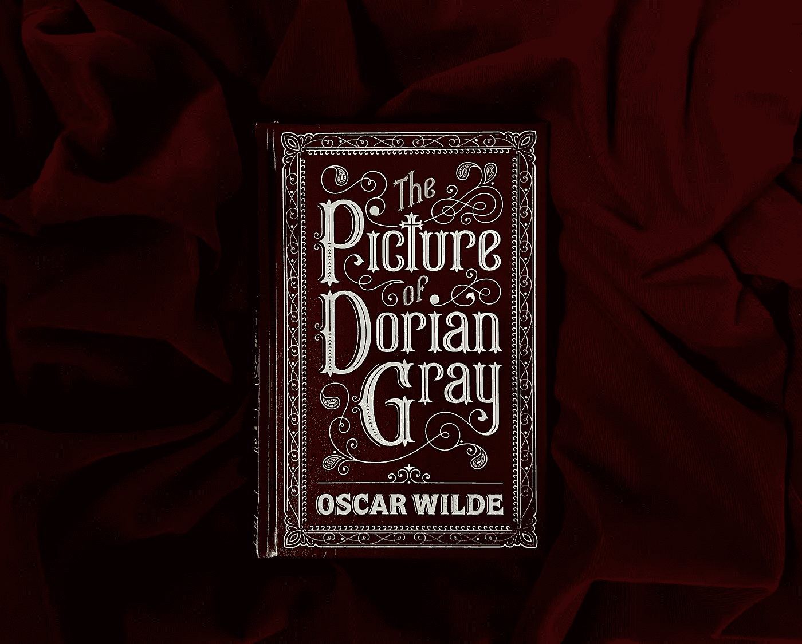

道林·格雷的照片由蒂姆·阿历克斯在 [Unsplash](https://unsplash.com/s/photos/oscar-wilde?utm_source=unsplash&utm_medium=referral&utm_content=creditCopyText) 上拍摄

奥斯卡·王尔德是我最喜欢的作家之一。1890 年出版的《道林·格雷的画像》仍然是最能引起我共鸣和影响我的故事之一。一幅画赋予你无限的权利，成为一个人邪恶的容器，而你却过着没有任何后果的生活，这个想法让我着迷。特别是，随着道林·格雷犯下越来越多可怕的罪行，这幅画的逐渐恶化将永远是我最喜欢的文学概念之一。

因此，我很自然地想通过数据科学和自然语言处理(NLP)技术的视角来研究它们。

NLP 融合了语言学、计算机科学和人工智能领域的概念和技术，旨在理解计算机如何处理人类语言。NLP 使用的一些常见任务是语音识别应用程序(例如，苹果公司的 Siri 和亚马逊公司的 Alexa)中的文本和语音处理，以及像话语管理(例如，计算机如何与人交谈)等更高级别的应用程序。

这绝对是一个迷人的领域，从我了解它的那一刻起，我就对它产生了浓厚的兴趣。

我想回答的一些问题是:

*   奥斯卡·王尔德最常用的词是什么？
*   他的作品中呈现的整体情绪是怎样的？
*   每一章的情绪是如何变化的(如果有的话)？是否存在一种特殊的情绪结构？
*   情感评估与叙述中的主题一致吗？

古登堡计划是一个拥有超过 60，000 本免费电子书的图书馆，人们可以下载或在线阅读。奥斯卡·王尔德是古腾堡计划的众多作家之一，他的作品随时可供查阅。

我会写一些代码从[项目古腾堡](https://www.gutenberg.org/)下载他的作品。这些例程应该也很容易应用于从其他作者那里获取资料！这个项目将直接显示我的代码，因为我将做一些查询和网络抓取来获得我需要的数据，我认为这是值得展示的。如果你有兴趣看到完整的代码，你可以在这里看到我的 GitHub 库。

在情绪/情感分析方面，我将首先使用一个在 Twitter 数据上训练的朴素贝叶斯分类器来确定一个章节中的情绪是积极的、消极的还是中性的。然后，我将使用 VADER 获得极性得分。最后，我将使用 NRC 词典将每一章分解成 10 种不同的情绪(喜悦、积极、愤怒、厌恶、消极、期待、惊讶、信任、恐惧和惊讶)。

说到这里，让我们开始吧！

# 前奏与阐述——在古登堡计划中构建对奥斯卡·王尔德的质疑

我需要的第一件事是从古腾堡项目的 HTML 站点检索内容的方法。这意味着我需要与站点/服务器通信，我可以很容易地用`urlopen`函数做到这一点。我尝试连接的 URL 与“Oscar Wilde”的搜索查询相关联，它看起来如下:

`[https://www.gutenberg.org/ebooks/search/?query=oscar+wilde&submit_search=Search](https://www.gutenberg.org/ebooks/search/?query=oscar+wilde&submit_search=Search)`

我将使用以下格式的格式化字符串替换该字符串，使其更加通用

`f'https://www.gutenberg.org/ebooks/search/?query={first_name}+{last_name}&submit_search=Search'`。

我应该注意到，古腾堡项目的查询被限制在 25 个搜索结果，但这对于最初的探索应该足够了。

现在我知道了要查询的 URL，我可以开始构建从 Project Gutenberg 获取所需信息的函数了。

# 第一步。与查询 URL 通信

现在我知道了我需要查询的 URL 的结构，我可以编写一个函数来与站点通信，如下所示:

# 第二步。网页抓取页面中所有 URL 的查询 URL

接下来，我需要一种方法从搜索查询中检索与图书文件相关联的 URL。BeautifulSoup 允许我们很容易地做到这一点，因为所有的图书链接都包含在`'a href'`标签中。因此，需要做的就是告诉 BeautifulSoup 找到所有以“a”开头的标签，然后获取包含由“href”表示的实际链接的部分。下面的函数会处理这个问题。

# 第三步。获取图书标识符

既然搜索查询中已经有了链接，我需要获取古腾堡项目使用的图书标识符。这是通过下面的函数完成的，该函数将返回一个`bookIDs`列表，我们可以用它来下载与我们的搜索查询结果相关的所有书籍。

# 第四步。从古腾堡计划下载一本书

我们几乎完成了我们的书的提取准备！现在我已经有了与查询结果相关联的`bookID`,我可以编写一个函数，将这本书下载到我们计算机的一个目录中。这是通过下面的函数完成的:

让我们来测试一下！《道林·格雷的画像》的图书 ID 是`174`。我将把它传递到我的函数中，结果是我的目录中有一个名为`174.txt`的漂亮文件，其中包含“道林·格雷的画像”厉害！

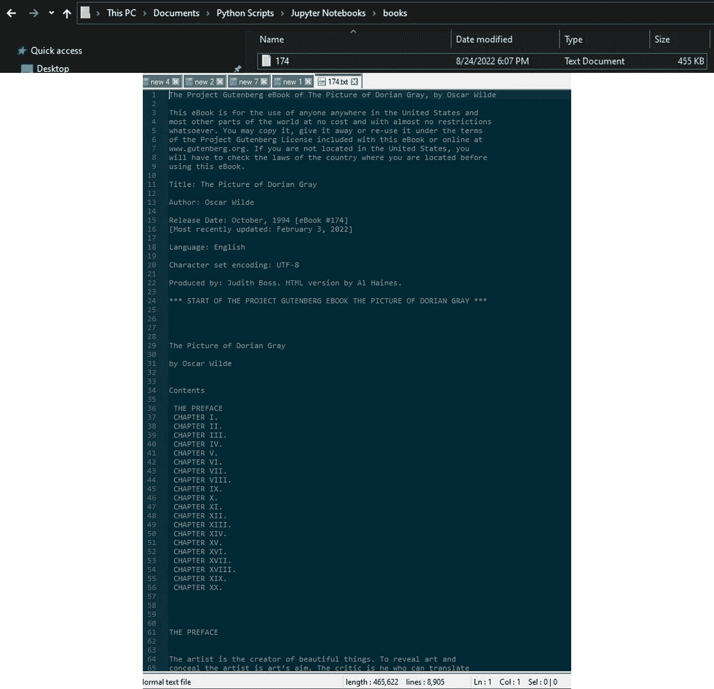

道林·格雷的肖像电子书下载到了我的电脑里。作者图片

完美！现在我有了基本的下载函数，我可以简单地将我的例程放入一个包装函数中。这将允许我下载我们的搜索查询页面中的所有书籍。

# 崛起的行动——从古登堡计划下载奥斯卡·王尔德的文学作品

这是一个包装器函数，它允许我下载 Oscar Wilde 搜索查询页面中的所有书籍:

运行该功能的结果如下所示:

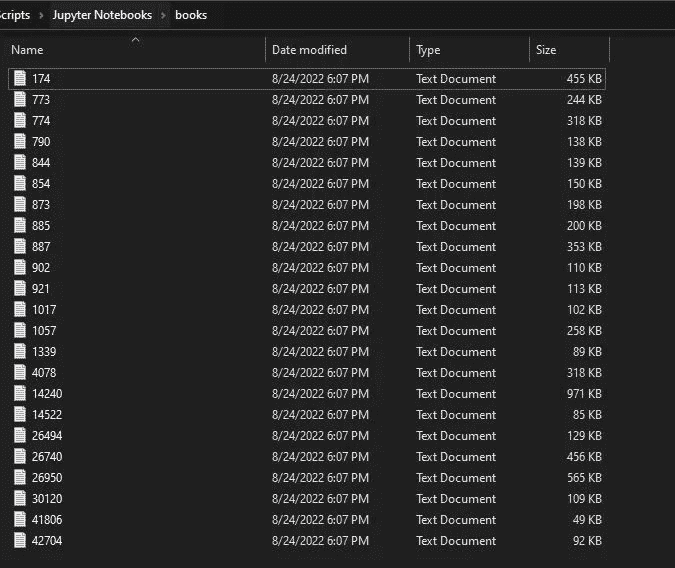

奥斯卡王尔德在古腾堡计划的书籍。作者图片

我们的函数返回了搜索查询页面上 25 个结果中的 23 个。省略的两个结果对应于“认真的重要性”的有声读物，以及题为“道林·格雷的画像”的德语版。这完全没问题，因为对于我的工作来说，我只对英文的文本数据和文档感兴趣，所以我会继续下一阶段的工作。

# 把书分成几章

现在我已经下载了这些书，我要写一个例程，把每本书分成几章。这将允许我单独处理和分析每一章。

接下来，我将加载我们生成的图书章节文件，以便可以访问它们。

最后，我会把书的内容读出来，放在这里的内存里。我将从第 1 章开始，它被保存为一个名为`2.txt`的文件，因为当前的书有一个前奏章节。

这个例程的输出如下所示。我已经打印了这一章的第一句话:

《道林·格雷的画像》第一章的第一句话。作者图片

我们准备好出发了！

# 中点——对一章进行符号化、词条化和去噪

我现在可以随意使用整本书了。然而，在进行情感分析之前，我需要对文本数据做一些准备。在我继续处理整本书之前，我想确保我的所有例程在一章中都可以正常工作。

一般来说，这就是我喜欢编码、学习、设计实验和做研究的方式。从一个简单的基础开始，我可以根据需要构建尽可能多或尽可能少的细节和复杂性。

我将从《道林·格雷的画像》的第一章开始。

# 修饰这一章

标记化是将字符串分割成称为标记的更小部分的过程。标记是计算机可以解析的最小文本单位(类似于人类语言中的音素和语素)。令牌可以是任何单词序列、表情符号、标签、链接，甚至是单个字符。这是情感分析准备的一个重要部分，因为它提供了一个框架，计算机将试图从这个框架中找到意义。

让我们从标记这一章开始。我将使用 nltk 的`word_tokenize`函数。我还将从标记化列表中删除前三个元素，因为它们只是章节号和空行。

这个过程的输出如下所示，可以看出，分词器从章节中生成了一个单词数组:

《道林·格雷的画像》第一章的符号化输出。作者图片

# 通过词汇化使章节中的单词规范化

词语可以用多种方式来表达意思。例如，eat 和 eaten 是动词 eat 的不同时态。分析可能需要将这些不同的时态转换成它们的基本的、基本的、规范的形式。这个过程被称为规范化，通常通过词干化和/或词汇化算法来实现。

在引理化中，该算法在词汇的上下文中通过使用形态学分析来规范化一个单词，以便产生一个引理。形态学中的一个引理被认为是一组词形的规范形式或字典形式。这个词汇化过程允许不同的单词被索引、映射或追溯到一个单词。例如，说、说、说、说、说和说都是说话的形式(称为词位)。

通过词汇化，我将能够标记单词，并将它们表示为名词、动词、介词等。这可以通过 nltk 轻松完成，如下所示:

其输出如下所示:

《道林·格雷的画像》第一章的词条输出作者图片

成功了！现在，每个标记化的单词都有一个与之相关联的标签。注意在“rose”后面有一个逗号标记。作为去噪/清理过程的一部分，我将删除这些内容。

# 去噪章节

我差不多准备完了进行情感分析的章节。但是，在我这样做之前，我需要删除标点符号、停用词和使数据变得混乱的特殊字符，然后再继续。这个过程被称为去噪。

为了消除数据噪声，我将通过下面的函数使用正则表达式(regexs ):

在章节上运行该函数的结果如下所示:

《道林·格雷的画像》第一章的去噪输出

可爱！现在我们准备开始做这一章的分析了！

# 计算章节的单词密度

既然这一章已经被标记化、词条化和去名词化了，让我来找出这一章中出现频率最高的 20 个单词是什么。

《道林·格雷的画像》第一章的词频图作者图片

看起来这一章中最常见的单词是“say ”,有 29 个实例，其次是单词“one ”,有 27 个实例。

# 危机—朴素贝叶斯分类器

现在，让我们来训练一个模型！我将从使用基于`twitter_samples`数据集的朴素贝叶斯分类器开始，看看它是如何工作的。这将允许我很容易地将单词分类为与积极或消极情绪相关联。我以后会试着用更详细的情感来分类单词、句子、章节和整本书，比如快乐、悲伤、愤怒等等。

分类器的结果如下所示:

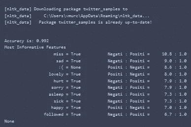

在 twitter_samples 数据集上训练的朴素贝叶斯分类器的训练结果。作者图片

该分类器具有 99.2%的分类精度。让我们在模型上运行它！

我将准备通过朴素贝叶斯分类的章节，这需要我使用下面的函数将去噪的章节转换成字典，其中每个单词将与一个`True` / `False` 值配对:

然后，我可以在刚刚制作的章节字典上运行分类器，输出将是该章节被认为是“正面”还是“负面”为本章运行朴素贝叶斯分类器的输出结果是“负的”这是一个我认为我能同意的观点，尽管在这一章里还有很多关于情感的内容要说。不管怎样，现在我准备将目前为止开发的例程应用到整本书中！

# 大事件——对一本书进行符号化、词汇化和去噪

现在，我准备处理整本书，并使用下面的包装函数确定每章中的主要观点:

运行该例程的结果如下所示:

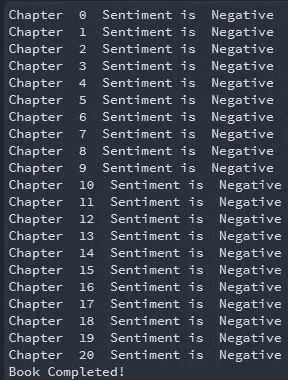

使用朴素贝叶斯分类器对《道林·格雷的画像》进行情感分析的结果。作者图片

呀！分类器确定书中的每一章都是负面的。虽然我倾向于同意这种观点，但这是一个非常无聊的结果，它过度简化了使这本书有趣的各种细微差别。因此，我决定查阅 VADER 和美国国家研究委员会的词典，为这一章中的情感增添色彩。

# 高潮——VADER 和 NRC 词典

VADER 将给出极性得分。即使情感分类仍然被设置为简单的积极、消极或中立，我们也将为这些值中的每一个值获得一个可量化的度量，并开始从每一章中更好地了解情感构成。我将首先从上面修改我的包装器例程，以便它将章节内容作为输出的一部分返回。

接下来，我将使用下面的代码创建一个 pandas 数据帧，它将保存每一行中每一章的内容:

该书的结果数据框架如下所示:

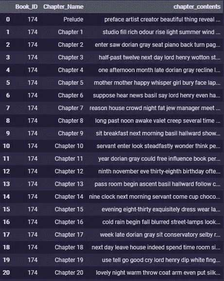

包含《道林·格雷的画像》中每章内容的数据帧。作者图片

现在，我将使用 VADER 运行`SentimentIntensityAnalyzer`，并使用下面的代码将每章的极性分数保存到数据帧中:

生成的数据帧如下所示:

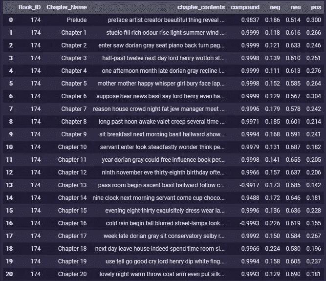

《道林·格雷的画像》中每一章 VADER 的极性得分作者图片

好了，现在事情开始变得有点有趣了。每一章都有不同的正面、负面和中性分数与之相关联。此外，复合得分(代表总体情绪，其中+1 表示最积极，而-1 表示最消极)在章节之间也是不同的。让我把它们画出来，看看是什么样子！

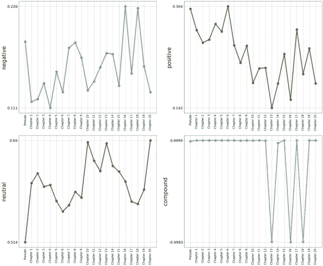

《道林·格雷的画像》中极性得分的进展作者图片

从这些图中我们可以看出以下几点:

*   负面情绪似乎在整本书的过程中呈上升趋势，并在最后几章达到最大
*   在整本书的过程中，积极的感觉似乎呈下降趋势，在第 13 章达到最低点
*   在这本书的过程中，中性的感觉似乎呈上升趋势。
*   大多数章节都有一个正的复合分数，只有少数明显的例外(第 13、16 和 18 章)
*   在三种类型的极性得分中，中性感觉得分最高

嗯，朴素贝叶斯分类器和 VADER 极性得分之间的情感评估是相反的。为什么？此外，在第 13、16 和 18 章中发生了什么，导致 VADER 将这些章节归类为主要是负面的？

例如，第 13 章是书中最高潮的章节之一。在这一章里，道林·格雷在 18 年没有见到巴兹尔后向他揭开了画像。门令人震惊的状况的揭露证实了巴兹尔听到的关于多里安·格雷的所有可怕的谣言确实是真的。

意识到多里安确实是一个可怕的人后，巴兹尔请求他为他所做的坏事寻求原谅，这也许是书中唯一真正纯洁的举动。最后，肖像推动多里安谋杀巴兹尔，他的反应是冷静和冷漠，令人不寒而栗。

很明显，一种消极的情绪不足以表达这一章中所有的消极情绪。当然，这一章是消极的，但正是细节使它变得有趣！这就是 NRC 词典发挥作用的地方。

# NRC 情感识别词典

现在，让我们尝试使用 NRC 词典，它有十种不同的情绪可以将文本数据分类。情绪有`joy`、`positive`、`anticipation`、`sadness`、`surprise`、`negative`、`anger`、`disgust`、`trust`、`fear`。在撰写本文时，NRC 词典由超过 27，000 个单词组成。

我将使用与 VADER 极性分数相似的策略，将书中每一章的各种情绪的分数放入数据框中。然而，我将通过章节字数来标准化情感分数，因为我注意到这会夸大分数。

熊猫数据帧现在看起来像这样:

《道林·格雷的画像》中包含来自 NRC 词典分析的情感分解的数据帧

漂亮！让我们开始看看这些不同的情绪是如何相互作用，并在本书的过程中不断发展的！

# 《道林·格雷的画像》中情感的关联矩阵

下面的相关矩阵显示了从 NRC 词典分析中获得的单词计数标准化情感得分之间的相互作用。色阶表明情绪相对于彼此是积极变化还是消极变化。明亮的颜色表示积极的趋势。较暗的颜色表示负面趋势。

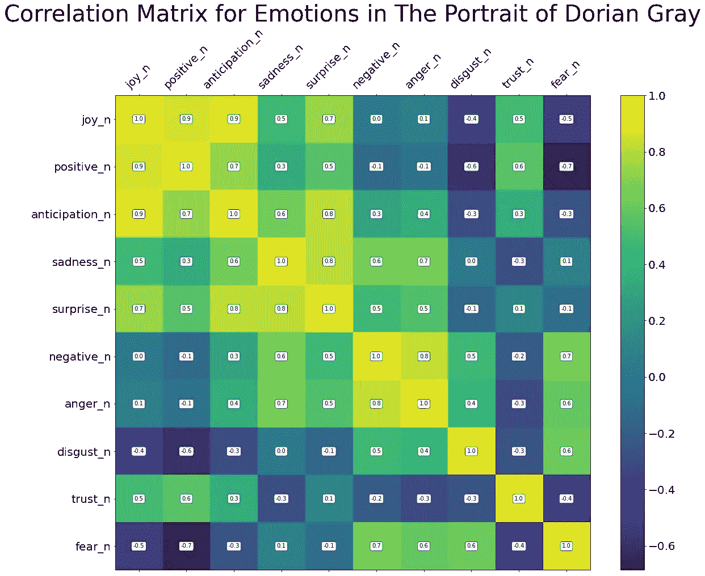

《道林·格雷的画像》情感得分的相关矩阵作者图片

然而，我们如何理解这些相关性呢？奥斯卡·王尔德说得好……“真相很少是纯粹的，也从来不简单。”

# 情感分析的实现——可视化

在上一节中，我展示了我们从 NRC 分析中获得的所有情绪之间的关联矩阵。让我们开始看看这些相关性是什么样子的吧！

# 高兴

快乐被定义为“一种巨大的快乐和幸福的感觉。”它从第 1-6 章开始上升，在那里达到顶峰，然后下降，直到在第 10 章达到最小值。然后，在本书的剩余部分，它会振荡。快乐主要与积极和期待的感觉相关，主要与恐惧的感觉反相关。

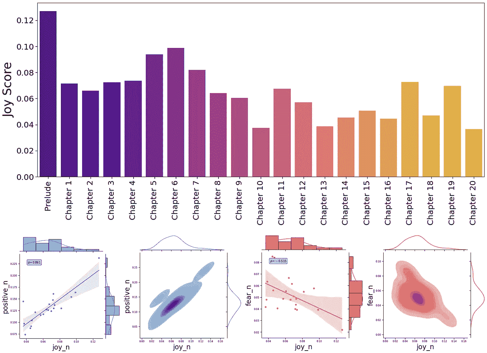

《道林·格雷的画像》中的欢乐进程和互动作者图片

# 积极的

积极情绪被定义为“一种好的、肯定的或建设性的品质或属性。”在前 13 章中，积极的感觉有一个整体的逐渐衰减，之后积极的感觉开始再次攀升，但它们永远不会达到最初的水平。积极大多与快乐的感觉相关，大多与恐惧的感觉反相关。

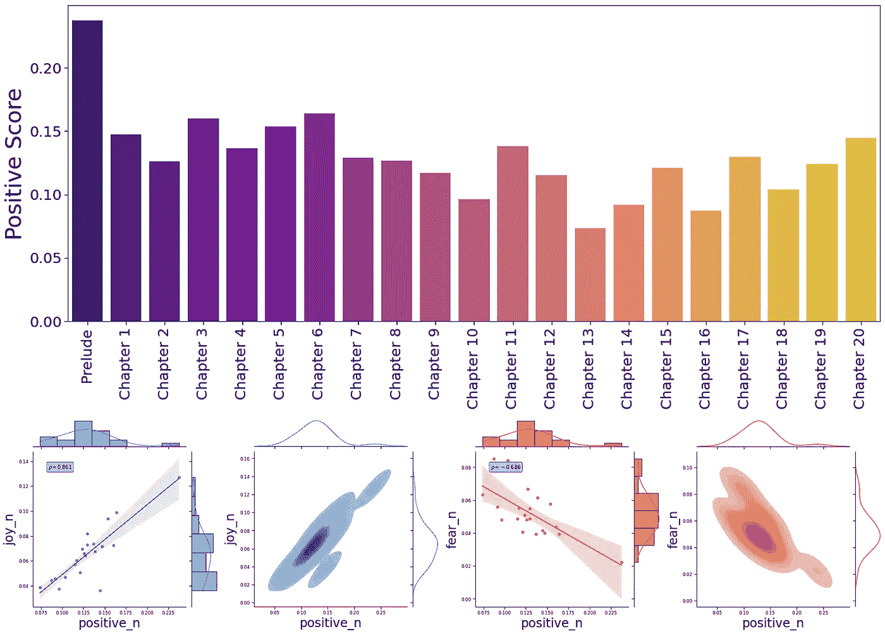

《道林·格雷的画像》中的积极进展和相互作用作者图片

# 希望

预期被定义为“对将要发生的事情感到兴奋”预期在第 1-5 章之间上升，然后逐渐下降，直到第 10 章。之后，它再次逐渐增加，最后又下降。预期大多与快乐相关，大多与厌恶和恐惧反相关。

《道林·格雷的画像》中的预期进展和互动作者图片

# 悲哀

悲伤被定义为“与劣势、损失、绝望、悲伤、无助、失望和悲伤的感觉相关或以此为特征的情感痛苦。”悲伤通常在第 8 章之前呈上升趋势，在第 15 章之前呈下降趋势。然后它在第 16-19 章之间跳跃并保持水平，然后在第 20 章下降。悲伤大多与惊喜感相关，大多与信任感反相关。

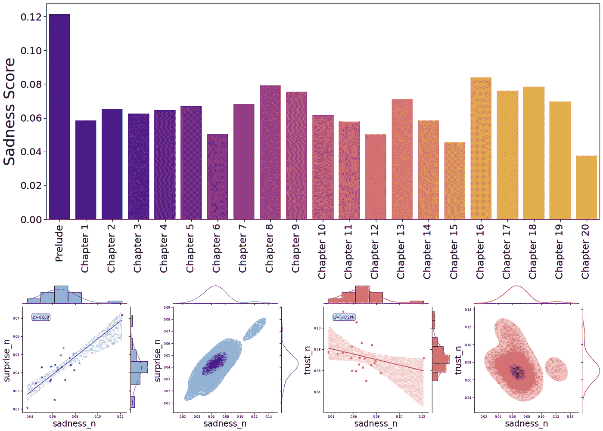

《道林·格雷的画像》中的悲伤进展和相互作用。作者图片

# 惊喜

惊奇的定义是“因为出乎意料而使人感到惊奇或惊奇。”在第 9 章之前，惊奇是相当持续的，直到第 10 章才突然出现。在这之后，惊喜增加，直到倒数第二章，然后在第 20 章下降。惊讶大多与期待感相关，大多与恐惧和厌恶感反相关。

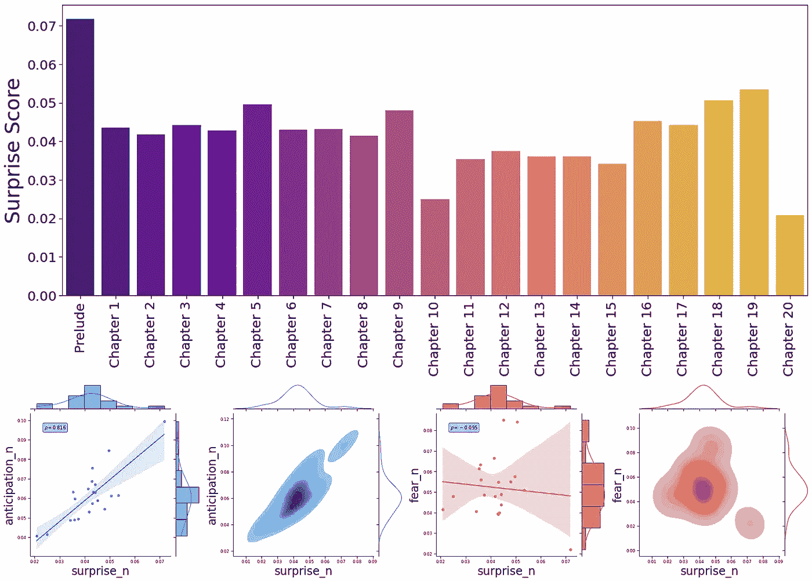

《道林·格雷的画像》中的惊人进展和互动。作者图片

# 否定的；消极的；负面的；负的

消极被定义为“以积极事物的缺失、保留或去除为标志。”在这本书的整个过程中，负面情绪是相当稳定的。它们在第 16 章和第 18 章达到顶峰。消极主要与愤怒感相关，主要与信任感反相关。

《道林·格雷的画像》中的否定推进和相互作用作者图片

# 愤怒

愤怒被定义为“一种强烈的不愉快或烦恼的感觉，通常是对侮辱、伤害或不公正的积极反对。”愤怒以波动的方式表现。它逐渐上升，直到第 8 章，然后轻微下降，直到第 15 章。它在第 16 章突然跳跃，然后衰减，直到书的结尾。愤怒大多与负面情绪相关，大多与信任感反相关。

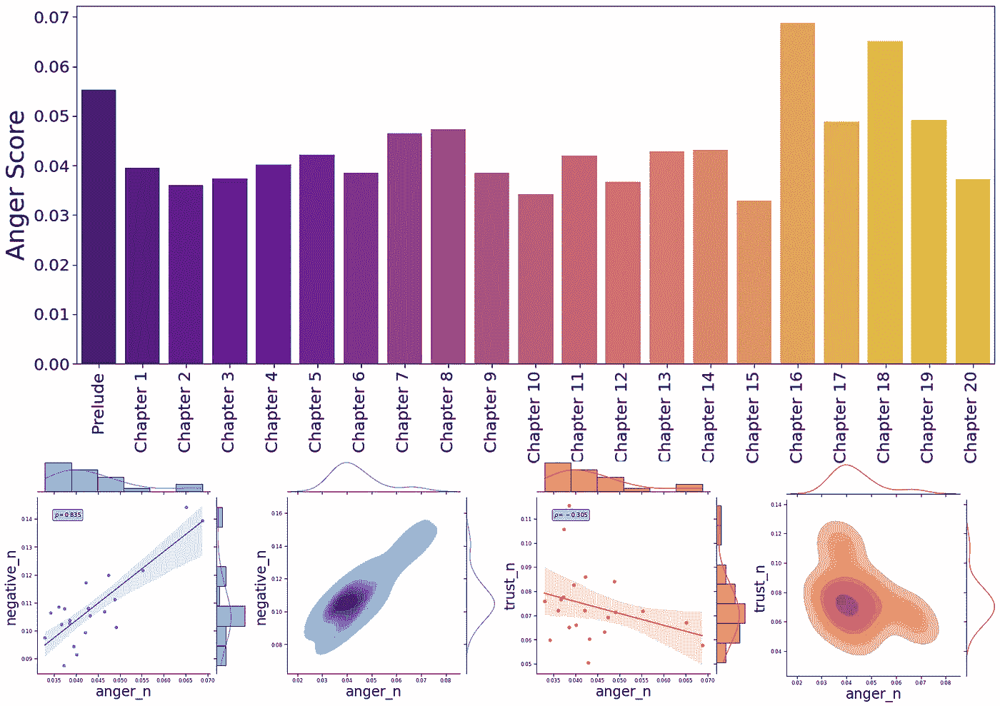

《道林·格雷的画像》中的愤怒进展和相互作用作者图片

# 厌恶

厌恶被定义为“由不愉快或令人不快的事情引起的厌恶或强烈不满的感觉。”厌恶感从前奏一直上升到第二章，随后衰减到第五章。这种行为再次重复，上升到第 7 章，然后下降到第 9 章。厌恶的感觉在第 10-15 章之间相当稳定。厌恶感在第 16 章达到顶峰，并逐渐衰减，直到书的结尾。厌恶主要与恐惧的感觉相关，主要与积极的感觉反相关。

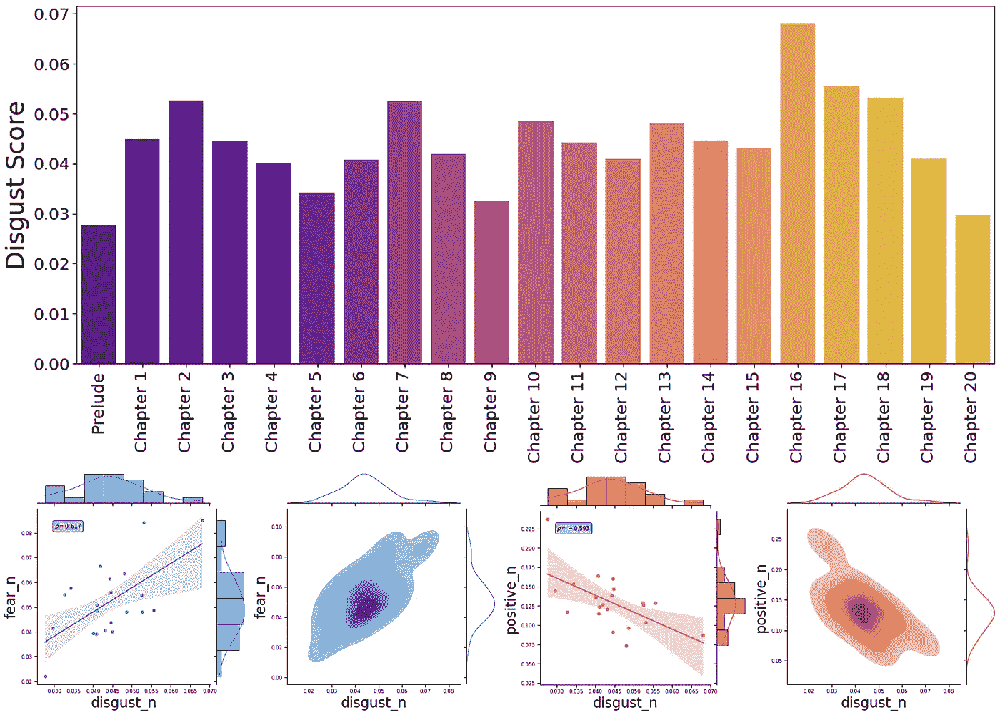

《道林·格雷的画像》中的厌恶进展和相互作用作者图片

# 信任

信任被定义为“对某人或某物的可靠性、真实性、能力或力量的坚定信念。”信任感在前奏到第三章之间增加。它们在第 4 章下降，然后又开始上升，直到第 6 章。信任的感觉在第 7 章下降，在本书的其余部分保持不变。信任主要与积极的感觉相关，主要与恐惧的感觉反相关。

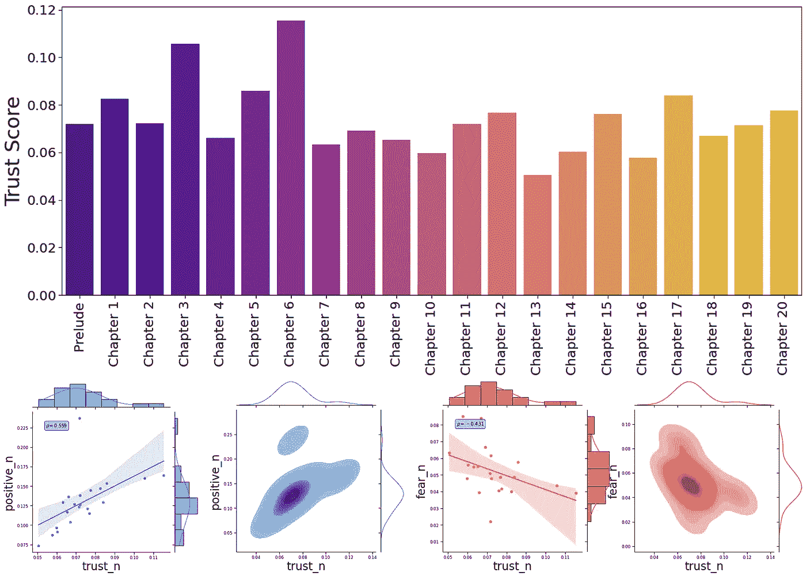

《道林·格雷的画像》中的信任进展和相互作用作者图片

# 害怕

恐惧被定义为“一种不愉快的情绪，这种情绪是由于认为某人或某物是危险的，可能会导致疼痛或威胁而产生的。”从前奏到第八章，恐惧呈上升趋势。之后，恐惧逐渐减少，直到第 15 章。它在第 16 章和第 18 章汹涌澎湃，最后两章逐渐平息。恐惧大多与消极情绪相关，大多与积极情绪反相关。

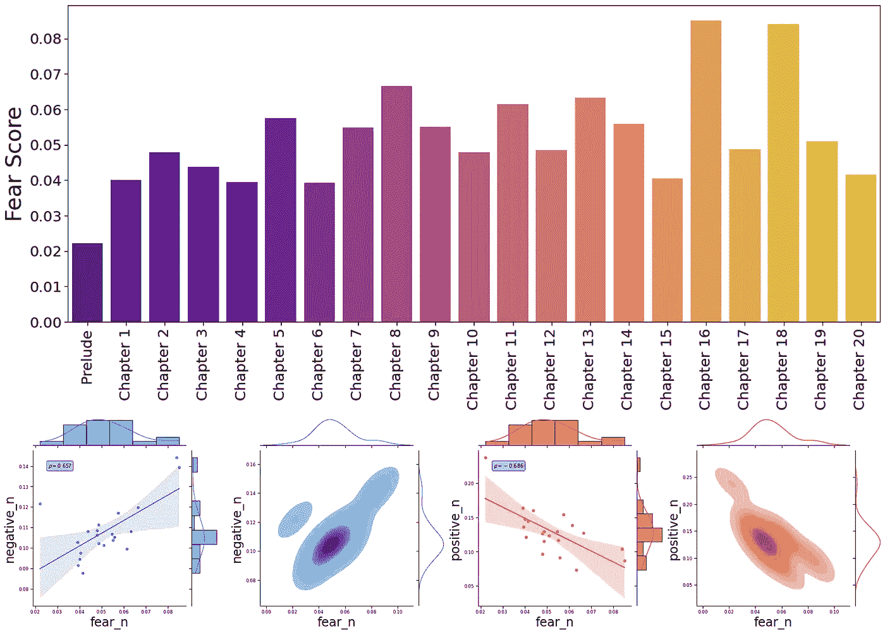

《道林·格雷的画像》中的恐惧进展和相互作用。作者图片

# 一切都在一起

不错！这给了我们一个概念，在这本书的过程中，这些不同的情感是如何发展和相互作用的。看到这些不同的情感在整个故事中如何相互作用是非常有趣的。

下面的堆积条形图总结了我对《道林·格雷的画像》的发现。x 轴代表书中的每一章，而 y 轴代表书中每一章中情感的百分比。这些颜色代表了 NRC 词典处理的十种不同情绪中的每一种。较浅的颜色与积极的情绪有关，而较深的颜色与更多的消极情绪有关。每种情绪的大小代表了它对该章节的总情绪分数的贡献。

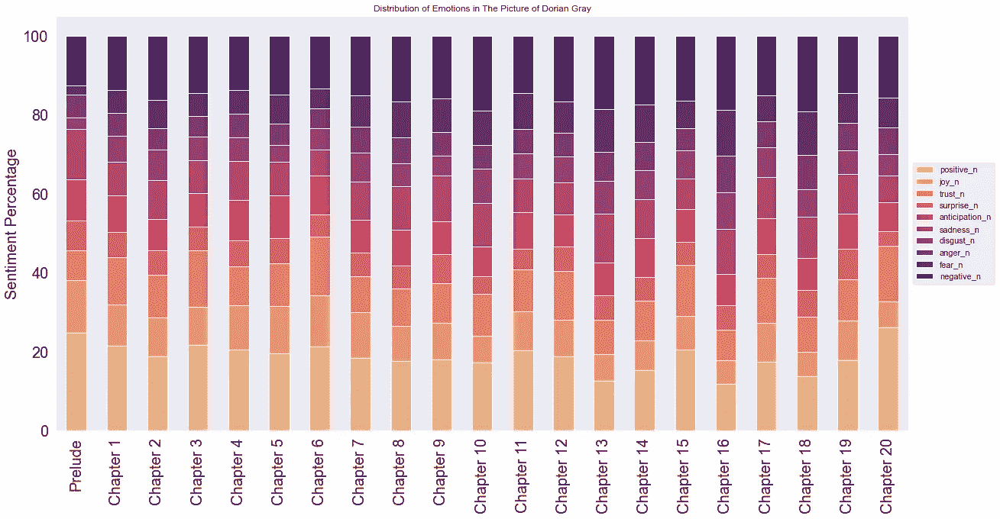

作者图片

这比我之前尝试的简单朴素的积极或消极情绪贝叶斯分类要微妙得多！

# 词云

作为最后的视觉化，这里是“道林·格雷的画像”的文字云图。单词越大，出现的频率越高。从这个情节中，我们不难看出，书中最常见的几个词是:一、知、命、去、看。

。作者图片

# 结论

情感分析和情感识别被用来分析奥斯卡·王尔德的《道连·格雷的画像》。这里展示的例行程序的结果阐明了这本书的一些主题/情感结构，使用朴素贝叶斯分类器、VADER 和 NRC 词典对书中的每一章进行分类。

这个项目的下一步包括处理奥斯卡·王尔德的剩余作品，看看他的书中是否有共同的情感结构。除此之外，我想探索其他作者和体裁，看看我是否可以提取共同的情感结构！也许这将为作家(或潜在的人工智能)以特定的方式写作提供一点公式化的方式。

我还在开发一个 Streamlit 应用程序，应该很快就会上线，它可以让你为古腾堡计划中的任何一本书进行情绪分析。

这是一个有趣的项目，我希望你从中有所收获。感谢阅读！

如果你愿意支持我的编码工作，请考虑通过我的推荐链接加入 Medium:[https://victormurcia-53351.medium.com/membership](https://victormurcia-53351.medium.com/membership)