# 使用无服务器框架测试 AWS 微服务

> 原文：<https://betterprogramming.pub/serverless-framework-to-test-aws-microservices-575cbbc0823>

## 学习使用 AWS 无服务器服务进行测试


一些最广泛使用的 AWS 无服务器服务

与普通的 REST API、web 应用程序或数据库相比，AWS 服务的功能测试稍微有点挑战性。让我们看看在处理 AWS 服务时有哪些主要问题。

让我们考虑一个使用 Lambda 函数运行应用程序并使用 step 函数进行编排的解决方案，将元数据存储在 DynamoDB 中，将数据文件存储在 S3 中。

在构建测试自动化框架时，如果您使用 Jenkins、CircleCI、GoCD 或任何其他 CI 工具来执行测试，那么在服务器上传递和存储像`aws_access_key_id`和`aws_secret_access_key`这样的用户凭证并不是访问 AWS 服务的安全方式——而且它有潜在的安全隐患。因此在这种情况下，您需要分配在 AWS 中运行的 CI/CD 服务器( [EC2](https://aws.amazon.com/ec2/) / [ECS](https://aws.amazon.com/ecs/) )并分配 [IAM 角色](https://docs.aws.amazon.com/IAM/latest/UserGuide/id_roles.html)来访问所有其他 AWS 服务。

这个解决方案也有一个限制:如果应用程序中的服务使用 [VPC 端点，](https://docs.aws.amazon.com/vpc/latest/userguide/vpc-endpoints.html)那么管理起来就变得非常困难，因为企业中的 CI 服务器通常托管在不同的 AWS 帐户中(传统上称为*工具帐户)。*视觉上，可以这样表示:

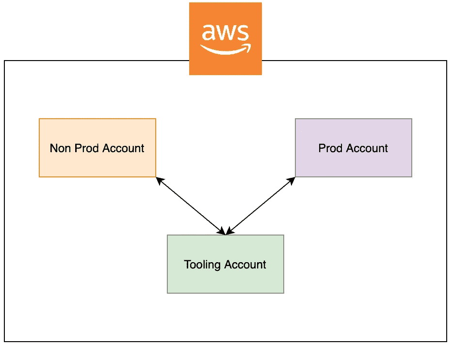

典型的企业 AWS 客户管理

# 无服务器框架如何帮助缓解这些问题

该框架考虑了以下假设:

*   测试运行时间不超过 15 分钟(当前的 Lambda 最大执行时间)
*   测试执行时不会消耗超过 3008 MB 的内存


详细的无服务器测试架构

在本文中，我将讨论构建和运行无服务器测试所需的一些组件。我将省略如何为测试调用/测试执行报告的语音命令构建 Alexa 技能，以及如何使用 Express 服务器报告仪表板，但我将在未来的文章中返回这些主题。

# 第一步

使用任何现有的框架编写您的自动化测试。在这个例子中，我们使用摩卡茶来展示一个样本测试。理想情况下，这些将是验证您的 AWS 应用程序的自动化测试。

运行以下命令，首先在本地运行这些测试:

```
mkdir serverless-test-framework && cd serverless-test-framework
npm init -y
npm i mocha chai mochawesome moment-timezone aws-sdk fs
```

*   `mocha`，`chai` : Mocha 是测试框架，柴是断言库
*   `mochawesome`:生成漂亮 HTML 报告的报告库
*   `moment-timezone`:用于轻松生成 AEST 时区的当前日期和时间
*   `aws-sdk`:用于与 S3、SNS 等服务交互，推送报表文件和通知
*   `fs`:用于从本地目录读取文件内容，以便复制到 S3

创建测试文件，并将下面的代码复制到其中。这是一个样本测试用例。

```
touch test.js
```

在这个阶段，可以通过运行`mocha`命令来独立运行这些测试。这将生成如下所示的输出。注意，还没有生成 HTML 报告。


Mocha 测试-执行结果

让我们开始编写 Lambda 函数的代码。首先，创建一个`lib`文件，该文件将包含助手函数，用于与框架所需的必要 AWS 服务进行交互。

```
mkdir lib && cd lib
touch aws-manager.js
```

将下面的代码复制到`aws-manager.js`文件中。第 3 行有`region`值。请确保根据您的位置进行更新。

最后一步是创建 Lambda 函数调用所需的`index.js`文件。

```
// come out of lib directory
cd .. 
touch index.js
```

将下面的代码复制到`index.js`中。在这个文件中，我们将使用编程方法调用 Mocha 测试。

**注意:**在 AWS 中创建资源后，第 40 行和第 55 行需要更新对 S3 和 SNS 主题的引用。


无服务器测试框架目录

这是你的文件夹在这一步结束时的样子。如果没有，请检查错过了哪一步。(`node_modules`将在`npm i`命令后自动创建。)

# 第二步

让我们开始构建 AWS 资源。我想你已经有一个 AWS 账户了——如果没有，可以免费注册。转到 [AWS 控制台，](https://aws.amazon.com/console/)并使用您的凭证登录。

## **创建 S3 存储桶**

这是存储使用 mochawesome 生成的执行报告所必需的。
点击“服务”，然后点击“S3”

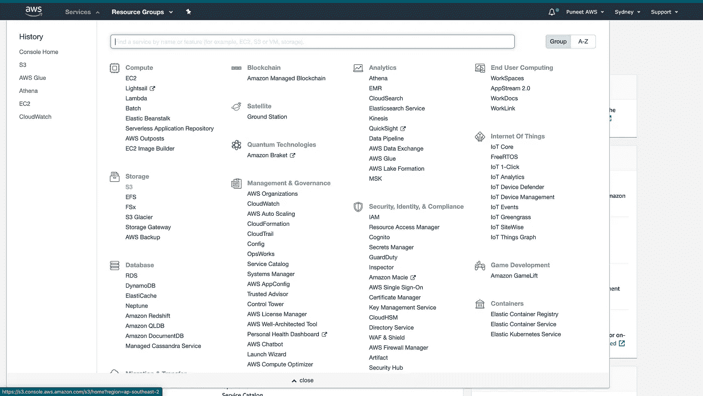

S3 在储物区下面

单击“创建存储桶”按钮，并输入您的存储桶名称。根据您的位置选择区域，然后单击底部的“创建存储桶”按钮。

不要忘记更新`index.js`文件中第 40 行的`name`。


## **创建 SNS 话题**

这用于在测试失败时向所有订户发送通知。

单击“服务”，然后单击“应用程序集成”部分下的“简单通知服务”。或者在搜索栏搜索“SNS”。

单击左侧窗格中的“主题”,然后单击“创建主题”按钮

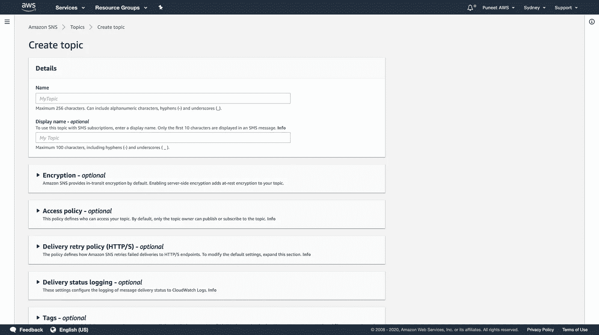

创建社交网络话题

输入主题的名称，然后单击底部的“创建主题”按钮。

不要忘记更新`index.js file`中第 55 行的`name`。

让我们给这个主题添加订阅者。单击上面创建的主题名称，然后单击“创建订阅”这是一个非常重要的步骤，可以确保您在测试失败时收到通知。

选择“电子邮件”作为协议，并输入您的有效电子邮件。点击屏幕底部的“创建订阅”按钮。

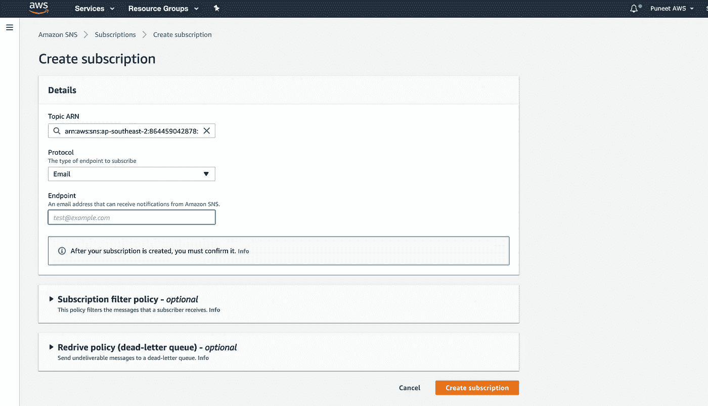

创建订阅

这将向您的 ID 发送主题为“AWS 通知-订阅确认”的电子邮件点击“确认订阅”链接。

**可选:**为您的手机号码创建另一个套餐。


短信和电子邮件订阅

## **创建一个 Lambda 函数**

这用于为自动执行部署测试。单击“服务”，然后单击“计算”部分下的“Lambda”。或者在搜索栏中搜索“Lambda”。

单击“创建函数”按钮，您应该会看到以下屏幕:


创建 Lambda 函数

输入函数名，运行时选择“Node.js 12.x”(默认选择)。

下一步可能是整个教程中最重要的部分。创建一个 IAM 角色，它将授予这个 Lambda 函数对上面创建的 S3 存储桶和 SNS 主题的访问权限。

展开“选择”部分，或创建一个执行角色。

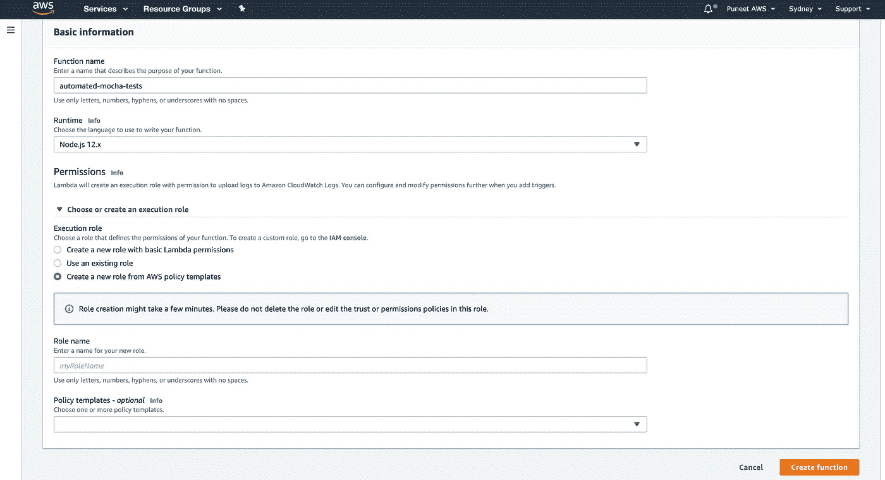

从 AWS 策略模板中选择“创建新角色”

输入角色名称，从策略模板下拉列表中选择“Amazon SNS 发布策略”

点击“创建函数”


选择亚马逊社交网络发布政策

这是你的 Lambda 函数最初的样子。我们将在步骤 3 中对这个 Lambda 部署测试。


λ函数

向下滚动 Lambda 函数页面，在基本设置下，点击“编辑”将超时时间增加到 30 秒，然后单击“保存”

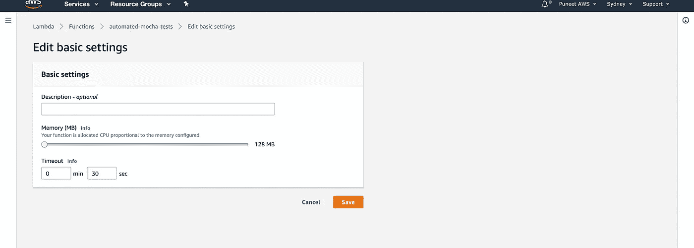

在 Lambda function 页面上，在 execution role 下，点击“查看<rolename>角色”这将带您进入 IAM 管理控制台角色页面。</rolename>

单击“附加策略”按钮。在“附加权限”页面上，在搜索栏中搜索“s3”，并选择“AmazonS3FullAccess”单击屏幕底部的“附加策略”。

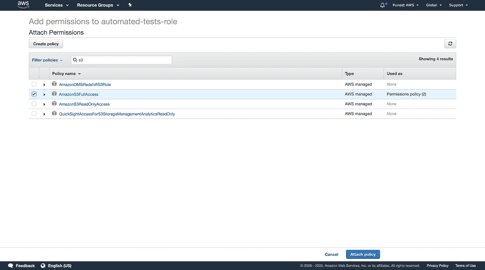

添加策略以授予 Lambda 对 S3 的完全访问权限

## 创建云观察事件

这将需要在预定的基础上触发 Lambda 功能。

单击“服务”，然后单击“管理和治理”部分下的“云观察”。或者在搜索栏搜索“CloudWatch”。

单击左侧窗格中的“规则”,然后单击“创建规则”按钮。

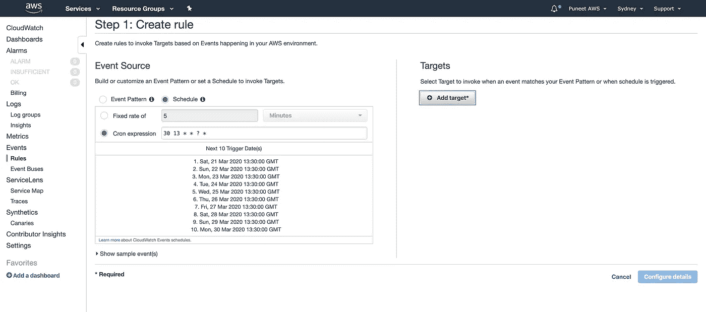

创建云观察事件

单击“Schedule”单选按钮，并选择“Cron Expression”在文本框中输入
`30 13 * * ? *`。这意味着该事件将在每天 13:30 GMT 时间发生。您需要将当地时间转换为 GMT，以便正确安排活动。

点击“目标”部分下右侧的“添加目标”,并从下拉列表中选择您的 Lambda 函数。


选择 Lambda 函数作为目标

单击底部的“配置详细信息”按钮。

输入名称和描述，然后单击右侧的“创建规则”按钮。

**注意:**状态默认启用。不要禁用它。

# 第三步

所有 AWS 资源都已创建，代码已经准备好部署到 Lambda 函数中。

打开终端，和`cd serverless-test-framework`。这与我们在步骤 1 中创建的目录相同。打包你的测试代码。

```
zip -qr tests.zip .
```

这将生成一个名为`tests.zip`的新 Zip 文件。

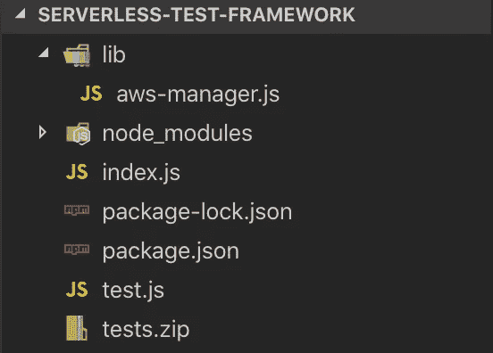

新的 Zip 文件已经添加

返回 AWS 控制台，并转到作为步骤 2 的一部分创建的 Lambda 函数。

点击“代码输入类型”下拉菜单，并选择“上传. zip 文件”

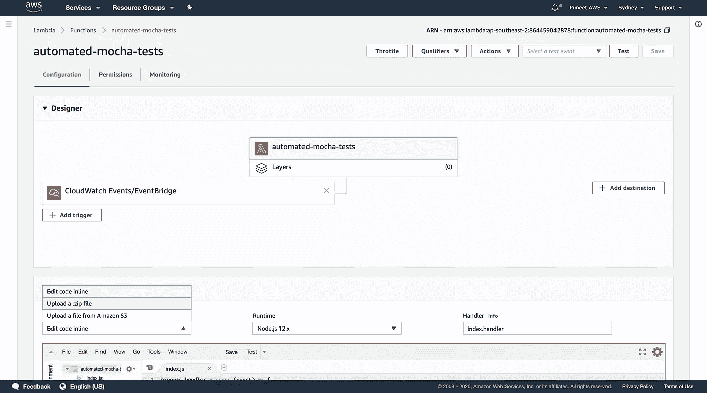

点击上传按钮，并选择`tests.zip`文件。点击屏幕顶部的“保存”按钮。

**重要提示:**点击屏幕上方的“保存”按钮故意重复)。

现在是测试部署是否成功的时候了。

单击屏幕顶部“测试”旁边的下拉菜单，然后单击“配置测试事件”

输入事件的名称，一切保持原样。点击“创建”按钮。

单击“测试”按钮，您应该会看到下面的绿色输出。这意味着 Lambda 函数已经成功运行，并且所有测试都已经执行。

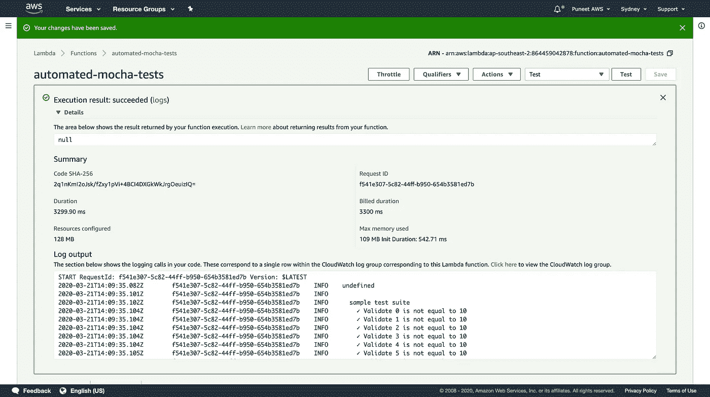

让我们看看 S3 的处决报告。打开一个新选项卡，并转到步骤 2 中创建的 S3 存储桶。

在这个 S3 中，应该会自动创建新的文件夹，
`reports` > `html` —包含所有 HTML 报告
`reports` > `json` —包含每次执行对应的 JSON 报告


执行报告

现在让我们检查当测试失败时我们是否收到通知。回到你的编辑器，让我们故意让其中一个测试失败。

打开`test.js`，将第 6 行改为`expect(i).to.not.equal(9)`。


更新的测试用例

执行 Zip 命令`zip -qr tests.zip`，它将更新现有的`tests.zip`文件。

返回到 AWS 控制台 Lambda 功能。点击“上传”，并选择`tests.zip`。点击右上角的“保存”。

保存成功后，点击“测试”。

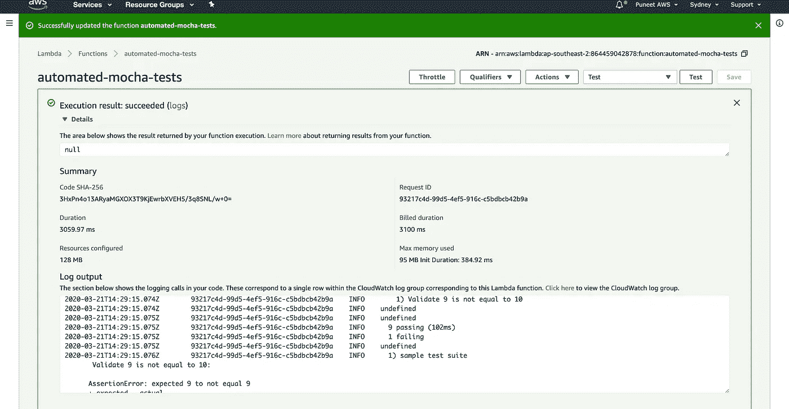

试验时的损坏

日志显示一次失败和九次通过。另外，你可以在 CloudWatch 中查看详细的日志。

点击“监控”，然后点击“查看 CloudWatch 中的日志”

如果您已经执行了多次，请选择最新的流。


CloudWatch 中的日志流

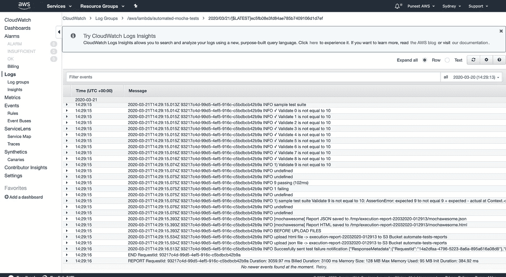

详细日志

与此同时，您应该已经通过 SMS(取决于您的订阅)在您的收件箱中收到了一封电子邮件。

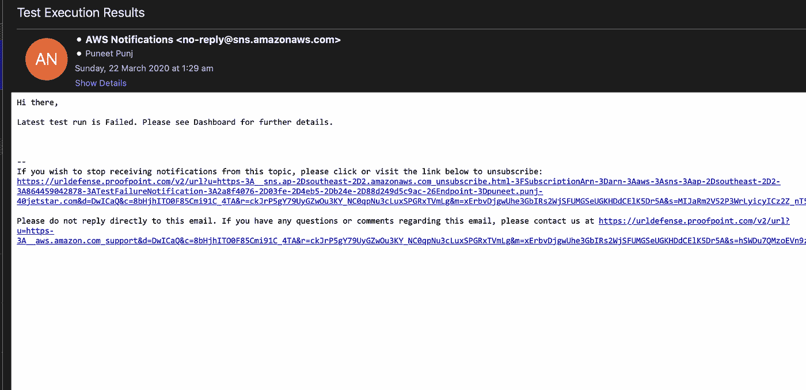

# 第四步

最后一件事很突出:我们需要检查 Lambda 函数是否基于步骤 2 中预定的触发器执行。检查 CloudWatch 中的日志，看看您是否注意到当时的日志流。

**注意:**日程安排部分提到的时间是 GMT，而不是您当地的时间。

# 结论

我们只涉及了详细的测试框架架构图(如下)中显示的一小部分。但是这是一个非常好的开始，现在您可以在一个无服务器的环境中运行自动化测试。

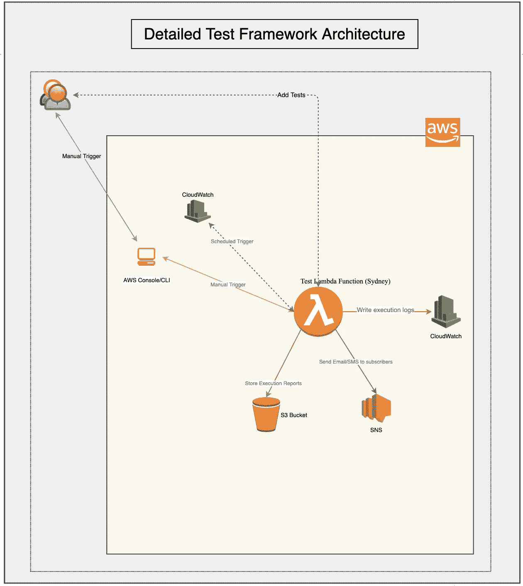

这是我们今天建造的

您可以向`test.js`文件中添加更多的测试，如果您想对任何 AWS 服务运行测试，比如 DynamoDB 或 RDS，只需确保更新 IAM 角色并根据需要增加超时/内存。

这是为每个应用程序独立运行测试的一种简洁明了的方法。

而且都搞定了！如果您成功地创建了所有的资源并成功地执行了测试，那就做得很好。在我的下一篇文章中，我将解释如何建立一个 Alexa 技能来使用语音命令执行测试。想象一下，说“嘿，Alexa，执行我的样本测试”，然后看到你的测试开始执行。

为您的框架构建简单而详细的报告仪表板—[https://medium . com/JavaScript-in-plain-English/reporting-dashboard-for-server less-test-framework-36dd 46 BF 54 da](https://medium.com/javascript-in-plain-english/reporting-dashboard-for-serverless-test-framework-36dd46bf54da)