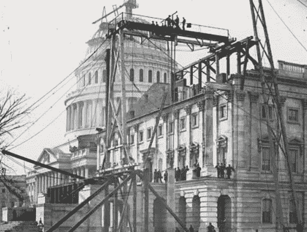

# 编写用户故事的 7 个最佳实践

> 原文：<https://betterprogramming.pub/seven-best-practices-for-writing-user-stories-7d979733fcfb>

## 构建软件很难

正在建设中的华盛顿 DC 国会大厦。很多人说，建软件就像盖房子；他们错了。(图片来源:美国国家档案馆)。

许多人说构建软件应该像建造房子一样，并想知道为什么需要这么多的努力来构建工作产品。从根本上说，构建软件不同于构建，因为我们几乎从未构建过可重复的产品。

因此，我们需要使用不同的技术来帮助我们应对软件开发所带来的不确定性。用户故事是一种有帮助的技术。

用户故事是记录你需要在软件中构建的特性的一种非常简单有效的方式。它们帮助开发人员和产品经理关注最重要的事情，它们也可以作为敏捷开发过程的一部分。但是尽管用户故事很有用，但也很难写好。

与任何技术一样，有一些最佳实践可以帮助您充分利用它们，在本文中，我们将讨论编写用户故事的七个最佳实践——从如何开始与您的客户谈论他们的需求(而不是您的需求),一直到开发人员完成每个故事后为其创建验收标准。

# 与你的利益相关者交谈

用户故事中最重要的部分是将要使用软件的人。你应该和你的客户谈论他们对项目的需求和目标，包括:

*   他们想让你造什么？
*   他们为什么想要它？
*   他们什么时候会使用它？

要回答这些问题，你需要花时间与利益相关者在一起，建立关系，观察他们的工作，了解他们的业务需求，并将这些需求转化为可以帮助他们的功能。

# 保持你的用户故事简单

你应该保持你的用户故事简单。这有几个原因:

*   简单的故事更容易阅读。如果你添加了太多的细节，团队中的新成员可能很难理解需要做什么。
*   简单的故事更容易从一个人的角度理解和解释(例如，一个开发人员)。你故事的每个元素都应该很重要。用户故事不是“填充”的地方——如果你的文本没有增加价值，就不要写！
*   简单的故事更容易测试——你应该能够在写完之后尽快测试故事中的每一项——这意味着你也不应该有任何不必要的琐碎或复杂。

# 不是格式的问题；是内容的问题

用户故事的格式并不重要。这只是一种传达你想用这个特性达到什么目的的方式。有许多方法来记录特性，但是重要的是你的团队同意一个一致的格式来记录它们。一些团队使用非常正式的文档，其他团队可能使用不太结构化的东西，比如墙上的便利贴。

最适合您的团队和项目环境的方法就是您的正确方法。就个人而言，我喜欢每个故事都有一个基于用户故事文本的格式，任何可能有帮助的背景注释，然后是任何接受标准。

# 保持你的用户故事小

用户故事是管理您的工作的一种很好的方式，但是如果您试图在覆盖太多功能的故事上工作，您可能会冒开发团队无法合理消化的风险。

太大的故事往往比较小的定义明确的故事具有更大的风险。如果功能有太多的方面，太多的未知，或者可能一次改变太多的代码库，那么开发就有遇到困难和陷入困境的风险。一般来说，让你的用户故事尽可能的小，并且覆盖一个独立的功能块来最小化这种风险是一个好的实践。

让我们从一个太长的用户故事的例子开始:“作为一个新的银行客户，我希望能够申请信用卡和贷款，而不必填写任何文书工作。”那不会解决问题的。

该示例包含多个场景，在本例中，应用不同类型的帐户，但是这些应该分解到单独的用户情景中。第二个问题是太笼统，没有真正详细描述需要做什么。

这个例子应该被看作是一个“史诗”或者一个总体故事，它可以被分解成子特性和用户故事，并通过一系列的步骤来交付。

# 不要害怕分割你的用户故事

将一个用户故事分解成更小的故事不仅是可以接受的，而且是鼓励的。如果你和一个开发团队一起工作，这将帮助他们在更短的时间内达到期望的结果。

如果你仍然不确定你的用户故事是否应该被分成更小的部分，问问你自己这些问题:

*   是不是感觉太大了？
*   它是否包含可以单独交付的多个方面？
*   接受标准是否揭示了分解故事的方法？
*   是那种需要很长时间才能传递的故事吗？

这些都可能是一个信号，表明你需要把故事分成更小的部分。

显示一些代码的计算机屏幕(图片:公共领域)

# 创建验收标准

验收标准是在用户故事被认为是完整的之前必须满足的条件。编写它们的过程与编写用例非常相似，但是有一些关键的区别:

*   验收标准比用例更具体。虽然这两个文档都有接受标准，但是用户故事通常比用例包含的步骤少。
*   验收标准应关注功能和性能需求，而不是业务需求；也就是说，他们将从用户的角度概述你的应用程序将如何运行，而不是关注幕后需要发生的事情。
*   验收标准是一系列的测试，这些测试将确保软件做用户需要的事情；请你团队中的任何专业测试人员来帮助编写它们，这是收集不同视角来真正检查代码的好方法。

接受标准可以写成一系列步骤，或者你可以用一个表格进行实验，表格中的每一列代表一个重要场景(例如，当某人第一次打开你的应用时会发生什么)，每一行代表一个结果(例如，“用户看到一个带有他们名字的仪表板”)。后一种方法可能会引导您探索测试驱动开发的“给定、何时、然后”格式(但是我将把它作为另一天的主题！)

无论哪种方式，验收标准都允许您在构建之后测试每个特性的工作情况。

# 考虑使用“就绪”的定义

“准备好的定义”是一种有用的方法，可以检查你的用户故事是否准备好让开发团队去挑选和处理。它类似于“完成的定义”，这是一个检查表，用于检查团队交付的功能是否满足某些最低标准(例如，测试通过、文档更新、代码部署等)。

作为业务分析师或产品负责人，我们习惯于处理不确定性。有时候，我们只是不知道在开始开发之前需要解决的许多问题的答案。

例如，让我们假设我们对一个过程有时间限制，但是涉众还没有就时间限制达成一致。或者我们正在等待一项立法成为法律。在这些情况下，我们要么解决不确定性，要么不得不承认这些领域的需求可能需要等待。

ready 的定义可以帮助您了解在开始开发之前还需要做哪些额外的工作，或者需要满足哪些条件。

就绪的基本定义可能包括以下因素:

*   状态——你认为故事已经准备好了还是有太多的不确定性？
*   写好了吗？
*   它符合你的利益相关者的期望吗？
*   细化——开发团队是否已经审查了用户故事，他们是否对故事可以进入开发感到满意？
*   团队对及时交付功能感到满意吗(例如，在 sprint 中，或者如果不使用 Scrum，在合理的时间范围内)？
*   是否有任何关键的验收标准被写下来？
*   用户故事可以被分割成更小的部分吗？

一个好的“就绪”定义会给你一个工作清单，帮助你确定在团队开始开发之前你已经完成了你的工作。

作为一名业务分析师或产品所有者，你可能会花相当多的时间来达成协议并把这些协议写下来。用户故事是一种很好的方式，可以捕捉利益相关者的需求，并与程序员和最终用户就产品的特性进行交流。

希望这些最佳实践能帮助你写出更好的用户故事，或者只是给你一些进一步研究的领域。这种努力是值得的，因为编写良好的用户故事可以帮助不确定环境中的敏捷开发团队以小的增量步骤进行开发，允许尝试各种选项并测试对变化情况的反应。

构建软件并不容易，所以任何帮助你应对不确定性和变化的技术都将成为你军械库中有价值的一部分。

记住，这不是格式的问题；是内容的问题。

*如果你觉得这篇文章有用为什么不* ***跟着*** *我呢？*

另外，你可能会对我写的关于编写用户故事的书感兴趣。在“ [*有效的用户故事*](https://www.amazon.com/dp/B085G6K4ZX) *”中，我更深入地探索了用户故事，研究了具体的例子，并包含了我在过去 20 多年中学到的大量经验教训。你可以在这里* *找到本书* [*。*](https://www.amazon.com/dp/B085G6K4ZX)