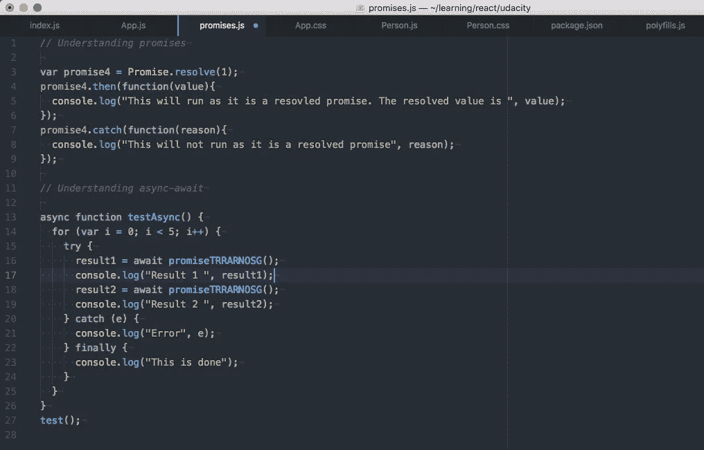

# JavaScript:承诺还是异步等待

> 原文：<https://betterprogramming.pub/should-i-use-promises-or-async-await-126ab5c98789>

## 一套何时使用的规则

我最近看了一个中型帖子，作者声称使用`async-await`比使用`promises`更好。

虽然这在一般情况下可能是真的，但我认为这种概括太宽泛了，对`async-await`和`promises`都不公平。

对于 JavaScript 新手来说，理解这些并决定使用哪一个可能是一个挑战。在这篇文章中，我将列出我学到的关于这些的东西，以及我如何决定何时使用它们。

我在哪里读到过`async-await`是使用`promises`的语法糖。因此，在了解`async-await`或决定使用哪种方法之前，请确保您对[承诺](https://medium.com/better-programming/understanding-promises-in-javascript-13d99df067c1)和[异步等待](https://medium.com/better-programming/understanding-async-await-in-javascript-1d81bb079b2c)有很好的理解。

以下是我遵循的一些经验法则。

# 使用承诺的经验法则

1.  每当使用异步或阻塞代码时，都要使用承诺。
2.  `resolve`映射到`then`并且`reject`映射到`catch`用于所有实际目的。
3.  确保为所有承诺编写`.catch`和`.then`方法。
4.  如果在两种情况下都需要做些什么，使用`.finally`。
5.  我们只有一次机会改变每个承诺。
6.  我们可以为一个承诺添加多个处理程序。
7.  `Promise`对象中所有方法的返回类型，不管它们是静态方法还是原型方法，都是一个`Promise`。
8.  在`Promise.all`中，承诺的顺序保持在 values 变量中，不管哪个承诺首先被解析。

一旦你对承诺有了概念，看看吧。它有助于您编写可读性更好的代码。如果使用不当，它也有不好的一面。

# 异步等待的经验法则

以下是我在使用`async`和`await`时保持理智的经验法则。

1.  `async`函数返回承诺。
2.  `async`函数使用隐式`Promise`返回结果。即使你没有明确地返回一个承诺，T2 函数也会确保你的代码通过一个承诺。
3.  `await`阻塞`async`函数中的代码执行，它(`await statement`)是其中的一部分。
4.  在一个`async`函数中可以有多个`await`语句。
5.  使用`async await`时，确保使用`try catch`进行错误处理。
6.  在循环和迭代器中使用`await`时要格外小心。您可能会陷入编写顺序执行代码的陷阱，而这本来可以很容易地并行完成。
7.  `await`始终为单个`Promise`。
8.  `Promise`创建启动异步功能的执行。
9.  `await`仅阻塞`async`函数内的代码执行。它仅确保在`promise`解析时执行下一行。所以，如果一个异步活动已经开始，`await`不会对它有任何影响。

# 我应该使用承诺还是异步等待

答案是我们会两者并用。

以下是我用来决定何时使用`promises`和何时使用`async-await`的经验法则。

1.  `async function`返回一个`promise`。反之亦然。每一个返回一个`promise`的函数都可以认为是`async function`。
2.  `await`用于调用`async function`并等待其到`resolve`或`reject`。
3.  `await`阻止代码在其所在的`async`函数中执行。
4.  如果`function2`的输出依赖于`function1`的输出，我就用`await`。
5.  如果两个功能可以并行运行，创建两个不同的`async functions`然后并行运行它们。
6.  要并行运行承诺，创建一个承诺数组，然后使用`Promise.all(promisesArray)`。
7.  每次你使用`await`的时候，记住你正在写阻塞代码。随着时间的推移，我们往往会忽略这一点。
8.  与其创造巨大的`async functions`和众多的`await asyncFunction()`，不如创造更小的`async functions`。这样，我们会意识到不要写太多的阻塞代码。
9.  使用较小的`async functions`的另一个好处是，你可以强迫自己考虑哪些异步函数可以并行运行。
10.  如果你的代码包含阻塞代码，最好让它成为一个`async` 函数。通过这样做，您可以确保其他人可以异步使用您的函数。
11.  通过从阻塞代码中创建异步函数，用户(将调用您的函数)可以决定他们想要的异步级别。

希望这能帮助你决定什么时候用`promises`，什么时候用`async-await`。

要了解更多这样的经验法则，请加入我们的对话服务器[https://discord.gg/ENbQbbZy25](https://discord.gg/ENbQbbZy25)或者在推特上关注我[https://twitter.com/gokulnk](https://twitter.com/gokulnk)

你也可以订阅我的简讯[https://understandingx.substack.com/](https://understandingx.substack.com/)我懒得写，所以你可能会有一段时间没有我的消息。