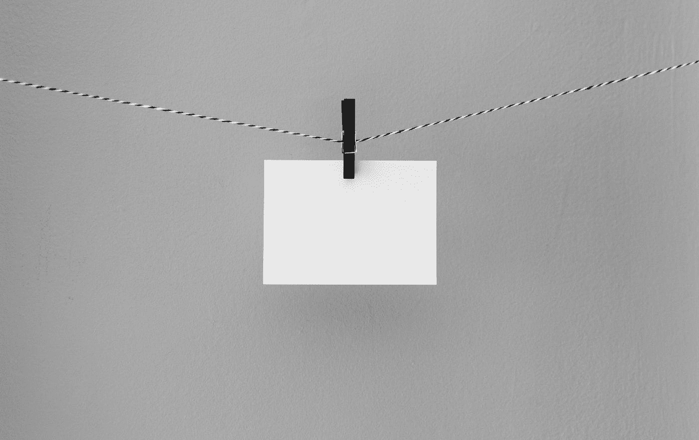

# 可以在数据库中存储 JWT 令牌的 3 种场景

> 原文：<https://betterprogramming.pub/should-we-store-tokens-in-db-af30212b7f22>

## 知道时间和原因

凯利·西克玛在 [Unsplash](https://unsplash.com?utm_source=medium&utm_medium=referral) 上的照片

基于令牌的身份验证(通常基于 JWT)被称为无状态身份验证，因为身份验证服务器不需要维护任何状态，令牌本身包含验证令牌持有者身份验证的所有必要信息。

服务器可以无缝地检查 JWT 是否包含有关用户身份和授权的必要信息，以执行某个操作，而无需查询数据库。现在问题来了，如果是这种情况，那么我们需要在数据库中保存 JWT 令牌吗？如果是，那么是什么时候，为什么？

我将尝试涵盖三种需要在 DB 中保存令牌的场景。

# **刷新代币**

在我们深入这个主题之前，让我简单介绍一下访问令牌和刷新令牌。当用户登录时，授权服务器发出一个访问令牌(通常是 JWT)，然后客户端可以使用这个令牌进行安全的 API 调用。

当客户端需要代表用户从服务器访问任何受保护的资源时，它会在请求标头中附加令牌，帮助服务器确定客户端/用户的真实性。访问令牌的寿命非常短(一般不超过 30 分钟)。

一旦访问令牌过期，客户端应用可以提示用户重新登录(这当然不是好的用户体验),或者客户端可以使用由授权/认证服务器发布的刷新令牌来生成新的访问令牌。

刷新令牌通常比访问令牌具有更长的寿命。他们可能是也可能不是 JWT。刷新标记可以是简单的编码字符串或 UUID。刷新令牌也是无记名令牌，因此恶意用户理论上可以窃取刷新令牌，并无限期地使用它来从服务器访问受保护的资源。那么我们如何保护我们的应用程序不被恶意用户访问受保护的资源呢？

对这个问题最直接的回答是在数据库中保存刷新令牌，并在报告任何此类恶意行为时，通过删除所有刷新令牌来撤销所有用户的访问。但是如果没有报告，我们会让恶意用户无限期地访问受保护的资源吗？我们是否继续在数据库中保存刷新令牌？

这个问题的答案是刷新令牌轮换、刷新令牌重用检测以及在生成新令牌时删除所有旧的刷新令牌。我来试着解释一下我的答案——当生成新的访问令牌时(在登录/注册或使用刷新令牌时)——还应该生成新的刷新令牌(这称为刷新令牌轮换)，并且必须删除所有之前的刷新令牌。

这样，即使恶意用户窃取了刷新令牌，当合法用户尝试登录应用程序时，也会生成新的访问令牌和新的刷新令牌，并且所有其他刷新令牌都将被删除。如果恶意用户尝试使用旧的刷新令牌，刷新令牌重用检测将已经检测到重用，或者刷新令牌不会存在于数据库中。这样我们可以防止恶意攻击。

# **电子邮件验证令牌**

在用户注册应用程序后，会向用户的电子邮件地址(他/她用来注册的地址)发送一封验证电子邮件。该电子邮件包含一个链接，该链接带有服务器为该用户 ID 生成的令牌，当用户单击该链接时，会使用该令牌(电子邮件验证令牌)向服务器发出 API 请求。这些令牌的到期时间总是很短。

服务器需要验证该用户电子邮件的令牌。但是，如果用户在当前链接/令牌过期之前再次点击重新发送验证电子邮件，该怎么办呢？为了处理这种情况，需要将令牌保存在 DB 中，要么保存所有令牌，要么只保存最新的令牌(当生成新令牌时，旧令牌将被删除)。

由于此时所有或多个令牌都是活动的，因此 JWT 验证将通过任何令牌，但我们应该只与最新的令牌进行比较。验证完成后，必须删除该用户的所有电子邮件验证令牌。

# **重置密码令牌**

当用户点击忘记密码并输入他/她的电子邮件地址时，会向用户发送一封包含链接的电子邮件(其中包含重置密码令牌)。这些重置密码令牌的寿命通常也很短。

一旦用户点击链接，他/她需要输入新密码，并且一旦点击重置密码，就会向服务器发出 API 请求，其中包含在电子邮件链接中发送的新密码和令牌。保存/不保存此令牌的原因与电子邮件验证令牌非常相似。如果用户多次点击忘记密码，并收到多封电子邮件(都在令牌到期之前)。

在这种情况下，我们需要在 DB 中存储所有令牌或最新的令牌(当生成新令牌时，旧令牌应该被删除)。用户单击链接后，API 请求有效负载中的令牌与 DB 中该用户的最新令牌相匹配，并且必须删除该用户的所有重置密码令牌。

# **结论**

JWT 允许服务器通过检查令牌内容来执行无状态身份验证。如果在任何情况下，可以为一个用户的单个目的生成多个 JWT，如电子邮件验证令牌或重置密码令牌，在这些情况下，我们必须将令牌/最新令牌保存在数据库中，以便与最新的令牌相匹配。类似地，对于刷新令牌(JWT 与否)，我们需要将其保存在 DB 中，以撤销和防止恶意用户访问。

编码，阅读，改变世界！