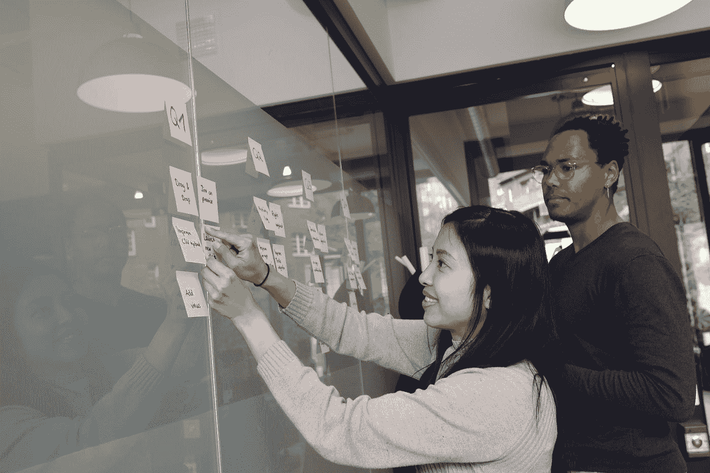

# 你应该抓住第一个成为经理的机会吗？

> 原文：<https://betterprogramming.pub/should-you-jump-at-the-first-opportunity-to-become-a-manager-91189c9a1914>

## 首先为过渡做好准备

在 [Unsplash](https://unsplash.com?utm_source=medium&utm_medium=referral) 上[空中聚焦](https://unsplash.com/@airfocus?utm_source=medium&utm_medium=referral)拍摄的照片

几年前，一个成为我团队经理的机会出现了。

团队发展到一定程度，我的经理需要额外的帮助，他会将他的一些直接下属分离出来。

寻找团队的新经理相对来说比较突然，虽然我之前和我的经理谈过可能走管理路线，但我没有认真考虑过。

那时，我是大科技公司的一名高级工程师，正在考虑是否应该花时间和公司的其他高级经理一起参加面试。

在面试我的两位高级经理中，我以前和其中一位共事过(他是我团队的项目经理)，而不是另一位。最终，我经历了这个过程，了解了这个角色的期望。

例如，一位经理强调了经理角色的人员方面是多么重要。人的重要性现在很明显，但当时不一定。我觉得我的经理花了大部分时间与其他团队协调，并改变团队的流程。

回顾过去，我确信他必须在幕后处理许多人事问题。正如我从与其他经理的交谈中了解到的，这是一个让许多新经理感到惊讶的领域。

关于向其他经理学习，我和其他最近从工程师转型过来的经理谈过。他们让我深入了解了他们的新角色以及他们如何处理这些角色；我将把这些见解融入到我下面的学习中。

在向我的经理汇报了来自高级经理的反馈后，我和他认为现在不是过渡的合适时机。

回想起来，我很高兴我没有抓住这个机会。对于我面试的两位高级经理的犹豫，我本可以不那么坦诚，并有可能获得新的经理职位。

然而，我知道我可以依靠以前共事过的经理来理解我的顾虑并提供指导。

相反，我花时间去理解工程经理角色的不同方面。根据您的公司，这可能会略有不同，或者工程师和经理之间的职责几乎没有重叠。

我也有后知后觉的能力，因为我已经在一家初创公司担任了一年多的工程经理。根据我的经验，我发现作为一名工程经理，我必须关注三个领域:技术指导、项目(有时是产品)管理和人员管理。

最重要的是，处理这些领域的方法与我当工程师时有了很大的不同。同样，根据您的公司，工程经理角色可能包含所有三种或其他职责。

# **技术指导**

许多工程经理在他们职业生涯的某个阶段是技术型的，通常是在开始阶段。然而，这些管理人员的专业知识差别很大，他们很少具有员工工程师的专业知识。

在一家大公司，如果经理是新进公司的，而且从未被期望为代码库做出贡献，那么很容易忽略工程师的奋斗可能是什么。

从我的经验来看，工程经理不需要像技术主管一样精通技术，但如果事情没有按计划进行，他应该足够同情或质疑团队。必要时，工程经理应该能够与团队一起调试问题。

工程经理还应该理解团队的技术方向，并与技术领导合作，在两者发生冲突时平衡业务需求。

在一些团队中，工程经理也是最具技术性的，但以我的经验来看，这只适用于较小的公司，因为在较大的(上市)公司中有太多的事情“出现”,瓶颈需要被分解。

# **项目或产品管理**

关于项目管理，我见过非常不同的方法。有些公司指定了 Scrum Masters，有些公司可能有项目经理。他们通常会参加 CSM 或 PMP 课程，并获得这些角色的认证。

从我的经验来看，这些认证对改进团队的过程没有什么帮助。这些专业人士的许多建议过于理论化，往往不能满足团队的需求。

相反，我发现工程经理或对与敏捷教练一起工作的过程充满热情的工程师可以产生最适合团队的敏捷方法。这也包括如何与组织内外的其他团队合作。

我很高兴在我作为一名工程师的最后几年里，我花时间完成了为一个全新的团队建立敏捷过程的任务，同时继续从事跨团队项目。

建立这些过程帮助我成为一个有经验的 Scrum 大师，而不需要获得认证，我可以将这种学习的不同部分转移到新的团队。

通常，工程经理会洞察到什么样的敏捷过程在他们的团队中起作用。当敏捷“最佳实践”不起作用时，强迫团队采用它会导致团队中的摩擦和挫折。对于没有指定产品团队的小公司，与 CEO、销售等一起帮助塑造产品。，也可以归属于工程经理。

# **人**

> 现在，人的重要性是显而易见的，但在当时(当我第一次考虑经理角色时)却不一定。

人员方面是最后一个领域，对大多数人来说也是最具挑战性的。在这篇文章中，我将包括教练/指导、团队合作、解决人员冲突和士气。

一个好的开始是了解你的管理风格。发现这一点是为什么许多新的经理培训课程和 MBA 项目要经过不同的性格测试，希望找到不同管理风格的蓝图。

然而，以我的经验来看，它要比那深刻得多；经理必须找出他们在报告中的优势和劣势。对我自己来说，我已经准备好接受辅导和指导。我在母校做了几年的导师，每年指导两名学生。

我还承担了指导更多初级工程师的责任，安排定期的一对一会谈，一起解决问题。我经常不知道解决方案，甚至不知道代码，因为不同的团队成员可能从事不同的项目。

这些情况有助于我在不知道答案的情况下进行辅导的能力，这在处理许多报告时给予指导是必不可少的。人们之间的冲突没有灵丹妙药，但思考不同的解决方案并咨询你的经理将有助于找到最合适的解决方案。

我发现最困难的地方是调整团队。通常，当团队成员喜欢跳到最近来自高级管理层的事情上时，这个问题就变得复杂了，不管它是否紧急。解决这个问题的一个方法是找到一种方法，围绕在 sprint 期间进入敏捷董事会的内容设置更严格的流程。

其他时候，它更多地是在站立时提醒团队冲刺的目标是什么。一个不一致的团队反映出每个人都很糟糕，因为速度变慢，功能总是被延迟。

尽管如此，最有可能解决这个问题的人通常是工程经理。正如看板方法所建议的，减少正在进行的工作也有帮助，但这可能不太可能，取决于公司的优先事项和正在进行的火灾数量。

> 我发现作为一名工程经理，我必须关注三个领域:技术指导、项目(有时是产品)管理和人员管理。

如果下一次你考虑成为经理是你的第一次，抓住机会观察你的经理每天都在做什么。与其他职位相对较新的经理(最好在你的组织中)交谈，看看他们的优缺点。

作为一名新经理，最具挑战性的方面因人而异。首要目标之一应该是弄清楚这对你来说可能是什么，有很多管理书籍都是关于这个的。另一种方法是看看你的公司是否为新经理提供培训，看看你是否能参加这些培训，然后再最终决定是否转型。

许多技术领域的个人贡献者(IC)只有在已经达到那个水平后才能晋升到下一个水平。然而，向经理的过渡很少使用相同的方法；许多高水平的工程师在缺乏指导的情况下陷入困境。

难怪许多曾经是优秀工程师的经理在一年之内又回到了 ICs。许多公司为过渡提供的帮助正在改善，但你仍然必须自己做工作，以使自己处于成功的最佳位置。我很高兴我的转变是渐进的，当我接手更多的管理任务时，它让我能够学习，而不会感到迷失方向或不知所措。

这个转变对我很有效，我希望你也能找到一个适合你的。