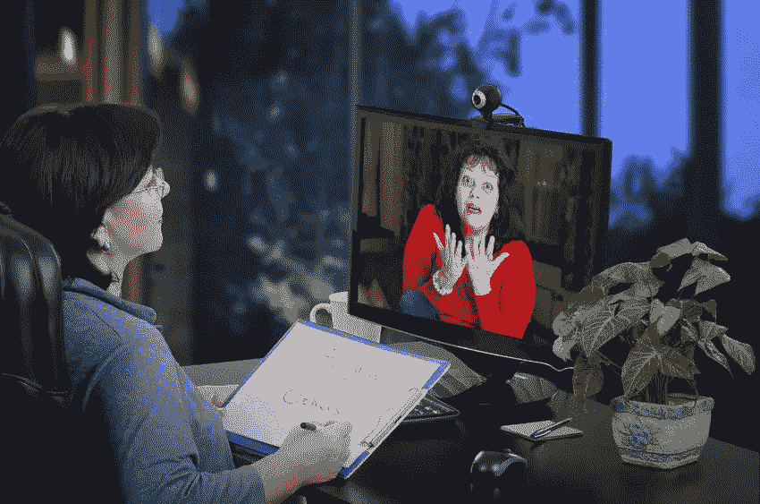

# 厨房里的“缩水”

> 原文：<https://betterprogramming.pub/shrinking-in-the-kitchen-telepsychiatry-makes-housecalls-at-last-6cf15a993d62>

## 电话精神病学终于出诊了

[韦尔巴斯卡](https://www.123rf.com/profile_verbaska)

尖叫声充满了整个房子，那个满头大汗、疯狂的女人喊道，“我不能呼吸了，我不能呼吸了！我胸口痛，我现在需要去急诊室**！”在大多数美国家庭中，这可能是一个警告，911 需要将其付诸行动，但在这里不是。**

**这个女人尖叫，咆哮到发狂，对她来说这是“新的常态”。她的丈夫知道该怎么做，也不是打 911。在电脑键盘上点击几下，“救援”就在眼前。**

**电脑显示器上的女人平静地开始安慰尖叫者，她没有死亡的危险，她没有心脏病，她会活过这一天。他们开始了一系列缓慢的练习，让这位在[恐慌发作中痛苦挣扎的妇女再次平静下来。](https://www.mayoclinic.org/diseases-conditions/panic-attacks/symptoms-causes/syc-20376021)**

**所有这些都是精神健康专业人员的日常工作，他们与最新的技术工具联系在一起进行实践。今天，我们不会像过去几个月或几年那样去急诊室了。技术已经进入了美国农村。**

**在世界范围内提供[心理健康服务](https://jamanetwork.com/journals/jama/article-abstract/2488315)的进展值得重新考虑并付诸实践。由于一个新的人工智能“朋友”，未来已经在中国这里。这个“朋友”每天收听超过一百万人向“她”讲述他们的问题。**

# **精神健康需求和服务**

**美国存在精神健康专业人员短缺的问题。在美国，650 万生活在农村地区的人患有精神疾病。许多脆弱的病人住在疗养院，那里可能没有精神病治疗。**

> **对于没有经过专门训练的普通医生来说，治疗它们的任务已经成为一种负担。在世界上的一些地区，这种短缺甚至更严重。**

**全世界估计有几十亿人无法获得精神卫生服务，创新是唯一可行的选择。据世界卫生组织统计，印度是抑郁症高发国家之一，人口超过 10 亿，却只有 9000 名精神病医生。出于这个原因，无论是在美国农村还是在世界各地，新的医学模式，如埃莉，已经得到了发展。艾莉是什么？**

**[艾莉](https://futurism.com/uscs-new-ai-ellie-has-more-success-than-actual-therapists)是南加州大学[创新技术研究所](http://ict.usc.edu/)的一款人工智能产品。她的动作和语言可以模仿真正的治疗师。虽然回应一项国际调查的精神病学家表示，他们认为技术永远无法取代专业人士表现出的同理心，但这似乎与埃莉明显的能力和成功相冲突。这种编程继续让她对人们的互动更加敏感。**

**正如他们所表示的那样，收听这个虚拟现实节目的人摆脱了去治疗的耻辱。最初是为了解决这个问题，并帮助军方帮助患有 PTSD(创伤后应激障碍)的退伍军人，现在发现它有更广泛的用途，包括治疗抑郁症和焦虑症。**

**设置是基本的；带有网络摄像头和麦克风的计算机允许患者观察和反馈人工智能问题。编程使得虚拟治疗师知道何时点头成为可能，就像治疗师在治疗过程中一样。**

**可以评估患者面部 66 个点的情绪提示，以读取会话期间的面部表情和变化。可以进一步分析患者的反应，以便与人工智能治疗师进行适当的交互。艾伦·特纳关于计算机未来的梦想正在变成现实。**

**[混合远程精神疗法](https://www.hindawi.com/journals/crips/2017/6296423/)，是远程精神疗法的另一种变体。在这种形式的治疗中，患者可以与精神病医生进行面对面的预约，也可以进行在线互动。**

**然而，对于那些没有资源在家里获得互联网设备或获得当地资源的人来说，远程精神治疗的好处可能仍然不在他们的能力范围之内。在某些情况下，精神健康中心可以填补空白。但是例外情况仍然存在，病人可能在报销方面处于夹缝之中，因此没有资格享受这些服务。**

# **人工智能和精神护理**

**一项关于精神病学家对人工智能的态度的研究确定了十项基本任务，作为他们日常工作的一部分。这些专业人员目前负责的领域有:**

**1.关于患者的文档**

**2.精神状态检查**

**3.采访以获得病史**

**4.评估杀人想法**

**5.评估和/或检测自杀想法**

**6.将信息综合成诊断**

**7.为药物和治疗制定治疗计划**

**8.决定门诊还是住院是最好的治疗选择**

**9.预测病情的进程(预后)**

**10.向患者提供移情护理**

**未来人工智能和精神病学的[全球医生调查](https://arxiv.org/abs/1907.12386)着眼于所有新兴技术以及分配给精神病医生的任务。分析了来自北美、南美、欧洲和亚太地区 22 个国家的 791 名精神病学家的回答。**

**40%的精神科医生年龄在 44 岁以下，34%年龄在 55 岁以上。样本中有 30%是女性。三分之二的样本是白人，其余的是亚洲人、黑人、西班牙人或混血儿。除了精神病学家，如心理学家或执业护士之外，没有心理健康专家被纳入样本。**

**对参与者工作环境的评估发现，包括公共诊所(52%)、私人诊所(35%)和学术界(13%)。大多数参与者平均每天看十多个病人。**

**研究结果表明，48.7%的参与者认为 AI/ML()“*在未来 25 年内对精神科医生的未来工作没有影响或影响甚微。只有 3.8%的受访者认为未来的技术可能会让他们的工作过时。另有 47%的人预测他们的工作将在未来 25 年内被人工智能/人工智能适度改变*。**

**然而，在许多领域，如人工智能项目的支持是非常宝贵的，但有一个领域被认为是有问题的，那就是移情。然而，像埃莉这样的人工智能进展证明，即使是这种预测也是有问题的。**

# **使远程保健/远程精神病学符合法律**

**美国精神病学协会和[美国远程医疗协会](https://en.wikipedia.org/wiki/American_Telemedicine_Association)合作开发了远程医疗项目和从业者工作的实践指南。他们部分声明:**

> ***1)执照和医疗事故***
> 
> **卫生保健服务被定义为在患者所在的州提供。远程心理健康服务的提供者应遵守各州的许可法，这通常要求**持有由患者在远程心理健康治疗期间所在的州**颁发的有效专业执照，并应拥有适当的医疗事故保险。**
> 
> **提供商应进行自己的尽职调查，以确定所需的许可类型，并确保其符合州许可委员会的规定。如果在联邦医疗保健系统(例如，退伍军人事务部、国防部、印度健康服务)内提供护理，提供者应遵循特定组织的许可指南，该指南可能允许跨多个管辖区的单一州许可。**
> 
> **提供者可以利用**州际许可协议**或某些州提供的特殊远程医疗许可，前提是他们符合所有个别州的许可和计划要求。**
> 
> **版权 2018，美国精神病学协会，保留所有权利。基于视频会议的远程心理健康最佳实践**

**同样，心理学家也通过他们的专业协会美国心理协会制定了指导方针，并被预先警告要跨州执业:**

> **“……美国国防部和退伍军人事务部等机构内的心理服务提供系统已经建立了内部政策和程序，以便在其系统内提供跨辖区和国际边界的服务。**
> 
> **“然而，在这些系统之外，管理心理学家提供服务的法律和法规因州、省、地区和国家而异(APAPO，2010)。心理学家应尽合理的努力熟悉并在适当的情况下了解他们所在的司法管辖区和他们的客户/患者所在的司法管辖区内管理远程心理学服务提供的法律和法规。”**

# **精神健康的新一天？**

**医疗保健和新技术的进步带来了对限制的关注和要求，以保护那些将使用这些服务的人。它们也为进一步的发展提供了机会，医疗互操作性中心已经成立来促进这些创新。在某种程度上，他们声称他们是:**

> **“…一个由 health systems 创建的 501(c)(3)合作研发实验室，旨在简化和推进医疗技术和系统之间的数据共享。我们提供一种集中的、供应商中立的方法来执行技术工作，实现以人为本的护理、测试和认证设备和系统，并促进可扩展解决方案的采用。”**

**随着世界人口的老龄化，医疗保健的需求也在不断增长，人们通常有需求，但却无法获得足够的服务。对这种需求的一个有效回应可能是通过可负担得起的、可用的和易于使用的设备中的技术创新。**