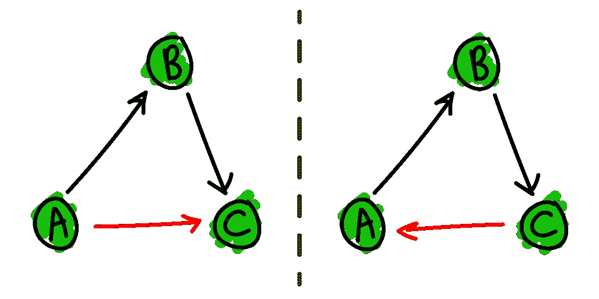

# 面向服务架构失败的迹象

> 原文：<https://betterprogramming.pub/signs-of-failing-service-oriented-architecture-fd405c58f75b>

## 停止构建分布式整体

马库斯·斯皮斯克在 [Unsplash](https://unsplash.com?utm_source=medium&utm_medium=referral) 上的照片

我看到过一些文章，在这些文章中，开发人员谈论他们的组织向面向服务的架构(SOA)的转移，失败，以及迁移回单体开发。当然，这也没什么不好。我们工作的一个重要方面是尝试一些东西，看看它是否可行，如果不可行就废弃它。SOA 并不适合所有人。如果不是为了你的公司，那就坚持使用独石。但如果是，那你就要做对！

多年来与庞大而单一的代码库打交道，形成了我们对事情应该如何做的看法和偏见。如果我们在使用服务时无意识地坚持同样的习惯，我们可能不会意识到我们失败的地方。在本文中，我将讨论在 SOA 世界中应用单一实践的危险。

# 1.高度耦合的数据和架构

为了在 SOA 世界中取得成功，避免高度耦合的数据和架构非常重要。每个服务都应该围绕一个深思熟虑的、前瞻性的抽象概念来构建。在某种程度上，服务应该是自包含的——理想情况下，它们不知道任何服务的存在。在某些情况下，创建高度耦合的服务变得很容易:

*   我们构建专门的服务来支持专门的用例。
*   创建一个好的抽象可能很昂贵。耦合服务是组织阻力最小的途径。
*   一些产品有一个中央数据模型。如果我们让数据模型决定我们定义的抽象，我们的服务最终会在某种程度上被耦合。

如果我们不仔细检查我们创建的抽象，我们可能会以高度耦合的服务生态系统而告终。以下是一些耦合依赖结构:

作者照片。

*   左图:服务 A 调用服务 B，知道它将调用服务 C。然后它向服务 C 查询结果。
*   对:服务 A 依赖于 B，B 依赖于 C，C 依赖于 A，我们的依赖图中有一个循环。

在这些结构中，你实际上是在开发一个分布式的整体。在某些时候，您会遇到以下问题:

*   您需要同时更新两个服务，但不知道先更新哪一个，因为它们都相互依赖。您可以通过在一个服务中引入不间断的向后兼容更改，更新它，然后在从两个服务中删除死代码之前更新第二个服务来解决这个问题。是啊…不漂亮。
*   一个简单的用户流可能跨越多个服务。如果出现问题，只能由具备多种服务相关知识的人来诊断。

一个“坏的”依赖结构暗示了一个分布式的整体——与整体一起工作的所有痛苦，没有与服务一起工作的任何好处。此外，高度耦合的服务通常会铺平道路，并欢迎更多相同的服务。换句话说，如果您不解决这个问题，随着您的服务生态系统的增长，事情会变得更糟。

## 数据耦合

当您的数据跨服务高度耦合时，您需要投资使用同步 API 调用和异步任务来保持数据同步。这些同步过程也可能采取[传奇](https://microservices.io/patterns/data/saga.html)的形式。无论如何，你必须:

*   大力投资基础设施和测试，以确保数据正确同步。
*   对开发人员进行流程培训，使他们不会意外引入导致数据同步问题的变更。
*   随着足够多的数据点在多个服务之间同步，开发人员必然会犯错误——而且是潜在的灾难性错误。
*   投资于可见性和工具，以确保在同步过程中断时得到提醒。当它真的坏了(很可能会坏)，您必须诊断问题并解决它。这两种方式都非常昂贵，这取决于系统的刚性。

然而，如果您能够构建一个数据耦合很少/没有数据耦合的服务生态系统，您就可以避免这些麻烦。

## 后续步骤

如果你发现自己处于这种情况，你该怎么办？当然，没有放之四海而皆准的解决方案。这里有一些想法可以帮助你开始:

*   首先，如果服务是稳定的并且没有被改变，就不要去管系统。它在起作用，你不想成为那个打破它的人，因为你“开悟了”
*   如果您当前的体系结构导致了问题，我要做的第一件事就是分析维护当前系统的货币成本、迁移到更好的系统的相关成本，以及新系统将实现的成本节约。这是一个艰难的练习，但是你会惊讶于使用像[交付周期](https://en.wikipedia.org/wiki/Lead_time)，错误/中断的数量，受影响的用户数量等指标所能达到的程度。一旦你做了彻底的分析，你可能会意识到迁移是没有必要的。然而，如果分析增强了您迁移系统的决心，那么使用您的分析来获得管理层的认可。
*   在很多情况下，改变现行制度是不现实的。组织无法承受较慢的迁移速度，这可能太过昂贵，等等。没关系。你仍然可以确保系统设计合理。

# 2.单一的开发习惯

在 SOA 世界中，沟通结构、团队、操作、部署和流程看起来都不一样。我们在多年的整体开发中收集的工具不一定是在处理服务时使用的工具。如果开发人员(和组织)要在 SOA 方面取得成功，旧的工具/习惯需要被它们的 SOA 等价物所取代。

## 地方发展

当使用 monolith 时，我们在本地机器上运行大多数(如果不是全部)基础设施。开发人员总会遇到“它在我的机器上不工作”的问题。组织投资 bootstrap 解决方案来避免这个问题，并使开发人员尽快提高工作效率。大多数解决方案都围绕着使基础设施更容易在本地机器上运行。

当您开始使用多个服务时，在本地机器上运行所有内容是不可伸缩的。

*   在大多数情况下，开发机器不够强大，无法在特性开发期间运行必要的服务。你可以运行一些大型的服务，但是总有一天你的机器会跟不上。
*   在本地运行服务意味着开发人员必须知道如何运行(并可能部署)他们不拥有的服务。理想情况下，服务所有者不需要担心他们所有权之外的任何服务。

投资于使本地运行多种服务变得容易的解决方案是整体思维，以同样的方式进行服务开发暗示了分布式整体。我将在文章的最后留下一些关于其他公司如何进行本地服务开发的参考资料，但是这些解决方案通常是这样的:

*   使用依赖注入和客户端库模仿与其他服务的交互。
*   在云中运行部分基础设施，在本地运行部分基础设施，将本地基础设施接入云基础设施。

## 端到端测试

端到端测试有两种形式:

*   自动化测试，通常在 CI/CD 管道中运行。
*   手动测试，开发人员在签入他们的代码之前以及在他们进行代码评审时进行的测试。

在单一代码库中进行端到端测试有些简单。在设置了适当的数据/状态之后，您就可以在本地机器上测试新的用户流了。

即使我们编写了好的单元/集成测试来验证代码的正确性，在 QA 期间在我们的本地机器上手动测试一切也会增加我们的信心。随着您的服务生态系统的增长，功能和用例将由多个服务支持，在本地测试所有内容是不可行的:

*   设置适当的状态可能需要很长时间。
*   可能很难模仿与重要系统(消息代理、异步作业队列等)的交互。).
*   您的计算机无法运行所需的基础结构。

SOA 中的端到端测试看起来很不一样。寻求一种能使本地端到端测试变得容易的解决方案不仅成本高昂，而且无法扩展。

SOA 之所以受欢迎，是因为它承诺加快迭代。如果您花费了大量的时间在本地测试您的更改，那么您就没有为利用 SOA 做好准备。在某种程度上，你需要放弃在本地测试所有东西的心理安全感。

您的测试策略取决于您将采用的本地开发解决方案。以下是一些无需在本地测试用户流就可以发布代码的方法:

*   在[功能翻转器](https://launchdarkly.com/)后面隐藏新功能，允许您在为每个人启用该功能之前测试生产中的用户流。
*   金丝雀部署、影子部署、红/黑部署等。
*   在推广到生产之前，对试运行阶段的新变化进行压力测试。

当然，你放弃本地测试所放弃的心理安全感可以通过其他方式获得:

*   彻底和深思熟虑的仪器/可观察性。
*   警报、工作簿和回滚程序，帮助您从故障中恢复。

我在文章末尾列出了测试/部署策略资源。

## 排除故障

另一方面，如果您的测试策略需要改变，那么您的调试策略也需要改变。

在 monoliths 中，堆栈跟踪足以让我们开始。堆栈跟踪为我们指出了正确的方向，我们跟着饼干屑直到找到问题。堆栈跟踪和传统的调试工具通常足以调试 SOA 中的问题，但是它们对于某些类别的问题是无用的:

*   暂时性网络错误。
*   跨多个服务的数据同步问题。
*   不正确的配置—连接超时、读/写超时、工作人员数量、扩展配置等。

尽管您仍然要仔细检查代码以找到问题，但是您的调试工具箱还应该包括:

*   用于下载和过滤生态系统中不同系统的访问日志的脚本。
*   分布式跟踪帮助您了解单个用户请求的生命周期。
*   带有 CPU、内存和 P99 指标的仪表板，用于捕捉不会导致堆栈跟踪的问题。
*   复制生产环境的负载模拟策略。

# 结论

在 SOA 中开发分布式单片出人意料地容易。我们需要避免将单一的开发习惯应用到我们的服务中。以下是一些需要注意的症状:

*   高度耦合的数据和/或架构。
*   一个用于多种服务的糟糕的本地开发策略。
*   一个糟糕的测试策略，包括在本地测试所有的东西。
*   过时的调试工具无法诊断网络和跨服务问题。

整体开发并不坏。就是不一样。许多公司已经投资转向 SOA，却没有意识到投资整体开发会更好。无论您坚持使用整体架构还是走服务路线，都要确保避免构建分布式整体架构——这对两个世界都是最糟糕的。

# 资源

*   [微服务开发环境](https://dzone.com/articles/development-environments-for-microservices)
*   [特征标志](https://www.martinfowler.com/articles/feature-toggles.html)
*   [微服务仪表](https://blog.risingstack.com/the-future-of-microservices-monitoring-and-instrumentation/)
*   [主动预防故障](https://dzone.com/articles/making-your-microservices-resilient-and-fault-tole-1)
*   [管理故障模式](https://www.infoq.com/presentations/microservices-failure-modes/)