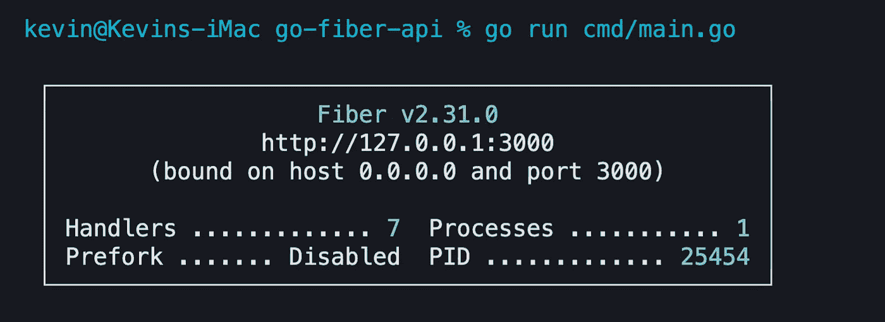
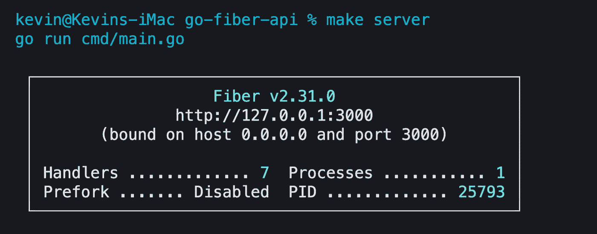

# 光纤 Go 中的简单 API(2022)

> 原文：<https://betterprogramming.pub/simple-api-in-go-with-fiber-1449198e0237>

## 用 Fiber、Postgres 和 GORM 在 Go 中构建一个简单的 API


根据 StackOverflow 开发人员调查和 TIOBE 指数，Go(或 Golang)近年来越来越受欢迎，尤其是在后端开发人员和从事基础设施自动化的 DevOps 团队中。这个理由足够写一个简单的教程介绍你去了。

这是值得学习的，所以在本文中，我想向您展示一个简单的指南，告诉您如何使用 Fiber 和 GORM 在 Go 中开发一个可扩展但简单的 CRUD API。为了简单起见，我们不使用 Docker。

# 什么是纤维？

Fiber 是一个受 Express 启发的 web 框架，构建在 Fasthttp 之上，fast http 是 Go 最快的 HTTP 引擎。旨在通过零内存分配和性能来简化快速开发。因此，如果你来自 NodeJS 背景，Fibe 可能是一个很好的选择。

# 我们要建造什么？

这个项目将会非常经典。我们将构建一个简单的基于 CRUD 的 API。因此，我们将拥有不同的创建、读取、更新和删除端点。

# 先决条件

你需要对围棋有一个基本的了解。我会选择 [Visual Studio 代码](https://code.visualstudio.com/)作为我的代码编辑器。你可以用你喜欢的任何东西。但是请记住，您将在本文中看到一次命令`code .`。这是一个特定于 VSCode (Visual Studio Code)的命令，用于打开 VSCode 中的当前目录。

您还需要安装这些:

*   在本地机器上安装 [Go](https://go.dev/doc/install)
*   在本地机器上安装 [Postgres](https://www.postgresql.org/download/)

两者的任何最新版本都可以。但是，我的 Go 版本是 1.18，PostgreSQL 是 14 版。

# 创建数据库

首先，我们需要创建一个 Postgres 数据库。我知道，每个人都有不同的处理方式，有些人使用 GUI，但我们将使用我们的终端。同样，您需要在您的机器上安装 Postgres。如果您安装了 Postgres，以下四个命令将在 Linux、Mac 和 Windows 机器上运行。

```
$ psql postgres
$ CREATE DATABASE go_fiber_api;
$ \l
$ \q
```

*   `psql postgres`使用用户`postgres`打开`psql` CLI
*   `CREATE DATABASE go_fiber_api;`创建我们需要的数据库
*   `\l`列出所有数据库
*   CLI 退出

在我们成功地执行了所有四个命令之后，我的终端看起来应该是这样的。如我们所见，数据库`go_fiber_api`被创建。


# 项目设置

首先，我们将启动我们的项目并安装我们需要的模块。

> ***小心:*** *用你的 Github 用户名替换你的 _ 用户名。*

```
$ mkdir go-fiber-api
$ cd go-fiber-api
$ code .
$ go mod init github.com/YOUR_USERNAME/go-fiber-api
```

现在让我们安装 Fiber、GORM 和 Viper。我们使用 Viper 来管理环境变量。

```
$ go get github.com/spf13/viper
$ go get github.com/gofiber/fiber/v2
$ go get gorm.io/gorm
$ go get gorm.io/driver/postgres
```

让我们继续最后的项目结构。

```
$ mkdir -p cmd pkg/books pkg/common/db pkg/common/config/envs pkg/common/models
```

另外，让我们添加一些文件。

```
$ touch Makefile cmd/main.go pkg/books/add_book.go pkg/books/controller.go pkg/books/delete_book.go pkg/books/get_book.go pkg/books/get_books.go pkg/books/update_book.go pkg/common/db/db.go pkg/common/config/envs/.env pkg/common/models/book.go pkg/common/config/config.go
```

因此，在创建我们的项目后，文件结构应该如下所示:


现在，该编码了。

# 环境变量

首先，我们需要添加一些环境变量来存储我们将要监听的应用程序端口和数据库的 URL。请记住，用您的数据库数据替换`DB_USER`、`DB_PASSWORD`、`DB_HOST`和`DB_PORT`。

让我们给`pkg/common/envs/.env`添加代码

例如，它在我的本地机器上会是什么样子:

# 配置

让我们给`pkg/common/config/config.go`添加代码

# 书籍模型

在这里，我们将创建图书模型/实体。`gorm.Model`会为我们添加`ID`、`CreatedAt`、`UpdatedAt`、`DeletedAt`等属性。

此外，我们添加了 3 个字符串属性。最后的`json`标签为 GORM 提供了 Postgres 数据库中每一列名称的信息。

让我们给`pkg/common/models/book.go`添加代码

# 数据库初始化

书模型做好了。现在，我们配置 GORM 并自动迁移我们刚刚创建的模型。只要我们运行这个应用程序，这个`AutoMigrate`函数就会为我们创建`books`表。

让我们给`pkg/common/db/db.go`添加代码

# 主文件

这是我们的引导文件。我们会在这里做很多事情。

*   初始化 Viper 来处理我们的环境变量
*   基于 GORM 的数据库初始化
*   添加简单的“/”路线
*   启动应用程序

我们稍后将再次更改该文件。

让我们给`cmd/main.go`添加代码

现在，让我们测试我们项目的当前版本。通常，应用程序会在调试模式下运行，所以我们会得到一些警告，忽略它们。

```
$ go run cmd/main
```

控制台内部的输出。最后一行很重要。



让我们访问 [http://localhost:3000](http://localhost:3000)


在浏览器中打开应用程序

太好了。我们可以看到我们的应用程序的端口。这意味着一切都按预期运行。

# 图书管理员

太好了，一切正常。我们将替换这个输出，所以不要担心。现在，让我们为我们的图书 API 添加一些处理程序。

## 控制器

图书处理程序/路径将基于所谓的[指针接收器](https://go.dev/tour/methods/4)，为此，我们定义了它的结构。这个结构稍后将接收数据库信息，因此每当我们调用图书处理程序/路由时，我们都可以访问 GORM。我们稍后将再次更改该文件。

让我们给`pkg/books/controller.go`添加代码

## 添加图书处理程序

所以这个文件很有意思。导入之后，我们为请求体定义一个结构。在第 16 行你可以看到我们在上一步定义的**指针接收器**。在第 31 行你可以看到，我们使用了这个**指针接收器**，它的变量名就是简单的`h`。

其他一切都很简单。我们获取请求体，声明一个新的 book 变量，将请求体与这个 book 变量合并，并创建一个新的数据库条目。然后，我们用图书信息创建一个响应。

让我们添加代码到`pkg/books/add_book.go`

## 获取书籍处理程序

在这条路线上，我们将返回数据库中的所有书籍。这种方法现在工作得很快，但是一旦有更大的数据需要处理，最好使用分页方法。

让我们给`pkg/books/get_books.go`添加代码

## 获取图书处理程序

在这里，我们只根据从参数中获得的 ID 来响应一本书。

让我们添加代码到`pkg/books/get_book.go`

## 更新图书处理程序

如果我们添加一本书，我们也应该有更新已创建书籍的选项。这条路线类似于我们之前编码的`AddBook`路线。

让我们给`pkg/books/update_book.go`添加代码

## 删除图书处理程序

这是我们在本文中的最后一条路线。这里，我们根据 ID 删除一本书，但前提是数据库中存在所需的条目。我们只用一个 HTTP 状态码来响应。

让我们给`pkg/books/delete_book.go`添加代码

## 控制器(再次)

路线完成了。现在我们需要再次修改控制器文件。这一次，我们创建了一个名为`RegisterRoutes`的函数，它很好地解释了它的作用，对吗？

你记得听筒指针吗？这里我们得到了路由/处理程序的接收指针。

让我们将文件`pkg/books/controller.go`从:

收件人:

## 主文件(再次)

此外，我们必须再次修改我们的主文件。之前，我们只是初始化数据库。但是这一次，我们得到了它的返回并注册了我们的路由/处理程序。

让我们将文件`cmd/main.go`从:

收件人:

# 生成文件

这是可选的。这里我们可以设置一些脚本来简化命令。例如，我们定义一个`server`脚本来运行应用程序。因此，我们不是由`go run cmd/main`来运行应用程序，而是由`make server`来运行它。这个例子并不好，因为实际的命令非常短，但是想象一下，您将不得不处理更长的命令。

让我们将代码添加到根目录下的`Makefile`中。

# 运行应用程序

一切都搞定了！不再编码了。现在，让我们运行应用程序。

```
$ make server
```

或者

```
$ go run cmd/main.go
```

输出应该是这样的。除了警告之外，我们可以看到，我们的路由已经确定，应用程序在端口 3000 上运行。



# 测试端点

现在，我们可以测试刚刚创建的两条路由。我们可以测试它，通过使用软件如[邮差](https://www.postman.com/)、[失眠](https://insomnia.rest/)，或者我们简单地运行 CURL 命令。

## 帖子:添加新书

```
$ curl --request POST \
  --url http://localhost:3000/books *\* --header 'Content-Type: application/json' \
  --data '{
    "title": "Book A",
    "author": "Kevin Vogel",
    "description": "Some cool description"
  }'
```

## 获取:获取所有书籍

别忘了，您也可以在浏览器中运行 get 命令。

```
$ curl --request GET --url http://localhost:3000/books
```

## 获取:通过 ID 获取图书

```
$ curl --request GET --url http://localhost:3000/books/1
```

## PUT:按 ID 更新图书

```
$ curl --request PUT \
  --url http://localhost:3000/books/1 \
  --header 'Content-Type: application/json' \
  --data '{
 "title": "Updated Book Name",
 "author": "Kevin Vogel",
 "description": "Updated description"
}'
```

## 删除:按 ID 删除图书

```
$ curl --request DELETE --url http://localhost:3000/books/1
```

我们完了！太好了。别忘了，我已经把这个项目上传到了 [Github](https://github.com/hellokvn/go-fiber-api) 上。

感谢您阅读这篇关于如何在 Go with Fiber 中构建一个可扩展但简单的 API 的文章。我希望，你能学到新的东西。如果你有问题，请告诉我。

干杯！