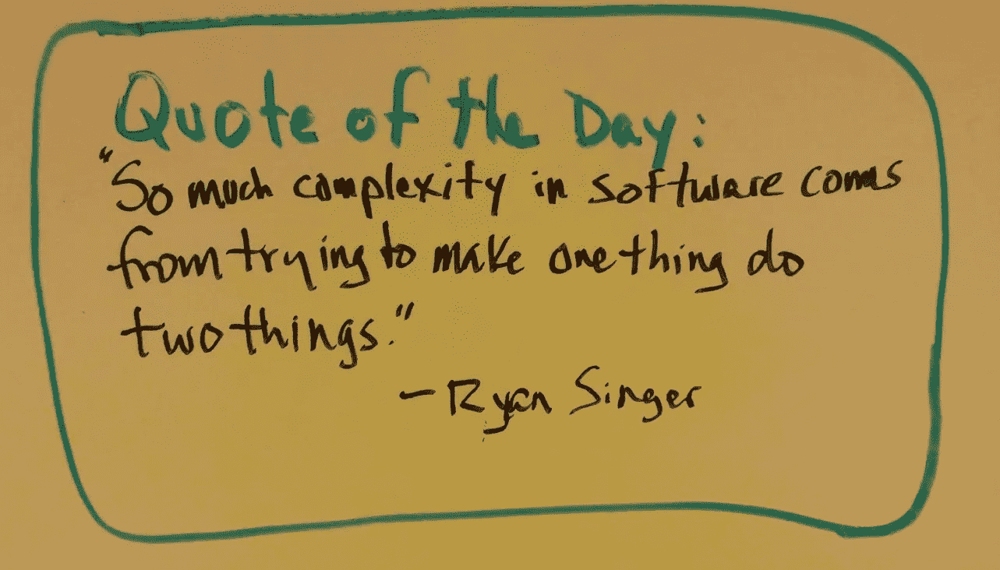

# 在您的代码中，简单性和复杂性不必相互排斥

> 原文：<https://betterprogramming.pub/simplicity-and-complexity-neednt-be-mutually-exclusive-in-your-code-cb07154f77db>

## 你的代码只有在你创造它的时候才是复杂的

由[丹尼斯·波波夫](https://unsplash.com/@nedlevart?utm_source=unsplash&utm_medium=referral&utm_content=creditCopyText)在 [Unsplash](https://unsplash.com/t/nature?utm_source=unsplash&utm_medium=referral&utm_content=creditCopyText) 上拍摄

# 好建议

我给新软件开发人员的第一条建议是:“[代码反对抽象，而不是实现。](https://drive.google.com/file/d/0ByOwmqah_nuGNHEtcU5OekdDMkk/view)”

但紧随其后的是遵循单一责任原则。

[单一责任原则](https://drive.google.com/file/d/0ByOwmqah_nuGNHEtcU5OekdDMkk/view) (SRP)是[面向对象编程的五个坚实原则](http://www.butunclebob.com/ArticleS.UncleBob.PrinciplesOfOod)中的第一个。这可能也是最重要的一点。遵循它，你可以避免各种各样的恶作剧、悲伤和麻烦。

# 单一责任原则

SRP 正式声明如下:

> 一个类应该只有一个改变的理由。

现在，我对这个定义非常不满意。一个类可以有各种各样的理由去改变——你可能会找到一个更好的实现，你可能会修复一个 bug，你甚至可能决定它需要一个额外的参数或者依赖。这些都是一个类改变的好理由。

但是一个类*不应该做的事情*是尝试做多件事情。它应该有一个单一的责任，不再承担更多的责任。

# 震惊的

我记得有一天，我坐在办公桌前工作，被这个概念的深刻性所震撼:

> 软件中如此多的复杂性来自于试图让一件事做两件事。—瑞安·辛格

这句话给了我当头一棒。千真万确，让我头疼。

我们都经历过——你会遇到一些`WidgetManager` 或`SprocketEngine` 类，它们做 14 种不同的事情。当有人决定给一个类添加另一个责任时，这一切就开始了。很快，这个类就变成了吸引功能的磁铁，在你知道之前，它已经做了所有的事情，并且成为了[神类](https://en.wikipedia.org/wiki/God_object)。

看在糖宝·埃尔维斯的份上，别那么做！为新的职责建立一个新的类。

辛格的文字之美让我思考什么是复杂，什么是简单。我意识到，如果你不想建立一个复杂的系统，就不要创造任何复杂的个体事物。

# 一块手表

一方面，手表是一个复杂的系统，但另一方面，它不是。它由独立的部分组成，这些部分本身很简单:齿轮是一个简单的东西，有一个责任，就像表圈、表带和秒针一样。每个部分都很简单。

迪米塔尔·斯特夫切夫在 [Unsplash](https://unsplash.com?utm_source=medium&utm_medium=referral) 上拍摄的照片

尽管如此，复杂性的存在是因为简单的部分相互作用提供了一些惊人的功能。齿轮转动指针，主发条推动一个齿轮，齿轮带动其他齿轮，等等。每个组件与其他几个组件相互作用，创建一个强大的系统。然而，由于部件之间的基本接口，整个机制非常简单。

我们的软件也是如此。所有有意义或有用的软件在功能上都将是复杂的。然而，它不必由复杂的东西组成。正如一块手表可以被分解成几个组成部分，每个部分服务于一个单一的目的，你的软件也应该由简单的交互类组成。

你应该能够将你的软件分解成独立的类，这些类本身并不复杂*。每个班级应该做一件事情。只有通过依赖注入和干净、分离的接口与其他类交互，复杂性才会出现。*

*正如 Singer 指出的，当类之间的绑定变得如此紧密，以至于任何给定的类都做得太多时，我们实际代码中的复杂性就来了。想象一下，在一个老爷钟里有一个钟摆，它不仅来回摆动来驱动整个引擎，而且还负责旋转那个小小的月相指示器。人们甚至无法想象这需要什么阴谋诡计，但是我们一直在软件中做这种事情。*

*所以听听瑞安·辛格。让他的话的赤裸裸的深刻冲刷你，永远不要让一个班做一件以上的事情。*