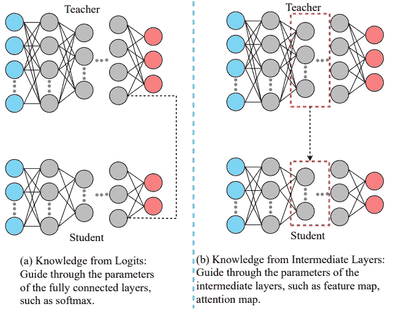
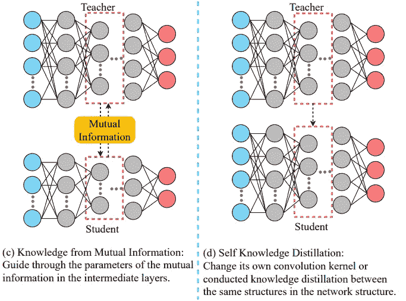
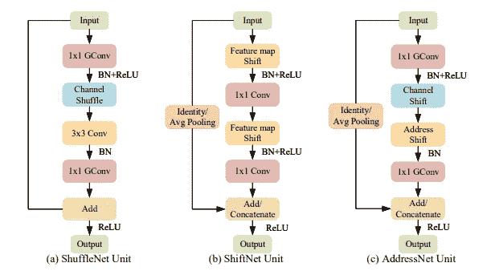
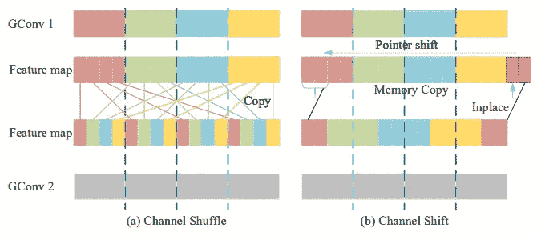

# 越小越好:缩小神经网络并保持其智能

> 原文：<https://betterprogramming.pub/smaller-is-better-shrinking-neural-network-and-keeping-its-brainpower-6b0288a3cb1d>

## 神经网络压缩方法综述

由 [Unsplash](https://unsplash.com?utm_source=medium&utm_medium=referral) 上 [charlesdeluvio](https://unsplash.com/es/@charlesdeluvio?utm_source=medium&utm_medium=referral) 拍摄的照片

你有没有想过，一个神经网络有多少是在执行，有多少只是自重？有多少神经元真正在做一件有意义的工作，有多少神经元要么没有被很好地训练，要么只是被训练去做一些你永远不会要求它们去做的事情？

还有……如果我们能找到一种优化神经网络的方法，让它变得更紧凑呢？

最近，我问了自己这些问题，并谷歌了互联网上关于这个主题的文章和论文，发现了一篇关于神经网络压缩的不同方法和途径的完美综述。

本文基于张可等人的论文[“为物联网压缩深度神经网络:方法和应用”。艾尔](https://arxiv.org/abs/2103.11083)【1】。原始论文是一篇关于压缩深度神经网络的全面的 25 页调查，重点是为物联网应用压缩它们。然而，这种压缩的好处不仅对物联网很重要，对所有其他领域也很重要，因为每个应用都将受益于更低的成本和更快的处理时间，这通常也意味着更低的能耗。

写这篇文章的原因是最初的研究使用了相当科学的语言和大量的细节。这有利于学术使用，但通常，我们只需要用简单的英语写一个不同方法和途径的简要概述，可以在这里找到。

最初，这篇文章只是作为我个人的总结开始的，但由于研究领域的复杂性，它最终变得有些冗长。可能对其他对此话题感兴趣的人有用。

> 与此同时，如果你想了解某个特定方法的更多细节，我建议你阅读原始论文，并点击那里包含的其他研究链接。

有两种压缩深度神经网络(dnn)的主要方法:

1.  使用量化、网络修剪和低秩分解等技术压缩预训练模型。这种方法的核心思想是修改初始模型，使其更小。
2.  使用诸如知识提炼和使用网络架构搜索和人工基本单元设计修改网络结构的技术来直接训练小模型。在这种情况下，我们不是修改初始模型，而是使用它(直接或间接)创建另一个更小的模型来模拟大模型的行为。

# 压缩网络模型

以下是压缩网络模型的技术:

*   量化
*   网络修剪
*   低秩分解

## 量化

量化是一种通过减少高精度浮点计算的开销来压缩和加速应用程序的方法。前者是多个神经元共享一个权重，但在推理过程中需要将共享的权重值恢复到原来的神经元位置。这意味着解码过程增加，从而增加了推断时间。

后者使用定点数映射浮点数，节省运行时内存和推理时间。但是，前者对模型的压缩程度比后者高得多。比较适合硬件存储空间匮乏的场合。

标量和矢量量化是使用码本和一组量化码来表示原始参数的技术。这些代码描述了码本中量化中心的分布，并且可以使用无损编码进行进一步编码，以进行额外的压缩。换句话说，标量和矢量量化有几种方法，包括 k 均值量化、乘积量化和残差量化。

这些方法中的每一种都有不同的压缩率，并且可以在不同的情况下使用，这取决于所需的压缩级别和压缩数据的具体特征。一些研究人员还提出了一些策略，将这些方法结合起来，或根据具体情况进行调整，以达到更好的效果。

原始论文中不同标量和矢量量化方法的比较

定点量化使用定点数而不是浮点数，依赖于这样一个事实，即与浮点数相比，计算机通常使用定点计算工作得更快。另一方面，在现代 GPU 和 TPU 的存在下，这种假设可能需要检查。原文回顾了一些 FP 量化方法，将其分为低位量化和二进制/三进制量化。

## 网络修剪

网络修剪背后的一般思想听起来非常直观:为了使模型紧凑，让我们只删除一些不太重要的部分！

基于幅度的修剪通过移除一些不重要的连接或神经元来使权重稀疏。该方法的性能和最终结果完全基于修剪准则的正确选择。通常很难确定剪枝后决定模型性能上限的标准。

> 通常，最好的结果不是通过只使用一种方法来实现的，而是通过找到正确方法的正确组合来实现的，原始研究提到了 Han 等人的一项工作[2]，该工作提出了剪枝、量化和 Huffman 编码方法的组合，实现了 35x-49x 的压缩率！

通道修剪，顾名思义，是修剪整个通道，而不是去除单个神经元连接，这至少有两个好处。首先，它没有引入稀疏性，因此生成的模型不需要特殊的软件或硬件实现。第二，推理阶段不需要大量的磁盘存储和运行时内存。与基于幅度的修剪一样，用于通道修剪的标准在最终性能中起着非常关键的作用。

该文件还简要提到了其他类型的修剪，如:

*   能量感知剪枝算法，根据能量消耗进行剪枝过程
*   在网络训练的反向传播阶段进行修剪，这可以执行端到端的学习并显著减少训练时间

## 低秩分解

如果我们可以找到矩阵中值之间的一些相关性，低秩分解就可以很好地工作。这个想法是，如果有相关性，那么就有多余的信息，可以删除，使模型更小。这种方法通常使用[矩阵分解](https://en.wikipedia.org/wiki/Matrix_factorization_(recommender_systems))技术中的一种。原论文说低秩分解计算量大，不容易实现。

# 知识蒸馏

知识提炼(KD)是一种将更大、更精确的神经网络模型(教师模型)的知识转移到更小、更不精确的模型(学生模型)的方法。这通常是通过训练较小的模型来模拟较大模型的预测来完成的，而不是试图直接从原始训练数据中学习。

知识提炼旨在创建一个更小的模型，该模型的性能几乎与更大的模型一样好，但计算资源更少，预测时间可能更快。如果较大的模型在生产中部署的计算成本太高，或者较小的模型需要在资源有限的设备上运行，这将非常有用。

代表性 KD 结构。四种结构的区别在于知识来源的不同。图片来源:原创研究。

原始研究回顾了 KD 的几种方法:

*   逻辑知识
*   来自中间层的知识
*   互信息蒸馏
*   自蒸馏

知识发现的有效性取决于教师网络的结构和信息传递的方式。一个设计良好的教师网络和一个适当的知识发现方法可以取得优异的成绩。

# 网络结构的修改

在本节中，作者探索了通过修改网络结构来设计轻量级模型的方法。这可以通过修改通道、过滤器、神经元之间的连接、活动功能和其他组件来实现。

DNN 压缩可以通过诸如**信道混洗或移位之类的技术修改网络结构来实现。**原论文回顾其中部分。ShuffleNet 是一种用于移动设备的紧凑网络架构，它使用组卷积来降低计算成本，并使用信道混洗操作来混合组卷积中的信息流。ShiftNet 将空间卷积替换为要素地图平移。AddressNet 结合了 ShuffleNet 和 ShiftNet 的特性，还引入了快捷移位来减少时间开销。

ShuffleNet、ShiftNet 和 AddressNet 的基本单元。它们分别取代了基于瓶颈结构的 1×1 卷积、3 × 3 卷积以及 1×1 和 3×3 卷积单元。图片来源:原创论文。

频道洗牌和频道移位的比较。Channel shuffle 需要复制和传输所有的特征地图数据，而 channel shift 只需要移动两个单位的数据，并将起始指针偏移两个单位。图片来源:原创论文。

快捷连接，也称为剩余连接，被提出来解决 DNNs 中梯度消失的问题。一些研究人员发现，消失梯度问题严重影响网络收敛，当网络越深入，网络退化也越严重。他们提出了深度残差学习框架来解决这些问题，并引入了残差映射。

在基本网络单元部分，作者回顾了对基本单元采取实验方法的几个网络，例如完全分离信道相关映射和空间相关映射，或者向网络添加挤压和激励(SE)模块。SE 模块通过显式地建模信道之间的依赖性和自适应地校准信道的特征响应来提高网络的信息表示能力。

不同结构的比较。图片来源:原创研究。

网络架构搜索是一种使用强化学习在搜索空间内找到最佳网络结构配置的方法。然而，当搜索空间非常大时，NAS 的计算成本可能很高。在实践中，神经网络通常包含重复的单元结构，如卷积核组、非线性单元结构，甚至连接组合。

我们能否通过 NAS 找到一个卷积单元的通用表达式，然后将卷积单元堆叠在一起，经过微调后达到很高的精度？最初的研究回顾了其他作者(Zoph 等人)的工作，他们提出了一种网络构建方法，即在小数据集上通过 NAS 搜索网络的基本单元，然后将这个单元转移到大数据集。

# 结论

深度神经网络的压缩是一个复杂的研究领域，旨在减少神经网络的参数数量和计算成本，同时保持或提高其性能。有几种方法可以实现这一点，每种方法都有自己的优点和局限性，对于特定任务的最佳方法将取决于给定情况的具体要求和限制。

我希望这篇文章能帮助你对压缩 DNNs 的主要方法有一个大致的了解，并敦促你阅读由[张可等人](https://arxiv.org/abs/2103.11083)撰写的原始论文，如果你有问题或需要更多的细节，请阅读那里的链接和参考资料。

这篇文章主要是为我自己做的一个简短的总结，但是因为它变得不那么短了(因为研究领域本身)，我想它可能对其他人有用。

# 链接

*   [1]原研究:【https://arxiv.org/abs/2103.11083 
*   [2] S. Han，H. Mao，W. J. Dally，“深度压缩:用剪枝、训练量化和 Huffman 编码压缩深度神经网络”，arXiv:1510.00149 [cs]，2015 年 10 月。