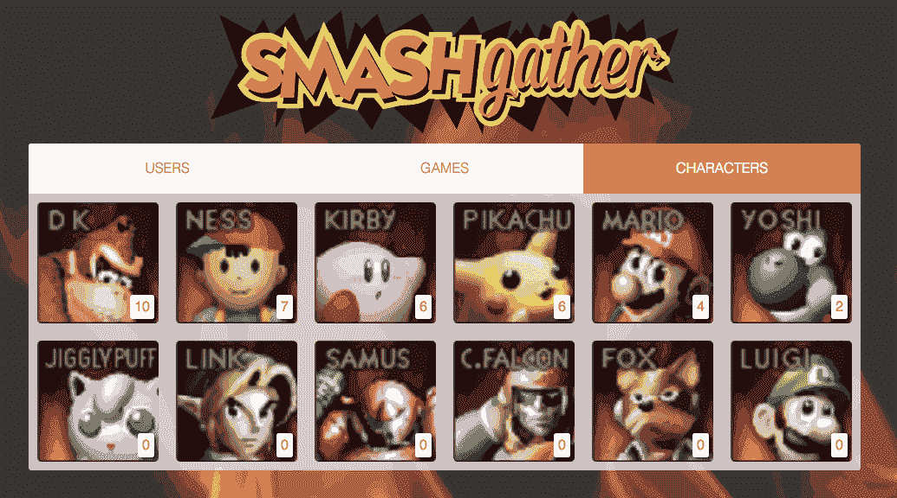
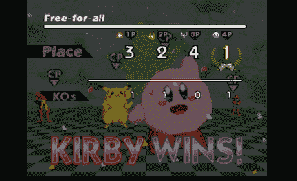
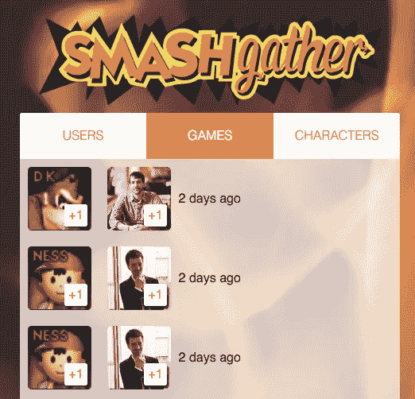

# Smashgather:用计算机视觉自动化 Smash Bros 排行榜

> 原文：<https://betterprogramming.pub/smashgather-automating-a-smash-bros-leaderboard-with-computer-vision-ce13c67231b>

## *这是一次特别喜欢的记忆之旅*

*最初于 2016 年 4 月 7 日在 pathgather.com 出版。*

三周前，我和我的一个朋友比较初创公司的故事，我们意识到，我们各自的公司都缺少创业“文化”中最典型的标志:乒乓球桌。在这一点上，我觉得有义务指出，在 Pathgather，我们已经超越了乒乓球，开始在每个周末玩 Super Smash Bros(N64 版本)——当然，是在花了一下午时间学习我们想学的东西(Pathgather 的文化传统)之后。我突然想到，我们没有一个好的方法来记录我们的争吵…这似乎是我可以自动化的事情，对吗？

那天，我拼凑了第一个版本的 [Smashgather](https://github.com/Pathgather/smashgather) : *“一个 OpenCV 应用程序，使用计算机视觉和魔法，自动将超级粉碎兄弟 64 游戏录制到互联网上。”*

# 它是如何工作的

我们通过我的笔记本电脑玩 Smash Bros，笔记本电脑连接着我们办公室的电视。当我们玩游戏时，Smashgather 客户端应用程序在后台运行，并使用 OpenGL 每秒捕获一个屏幕截图，然后使用 OpenCV 在屏幕截图上运行一个非常基本的图像处理算法，该算法确定两件事:

1.  当前截图是不是 win 屏？
2.  如果是，谁是获胜的角色？

一旦我们发现获胜者，我们可以将结果记录到网络服务器上，然后在网络应用程序上显示数据。当获胜者停止庆祝最后一击时，他们的胜利将在 smashgather.com 永垂不朽。

# 检测获胜

一些例子赢屏幕从原来的超级粉碎兄弟。

我从收集每个角色的胜利屏幕截图开始。你会注意到这些是多么的相似——事实上，每一个中的“WINS”文本都是*相同的*,除了在屏幕上的位置略有不同，这取决于获胜角色的名字。我们绝对可以设计一个算法来利用这一点！这是非常基本的图像处理的东西，但是深入一点看看它是如何工作的仍然很有趣。

Smashgather 算法是[模板匹配](https://en.wikipedia.org/wiki/Template_matching)和[图像相似度](https://en.wikipedia.org/wiki/Structural_similarity)的组合。首先，屏幕截图被转换为灰度(为了简单和性能)，然后与伴随每个超级粉碎兄弟胜利的“胜利”文本的模板(裁剪图像)匹配。这种匹配是通过在整个屏幕截图上“卷积”模板来完成的——不要太深入，这基本上意味着我们在每个可能的 x/y 位置将模板与屏幕截图进行比较，以找到模板和屏幕截图重叠最强的点。对于我们的截图来说，大约有 200 万个不同的位置，但是 OpenCV 非常擅长快速完成这些工作——所以我们不必担心实现所有的数学运算。

“WINS”模板与截图中的每个位置相匹配，产生了右边的奇怪图像。图像中最亮点表示最强的匹配；该位置的坐标似乎是“WINS”模板可能适合的位置。

现在我们有了模板重叠最多的坐标，我们可以开始尝试确定“WINS”文本是否确实在那里。这是一个更容易理解的问题——我们将截图和模板裁剪成相同的大小，然后计算两幅图像之间的 [SSIM](https://en.wikipedia.org/wiki/Structural_similarity) (结构相似性)得分，以确定它们有多相似。请记住，两幅图像不会完全相同——背景会有所不同，对齐可能不精确，等等。SSIM 算法在处理这类错误方面设计得相对较好，对于我们的目的来说，它确实足够好。如果截取的屏幕截图和“胜利”模板足够相似，我们可以有把握地说，我们实际上正在看一个超级粉碎兄弟胜利屏幕！

接下来，我们必须找出谁是赢家。对于这一步，我们针对每个字符名称的模板运行完全相同的“匹配和比较”算法。一旦我们找到匹配的字符模板，我们就得到我们需要的一切(如果你好奇，你可以在这里看到这个简单算法的源代码: [WinDetector.cpp](https://github.com/Pathgather/smashgather/blob/master/client/src/WinDetector.cpp) )。

整个过程(截图，“胜利”模板匹配和比较，角色名称模板匹配和比较)每秒进行一次，以跟踪游戏的当前状态。我们用一个简单的状态机来结束这个过程，以避免重复计算胜利，我们已经为自己准备了一个程序，可以自动跟踪超级粉碎兄弟游戏！

# 记分

Smashgather 的其余部分就没那么有趣了——每当检测到一个胜利，我们就将其记录在服务器上，然后通过一个基本的 web 应用程序访问这些记录。为了使项目的这一部分更有趣，我使用了一堆对这个问题没有实际意义的技术:PostgreSQL 用于数据存储，GraphQL 节点后端用于提供结果，React + Relay 应用程序用于呈现数据。当然，一个简单的 Ruby on Rails 站点只需要很少的时间，需要的 Javascript 也少得多(未缩小、未压缩的包只有 2.1 MB)，但是这有什么意思呢？此外，即使做了那些不必要的工作，我们仍然有时间在周五下午做一个令人畏缩的 90 年代风格的界面。当然，您可以随时访问[smashgather.com](http://smashgather.com)查看我们的排行榜。

# …为什么？

老实说，我们在 Pathgather 比以往任何时候都忙。在推出新客户、编写新功能和雇佣新员工之间，我们并没有太多的空闲时间——这并不是花一两天时间来创建一个自动化视频游戏排行榜的理想时机，不是吗？

我认为*总是有借口对你的公司价值观和文化妥协，但你不应该妥协。在我们的“学习星期五”里，我们有很多构建 Smashgather 的乐趣；我们学到了一些有趣的新技术，我也可以和我的旧爱 C++一起玩了。此外，坦白地说，记录我们的成功绝对至关重要。工作可以等到周一。*

继续学习！