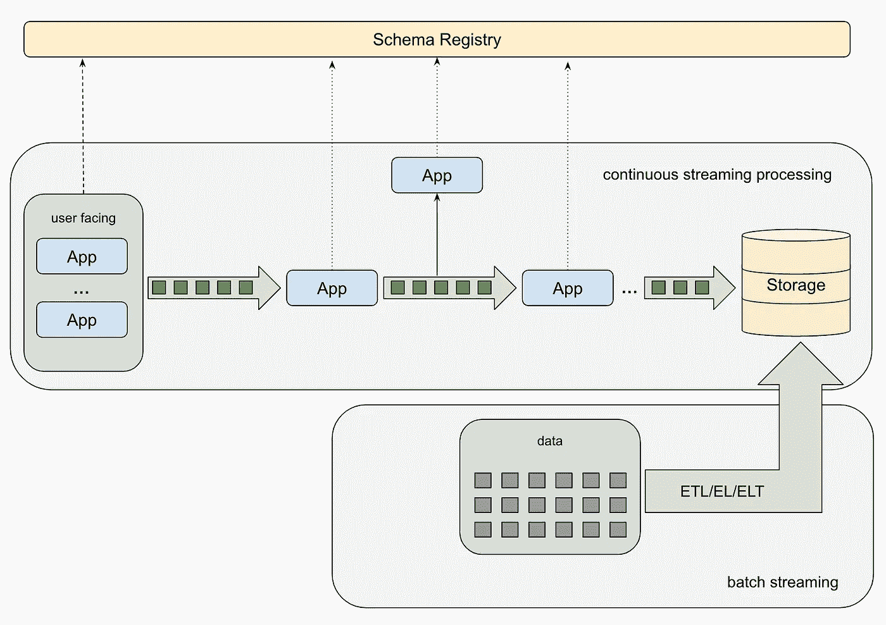

# 从软件工程师到数据工程师——模式注册、数据沿袭和编目

> 原文：<https://betterprogramming.pub/software-engineer-to-data-engineer-schema-registry-data-lineage-and-cataloguing-71c7905e6522>

## 重要概念及其重要性的简要概述


照片由[🇸🇮·扬科·菲利](https://unsplash.com/@itfeelslikefilm?utm_source=medium&utm_medium=referral)在 [Unsplash](https://unsplash.com?utm_source=medium&utm_medium=referral) 上拍摄

在我的[上一篇关于从软件到数据工程的转变的文章](/from-software-engineer-to-data-engineer-the-basics-part-1-535c0837b591)中，我概述了一个非常基本的观点，关于生产流水线可能是什么样子，以及相关的概念意味着什么。然而，还有更多。除非您知道如何使用数据，否则数据本身毫无意义，无论是对工程师还是对业务都是如此。

通常，在公司中自然发生的是，当试图在各自的业务领域中保持领先的快速技术进步和创新，以保持竞争力时，他们忽视或忽略了一些最佳实践。对于初创公司来说，为了领先并寻找“变通办法”，推迟一些有利于 MVP 的适当实现，匆忙推出解决方案并不罕见。

一件常见的事情可能会在“以后”的待办事项中结束，那就是对公司拥有的数据进行编目。这不是每个人都会优先考虑的事情，因为一开始就没有太多的数据。因此，忽略它似乎是无害的，每个服务只是“触发并忘记”一些到达某种存储的字节数组，就这样，工作完成了，我们有了数据。

几年后，有几十个甚至数百个微服务在发送各种数据，有从第三方获取数据的管道，企业希望根据现在非常丰富的数据做出智能决策。如果你在成长的早期没有付出一些努力，那么你会在这里挣扎…很多。在大多数情况下，公司至少会添加一个模式注册表，也许是每个数据人的适当血统和梦想——数据目录。

# 模式注册表

这实质上是一个模式文件的集中存储库。它们可以是 JSON 或 AVRO 格式，并定义通过公司系统传输的所有事件和数据点中所有属性的结构和含义。这些模式可以进行版本控制和更改，并由相应数据的生产者拥有。

理想情况下，会有一个 UI 允许业务中的每个人查看当前活动的模式和旧的定义。

发送到管道的每个事件都应该经过验证，只有有效的事件才能到达存储。

```
{
  "schema": "http://schema-def-url",
  "title": "user account created",
  "self": {
     "vendor": "a vendor",
     "name": "user_account_created",
     "format": "jsonschema",
     "version": "1-0-0"
  },
  "type": "object",
  "properties": {
     "user_id": {
       "type": [
          "string"
       ],
       "description": "the user id..."
     },
     "email": {
       "type": [
          "string"
       ],
       "description": "the user email...",
       "pii": true 
     },
     ...
     "region": {
       "type": [
          "string"
       ],
       "description": "..."
     }
   },
   "required": [
     "user_id",
     "email",
      ...
   ]
}
```

这是一个非常非常简单的模式的一部分。您会注意到它定义了所有属性的名称和类型，以及哪些是必需的。还有一个额外的位`pii: true`。它旨在表明该字段是一个 PII(个人可识别信息)，因此该字段可以在需要时匿名(应客户要求或在法定保留时间过后)。可以向每个字段添加更多的位，以允许正确的验证、存储和使用——如最大长度、编码、它要转换到的表中的列类型等。

没错，模式可以用来在表的顶部创建视图，事件就像 JSON 有效负载一样存储在表中，或者可以具体化为表。

此外，模式允许您基于这些定义类，并在您的应用程序中以更易于管理的方式处理数据(有一些工具可以基于定义自动生成类，因此可以作为模式注册表发布过程的一部分)。你可以有一个基于它的全公司范围的 API，这意味着所有的应用程序总是在同一个页面上。

# 流式数据

我提到过，应用程序可以使用模式注册表来反序列化事件，并将它们作为类来处理。在一家大公司，你会有很少的应用程序产生事件，可能会有很多应用程序从所选的流媒体解决方案中消费这些事件，并根据这些事件采取行动或进行报告。

根据应用程序获取消息的机制，有两种类型的流:

*   **拉**——意味着应用程序将从各种事件/消息的队列中拉出，随时准备处理它们，然后提交一个指示器来“记住”它到达的位置，以防它死亡。在这种方法中，应用程序控制处理速度、偏移和事件数量。这是一个很好的解决方案，无论何时数据持续大量流动，它都是两者中更可靠的，除非发生大规模中断，否则不会有丢失数据的风险。这方面的一个例子是卡夫卡，这是最流行的解决方案之一。
*   **推送** —意味着每当有新消息添加到队列中时，应用程序都会收到请求。解决方案通常可以配置为重试多次，一旦成功，就会将“指针”移动到队列中的下一个位置。这种方法更适合偶尔发送数据和/或处理不太重要的情况(因为如果应用程序未能在配置的尝试次数内回复 OK，消息可以被跳过，这超出了应用程序的控制)。谷歌的 Pub/Sub 就是一个例子。

应用程序将订阅主题(或任何其他特定于实现的抽象，这里使用 Kafka ),并读取所有内容，但只处理和反应与特定应用程序相关的记录。

通常，作为业务运营一部分的应用程序将从连续流中消耗数据，但也有批处理流的概念。所以，我会简单提一下区别:

*   **批处理**是一种模型，其中数据随着时间的推移而累积，并以块为单位进行处理。通常，它用于通过类似 ETL 的过程将第三方数据导入数据仓库。它还可以用于从连续流中导入聚合数据，以便优化导入或节省定价。另一种使用情形是将聚合数据移动到不同的存储，以便更容易地进行分析或报告。
*   **流处理**模型是指数据实时或接近实时地连续通过系统的模型。这通常用于制定运营决策。



图片来源:作者

# 数据谱系

除了数据结构和单个属性的含义之外，工程师还需要了解一个更重要的信息，那就是血统。理想情况下，这意味着能够跟踪一段数据的整个生命周期，并将其可视化。

这意味着显示每条数据是在哪里产生的，是否以及如何沿着管道进行转换，由哪些应用程序进行转换，在哪里以及是否最终出现在目标存储解决方案中。

实施这一流程将使公司能够:

*   发现数据
*   追查错误
*   以较低的风险实施变革
*   跟踪的详细信息还有助于审计和遵守任何组织政策和法规标准

# 数据目录

模式注册和数据沿袭以及其他数据原则旨在使数据对业务可用且有意义。

数据目录使用户(无论是数据工程师、数据科学家、业务分析师还是开发人员)能够在一个地方访问所有有用的信息。通常，企业解决方案并不持有任何实际数据，而是从不同来源访问所需信息的端点集合，以人类可读的格式聚集和呈现。这意味着没有重复的元数据，因此不需要处理同步和现状问题。

本质上，数据目录是各种元数据的门户:

*   技术—模式、文件名、数据源名称、以任何方式更改或处理数据的应用程序名称等
*   业务——与业务相关的任何特定领域的信息，如描述、评论、注释、分类等
*   操作—访问日志、更新时间等

关于数据和比我更聪明的人，我不可能说尽所有，我已经就我提到的每个概念写了详细的文章和帖子。我在这里的目标只是给出其中的一个片段，并激发你阅读更多。希望这是一次成功:)

感谢阅读！