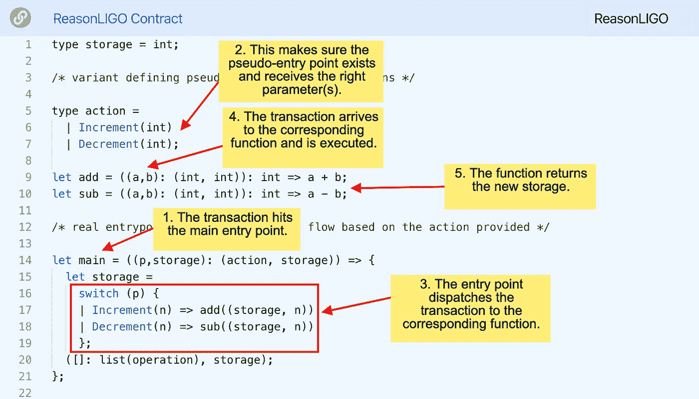

# Solidity 与 Ligo 的主要区别

> 原文：<https://betterprogramming.pub/solidity-vs-ligo-the-main-differences-e763a52ba2d7>

## 当你来自以太坊时，你需要知道在 Tezos 区块链上写智能合同


[由 Vecteezy 提供的 Boxer Vectors](https://www.vecteezy.com/free-vector/boxer)

泰佐斯区块链是 2020 年你需要关注的主要项目之一。其流动性的股权证明制度对寻求稳定收入的人越来越有吸引力。自去年 12 月以来，其代币价格已经上涨了一倍多，令投资者颇感兴趣。还有许多新项目计划在 2020 年部署在区块链上(一款[基于 NFT 的游戏](https://www.coindesk.com/tezos-co-founder-turns-to-gaming-with-hearthstone-competitor)、 [USDTez](https://usdtz.com/) 和新 [tzBTC](https://tzbtc.io/) 等等)。

你有一些以太坊区块链的经验，你正在考虑冒险尝试 Ligo。恭喜你！然而，你会很快注意到，即使它们都被贴上了“区块链”的标签，在 Tezos 区块链和以太坊区块链上编程可能会像用两种不同的语言编程一样不同。在用 Ligo 编码时，您从 Solidity 中了解到的一些概念并不适用(甚至可能适得其反)。同样，Ligo 中的一些概念在 Solidity 中并不存在。

在本文中，我们将看看主要的区别、陷阱，以及当您习惯了 Solidity 并希望加入我们成为 Tezos 智能合约开发人员时需要记住的事情。

我假设你对可靠性和 JavaScript 有(相当)好的了解。不需要 Ligo 的知识，尽管它可以帮助你更好地理解比较。

# 类型系统

Solidity 和 Ligo 中简单值的类型系统非常相似。Ligo 有整数、字符串、地址、NAT(Solidity 的无符号整数)、布尔等。Ligo 类型的一个好处是你可以声明你自己的类型，它允许你的代码有一个更好的结构和组织。例如，有时创建一个新类型而不是使用一个原始类型(用`username`代替`string`，`score`代替`nat`)可能会更清楚。

复杂类型呈现出更多的差异:Ligo 有元组、集合和列表，但没有数组。集合可以看作是无序的数组，包含相同类型的唯一值，而列表可以看作是有序的数组，包含相同类型的值。Ligo 还提供了许多方法来读取、修改或返回关于集合和列表的信息，这非常方便。

Ligo 还提供了非常有用的`records`，在坚固性上与`structs`相似。Ligo 没有枚举，但是它的[变种](https://ligolang.org/docs/language-basics/unit-option-pattern-matching#variant-types)给了你枚举的所有功能和额外的好处！当验证提供了正确的值时，一种叫做`option`的特殊变体会让你避免很多错误。

Solidity 和 Ligo 的另一个主要区别是它的映射(Solidity 的映射)，这是下一段的主题。

# 地图和大地图

Ligo 提供了地图和大地图，它们的行为本质上是一样的。大地图更适合包含大量数据。它们类似于坚固性的映射，但有一些好处。

在 Solidity 中，一个映射的所有键都是缺省存在的，如果你试图获得与一个不存在的键相关联的值，你将获得其类型的缺省值。Ligo 就不是这样的。多亏了模式匹配，当您在 map 中查询一个值时，您可以精确地知道它是否返回某个值。如果没有返回任何内容，您将得到一个值为 `[None](https://ligolang.org/docs/language-basics/unit-option-pattern-matching#optional-values)`的[选项。您不必担心返回的`0`或空字符串是实际值还是默认值，因为键不存在！](https://ligolang.org/docs/language-basics/unit-option-pattern-matching#optional-values)

在 Ligo 中，可以迭代一个映射(这在 Solidity 的映射中是不可能的)。当迭代一个映射时，你可以检查返回值，你可以修改它们或者你可以"[折叠](https://ligolang.org/docs/language-basics/maps-records#folded-operations-over-maps)"它们。来自 Solidity(或 JavaScript 之类的语言)需要花一些时间来适应的一个特性是，您将使用的函数不是 map(或 set/list)实例的方法，而是 Map (list/set)对象的方法。例如，如果你想知道地图的大小，你不会写`my_map.size()`而是`Map.size(my_map)`。要添加一个元素到集合中，你不应该写`my_set.add(el)`而是`Set.add(el, my_set)`。

# 字符串操作和集合/列表

我将这两种不同的情况放在一起，因为它们是小亮点，会使您的工作更容易，代码更安全。

Solidity 因缺乏任何类型的原生字符串操作而臭名昭著——你不能分割它们，连接它们，等等。庆幸吧，因为 Ligo 让你这么做！有三种方法可以帮助你处理字符串。`String.length()`将返回字符串的长度，`String.sub()`将返回字符串的子串，字符串可以很容易地用`++`操作(`string1 ++ string2`)在 ReasonLigo 中连接起来。

在 Ligo 中编写智能合同时，我特别喜欢使用集合和列表。集合是同一类型的唯一值的无序列表。有几个函数可以帮助你轻松地操作它们(`Set.add()`、`Set.remove()`)，并且你可以确保它们中有唯一的不重复的值。

列表是相同类型元素的有序集合。如果需要按照一定的顺序存储一些值，就用这个。不同的方法可以帮助你处理列表，比如`List.iter()`、`List.map()`和`List.fold()`。这些类型为您的智能合约增加了另一个级别的安全性和健壮性。

# 合同部署和初始化

成为一名智能合同开发人员的一个亮点是将您的合同部署到区块链，并让它开始独立的生活！

当你在 Solidity 中编写一个智能合同时，你通常从构建`constructor`开始。此功能负责在部署合同期间初始化存储。这在 Ligo 是不存在的。没有构造函数。相反，您需要在部署智能合同时提供初始存储！在 Tezos 的行话中，它被称为“*发起合同*”。

# 入口点

在 Tezos 区块链上使用智能合约的逻辑与在以太坊区块链上使用合约的逻辑有些不同。在 Solidity 中，你的契约有多个访问点，你可以直接调用它们来修改或返回一些数据。这就产生了对“后备功能”的需求，以防用户试图调用一个不存在的功能。

在 Ligo 中，智能合约只有一个访问点，称为入口点。这一开始听起来可能有点奇怪(对我来说确实如此)，但它实际上是一个强大的系统，消除了对后备功能的需求。您的主入口点接收您试图调用的函数的名称作为参数，并将使用模式匹配来确保该函数存在。然后，它将调用称为“伪入口点”的匹配函数如果它不存在，它只会失败。在 Solidity 中，调用一个不存在的函数会触发回退功能。在 Ligo 中，它抛出一个错误。

注意:Ligo 中智能契约的主入口点只接受两个参数:一个参数随事务和存储一起发送。不可能像在 Solidity `function myFunc(param1 uint, param2 uint, param3 string)`中那样提供多个参数。但是，您可以向函数发送记录。当以错误的顺序传递参数时，这种限制有助于避免在可靠性方面的常见错误。

# 状态更新

Solidity 和 Ligo 的另一个主要区别在于事务流。在 Solidity 中，当您向智能合约发送事务时，智能合约的状态会一直更新，直到事务到达函数的末尾。如果流程中的任何一点出现错误(例如由`assert`或`require`异常抛出)，状态将恢复到事务发生前的原始值。如果你不注意更新状态的时间和方式，你的代码就容易受到[重入攻击](https://consensys.github.io/smart-contract-best-practices/known_attacks/#reentrancy-on-a-single-function)。

在泰佐斯区块链上签订一份聪明的合同，再入攻击是不太可能的。在 Ligo 中，主入口点*总是*返回两件事:要执行的事务列表和新状态。在交易流程的任何时候，智能合约的存储都不会改变。如果有一个错误，交易将停止，没有任何改变。由于该函数返回整个存储，模式匹配将确保您返回具有预期值的正确存储。如果您的存储属性应该是 nat，则不可能存储整数。

# 模式匹配

模式匹配是 Ligo 智能合约的特性之一，它将帮助你使它没有错误。下面是两个模式匹配的例子，但这是一个内置的特性，它将证明自己在您的智能合约中非常有用！

## 在伪入口点中

如前所述，在你的 Ligo 智能合约中只有一个“真正的”切入点。通过模式匹配，它将负责将事务调用重定向到正确的函数。让我们来看看 Ligo 网站上提供的例子:



交易流程

当事务到达智能合约时，将根据其名称和参数对其进行评估。如果参数的类型匹配，它将通过开关模式被重定向到相应的函数。在函数处理完事务后，新的存储被返回。

## 在更新地图时

当你想更新地图时，模式匹配是一个强大的盟友。

在 Solidity 中，当更新一个映射时，你必须大胆猜测，并假设这个键已经用一个值初始化了(因为默认情况下所有的键都存在)。有时这是一种理想的模式——例如，如果您想要创建一个新的键，因为向一个之前在映射中没有初始化的键添加一个值将会创建它。

在 Ligo 中，不可能给一个 map 中不存在的键添加值。地图的每次搜索和更新都要经过模式匹配。假设我们有一个类型为`map(address, tez)`的映射，它存储了用户拥有的 tezzies 的数量。这是您更新所提供地址的值的方式:

```
switch (**Map.find_opt** (user, wallets)) {
  | Some (**wallet**) => Map.update(user, wallet + 1tez, wallets)
  | None => **failwith** ("No wallet found") : return_type
}
```

下面是这段代码中的内容。

`Map.find_opt`是一个返回[选项类型](https://ligolang.org/docs/language-basics/unit-option-pattern-matching#optional-values)的函数，即只包含两个选项的变量类型。要么有(`Some`)要么没有(`None`)。如果找到了与该键相关联的值，则用`Some`返回该值。否则，返回`None`(在这种情况下，我们只是抛出一个错误，但是您也可以创建键/值对或完成另一个动作)。这样就不可能试图更新一个不存在的键的值。

在 Solidity 中，你应该写`wallets[user] += 1 ether`,因为默认情况下这个键是存在的，你不能控制它的存在。钱包也可能等于`0ether`，你不会知道它是一个理想值还是仅仅是默认值。在 Ligo 中，如果一个键的值是`0tez`，你知道它是被故意设置为等于 0 的。

# 存储读数

当我开始为 Tezos 区块链编写智能合同时，对我来说，Ligo 和 Solidity 之间最令人困惑的区别之一是如何将合同存储中的值保存到我的 dapp 中。如前所述，Ligo 契约的入口点总是返回整个存储和一个操作列表。如果你想返回一个单独的值，就不需要实现 getter 函数。此外，Ligo 智能合约中的存储是一个单独的变量(通常是一个记录)，而不是像 Solidity 中那样是不同的独立变量。

当我开始玩 dapps 的库时，我才得到这个问题的满意答案，比如优秀的 [Taquito](https://tezostaquito.io/) 。对于每一个来自 Solidity 并想知道 Tezos 智能合约如何导出其值以在 dapp 中使用它们的智能合约开发人员来说，简单的答案是:他们没有。它们不会返回任何值，但是你可以从外部读取它们。Tezos 节点公开了契约存储，像 Taquito 这样的库可以让您访问整个存储(例如，如果使用 Taquito，可以使用`await contractInstance.storage()`)。

Solidity 必须为你的变量自动创建 getter 函数，而 Ligo 不关心这个。在 Ligo 中，存储的每一个价值都离你只有一个承诺！

# 坚固性的理想特征

既然我已经花了整篇文章试图向您展示为 Tezos 区块链编写智能合同是多么令人惊奇，那么让我们来看看当您转向 Ligo 时，作为一名 Solidity 开发人员将会错过的一些事情。

显然，Tezos 生态系统还没有达到以太坊生态系统的成熟度，许多工具和功能都有待开发。以下是一些有望进入智能合约和 Tezos 生态系统的公司:

1.  **事件。**与以太坊不同，Tezos 智能合约中没有事件。您不会收到智能合约状态已更改的通知。Taquito 有一个监听存储变化的功能(`Tezos.stream.subscribeOperation`)，但我在一个沙盒节点上尝试了一下，有一半的存储更新没有注册。时至今日，获得存储更新通知的最可靠方式是一个很好的老式`setInterval`，它具有比较新获取的存储和旧存储的值的功能。
2.  **混音。Remix 就像是在线编写、测试和部署智能合约的圣杯。Ligo(就此而言，还有 SmartPy)在创建在线编辑器方面做得很好，但与 Remix 相比，它们仍然显得脆弱。使用 Ligo 编辑器，您可以编写您的智能契约(变量名和方法/属性的语法高亮和自动补全非常简洁)，将它们编译到 Michelson，测试您的入口点，并将其部署到 Carthagenet(理论上)。然而，编辑器不会让你保存你的智能合同——在我的神奇鼠标上的一次错误点击意味着我不得不重新开始。要了解如何格式化您的存储初始值以测试智能合约入口点，需要一些尝试和失败。最后，没有用于测试的 JavaScript VM。**
3.  **MetaMask。**很抱歉带来坏消息，但对于泰佐斯·区块链来说，没有超面具。在你找到(并接受)TezBridge 之前，你会想知道 dapp 的用户如何签署他们的交易。TezBridge 是一个很棒的工具，因为它允许 dapp 用户在不安装任何东西的情况下签署他们的交易，并且它与 Taquito 集成得很好。然而，您将会错过 MetaMask 的优雅、简单和方便。您将无法检查您的交易历史，您将看不到您的余额、您拥有的代币，并且您将无法从界面发送 tezzies。TezBridge 只做一件事，帮你签署交易，而且做得很好！
4.  **一般的工具。**由于 Tezos 才成立两年，帮助您开发智能合约和 dapps 的可用工具仍处于起步阶段，非常匮乏。可用的文档通常不适合初学者，因为您必须对迈克尔逊和/或函数式编程有很好的了解，才能理解不完整或高度技术性的文档。如果你是一名初级 JavaScript 开发人员，可能需要花几个小时在 Solidity 中编写一个简单的智能契约，弄清楚如何在 Remix 中测试它，旋转 Ganache 和 Truffle，并用 web3js 构建一个简单的 dapp。换成 Tezos 就不会这样了(至少目前不会)。你将不得不做一些研究，阅读文档，在 Ligo Telegram 上窃听那些了不起的、非常有帮助的人，并且不断尝试和失败，直到你找到正确的方法。
5.  **资源丰富。无论你是想在 Solidity 中创建一个简单的智能合同，使用 OpenZeppelin，还是创建可升级的合同或开发下一个 DeFi hit，都有无数的教程可以指导你。Tezos 就不是这样了。你会找到一些简单的教程，但是对于更高级的概念，教程很少或者根本不存在。学习 Ligo 将要求您对函数式编程有一个基本的了解(尽管 ReasonLigo 使它变得容易得多)。我能找到的许多智能合同都是用 PascaLigo 编写的，这给初学者增加了另一层复杂性。**

# 结论

可以想象，从 Solidity 切换到 Ligo 需要耐心和大量的阅读。你必须学会如何为智能合约使用一种新的编程语言，这种语言与 Solidity 截然不同。您需要找到新的工具来帮助您测试您的智能合约并开发您的 dapps。您需要学习如何从您的应用程序中与 Tezos 上的智能合约进行交互。

如果你像我一样是一个自学成才的开发人员，你需要一些时间来弄清楚所有的东西是如何一起工作的。然而，这是一个非常值得的过程。在过去的几个月里，我学到了很多关于函数式编程、智能合约、Tezos 和 dapps 的知识。如果您继续在 Solidity 中编写智能合同，那么浏览一下创建它们的另一种方法可能会帮助您成为一名更好的开发人员。只是要小心——为 Tezos 编写智能合同是非常容易上瘾的，只要你意识到它们是多么安全、健壮和优雅！

不要犹豫，留下你的意见或建议！