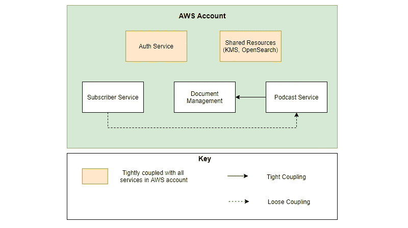
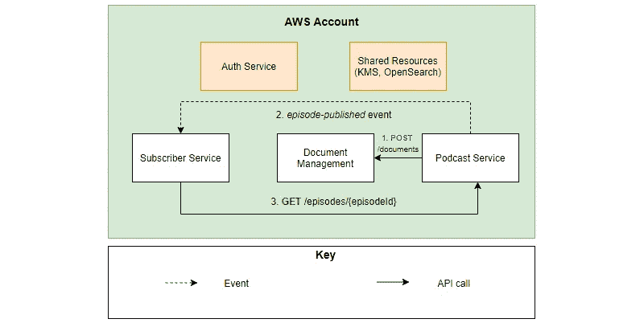

# 解决方案架构师提示—如何设计面向增长的应用

> 原文：<https://betterprogramming.pub/solutions-architect-tips-how-to-design-applications-for-growth-e9783d5a87e4>

## 设计应用程序时，您需要为未来的三个步骤做好计划

由[宏向量](/www.freepik.com)创建的电灯泡向量

几年前，我被要求设计一个独立的应用程序。它有一个单一的目的，是为了独立于我们公司的任何其他应用程序使用。

所以我根据需求设计了一个应用程序。它的一切都是独立的，不幸的是，它与组成它的各个部分紧密相连。

在我听到一个可怕的谣言之前，我们进行了大约 7 个月的开发。这个应用程序需要成为更大的东西的一部分。一个更大的应用生态系统中的玩家。但这只是一个谣言，所以我们继续。

三个月过去了；这不再是谣言了。在开发将近一年的时候，我们已经正式决定转向应用程序的方向。设计决策是根据现在完全错误的假设做出的。应该与这个“更大的生态系统”共享的应用程序的主要组件与非常集中的用例紧密耦合。

不用说，我们陷入了困境。我们的数据模型需要改变。我们的微服务需要不同的隔离级别。我们需要在我们的服务之间放松很多耦合。

多年后，我们仍在解开一些紧密的耦合。尽管被告知最初的方向，我们可以预先设计一个稍微不同的应用程序来避免这样的情况。

如果我们遵循了这些为增长而设计架构的指导方针，我们可以最大限度地减少返工的数量，并拥有一个更强大的整体解决方案。

# 增长与扩展

在之前的一篇博客文章中，我写了关于[为规模](/building-serverless-applications-that-scale-the-perfect-amount-ca6f75ae94a5)设计应用的文章。在那篇文章中，我介绍了如何为系统中不断增加的用户设计应用程序。随着时间的推移，你的用户群将会增长，你的应用会有更多的流量。这是规模。

另一方面，我们有增长，这是您的应用程序的大小、范围和复杂性的有机增长。当你迭代你的应用的特性集时，你正在帮助它成长。应用程序的足迹变得越来越大，自然会产生一个更加复杂和难以维护的软件。

将两者放在同一个范围内考虑，处理更多的流量(规模)将是向上扩展，而构建更大的功能集(增长)将是向外扩展。

成长没有错；这是一个好问题。但是当你提出你的设计时，你确实需要考虑它。您将如何解释新的主要功能？您的应用程序有可能扩展成更大的东西吗？

在你的设计中加入一些有意的生长点，以便将来可以添加、迭代和删除一些东西。

# 架构考虑

在为增长设计应用程序时，假设有许多未知的未知因素。产品管道中会有新的特性，但是你不知道它们是什么。产品所有者甚至不知道他们是什么。但是你需要在设计的时候考虑它们。你是怎么做到的？

## 松耦合

任何规模的生产应用程序都会有许多活动部件。作为解决方案架构师，您的目标是使每个移动部分尽可能完全独立。这意味着组件可以自行迭代和部署，而不需要依赖其他微服务或组件来部署或正常工作。如果一个组件发生变化，您不需要同时改变“耦合”的组件。

一般来说，以这种方式设计一个系统意味着你的组件很少或者根本不了解彼此。当它们必须通信时，使用 API，而不是直接调用函数或从数据库加载。这就是所谓的[松耦合](https://en.wikipedia.org/wiki/Loose_coupling)。

松散耦合为应用程序的增长敞开了大门。由于您的组件和微服务互不依赖，您可以添加和创建新的组件，而无需重写或减慢速度。

当在[架构图](/introducing-a-new-cross-cutting-architecture-diagram-the-critical-path-62d75980bd1f)上显示松散耦合时，您可以用虚线表示这些关系。紧密耦合的关系(希望不会太多)由连接不同组件的实线表示。

我们举个例子。假设您有一个由下面列出的几个服务组成的播客应用程序。

*播客应用服务图*

*   播客服务与文档管理服务紧密结合，文档管理服务存储播客的音频和视频文件。
*   订户服务与播客服务松散耦合，订阅事件并使用 API 加载剧集信息。
*   所有服务都与身份验证服务和共享基础设施服务紧密耦合，其中包含自定义身份验证机制和 KMS 密钥之类的东西。

## 事件驱动的工作流

事件是在您的系统中发生的动作。事件不仅提供了松散耦合，还提供了与业务流程的挂钩。

例如，在我们的播客应用程序中，当创建一个新的剧集时，会发布一个`episode-published`事件。订户服务监听事件，并向订阅播客的每个人发送电子邮件。

发布者不知道事件的订阅者。特定事件可以有零个、一个或多个订阅者，这使得事件驱动的工作流非常适合增长。

当初始开发完成时，即使没有订阅者，您也可以发布代表重要业务活动的事件。在未来的开发中，服务可以订阅现有的事件，并立即绑定到自己的工作流中。这就是所谓的[网钩](https://allenheltondev.medium.com/webhooks-explained-simply-with-car-shopping-1443fb40c445)。

随着时间的推移，Webhooks 允许最容易的增长。只要服务可以订阅您的事件，您就可以无限地(在某种程度上)用新的松散耦合特性来扩展您的应用程序。事件驱动的工作流甚至被 AWS 明确列为[无服务器设计原则](/7-aws-serverless-design-principles-for-solutions-architects-2be22717713b)。

通过在我们的播客例子中使用 webhooks 和 events，我们有效地为将来的开发打开了一扇大门。

如果我们决定自动将我们的内容推送到托管服务，如苹果播客和 Spotify，那么`episode-published`事件已经存在，我们可以快速轻松地绑定并添加该功能。

## API 重度

一个复杂的应用程序在服务之间会有几次通信。您的事件通常需要额外的查找来获得实体的全部细节，并且多服务验证对于高级工作流是必要的。为了在保持松散耦合的同时促进这一点，可以调用 API。

> *设计您的应用程序时，应强调易于扩展和使用的 API。*

通过构建[灵活且一致的 API](/the-importance-of-proper-serverless-api-design-878dfc3d3fcf)，您可以使未来的开发获得他们需要的准确信息。它还为消费者创造了将数据作为新功能集的一部分进行操作的机会。

在下面的例子中，当一集在我们的播客应用程序中发布时，我们有一系列跨服务的操作。

*发布播客剧集的跨服务工作流程*

1.  播客服务对文档管理服务进行 API 调用以保存音频文件。
2.  podcast 服务触发订阅者服务订阅的事件。
3.  订户服务对播客服务进行 API 调用，以在通知订户之前获得关于剧集的完整细节。

虽然将您的系统设计成 API 密集型并不是技术上的架构，但这是解决方案架构师需要考虑的事情。只有访问强大的 API，才可能满足上面的工作流。

为了推动对 API 的适当重视，你可以在你的组织中推动 [API 优先开发](/going-api-first-your-first-30-days-4c1ef6da320d)。预先在 API 设计上投入时间和精力将使您的应用程序易于增长。

# 结论

在上面示例中提供的简单业务流程中，有两个跨服务 API 调用和一个事件。随着应用程序的增长，这种模式会不断重复。

作为一名解决方案架构师，您的工作是找出如何使组件完全分离，同时无缝地协同工作。从表面上看，这听起来像是一个令人生畏且几乎不可能完成的任务。但是如果你记住了这三件事，你就会成功。

1.  保持您的组件松散耦合，这样您就可以独立地迭代它们并分别部署它们。
2.  发布关于主要业务活动的事件，为未来的功能和集成器添加触发点(即使您现在不使用它们)。
3.  为一切构建 API。如果可以，让它们都面向公众，并在一个共同的治理模型下构建它们。

记住这些，你就可以让你的应用程序变得无所不能。您不会被通过紧密耦合的服务迷宫传播变更的负担所束缚。您用任何事情都可以在任何时候绑定的事件构建有意的扩展点。并且通过 API 为服务构建易于使用的入口点。

当你用这种方法构建时，你不必知道未来。您可能会遇到一个又一个难题，您的应用程序将能够处理它。

编码快乐！