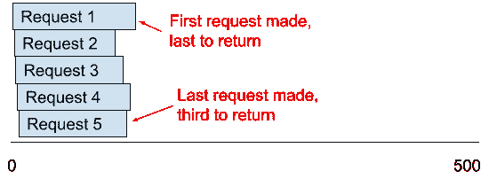
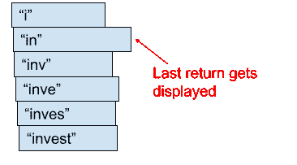

# 解决常见的并发问题

> 原文：<https://betterprogramming.pub/solving-common-concurrency-problems-eb3ebeeeb82b>

## 创建用于搜索附注的并发 API 请求


照片由 [Unsplash](https://unsplash.com?utm_source=medium&utm_medium=referral) 上的[甘帕尼·库马尔](https://unsplash.com/@gkumar2175?utm_source=medium&utm_medium=referral)拍摄

并发是令人沮丧的错误的一个众所周知的原因。大多数软件错误都是一致的。如果你做 X，然后 Y，然后 Z，你得到 Bug A。

不过，您可以获得并发的竞争条件。这基本上是一个 bug，如果你做 X，然后 Y，你可能有 10%的机会得到 Bug A。错误的发生是间歇性的，这使得很难找到根本原因，因为你不能可靠地重现它。这也很难证明你确实解决了问题。如果 Bug A 只发生了 10%,你就需要试着重现这个 Bug 很多次，以便有合理的信心你已经修复了它。

在我职业生涯的早期，处理并发问题是我的谋生之道。我喜欢处理线程和修复高级开发人员遗漏的竞争条件。这是一次巨大的信心提升。

然后我去面试，被问了一个并发问题。总计。炸弹。

就在那时，我意识到我擅长某种类型的并发问题，而这个问题恰好是大多数并发问题。

首先，让我们谈一点什么是并发。然后我们将继续讨论一个简单的并发问题，然后是一个更复杂的问题。

并发基本上就是让多个独立的代码同时运行。让我们从一个假设开始，然后进入一个真实的情况。

假设我需要向一个 API 发出 5 个不同的请求。每一个都需要 100 毫秒才能完成。如果我在开始下一个之前等待一个完成，我将会等待 500 毫秒。


所有图片由作者提供

如果我同时执行所有这些 web 请求，我将会等待 100ms +一些小的开销。


这是一个相当大的性能差异。这通常是使用并发的原因。

这听起来是一个简单的概念，对吗？那是因为它是一个简单的*概念*。

问题在于执行力。这些 API 请求每一个大约花费*100 毫秒，而不是正好 100 毫秒。*

这意味着您将按顺序发出 API 请求，但是返回将是无序的:



每次运行这段执行 API 请求的代码时，返回顺序都会不同。

您通过并发获得了性能提升，但是您放弃了一致性。

如果处理这些 API 请求响应的代码使用共享数据，错误就会突然出现。

让我们看一个更详细的例子来说明这是如何发生的。在 [Dynomantle](https://www.dynomantle.com) 中有一个关于搜索栏中建议的 bug。


问题就在这里:每次你输入一个字符，就会产生一个 API 请求。

这是为了让您在键入时能流畅地看到建议。你输入“我”，以“我”开头的笔记/书签/电子邮件就会弹出来。你输入“in ”,列表就会细化到以“in”开头的内容。

当你知道你要找什么的时候，你输入 5 个字符需要多长时间？2 秒？1 秒？半秒钟？

我仍然需要调整这个特性，但是现在处理每个 API 请求需要半秒到一秒的时间。

让用户在输入每个字符之间等待一秒钟，这将是一种糟糕的用户体验。所以我只是在输入每个字符时发出一个 API 请求。问题是请求返回的顺序不对。具有 2 个字符的请求可以在具有 5 个字符的请求的之后返回*。*

这些建议只是作为一个列表存储。每次有响应时，整个列表都会刷新。在这种情况下，当最后一个请求返回时，用正确的建议刷新整个列表，但是当旧的请求返回时，用不正确的建议填充。



幸运的是，这是一个很容易解决的问题，因为请求是按顺序进行的。

1)每次发出请求时生成时间戳或散列。这基本上是作为一个`requestId`:

```
let requestId = Date.now()
```

2)将`requestId`设置为建议列表的附加变量。因为我们按顺序提出请求，所以这总是最后一个请求:

```
let requestId = Date.now()
// Datastore is some singleton for
// easy access to these types of variables
datastore.setLastRequestId(requestId)
```

3)在每个 API 调用的成功函数中传递请求:

```
let requestId = Date.now()
datastore.setLastRequestId(requestId)
$.ajax({
    success: function(json) {
        suggestionsReceived(json, requestId)
    },
})
```

4)当响应到来时，验证它总是针对预期的请求:

```
suggestionsReceived(
    suggestions: Array,
    requestId: number,
) {
    if(datastore.lastRequestId != requestId) {
        return
    }
    // the rest of the code
}
```

不幸的是，如果用户打字非常快，他们可能会延迟看到任何建议。即使他们不使用两个字符的建议，看到它填充可以提供一种感觉，即该应用程序正在做一些事情，而不是只是等待。


解决这个问题需要对上面的代码做一点小小的修改。

我们将坚持使用时间戳而不是散列。

接下来，我们将存储最后一个`requestId` *收到的*而不是最后一个`requestId`发出的。

```
let requestId = Date.now()
$.ajax({
    success: function(json) {
        suggestionsReceived(json, requestId)
    },
})

suggestionsReceived(
    suggestions: Array, 
    requestId: number,
) {
    datastore.setLastRequestId(requestId)
    // the rest of the code
}
```

最后，只有当响应的`requestId`比上次收到的响应高时，我们才会刷新列表。因为我们使用时间戳作为`requestId`，所以所有的请求都是有序的，更大的 id 是最新的请求。

```
suggestionsReceived(
    suggestions: Array, 
    requestId: number,
) {
    if(datastore.lastRequestId > requestId) {
        return
    }
    datastore.setLastRequestId(requestId)
    // the rest of the code
}
```

注意:这只是因为用户不会在同一毫秒内输入多个字符。如果他们这样做，他们是粘贴内容，我们只想提出一个 API 请求。

另一个重要的注意事项是，这也仅仅是因为 [Javascript 处理并发的方式。](https://developer.mozilla.org/en-US/docs/Web/JavaScript/EventLoop)并不是*真正的*并发。每个函数在另一个函数运行之前执行和完成。

在 Java 中尝试类似的代码，你会很难受，因为对`suggestionsReceived()`的多个调用可以同时执行。这意味着“in”和“inv”的建议响应都可以通过 if 语句的检查，然后执行函数的其余部分。

您将看到的行为会非常不一致，这取决于函数的剩余部分有多长以及两个函数调用的时间。要在真正的并发语言中实现这一点，您需要了解如何为该语言使用锁。如果您要跨多个服务器处理并发性，Redis 也有分布式锁。

一个锁基本上阻塞了函数的执行，而另一个函数拥有锁。如果我们在 Javascript 中需要锁，它看起来会像这样:

当然，风险在于，如果我们不解锁，那么其他功能就不会执行。如果我们在多个函数中使用多个锁，我们可能会陷入两个函数都在等待另一个函数锁定的锁的情况。我们的程序现在冻结了，因为这两个函数都无法运行。这就是所谓的僵局。

Dynomantle 中的建议错误是一个简单的并发问题，因为它在 Javascript 中。让我们来看一个更复杂的问题，这个问题碰巧发生在 Java 中，但是它的教训应该可以转移到许多其他问题上。

我大学毕业后的第一份工作是开发网络管理应用程序。示例:您正在访问一家公司，并连接到客户 wifi 网络。我们的应用程序允许系统管理员根据登录凭证、办公室位置、一天中的时间等来配置您的访问权限。他们可以根据公司政策启用或阻止端口。

由于我们支持多种协议，并发性开始发挥作用。我们支持 wifi 的 802.1x，但我们也支持基于某人连接的以太网端口的认证、Kerberos 认证协议和其他一些协议。

一旦你打开你的电脑，它会尝试连接尽可能多的协议。在。的。一样。时间。

假设管理员为以太网端口访问设置了一个不太容易访问的策略。你也许可以得到端口 80 和 443(基本上只是网页浏览)。如果您使用 Kerberos 进行身份验证，您可以获得更广泛的网络访问。这里的问题是顺序无关紧要。如果用户使用多个协议进行身份验证，管理员可以配置哪个协议具有优先权。

当我开始这个项目时，交给我的代码将身份验证的状态存储在一个数据库表中，每个人的 MAC 地址都有一行，并且只有一行:

*   `primary_key` — int
*   `mac_address` — varchar(255)和唯一键
*   `authentication_protocol` —枚举
*   `status` —枚举

(真正的桌子要复杂得多，但这是 15 年前的事了，所以请原谅我)

`authentication_protocol`列存储了优先级最高且成功的协议。如果所有认证尝试失败，它还会存储最高优先级的协议。

我把问题过于简化了，但是我们需要数千行代码来协调所有不同的协议，找出哪些协议具有最高优先级，处理一些具有多个认证步骤的协议，处理各种锁，还需要考虑各种交换机和路由器制造商的固件中的一些古怪之处。客户非常不高兴，因为它很少正常工作，用户经常得到分配给他们的错误的网络策略。

我职业生涯最初几个月的大部分时间都在修复这个 bug，然后处理后续出现的 bug。最终，我意识到问题不在于我们的用户需求复杂。问题是我们建立了一个糟糕的数据模型，这使得代码比它需要的更复杂。

解决方案非常简单。以上面同一个数据库表为例。现在为每个 MAC 地址和协议添加一行。与其只有一行并试图协调在该行中显示哪个协议，不如为每个协议添加一行。

并发性仍然存在，但是您不再需要协调从并发性中实际保存什么数据。每个线程/进程都有自己专门修改的数据。确定用户的网络访问权限时，只需查找该用户的所有行并选择相关的行。

没有锁。没有要修改的共享数据。

代码最终变得更简单，因为在大多数情况下可以忽略并发性。开发者很开心。代码工作正常。顾客很高兴。

现实场景中，管理员只设置了 2 到 3 个适用于单个人的策略，因此我最终将表的大小增加了 2 到 3 倍。然而，那是线性增长。数据库可以轻松处理线性增长。从 1000 行到 3000 行无关紧要。从 100 万行到 300 万行也与现代硬件无关。

从 10 亿行到 30 亿行可能是相关的。然而，在达到 10 亿行之前，您就应该开始扩展数据库以支持 30 亿行。

所有这些都是一种冗长的说法:将表的大小增加 3 倍是值得的，因为不必担心并发性。

这种问题是常见的并发问题。许多数据似乎需要由不同的并发进程同时访问和修改。大多数时候这不是真的。对数据模型进行小的调整，并利用存储便宜的事实，可以为您的团队节省大量工作。

希望这篇帖子对你有帮助！如果您有任何问题或者想要一些关于您自己的并发问题的建议，请随时联系我们。

```
**Want to Connect With the Author?**Subscribers to my newsletter also get some bonus content describing some other concurrency problems. You can [subscribe here.](https://blog.professorbeekums.com#home-emailSignup)This article was originally published at [https://blog.professorbeekums.com](https://blog.professorbeekums.com/2021/solving-concurrency-problems/).
```