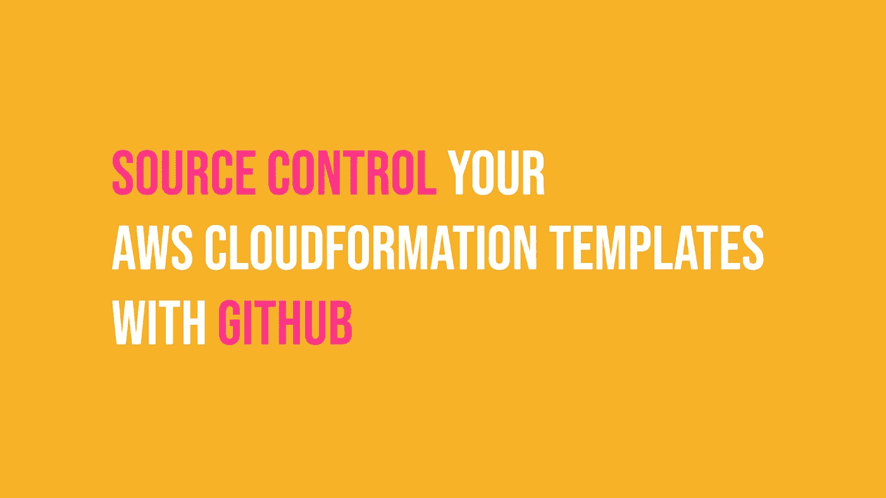

# 使用 GitHub 对 AWS CloudFormation 模板进行源代码控制

> 原文：<https://betterprogramming.pub/source-control-your-aws-cloudformation-templates-with-github-9e2fe5dce677>

## 通过 GitHub 操作提高您的工作效率

作者图片

源代码管理是跟踪和管理代码更改的实践。这可以是软件代码或基础设施代码(IaC)。

长期以来，IT 开发中的源代码控制一直是常见的做法。但在 it 运营团队中，这仍然是一件新鲜或不常见的事情。

我可以举起我的手说，我写的许多脚本或部署模板曾经存在于标记为版本 1、旧版本、新版本等的文件夹中。甚至是我邮箱里的草稿邮件。多疯狂的工作方式啊，对吧？

感谢 GitHub 的发明和我的发现，我变得更擅长编写和存储脚本(希望如此！).现在一切都公开展示了。

# 使用 GitHub 进行 AWS CloudFormation 源代码控制

我最近一直在学习和创建 [AWS CloudFormation 模板](https://www.techielass.com/create-an-s3-bucket-using-aws-cloudformation)，并创建了一个 GitHub 存储库来帮助存储我的模板，所以我可以对它们进行操作，也可以与他人分享它们。

你可以在这里找到我的作品:【https://github.com/weeyin83/AWSCloudFormationSamples 

当我在本地机器上创建模板时，我一直使用某些工具来验证和检查我的模板的最佳实践和任何安全漏洞。

这让我想看看是否可以用 [GitHub Actions](https://www.techielass.com/tag/github-actions/) 将这些检查构建到我的 GitHub 库中，我可以！

编写模板时，很容易养成坏习惯，或者使用错误的措辞或语法。尤其是当你在不同语言之间切换甚至是多任务处理的时候。

为了测试您的 AWS CloudFormation 模板，您可以部署它们。这将有助于验证您的模板，但还有其他更好的方法。Lint 测试你的代码是前进的方向。

Lint 测试您的代码可以帮助您识别错误或违反最佳实践的情况。您可以在编写代码时对代码进行 lint 测试。在你最喜欢的代码编辑器中，通常有你可以安装的工具或插件。但是最佳实践也是在您将代码签入源代码控制环境时执行 lint 测试。

为了帮助验证您的 AWS CloudFormation 模板，您可以使用一个名为 [cfn-lint](https://github.com/aws-cloudformation/cfn-lint) 的工具。

cfn-lint 工具可以根据 [AWS CloudFormation 资源规范](https://docs.aws.amazon.com/AWSCloudFormation/latest/UserGuide/cfn-resource-specification.html)来验证 YAML 和 JSON 模板。

如果在模板中没有发现问题，cfn-lint 工具将返回一个零退出代码。任何其他值都表明模板有问题。下面列出了可能对您有帮助的代码:

*   0 表示未发现问题
*   2 是一个错误
*   4 是一个警告
*   6 是一个错误和警告
*   8 是一个信息
*   10 是一个错误信息
*   12 是一个警告和信息
*   14 是错误、警告和信息

# 使用 cfn_nag 检查安全漏洞

还有另一个叫做 [cfn_nag](https://github.com/stelligent/cfn_nag) 的工具，它可以检查你的代码中潜在的任何不安全的基础设施。当您阅读这个工具的相关文档时，作者说它可以检查如下内容:

*   太宽松的 IAM 规则(通配符)
*   过于宽松的安全组规则(通配符)
*   访问未启用的日志
*   未启用的加密
*   密码文字

在流程的早期检查您的基础架构模板是否存在任何潜在的安全问题非常重要。没有人愿意为其基础架构中的安全漏洞负责，这些漏洞可能会给他们或他们的客户带来声誉或财务问题。

# 带有 GitHub 操作的 AWS CloudFormation 工作流

由于我们的 AWS CloudFormation 模板作为中央存储库存储在 GitHub 中，我们希望确保只有符合正确标准的模板才存储在那里。

为了做到这一点，我们可以构建一个 GitHub actions 工作流来运行 cfn-lint 和 cfn_nag 工具。

以下是我创建的 GitHub Actions 工作流:

GitHub 检查云形成的工作流程

我创建的工作流会因多种原因而触发:

*   当某个东西被推入存储库的主分支时
*   当创建一个 pull 请求来将一些东西推入存储库的主分支时
*   当手动触发时

GitHub 动作在 Ubuntu [runner](https://www.techielass.com/github-runners/) 上运行。它运行以下三个步骤:

*   签出—此步骤签出代码，以便工作流可以使用并访问它。
*   cfn-lint-action —第二步是使用 cfn-lint 工具运行我的所有 YAML 模板文件。
*   stelligent cfn_nag —第三步针对所有模板运行 cfn_nag 工具。

我最近创建了一个 pull 请求，试图将新模板合并到主存储库中，当检查运行时，出现了错误。

当我深入细节时，我可以看到根据 cfn_nag 工具，我的模板中有一些警告和错误。

这有助于提醒我和存储库的所有者或维护者，模板有一些问题，应该在合并到主分支之前查看。

让我知道你是如何使用 GitHub 动作来帮助存储和编写更好的基础设施作为代码模板的！

*原载于*【https://www.techielass.com】