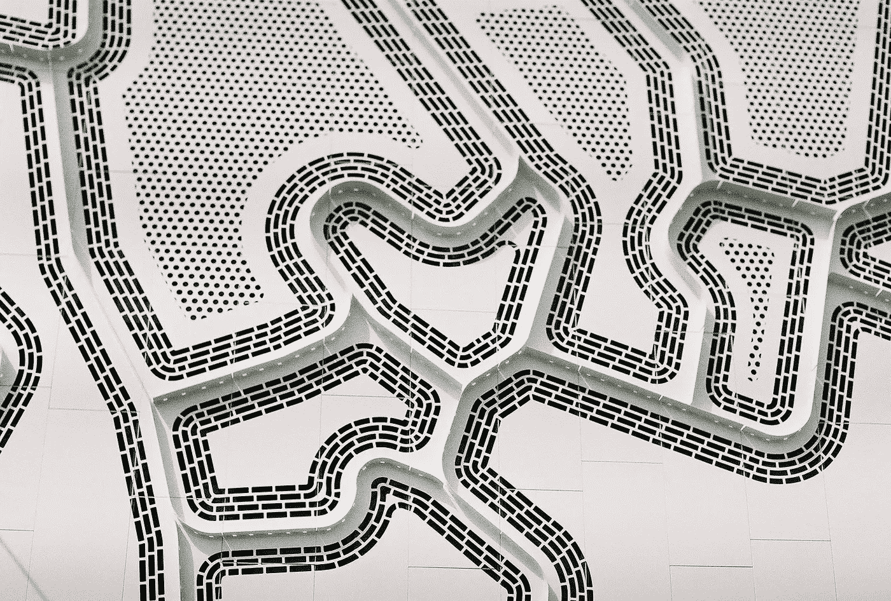
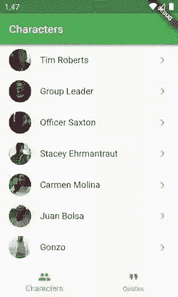

# Flutter 中完美的路由和导航

> 原文：<https://betterprogramming.pub/spotless-routing-and-navigation-in-flutter-995c647b9258>

## 在代码中处理路由和导航的最佳方式是什么？这里有一个完美的解决方案，你应该试试



由[波格丹一世·卡伦科](https://unsplash.com/@bogdan_karlenko?utm_source=unsplash&utm_medium=referral&utm_content=creditCopyText)在 [Unsplash](https://unsplash.com/s/photos/routes?utm_source=unsplash&utm_medium=referral&utm_content=creditCopyText) 上拍摄的照片

# 介绍

一旦你完成了对 Flutter 基础知识的学习，并开始着手你的第一个项目，你会发现自己在问:

“处理路线和导航的最佳方式是什么？”

“我应该使用命名路由吗？我该不该用套餐？”

不，我不是来说“这取决于你的需求。”

我在一家软件服务公司工作，因此，我们每年开发许多应用程序。这就要求找到适合最多不同项目的解决方案。

如果你做过原生移动开发，你就会知道路由总是成为一件严肃的事情。每当我周围的失败者，它是五分钟之前，我们讨论路由器，协调器，流量，及其利弊。对于 Androiders，情况完全相同——只需用 Jetpack Navigation、Cicerone 或 FragNav 替换这些术语。似乎没有人对它完全满意。

如果 Flutter 是你第一次涉足移动世界，请记住这些话:这不会是你最后一次谈论路由策略。

在你绝望之前，给我一个机会让你看看我是怎么做到的。

我非常满意，我想你也会满意的。

你曾经花时间思考过网页上的导航是如何进行的吗？

我不是在谈论它是如何开发的或者类似的事情——我感兴趣的是你作为网站用户或者 RESTful API 消费者的体验。

URL 通常是围绕资源设计的，资源可以是一个集合，也可以是一个项目。例如:

想要访问电影列表吗？转到`${yourFavoriteMovieWebsite}/movies`。

想要查看您在列表中找到的特定电影的更多详细信息吗？转到`${yourFavoriteMovieWebsite}/movies/:picked_movie_id`。

你注意到参数化的 id 了吗？这是路径参数或 URL 参数。

只看 2020 年上映的电影怎么样？没问题，只需向第一个端点传递一个名为`releaseYear`的查询参数:

`${yourFavoriteMovieWebsite}/movies?releaseYear=2020`

顺便说一下，URL 中包含参数的部分，以问号开头，就是我们所说的查询字符串。

延伸阅读: [REST 资源命名](https://restfulapi.net/resource-naming/)。

# 如果我们的应用程序也能做到这一点会怎么样？

“我为什么要做这种事？”

除了它惊人的直觉和组织性，我们只差一步就准备好深层链接了。

“深度链接？”

你有没有在手机上打开一个链接，而不是打开一个网页，打开一个应用程序的特定页面？

另一个很好的例子是，当你收到来自 messenger 应用程序的推送通知并点击它时，它会将你带到特定的对话屏幕。

这就是深度链接的意义所在。这也是我们今天要说的全部内容——它很快会有自己的文章。

我的观点是:如果我们迟早要考虑页面的 URL 路径，为什么不从一开始就考虑呢？即使你不打算在你的项目中支持深层链接，这仍然是最成熟的组织路线的方式。

为了展示今天的文章，我决定我们需要开发一个真正的应用程序。为了让它成为可能，我花了一些时间寻找免费的 HTTP APIs，这时我发现了伟大的[绝命毒师 API](https://breakingbadapi.com) 。

它为我们提供了一系列关于绝命毒师和更好地呼叫索尔电视节目的信息。不过，我们的应用仅限于打破坏角色和它的显著报价。

就这样，我发现自己面临着最具挑战性的任务。决定应用程序的名称！

# 破碎的 Bapp 诞生了

不要担心我的营销技巧——我不打算从事那个职业！还有，我向你保证我会尽我所能只在名字里保留“破坏”的部分。



突破 Bapp 演练

# 资源思维

我们已经说过，我们应该围绕我们提供的资源来设计我们的道路。你能想象如果我们谈论一个网站，URL 会是什么样子吗？我做了那个练习:

*   字符列表:`characters`
*   单个字符的详细信息:`characters/:character_id`
*   报价清单:`quotes`
*   报价作者详情:`quotes/authors?name=:quote_author_name`

最后一个是最棘手的。也许你想知道为什么`name`是查询参数而不是路径参数，或者为什么我们不使用引用的作者 ID 而不是他们的名字。

要回答这个问题，首先让我向您展示一个从 API 中检索的报价的 JSON 对象:

```
{
   "quote_id":1,
   "quote":"I am not in danger, Skyler. I am the danger!",
   "author":"Walter White"
}
```

注意，我们没有作者的 ID，只有它的名字。由于`name`不是一个可靠的唯一标识符，并且推荐使用 path params 作为唯一标识符，我们能做的最好的事情就是想象我们正在查询作者的资源。

通过这样的设计，我可以教你如何使用查询字符串。

对于那些不是《绝命毒师》粉丝的人来说，值得一提的是，引用作者只不过是这部剧的一个角色。因此，要获得这些信息，我们只需要使用字符细节端点——幸运的是，API 允许我们通过名称而不是 ID 来查找字符。

# 在 Flutter 中导航是如何工作的？

导航只不过是转换到一个新的全屏小部件的简单行为，我们称之为页面或屏幕。为此，我们需要将这个新的小部件包装在一个`[Route](https://api.flutter.dev/flutter/widgets/Route-class.html)`对象中，该对象描述了过渡应该如何发生，并将它推送到一个`[Navigator](https://api.flutter.dev/flutter/widgets/Navigator-class.html)`。默认情况下，有两种方法可以做到这一点。

## **第一种方法**

给`[Navigator](https://api.flutter.dev/flutter/widgets/Navigator-class.html)`一个`[Route](https://api.flutter.dev/flutter/widgets/Route-class.html)`对象。

让我们来看看 Bapp，这是`onTap`角色名单的回调:

(亲)极其易学；

(Pro)强类型；

(缺点)如果你需要在应用程序的许多部分导航到同一个屏幕，会导致大量的代码重复；

## **第二种方法，又名命名路线**

给`[Navigator](https://api.flutter.dev/flutter/widgets/Navigator-class.html)`一个路由名和一个通用参数(可选)，它将被传递给一个函数，该函数将这两个参数映射到一个`[Route](https://api.flutter.dev/flutter/widgets/Route-class.html)`。

你需要自己写那个函数，作为`[MaterialApp](https://api.flutter.dev/flutter/material/MaterialApp-class.html)`的`[onGenerateRoute](https://api.flutter.dev/flutter/material/MaterialApp/onGenerateRoute.html)`。

(缺点)不如第一种方法好学。

(Pro)虽然看起来更冗长，但这实际上是推荐的方法，因为我们保持页面的实例化集中，避免了代码重复。

如果我们仔细观察，命名路由方法相对来说更接近于我们试图完成的 web 任务。唯一的区别是，在 web 上，我们不需要这个参数对象(`[Navigator.pushNamed](https://api.flutter.dev/flutter/widgets/Navigator/pushNamed.html)`的第三个参数)，因为我们将能够在路由名称内传递我们需要的每个参数*，或者作为路径参数，或者作为查询参数。*

我们想这样做:`Navigator.of(context).pushNamed('characters/${character.id}');`

而不是这个:`Navigator.of(context).pushNamed('character-details', arguments: character.id);`

然而，如果你试图马上这样做，它会让你头疼。在您的`[onGenerateRoute](https://api.flutter.dev/flutter/material/MaterialApp/onGenerateRoute.html)`函数中，您将需要一种方法来通配符化角色的 ID，这样`characters/11`和`characters/22`将采用相同的路线，只是参数不同。另一个问题是必须剥离和解析问号后面的内容作为查询参数。

# [Fluro](https://pub.dev/packages/fluro#-readme-tab-) 包来救援

根据他们的说法(我也倾向于同意)，Fluro 是:

> *最亮、最潮、最酷的 Flutter 路由器。*

在几个特征中，我要强调的是:

*   通配符参数匹配
*   Querystring 参数解析

我们找到我们要找的人了！

作为我们的起点，我使用第一种路由方法(没有命名路由)构建了一个版本的 Breaking Bapp，从这个版本开始，我们将使用 Fluro 开发一个优雅的解决方案。

不要担心我如何进行 HTTP 调用或者状态管理方法是什么。我设法让事情尽可能简单，这样就不会占用导航和路线的重点。

为了涵盖有多个`[Navigator](https://api.flutter.dev/flutter/widgets/Navigator-class.html)`的场景，我们有一个底部导航菜单结构。

我建议你查看一下 [Breaking Bapp 的 GitHub 库](https://github.com/EdsonBueno/breaking_bapp)的`starting-point`分支，并相对熟悉它以获得更好的学习体验。

# 逐步迁移到 Fluro

## 1.安装氟

本文基于 1.7.8 版本。

请不要使用更新的版本，直到你完成所有的步骤。我说不出这有多重要。

[https://pub.dev/packages/fluro#-installing-tab-](https://pub.dev/packages/fluro#-installing-tab-)

## 2.设置您的路线

主 Fluro 的课叫`[FluroRouter](https://pub.dev/documentation/fluro/latest/fluro/FluroRouter-class.html)`。我们将把它用于我们需要做的一切，除了推送页面，因为我们将继续为此使用`[Navigator](https://api.flutter.dev/flutter/widgets/Navigator-class.html)`。你不需要自己实例化它，因为 Fluro 已经为我们提供了一个实例作为静态变量，只需通过`[FluroRouter.appRouter](https://pub.dev/documentation/fluro/latest/fluro/FluroRouter/appRouter.html)`访问。

首先，我们将开始使用一个名为`[define](https://pub.dev/documentation/fluro/latest/fluro/FluroRouter/define.html)`的`[FluroRouter](https://pub.dev/documentation/fluro/latest/fluro/FluroRouter-class.html)`函数，它的作用是*定义*一条路线。它接受三个参数:

*   表示路线路径及其预期的*路径*参数的字符串。查询不需要事先指定。
*   一个 handler 对象，用于保存页面的小部件生成器。
*   一个可选的`[TransitionType](https://pub.dev/documentation/fluro/latest/fluro/TransitionType-class.html)`，以防你想改变默认的路线过渡。

我在主函数(`main.dart`)中完成了所有的路由设置，我建议你也这样做。

仔细阅读下面的要点。我尽力评论你需要知道的一切。

## 3.将您的路由器连接到您的导航器

现在我们有了一个叫做`[FluroRouter.appRouter](https://pub.dev/documentation/fluro/latest/fluro/FluroRouter/appRouter.html)`的特殊小家伙，它知道如何处理我们所有的网络状命名路由。但是我们还没有把它插在任何地方。因此，当我们`[Navigator.pushNamed](https://api.flutter.dev/flutter/widgets/Navigator/pushNamed.html)`某个东西时，它仍然不会使用我们在上一步中刚刚完成的所有设置。

还记得`[MaterialApp.onGenerateRoute](https://api.flutter.dev/flutter/material/MaterialApp/onGenerateRoute.html)`构造函数参数吗？在讨论命名路由时，我们已经简单地讨论过了。我们需要为它提供一个接收推送的路由设置的函数，并使用它来构建一个具体的`[Route](https://api.flutter.dev/flutter/widgets/Route-class.html)`。猜猜谁有这个？是的，`[FluroRouter.appRouter](https://pub.dev/documentation/fluro/latest/fluro/FluroRouter/appRouter.html)`。

现在，每次我们使用我们的*根* `[Navigator](https://api.flutter.dev/flutter/widgets/Navigator-class.html)`导航时，一切都很好。

**“你说的*根*导航器是什么意思？”**

默认情况下，在`[MaterialApp](https://api.flutter.dev/flutter/material/MaterialApp-class.html)`中，我们被赋予了一个`[Navigator](https://api.flutter.dev/flutter/widgets/Navigator-class.html)`来推送和弹出我们的页面小部件，这就是我们刚刚与`[FluroRouter](https://pub.dev/documentation/fluro/latest/fluro/FluroRouter-class.html)`链接的那个。但是如果你的导航结构比那更复杂，例如如果你使用一个[底部导航组件](https://material.io/components/bottom-navigation/)，你可能有不止一个`[Navigator](https://api.flutter.dev/flutter/widgets/Navigator-class.html)`。我们还需要把这些和氟罗联系起来。幸运的是，这是打破巴普的情况！

**“如何让 Fluro 与多个** `[**Navigator**](https://api.flutter.dev/flutter/widgets/Navigator-class.html)` **一起工作？”**

**简答**:`[Navigator](https://api.flutter.dev/flutter/widgets/Navigator-class.html)`的构造函数也有一个`[onGenerateRoute](https://api.flutter.dev/flutter/widgets/Navigator/onGenerateRoute.html)`。只要在代码中实例化一个新的`[Navigator](https://api.flutter.dev/flutter/widgets/Navigator-class.html)`时，给它相同的`FluroRouter.appRouter.matchRoute(context, settings.name, routeSettings: settings).route`，使用`[initialRoute](https://api.flutter.dev/flutter/widgets/Navigator/initialRoute.html)`参数改变它的初始路径，然后跳到我们的第四步。

**长回答**:为此，我要给大家展示一下我在 Breaking Bapp 的底部导航中是怎么做到的。

如果你还没有关注我的[最新文章](https://medium.com/swlh/bottom-navigate-like-the-pros-in-flutter-8a48bdd5fed4)，你就不容易明白这是怎么回事了。如果是这样的话，我强烈建议你满足于简短的回答，直接跳到第四步。我向你保证不会有任何损失！

**3.1。将您的路由器连接到您的附加导航器**

我们的代码有一个名为`[BottomNavigationTab](https://github.com/EdsonBueno/breaking_bapp/blob/starting-point/lib/presentation/common/bottom_navigation/bottom_navigation_tab.dart)`的类，它保存了构建应用程序底层导航流的所有依赖项。这包括要在菜单中显示的项目，它应该用于特定选项卡的`[Navigator](https://api.flutter.dev/flutter/widgets/Navigator-class.html)`的`[GlobalKey](https://api.flutter.dev/flutter/widgets/GlobalKey-class.html)`，以及每个选项卡的初始页面生成器。`initialPageBuilder`曾经在我们自己实例化路线时很有用(通过使用第一种导航方法)。但是现在我们使用命名的路径，我们不再喜欢页面生成器，只喜欢路径名，因为 Fluro 现在正在构建东西。

区别在于:

```
class BottomNavigationTab {
    const BottomNavigationTab({
        @required this.bottomNavigationBarItem,
        @required this.navigatorKey,
-       @required this.initialPageBuilder,
+       @required this.initialRouteName,
    }) : assert(bottomNavigationBarItem != null),
       assert(navigatorKey != null),
-      assert(initialPageBuilder != null);
+      assert(initialRouteName != null);

    final BottomNavigationBarItem bottomNavigationBarItem;
    final GlobalKey<NavigatorState> navigatorKey;
-   final WidgetBuilder initialPageBuilder;
+   final String initialRouteName;
}
```

由于我们刚刚更改了`BottomNavigationTab`的定义，我们需要确定实例化它的位置:

```
class HomeScreen extends StatefulWidget {
  [@override](http://twitter.com/override)
  _HomeScreenState createState() => _HomeScreenState();
}class _HomeScreenState extends State<HomeScreen> {
  final List<BottomNavigationTab> _bottomNavigationTabs = [
    BottomNavigationTab(
      bottomNavigationBarItem: BottomNavigationBarItem(
        title: const Text('Characters'),
        icon: Icon(Icons.people),
      ),
      navigatorKey: GlobalKey<NavigatorState>(),
-     initialPageBuilder: (_) => CharacterListPage(),
+     initialRouteName: 'characters',
    ),
    BottomNavigationTab(
      bottomNavigationBarItem: BottomNavigationBarItem(
        title: const Text('Quotes'),
        icon: Icon(Icons.format_quote),
      ),
      navigatorKey: GlobalKey<NavigatorState>(),
-     initialPageBuilder: (_) => QuoteListPage(),
+     initialRouteName: 'quotes',
    )
  ];[@override](http://twitter.com/override)
  Widget build(BuildContext context) => AdaptiveBottomNavigationScaffold(
        navigationBarItems: _bottomNavigationTabs,
      );
}
```

还剩下两个地方，都在`material_bottom_navigation_scaffold.dart`中，因为那是我们子类化和实例化上述`BottomNavigationTab`的地方。

```
class _MaterialBottomNavigationTab extends BottomNavigationTab {
  const _MaterialBottomNavigationTab({
    [@required](http://twitter.com/required) BottomNavigationBarItem bottomNavigationBarItem,
    [@required](http://twitter.com/required) GlobalKey<NavigatorState> navigatorKey,
-   [@required](http://twitter.com/required) WidgetBuilder initialPageBuilder,
+   [@required](http://twitter.com/required) String initialRouteName,
    [@required](http://twitter.com/required) this.subtreeKey,
  })  : assert(bottomNavigationBarItem != null),
        assert(subtreeKey != null),
-       assert(initialPageBuilder != null),
+       assert(initialRouteName != null),
        assert(navigatorKey != null),
        super(
          bottomNavigationBarItem: bottomNavigationBarItem,
          navigatorKey: navigatorKey,
-         initialPageBuilder: initialPageBuilder,
+         initialRouteName: initialRouteName,
        );

  final GlobalKey subtreeKey;
}void _initMaterialNavigationBarItems() {
  materialNavigationBarItems.addAll(
    widget.navigationBarItems
        .map(
          (barItem) => _MaterialBottomNavigationTab(
            bottomNavigationBarItem: barItem.bottomNavigationBarItem,
            navigatorKey: barItem.navigatorKey,
            subtreeKey: GlobalKey(),
-           initialPageBuilder: barItem.initialPageBuilder,
+           initialRouteName: barItem.initialRouteName,
          ),
        )
        .toList(),
  );
}
```

最后，是时候确保我们额外的导航员将其路线生成委托给 Fluro，并使用最新的`BottomNavigationTab`的`initialRouteName`。我在 Android 和 iOS 上使用了不同的底部导航菜单，所以我需要在两个文件中进行更改:

1.  `material_bottom_navigation_scaffold.dart`

```
Widget _buildPageFlow(
  BuildContext context,
  int tabIndex,
  _MaterialBottomNavigationTab item,
) {
  final isCurrentlySelected = tabIndex == widget.selectedIndex;

  // We should build the tab content only if it was already built or
  // if it is currently selected.
  _shouldBuildTab[tabIndex] =
      isCurrentlySelected || _shouldBuildTab[tabIndex];

  final Widget view = FadeTransition(
    opacity: _animationControllers[tabIndex].drive(
      CurveTween(curve: Curves.fastOutSlowIn),
    ),
    child: KeyedSubtree(
      key: item.subtreeKey,
      child: _shouldBuildTab[tabIndex]
          ? Navigator(
              // The key enables us to access the Navigator's state inside the
              // onWillPop callback and for emptying its stack when a tab is
              // re-selected. That is why a GlobalKey is needed instead of
              // a simpler ValueKey.
              key: item.navigatorKey,
-             // Since this isn't the purpose of this sample, we're not using
-             // named routes. Because of that, the onGenerateRoute callback
-             // will be called only for the initial route.
-             onGenerateRoute: (settings) => MaterialPageRoute(
-               settings: settings,
-               builder: item.initialPageBuilder,
-             ),
+             initialRoute: item.initialRouteName,
+             // RouteFactory is nothing but an alias of a function that takes
+             // in a RouteSettings and returns a Route<dynamic>, which is
+             // the type of the onGenerateRoute parameter.
+             // We registered one of these in our main.dart file.
+             onGenerateRoute: FluroRouter.appRouter
+                 .matchRoute(context, settings.name, routeSettings: settings)
+                 .route,
            )
          : Container(),
    ),
  );

  if (tabIndex == widget.selectedIndex) {
    _animationControllers[tabIndex].forward();
    return view;
  } else {
    _animationControllers[tabIndex].reverse();
    if (_animationControllers[tabIndex].isAnimating) {
      return IgnorePointer(child: view);
    }
    return Offstage(child: view);
  }
}
```

2.`cupertino_bottom_navigation_scaffold.dart`

```
Widget build(BuildContext context) => CupertinoTabScaffold(
      // As we're managing the selected index outside, there's no need
      // to make this Widget stateful. We just need pass the selectedIndex to
      // the controller every time the widget is rebuilt.
      controller: CupertinoTabController(initialIndex: selectedIndex),
      tabBar: CupertinoTabBar(
        items: navigationBarItems
            .map(
              (item) => item.bottomNavigationBarItem,
            )
            .toList(),
        onTap: onItemSelected,
      ),
      tabBuilder: (context, index) {
        final barItem = navigationBarItems[index];
        return CupertinoTabView(
          navigatorKey: barItem.navigatorKey,
-         onGenerateRoute: (settings) => CupertinoPageRoute(
-           settings: settings,
-           builder: barItem.initialPageBuilder,
-         ),
+         onGenerateRoute: (settings) {
+           // The [Navigator] widget has a initialRoute parameter, which
+           // enables us to define which route it should push as the initial
+           // one. See [MaterialBottomNavigationScaffold] for more details.
+           //
+           // The problem is that in the Cupertino version, we're not
+           // instantiating the [Navigator] ourselves, instead we're
+           // delegating it to the CupertinoTabView, which doesn't provides
+           // us with a way to set the initialRoute name. The best
+           // alternative I could find is to "change" the route's name of
+           // our RouteSettings to our BottomNavigationTab's initialRouteName
+           // when the onGenerateRoute is being executed for the initial
+           // route.
+           var routeSettings = settings;
+           if (settings.name == '/') {
+             routeSettings =
+               settings.copyWith(name: barItem.initialRouteName);
+             );
+           } 
+           return FluroRouter.appRouter
+               .matchRoute(
+                 context,
+                 routeSettings.name,
+                 routeSettings: routeSettings,
+               )
+               .route;
+         },
        );
      },
    );
```

## 4.航行

到目前为止，我们所做的一切都是为了准备处理任何传入的类似网络的命名路由，但我们仍然没有使用它们。我们需要停止使用`[Navigator.push](https://api.flutter.dev/flutter/widgets/Navigator/push.html)`，开始使用`[Navigator.pushNamed](https://api.flutter.dev/flutter/widgets/Navigator/pushNamed.html)`。有两个地方可以改变这种情况:

*   当选择列表中的字符时。

`character_list_page.dart`

```
- Navigator.push(
-   context,
-   MaterialPageRoute(
-     builder: (context) => CharacterDetailPage(
-      id: character.id,
-     ),
-   ),
+ Navigator.of(context).pushNamed(
+   'characters/${character.id}',
  );
```

*   在列表中选择引用的作者时。

`quote_list_page.dart`

```
Navigator.of(
    context,
    rootNavigator: true,
- ).push(
-   MaterialPageRoute(
-     fullscreenDialog: true,
-     builder: (context) => CharacterDetailPage(
-       name: quote.authorName,
-     ),
-   ),
+ ).pushNamed(
+   'quotes/authors?name=${quote.authorName}',
  );
```

我们都完了！

## 边注

我曾经读到有人认为，使用 Fluro，我们无法将复杂的对象直接从一个页面传递到另一个页面。虽然我们可以找到晦涩的方法来做到这一点，但我不建议这样做。

我坚信我们不应该传递复杂的物体。我喜欢的另一种方法是给对象一个`id`并将它存储在数据层中。这样，我们只能在页面之间传递它的`id`。

# 奖金

您可能已经注意到，代码中的路由名称是重复的。这根本不是推荐的做法。它的目的是提高文章的可读性，但我不希望你在其他地方这样做。关于如何提取它的灵感，请查看`master`分支。

# 有用的链接

*   [GitHub 库](https://github.com/EdsonBueno/breaking_bapp)
*   [像专业玩家一样在底部导航](https://medium.com/swlh/bottom-navigate-like-the-pros-in-flutter-8a48bdd5fed4)
*   [绝命毒师 API](https://breakingbadapi.com)
*   [氟包](https://pub.dev/packages/fluro)
*   [休息资源命名](https://restfulapi.net/resource-naming/)