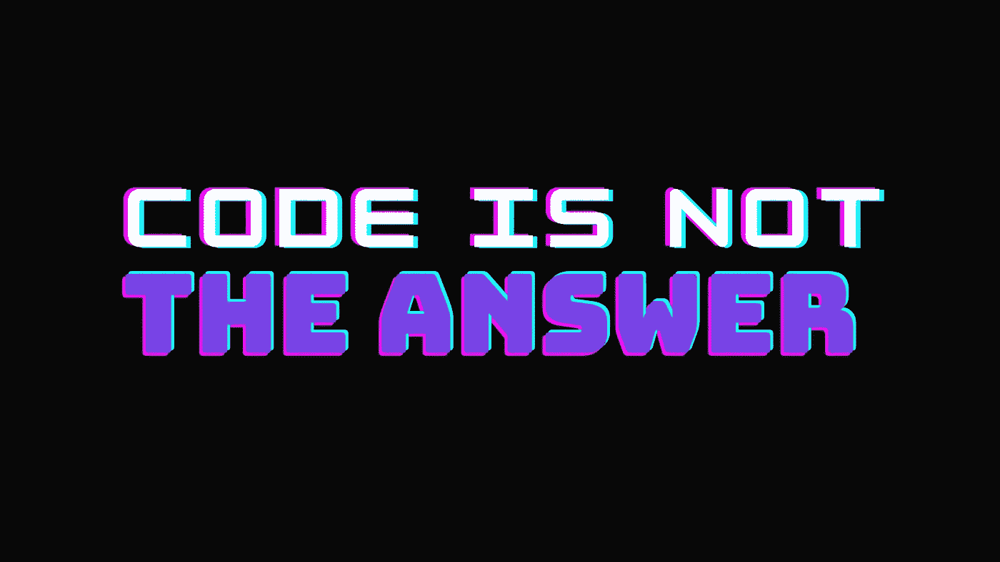

# 2022 年开始新的副业项目？超越编码

> 原文：<https://betterprogramming.pub/starting-a-new-side-project-in-2022-look-beyond-coding-9e0314c7d4ba>

## 构建一个实际的软件产品是什么样子的？

作者图片

出于某种原因，开发人员开始将未完成的附带项目的数量作为荣誉徽章:越多越好。他们有了想法，买了域名，写了几行代码，几个星期后，他们对一个新想法感到兴奋，而把另一个留给烂掉。

你认为这是为什么？我知道为什么我过去常常这样做:我过去常常用我的代码思考，而不是适当地计划我的项目。

每当我有一个新的想法，我会毫不犹豫地开始把我的想法变成代码。但这不是正确的方法，不是吗？当一个闪亮的新想法出现时，我正埋头于代码，处理我的业务逻辑。

所以我必须做出决定:是从头开始新项目，还是继续处理一个我不知道如何解决的问题？这个决定很容易，结果也在意料之中:我无法完成一个小项目。

因此，让我们来看看正确处理一个附带项目意味着什么，以及除了实际编码之外还需要发生什么。

# 控制住冲动，开始编码并制定计划

每当一个新的想法出现时，你必须阻止自己编码。不会很久，但是在你到达那个部分之前，有一些任务你需要处理。

我知道编码是“有趣”的部分，但是没有计划的编码是你能为你的项目做的最糟糕的事情。

要创建计划:

*   决定你在建造什么。
*   列出所有的特征。不一定要详细，但至少要列出你想涵盖的要点。
*   在这个列表之外，决定需要实现的最低限度，以及哪些是“最好的”，这样你就有了一个 MVP(最低限度可行产品)范围。
*   考虑产品的架构。这会存在于云中吗？会是手机 app 吗？一旦以这种方式发布到产品中，它还能工作吗？

这些都是你要问自己的问题。不涉及编码，不要搞混了。我不是要求你做任何事情，除了打开一个文本文档或 Trello 板，或任何你想做的事情，并开始问自己这些问题。

通过回答这些问题，你已经远远领先于其他已经在编写代码的人了。相信我，你在制定计划。

一个计划会给你一个完整的范围，一个预先定义好的你要做的事情的清单。这很重要，因为它会告诉你什么时候结束。相反，如果你在开始编码的时候没有考虑你要实现什么，你就开始不停地添加新的特性，很有可能，你永远也看不到它的尽头。这被称为“范围蔓延”，当您在完成当前范围之前开始增加额外的范围，这是软件项目失败的主要原因之一。

所以，做个计划吧。见鬼，制定几个计划:一个 MVP 计划，一个版本 1 计划，一个版本 2 计划，等等。但是不管你有什么计划，都要尽可能的坚持下去。只有当你完成了当前的计划，才开始考虑下一个计划。

# 考虑你的代码的稳定性

我们都想开始编写那些“管用”的代码，因为我们想向前迈进。

这并不完全是坏事，只要你记得这段代码需要在不久之后被复查和测试。

我的建议是从一开始就对稳定性进行编码。但是如果速度是一个问题，你需要准备好你产品的第一个工作版本，那么，无论如何，暂时避免所有的质量标准。但是不要忘记永远，只要足够你得到第一个版本(通常是 MVP 之前的版本，称为概念验证)。

您应该稍后回到代码，并以更详细的眼光正确地浏览它。寻找一些东西，例如:

*   稳定性问题。在构建这个 PoC 版本时，您是否考虑到了您的逻辑的每一个边缘情况？你确定你的代码足够稳定，可以继续添加更多的特性吗？
*   代码味道，如代码重复和缺乏适当的编码标准，可能会损害您未来的进展。

这一步的重点是确保你为未来打下坚实的基础。在没有适当基础的补丁上添加补丁就像在流动的沙子上建造一座没有蓝图的办公楼。那栋大楼不会完工了。你的项目也不是。

最终，您会发现问题太大而无法修补，需要您重构一大块代码。那将是你一直在思考的新项目开始看起来像一个伟大的想法的时候。

花些时间稳定你的基础，如果你有多个系统，增加单元测试，集成测试。尝试从构建过程中尽可能多地自动化。这将有助于你专注于真正重要的事情:完成项目。

# 缩放应该不是未来的问题

你希望有多少用户？您想要处理多少数据？

在一个新项目开始时回答这些问题(或类似的问题)，如果你对以前的问题没有足够的经验，这不仅很难，而且几乎不可能。

如果你想准确地回答它们，至少是这样的。但我不是这个意思。在这个阶段问自己这些问题的目的不是正确地估计你的产品的流量或工作负载，而是为你的理想场景做计划。

构建一个只能在你的机器上工作的产品和构建一个可以被几百个人使用的东西是有很大区别的。如果你的目标是接触更多的客户，不要让我开始。如果你为十个用户开发了一个产品，因为你从来没有停下来考虑过这一点，那么当 100 个用户发现你的产品时，他们将无法测试它。事情将是缓慢的；它会没有反应；他们会崩溃的。你会失去你试图赢得的用户，仅仅因为你在写代码之前没有停下来思考一下你的架构。

这个项目从一开始就注定要失败，而你甚至不知道。

提出项目的架构并不容易，尤其是在你没有经验的情况下。但是，这里的重点不是提出一个最终的架构，一个能够适用于所有情况的架构。相反，我的观点是，你应该回顾你的产品成功的理想场景，并问自己:如果我这样构建，他们能使用它吗？

也许你正在构建一个 web 应用程序，你正在使用一种单一的方法。最终，您可能不得不转向基于微服务的架构。从整体服务到微服务的转变需要巨大的重构。相反，你可以预见到这一点，只创建几个微服务，足以让工作流的要点继续下去，所以如果明天你需要分解其中的一些，基本架构已经设置好了。这样重构应该没那么痛苦。

或者，您可能每天都要处理大量信息。一种方法是对它进行迭代并连续处理。毕竟，拥有 10 个或 20 个用户意味着你只需要十分钟。这不是什么大问题。但是当你的用户开始增加时会发生什么呢？100?1,000?现在你从 10 分钟跳到 100 分钟，或者更多。您的处理脚本还能处理这么多数据吗？相反，您可以预见到这一点，并考虑做一些并行处理。从一开始就很难实现，但是现在这个过程会扩展得更好。

我想说的是，让你的第一个版本上线并运行以确保它能正常工作与拥有一个你可以称之为“生产就绪”的产品之间有很大的区别。第一个是 PoC，我们可以在里面做任何我们想做的事情，但第二个，我们可以称之为 MVP 或版本 1，需要考虑某些因素，因为它将是我们真正的用户要与之交互的。我们希望他们幸福，不是吗？

规模从一开始就是一个问题——请注意，这不是一个大问题，但它应该在你的脑海中——你应该基于它(以及你的其他业务需求)来驱动你的所有设计决策。

# 就因为你建了，他们就不来

“你建了，他们就来了。”

那个短语在这种情况下不适用。如果你想成功，仅仅制造一个伟大的产品是不够的。你还必须想办法接触到你的观众。

有很多方法可以做到这一点；这都是关于营销的一种或另一种方式。但它的要点是，你必须有一个在线存在。

如果你在网上找不到，你的产品成功的机会就会大大减少。

被发现是什么意思？这是关键，不是吗，没有一个单一的方法，因为它取决于你的目标用户的类型。这些用户通常会通过谷歌找到他们需要的东西吗？他们在用 Reddit 吗？或许他们在 Pinterest 上搜索是因为他们在寻找视觉产品？

有无数种方法可以让他们找到你提供的东西，关键是你应该在决定你的营销策略之前了解他们。

一旦你这样做了，尽可能多地向他们提供信息:

*   围绕你的产品创造内容可能会有所帮助。博文、视频、Instagram 故事，应有尽有。重点是围绕你的项目创造其他人可能会发现的新鲜内容。这有助于传达这样的信息，即你正在积极地工作，并且你关心与用户的互动。这不是一个十年前建起来然后就被遗忘的项目。
*   创建常青树内容。教程和用户指南回答如何使用你的产品的常见问题是让用户喜欢你的好方法。然后，你必须找到他们询问的地方，并尝试将那里的内容链接起来。如果他们去脸书团体问问题，确保你在那里回答。如果他们询问堆栈溢出，设置一个警告并回复这些问题。为你的用户着想。
*   最后，在线建设是一种趋势，事实证明这种趋势也非常有效。通过分享你的构建过程，你在开发你的产品的同时赢得了观众。这样，当你准备好项目的第一个版本时，你已经有一群客户对它感兴趣并渴望尝试。这不是一个容易的过程，它需要你分享你的高潮和低谷来证明你是诚实的。然而，如果做得好，结果会很好。

无论您决定做什么，请记住，构建产品并让代码工作并不足以称之为“完成”接触你的客户同样重要，也应该从第一天起就成为你计划的一部分。

容易吗？见鬼不！如果你以前从未做过，你可能想寻求帮助。但是忽视它并且没有任何营销策略意味着一旦你发布，你将很难增加用户数量。记住这一点！

下一次，当你想到另一个你真的想完成的兼职项目时，记得:

*   坚持马上开始编码的想法，并为它制定一个计划。
*   一旦你开始编码，就要考虑到代码的稳定性。
*   围绕这个想法考虑规模和设计。
*   尽快开始培养观众。

这应该有助于您增加您的项目可以被其他人实际部署和使用的机会。

你怎么想呢?我漏了一步吗？