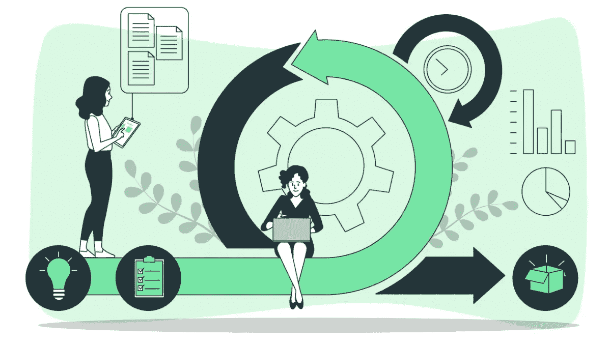

# 有目的地重新开始——我的无服务器冒险

> 原文：<https://betterprogramming.pub/starting-over-with-purpose-my-serverless-adventure-99f0c051d73a>

## 从零开始到两个完全无服务器的应用程序上线需要什么

由[故事集](/www.freepik.com)创建的插图矢量

无服务器对我来说是一次冒险。这始于 2019 年初，当时我的任务是“搞清楚整个云的事情。”

正如我在我的上一篇文章中提到的[，我和我的团队已经为我们安排好了工作。除了学习无服务器，我们还必须学习多租户、NoSQL 数据建模、CI/CD。几乎每一个与云相关的流行语都在我们的雷达上。](/3-things-to-know-before-building-a-multi-tenant-serverless-app-a19e21470b56)

我们花了大约一年的时间学习和构建概念证明，直到我们最终开始构建“生产就绪”软件。我们开始真正建设的第一天。该团队全力以赴，准备编码。直到中午左右，我们才重新组合，我们都互相觉得我们还没有准备好。

要考虑的事情太多了，以至于[的概念验证](/4-reasons-you-should-never-use-proof-of-concepts-in-production-ca54432e52b9)都没有让我们做好准备。但我们是研发团队。我们为我们的公司开拓了这个领域。当我们有问题时，没有专家团队可以求助。

所以，我们只是…做到了。

我们按照我们所知道的，或者当时认为我们知道的去做，并试图解决业务问题。我们会边走边学，并承诺在学习的过程中回来改进我们的解决方案。

> 你永远不会比现在知道的更少。

我为我的团队感到无比自豪。虽然许多工程队可能会死在不确定的轨道上，但我的队伍一直向前冲。我们构建了不止一个而是两个无服务器应用，并在创纪录的时间内投入生产。

当然，我们在这个过程中犯了一些错误，但是我们都知道没有完美的软件。尤其是当你在学习的时候。

我可以自信地说，我们完成了我们所做的事情，因为我们遵循了*做，做对，做得更好*的思维模式。

# “动手”阶段

任何项目的初始开发阶段通常被认为是概念验证的升级。这意味着您需要做您需要做的事情，但是您也需要遵循安全指南和您可能已经有的任何最佳实践。

你在“做”阶段的目标就是去做。

## **做吧。**

解决业务问题。尽一切可能用手头的工具勉强度日。你知道在这个阶段你知道的不多。

使用无服务器时，请使用最容易满足您需求的服务。不要太担心优化性能成本或减少 API 响应的毫秒数。专注于完成工作，把手弄脏。根据需要随时将 API Gateway 与 Lambda 和 DynamoDB 绑定。这是无服务器世界的瑞士军刀。

当你第二次回来时，你在编写产品软件时积累的经验将是至关重要的。你不必(太)担心做得对不对。这个阶段首先要证明你能做到。

在我们的第一个无服务器应用上，我们从小规模开始。我们的应用程序被设计为将文档发送给某人签名，然后将它们返回给所有者。我们从应用领域中提取了最简单的用例并构建了它。

对我们来说，“动手”阶段是允许用户将文档上传到我们的网站，然后将其传递给预先配置好的用户。用户会收到一封电子邮件，通知他们要签名的内容。当他们登录时，会看到一个托管文档版本。文档签署后，上传者收到一封电子邮件，称已完成。简单。

我们[硬编码值](/new-project-just-hardcode-it-bac72e1a231e)，而不是编写配置页面。我们构建了有针对性的 API 端点，它们做的比它们应该做的更多。但是我们解决了业务问题。

事实上，我们带着一个未知的技术栈(给我们)并且用它建造了一些东西，这对我的团队来说意味着整个世界。我们看到了无服务器的价值，并向我们自己和公司证明了它不仅仅可以用于有趣的附带项目。

最重要的是，我们了解了业务问题和技术堆栈。

# “做对”阶段

下一阶段是你开始认真起来的时候。您已经看到了无服务器可以做什么，并了解了如何构建。现在是时候构建更多的用例了，但是使用不同的方法。

现在你对构建一个生产就绪的应用程序的舒适度更高了，是时候开始提前思考了。关于正确建造它。

在你的应用上线后，你将如何[监控使用和跟踪问题](/the-challenges-of-stateless-architecture-and-how-to-monitor-your-serverless-application-94c0e8b8dd1)？通过 CI/CD 将[部署到生产的可持续方式是什么？到目前为止，你已经认识到你所构建的任何模式了吗，你准备好](/are-you-really-ready-for-ci-cd-9a8bf6d01b8a)[建立开发治理规则](/going-serverless-governance-is-everything-c70589c9cee9)了吗？

这些问题必须在开发周期的早期回答，但不要过早到“动手”阶段。这个阶段是为了学习。

> “正确行事”阶段是关于建立规范和为成功做准备。

在我的第一个项目中，这是我们开始拧紧螺栓的阶段。已创建配置页面。死信队列已配置。部署管道被硬化和模板化。

我们还利用我们在早期阶段开发的技能，将它们应用于更困难的业务问题。我们添加了构建动态数据输入页面的功能，这些页面在将文档发送到可配置的目的地之前填充文档。

我们开始构建从 API Gateway 到 DynamoDB 和[的直接集成，合并步骤函数](/how-to-build-lightning-fast-apis-with-aws-step-functions-d1725624aaaa)。还增加了签名后文档管理的功能。我们构建的应用程序是真正为生产准备的。

建立在第一阶段的知识基础上。识别可重复的模式，并将其规范化。让你的团队更有效率，让你的代码更易维护。

# “做得更好”阶段

在项目接近尾声的时候，我们转移了关注点。一旦我们有了一个上线日期，截止日期就要到了，我们有了一种新的紧迫感来优化应用程序。

在开发的早期，我已经为我们的应用做了一些初始的[无服务器成本建模](/5-steps-to-making-a-predictable-cost-model-for-aws-serverless-projects-78d78909bb82)。但是随着我们应用程序的增长，我们对无服务器的信心也在增长。这最终意味着应用程序的复杂性增加，成本模型需要重新审视。

到目前为止，我们已经进行了两年的开发。我们认为自己是高级的无服务器开发人员，知道如何识别和解决快速出现的问题。

现在我们开始优化。不仅仅是成本和性能优化，而是[完整的项目优化](/quick-optimizations-you-should-make-to-your-serverless-applications-9cc73ec464b9)。优化流程、微调应用程序功能以及构建我们的支持组织是我们的首要任务。

> *优化是“做得更好”阶段的重点。*

我们以 5 倍于预期流量的速度执行了[负载测试](https://www.readysetcloud.io/blog/allen.helton/load-test-with-serverless),以确定我们达到规模时的瓶颈。我们开始[重构应用](/how-to-refactor-serverless-applications-the-right-way-fb5e80c71d36)，以确保所有微服务、Lambda 函数和 DynamoDB 表都遵循我们的最佳实践。我们制定了我们的[灾难恢复战略](/is-disaster-recovery-worth-it-in-serverless-applications-1a4fbccfe6fd)。

这些是我们需要等待的软件开发的艰难部分。需要积累专业知识，以便对这些任务关键型组件做出明智的决策。如果我们最初在“做”阶段就做了，我们不可避免地会设置护栏，在整个过程中阻碍我们。

[迭代是构建强大的、生产就绪的软件的关键](/the-3-key-phases-of-successful-iteration-12a4e49399e7)。

你不会第一次就造好的。

**曾经。**

从你的错误中学习，提高你的技能，并在此基础上做出明智的决定。用你的经验来指导你做出更好的软件。

# 结论

每个阶段并不意味着是一个完整的重构。相反，你希望每个阶段都能教会你一些可以为下次打下基础的东西。在“动手”阶段，您将了解您的技术体系的大致运作方式。

*你能用你团队中的技能开发生产软件吗？*

“正确地做”阶段意味着建立在你的舒适和经验教训的基础上，并将你的基础工作转化为生产应用程序。适应无服务器的细微差别。了解无状态架构以及它们与有状态应用程序的区别。

识别和建立开发模式作为最佳实践。开始宣传如何使用无服务器构建。

“做得更好”阶段侧重于优化。你如何让你的应用程序从“坚持最佳实践”变成“像天使一样歌唱，几乎不花钱”？试着找出有助于他人支持你的申请的领域。

> *优化并不总是意味着性能增强。*

它是关于建立更好的流程、更新现有的最佳实践、降低成本等等。

在我的旅程中，我们花了大约 25%的时间在“做”阶段，65%的时间在“做对”阶段，10%的时间在“做得更好”阶段。但这对你来说不一定是最好的分解。

每个阶段的时间会根据你的团队的舒适程度和他们的经验而有所不同。我的团队对无服务器是全新的，所以我们花了一些额外的时间来发现我们可以使用的工具。当我们到达“做得更好”阶段时，团队正在向公司的其他人演示无服务器。

我谈了很多关于我从零开始构建应用程序的旅程，但这并不是“做，做对，做得更好”这句话的唯一用例。您可以在更小的范围内完成这项工作，甚至是在要素级别。

如果你想在你的应用程序中实现新的技术或者你完全不知道的东西，遵循上面的过程。在你学习的时候先试一试，让它发挥作用。然后带着第一次学到的知识重新复习。

最后，试着在上面戳洞，然后马上补上。弄清楚你需要做什么来让它对每个人都是可持续的。

这是我多年来的口头禅。我想我再也不会用另一种方式来开发软件了。在学习的过程中不断改进，远离过早的优化将有助于你保持敏捷，并保持一种改变是好事的心态。

编码快乐！