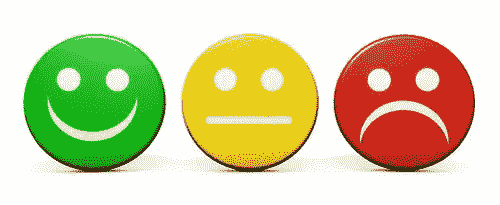

# PHP 中的状态和策略设计模式

> 原文：<https://betterprogramming.pub/state-strategy-design-patterns-by-example-f57ebd7b6211>

## 状态和策略是非常流行和有用的设计模式，可以帮助您更好地组织代码

状态和战略在执行上非常相似，但动机不同。在状态模式中，对象根据它所处的内在状态改变它的行为。在策略的情况下，对象的行为依赖于所提供的算法。在这两个用例中，使用的状态和算法都封装在单独的类中。

状态和策略都是行为模式。行为设计模式专注于对象之间的交流和责任分担。

# 状态

人们根据他们的心情以不同的方式做事情。如果你快乐，你会做很多与悲伤和沮丧时不同的事情。让我们试着用代码对此建模。有一个`Person`类，代表一个真实的人。我们的人可以介绍自己，被侮辱或拥抱。侮辱让他生气，拥抱让他更开心——这的确是一个真实的例子。

我们有三种可能的情绪共享同一个界面。

我们的人会幸福。然后，他人很好，说好听的话。

他也可以保持中立的情绪。然后你可以用一个拥抱让他开心，或者用一个侮辱让他生气。

最后一种可能的情绪是愤怒。

太好了。让我们看看我们的应用程序在运行，以及 Jan 将如何表现。

当考虑设计模式的使用时，考虑实现相同行为的替代方法是很重要的。我们可以:

1.  包括 *ifs，*根据其状态改变`Person`方法中的响应
2.  创建特殊班级，如`AngryPerson`、`NeutralPerson`、`HappyPerson`

如果我们尝试解决方案 1 或 2，我们会陷入不必要的复杂性或代码重复。与状态模式相比，它们都可能变得不可读并且伸缩性很差。

状态模式有三个元素:

*   上下文(`Person` )-使用状态并为客户端定义接口
*   状态(`Mood` )-每个状态的一个界面
*   具体状态(`Happy`、`Neutral`、`Angry` )-实现状态

在这种模式中，对象的状态可以在两个地方改变:上下文或具体状态。两种方法都可以，这取决于我们应该使用哪一种方法。

使用状态模式的常见示例:

*   会议室系统(房间处于空闲、占用等状态。)
*   生产周期(产品处于以下状态:准备装配、进行中、准备装运、已装运等。)
*   批准周期(图书处于状态:新、批准、出版)
*   灯泡(它们处于打开或关闭状态)

# 战略

这种设计模式侧重于将使用的算法从客户端分离出来。我们希望将数组中的一些数据传输到 JSON、XML 或逗号分隔的字符串中。在每种情况下，我们必须以不同的方式处理数据，并以字符串的形式产生结果。该组件的使用应该尽可能简单。我们可以向表示所选算法的上下文或关键字的`__construct`提供一个具体策略的实例。现在，我们将使用后一种选择。

每个算法必须共享一个公共接口。

在 PHP 中，从数组生成 JSON 非常简单。我们要做的就是在数据上调用`json_encode`。

将数组转换成逗号分隔的字符串也不是很复杂。

最困难的部分是从给定的数据创建 XML 字符串。我们设法用`SimpleXMLElement`的用法做到了。

现在处理数据转换容易多了。添加额外的格式现在是小菜一碟。

战略模式有三个要素:

*   上下文(`Context`)——使用具体的策略并为客户定义接口
*   策略(`OutputFormatter` )-所用算法的接口
*   具体策略(`JSONFormatter`、`XMLFormatter`、`StringFormatter`)-算法的实现

使用策略模式的常见示例:

*   排序算法的使用(每个算法都在一个单独的策略中)。
*   文本格式化(每种文本格式化技术都是一种独立的策略)。
*   解决问题的不同方法(例如，每个策略所代表的旅行推销员问题的不同算法)。
*   根据给定条件使用不同的算法(例如，根据通信模式和天气条件显示不同的路线，或使用不同的支付方式，如信用卡和 PayPal)。

# 结论

状态和策略的使用对您的代码准备非常有益，并使其更加灵活。他们都强烈支持单一责任和开闭原则。它们将与应用程序的某些特定部分相关的逻辑移动到单独的层次结构中，使得添加新的替代方案变得容易，并且独立于客户端实现。

然而，使用这种模式有时也会使您的代码过于复杂。如果一个代码中只有几个状态或策略，或者它们很少改变，那么这可能是过度的。请记住，这些模式不是最终的补救措施。

这里提供了一些其他模式的完整源代码和描述:

 [## jkapuscik 2/设计-模式-php

### 这个项目是一组在现实世界中使用不同设计模式的简单例子。每个人都有一个…

github.com](https://github.com/jkapuscik2/design-patterns-php) 

如果您想了解一些更有用的设计模式，您可以在以下文章中找到它们:

*   [工厂方法](https://medium.com/@j.kapuscik2/getting-started-with-design-patterns-in-php-4d451ccdfb71)
*   [创作模式](https://medium.com/@j.kapuscik2/creational-design-patterns-in-php-db365d3245ce)
*   [迭代器](https://medium.com/@j.kapuscik2/iterator-pattern-in-php-b7624f6bdbcf)
*   [迭代器](https://medium.com/@j.kapuscik2/iterator-pattern-in-php-b7624f6bdbcf)
*   [模板方法](https://medium.com/@j.kapuscik2/template-method-pattern-in-php-6116fd7e8ccc?source=friends_link&sk=ac4c483446bd5a5323c09a662bd54116)
*   [飞锤](https://medium.com/swlh/flyweight-design-pattern-in-php-edcda0486fb0?source=friends_link&sk=a0fa3083d5afd7e41af8a4f7a1df05f1)
*   [代理](https://medium.com/better-programming/proxy-design-pattern-and-how-to-use-it-acd0f11e5330)
*   [装饰者](https://medium.com/better-programming/decorator-c04fae63dfff)
*   [依赖注入](https://medium.com/better-programming/dependency-injection-8f09a93ec995)
*   [复合](https://medium.com/swlh/composite-908878748d0e)
*   [适配器](https://medium.com/swlh/building-cloud-storage-application-with-adapter-design-pattern-8b0105a1bda7)
*   [立面](https://medium.com/better-programming/what-is-facade-design-pattern-67cb09ce35d4)
*   [桥](https://medium.com/better-programming/what-is-bridge-design-pattern-89bfa581fbd3)
*   [责任链](https://medium.com/@j.kapuscik2/what-is-chain-of-responsibility-design-pattern-ff4d22abd124)
*   [来访者](https://medium.com/@j.kapuscik2/what-is-visitor-design-pattern-8451fb75876)
*   [命令](https://medium.com/@j.kapuscik2/what-is-cqrs-command-design-pattern-5d400fd9f93a)
*   [空对象](https://medium.com/@j.kapuscik2/what-is-null-object-design-pattern-f3b4d3d28636)
*   [流畅的界面](https://medium.com/@j.kapuscik2/what-is-the-fluent-interface-design-pattern-2797645b2a2e)
*   [规格](https://medium.com/@j.kapuscik2/what-is-the-specification-design-pattern-4051dd9e71c3)