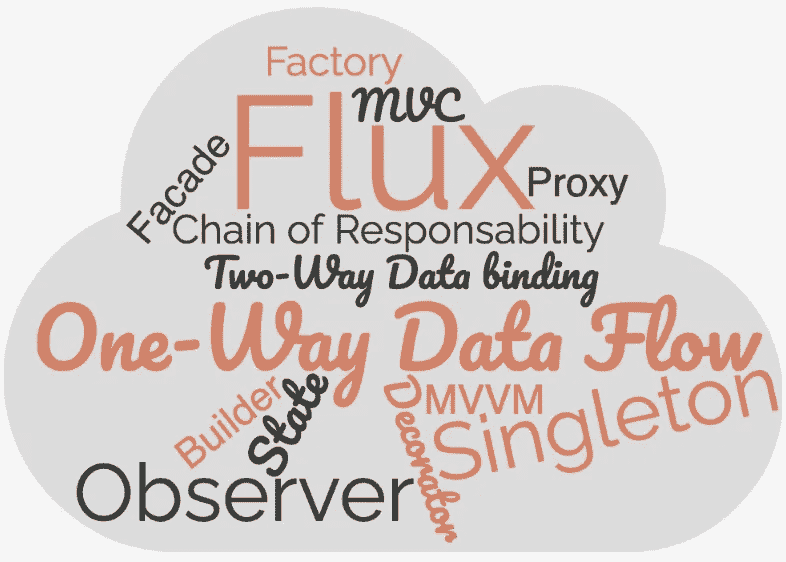

# 作为前端工程师保持相关性

> 原文：<https://betterprogramming.pub/stay-relevant-as-a-front-end-engineer-942e24dd70ff>

## 让自己与时俱进

我同意这很累人。

每年…实际上，每个月(或每天)都会发布一个新工具。我们一直受到新的库和框架的冲击。状态管理、CSS 处理器、表单、反应式编程等。

我还没学完一个框架，同一个的两个新版本就发布了！我们能做些什么来保持相关性？不管事情变化有多快，我们能做些什么来准备开始任何类型的项目？

没有“银弹”可以解决这个问题，但是有一些小技巧可以让我们通过不断学习这个令人筋疲力尽的挑战。

# **强基**

明白一件重要的事情:JavaScript 是你的朋友。

如果你是一名前端开发人员，并且不理解 JS 核心、JavaScript 运行时和 Web APIs 的复杂性，那么我需要告诉你还有一段路要走。

框架来来去去，基础永远不会改变。我知道，我知道……Angular 和 ReactJS 不会在不久的将来消失，但重点是:前端框架和库都是基于 Javascript 的。下一个将在市场上找到一席之地的流行框架将会是基于 Javascript 的。Typescript 是 Javascript 的超集。

经常听到一些开发人员说:“为什么我需要知道幕后发生了什么？我不会在工作中使用它。我从来不用它！”

这伤害了我的感情。直到一种“意想不到的行为”发生，人们才意识到真正深入理解一种语言有多么有用。

与其他语言相比，JavaScript 非常特别。有一个事件循环来处理异步调用，因为执行是在单线程上进行的。有闭包、执行上下文、原型链、被传播的事件、作用域等等。

很多 bug 的解决方法可以通过简单地理解那些主题来实现。有时候，只需快速浏览一下代码，就可以了:你知道为什么不工作了！

了解 JS 的一切看起来很可怕。可能吗？嗯，我不知道，但有可能尝试，我们应该这样做。但是从哪里开始呢？我会让你过得更轻松。[这里列出了你应该掌握的所有话题](https://zerotomastery.io/cheatsheets/javascript-cheatsheet-the-advanced-concepts/)。

太迟了！你已经读过了！没有更多的借口…你将不得不做一个清单，并一个一个地勾选主题。

# 关注概念

你有没有注意到，当一个新的库开始获得更多的关注并变得流行时，其他类似的库也开始发布。安托万·拉瓦锡曾经说过:“没有什么是丢失的，没有什么是创造的，一切都是变化的”。该死，他完全正确！

2015 年发布了当今使用最多的库:Redux。建议处理应用程序状态的解决方案。这是处理那些强制使用“双向数据绑定”的框架所造成的混乱的终结。公平地说，混乱是由开发人员造成的，而不是由框架造成的，但这不是这里的重点。

受 Redux 的启发，创建了另一个重要的库:NgRx。通常与 Angular 一起使用，由 RxJS 提供支持，这个库本质上是 Redux 的一个更丰富的版本。因此，市场上有两种主要的框架，通常与具有相同概念的库一起使用。

> 这里有什么问题？如果你理解了一些重要的模式，比如通量、观察者和状态，你只需要担心样板文件和语法(很容易研究)。

记得我上学的时候，看物理课，老师们都在时不时的重复着下面这句话:“不要试图去背公式，要学习公式背后的理论！”。我们大多数人都忽略了这一点，因为，当然，我们非常不成熟。孩子们。

当学习一个新的框架或如何使用某个库时，理解概念、创建该工具的动机、使用的模式等非常重要。

如果我们能理解 [flux](https://facebook.github.io/flux/docs/in-depth-overview) 为什么要记住 Redux 或 NgRx 使用的所有模板来使它们工作？一个库的特定功能或代码结构可以很容易地在互联网上、文档中找到。但是对这个概念的真正理解不是很快就能研究出来的。

> 一旦你理解了一个概念，你将很快学会应用这个概念的任何工具。

## 关注新技术趋势

你不需要在新工具一发布就不断学习它们。但至少你可以了解他们。

我该怎么做？以下是一些建议:

*   [JavaScript 的现状](https://2021.stateofjs.com/en-US/) —在这里你可以找到一些关于 JS 相关技术使用情况的数据分析。
*   [零到精通](https://zerotomastery.io/blog/)——一个有有趣文章的博客。另外，还有一个邮件列表(他们可以给你发送非常有趣的内容)。
*   [JSConf Youtube 频道](https://www.youtube.com/c/JSConfEU) —关注 JS 会议。这个比较有名，不过你也可以找找其他的。
*   [有趣的网络研讨会](https://www.youtube.com/c/ThisDotMedia/)

还有…做你自己的研究。除了有趣的模因，互联网上还有很多有趣的内容。

斯蒂芬·科斯马在 [Unsplash](https://unsplash.com?utm_source=medium&utm_medium=referral) 上拍摄的照片

# 管理自己

动机和时间管理是成功学习的关键。如何对越学越有动力？如何在忙碌紧张的一天里挤出时间？

## 为自己预定一些时间

使用你的日历工具，将你脑海中的一切下载到日历中。你参加的所有会议，你想完成的任务，以及留给自己的时间。一旦你用一些外部工具，在你的意识之外创造了事件，实现你的妥协的行为会变得更舒服。

## 提前计划你的学习

我记不清自己是什么时候决定开始学习的，但一旦开始，我就意识到自己不知道该学什么或从哪里开始。

制定一个计划。寻找与你想涉及的主题相关的东西。然后你保存你找到的内容，组织一个结构，你可以一个接一个地选择主题。如果你需要的话，优先考虑它们。这里有一个你可以使用的工具的建议:[特雷罗](https://trello.com/)。你可以在看板上组织你的主题，比如任务。

## 不要停止，做最少

定义你应该做的最小努力。当你完全停止学习时，很难恢复动力并重新开始，特别是如果你有一些学习没有完成。

创建你自己的规则。例:*每天至少 15 分钟，至少看一段视频，至少读一篇文章等。*

## 短期目标

有一个小目标的列表会更容易管理。试着分解目标，比如:“学习反应”。最好是制定一些小目标，在短时间内可以实现。

例如:“学习如何创建组件”、“学习如何在父子组件之间传递数据”等。

更有可能你会放弃巨大的目标。小目标让你保持高动力。它带给你完成一项任务的美好感觉。

时间会让你更了解自己。随着你获得经验，你会建立自己的资源清单，更有效地推动你的知识之路。

相信我，让自己跟上时代，养成学习和同步新技术的习惯，会给你的大脑带来非常好的愉悦感觉。