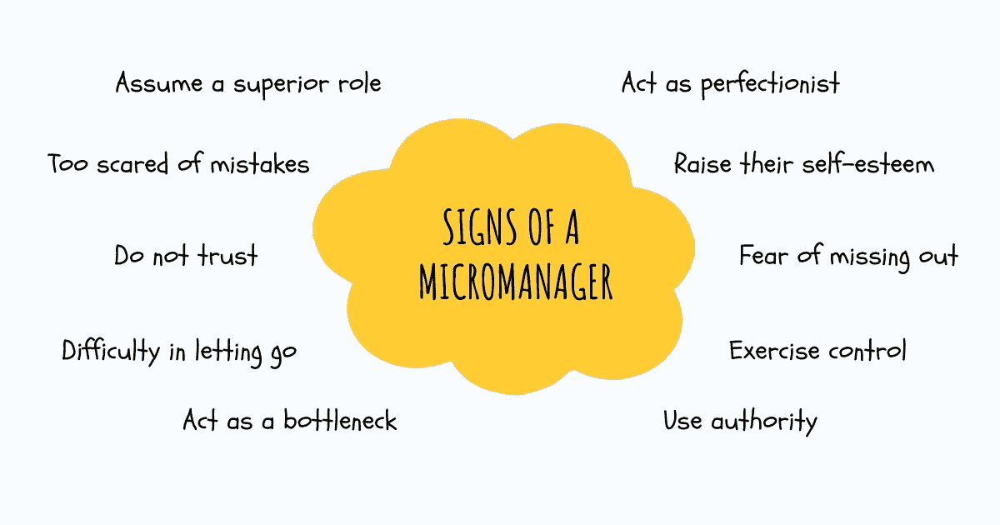
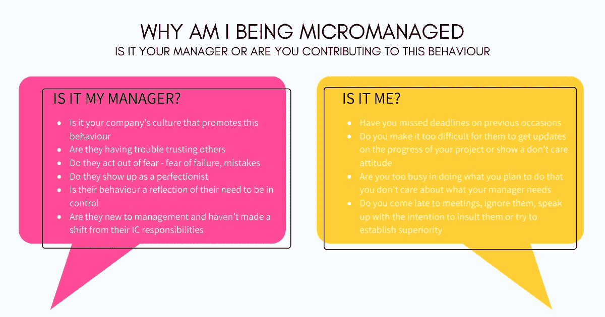
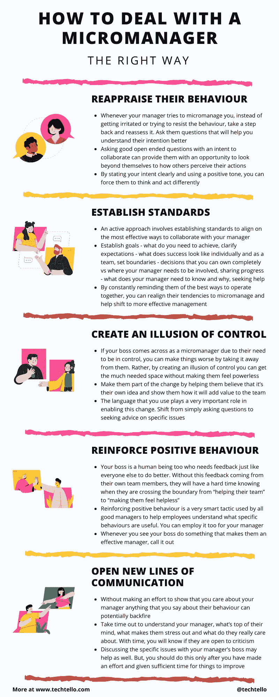

# 停止被微观管理

> 原文：<https://betterprogramming.pub/stop-being-micromanaged-d341c3838ab3>

## 识别信号并管理

鸣谢:作者

组织花费大量的时间和资源来雇佣聪明、有才华和自我激励的人——这些人对自己的成长和组织的成功表现出热情和承诺。

怀着贡献的愿望，这些人想要挑战现状。他们希望为问题设计出创造性的解决方案，并成为组织成功故事的一部分。他们都是从一个伟大的梦想开始的。

然而，只有少数人最终通过工作的影响找到了力量和满足感。有些人茁壮成长，而有些人勉强生存。

这不是他们能力的差异，而是如何运用这些能力。这是关于在监督和自主之间取得恰当的平衡。这是关于在对决策负责的同时要求清晰，获得处理风险的自由和成熟，以及拥有必要的工具和资源来建立其角色的能力。

经理和员工之间的关系以及他们对彼此的信任决定了他们的未来。在充满挑战的时期，他们如何相互支持，解决分歧，协调结果，并帮助彼此每天都变得更好？

我们都可能在工作中面临冲突，但与老板的 T2 冲突可能是我们压力和疲惫的最大来源。

如果一个经理触动了你的按钮，夺走了你的厚望，粉碎了你的创新欲望，阻止你做出最好的工作，那该怎么办？如果你有一个微观管理者呢？

# 为什么我觉得我的老板是个微观管理者？

鸣谢:作者

识别微观管理者的特征:

*   他们是团队决策的瓶颈。每一件小事都需要他们的批准
*   他们难以释怀。他们深入到每个问题的最微小的细节。
*   他们不相信团队中的人会按时完成工作，他们试图通过不断询问项目的更新来管理这种恐惧。
*   他们害怕错误，从不错过指出错误的机会，甚至在错误发生之前。他们的“不要做”清单阻碍了团队成员发展他们自己的批判性思维技能。
*   他们认为，除非他们督促员工并参与日常执行，否则工作无法完成，一切都会乱七八糟，因此他们扮演了一个优越的角色。
*   他们表现得像一个完美主义者，执着于以某种方式做事。
*   他们通过接手问题并亲自解决问题来提高自尊，而不是指导团队并帮助他们培养新技能。
*   他们害怕错过机会，并要求在所有的交流中保持消息灵通。
*   他们通过设定目标，然后规定如何实现这些目标来行使控制权。控制“什么”而不控制“如何”([战略对战术](https://www.techtello.com/strategy-vs-tactics/))会让他们紧张。
*   他们使用权威来定义项目时间表，而不是影响和帮助他们的团队成员学习项目规划技能。

评估这些行为需要仔细检查。与你的经理意见相左会助长你的[确认偏见](https://www.techtello.com/confirmation-bias/)，让你相信他们是个微观管理者，而他们实际上做的是他们工作的一部分。询问必要的工作进度更新，强调准时出席会议的必要性，介绍提高团队效率的流程，或者提出对项目成功至关重要的变更建议，这些都不会让他们成为微观管理者。

把自己的缺点归咎于经理，因为自以为是而拒绝合作，把自己的平庸表现归咎于经理，很容易表现得不负责任，逃避自己的缺点。看清事物的本来面目需要勇气。

所以，如果你真的认为你的老板是一个微观管理者，控制你的行为。你可以通过与你的经理建立沟通渠道来有效利用它，或者通过采取消极-积极的方法来摧毁它并关闭它。

迈出管理这段关系的第一步，改变你的方向，有意识地从问题转向你想要的结果。不要做一个[的受害者](https://www.techtello.com/how-to-opt-out-of-the-drama-triangle/)，而是扮演一个创造者的角色。

> 受责备的孩子是愤世嫉俗和绝望的。当我们相信自己是环境的受害者，屈服于宿命论的困境时，我们失去了希望，失去了动力，陷入了顺从和停滞。“我是一个棋子，一个木偶，一个齿轮，对此无能为力。你就告诉我怎么做吧。”如此多聪明、有才华的人感受到了这一点，并遭受随之而来的大范围的沮丧和抑郁。纵观历史，成长和希望的原则是发现“我是我生命的创造力量。”
> 
> —斯蒂芬·R·科维

# 为什么我被微观管理？

鸣谢:作者

微观管理是一个更大原因的征兆。没有理解*什么；*“是什么导致他们如此行事？”；你无法定义*如何；*“我怎样才能不再被微观管理？”。

坦率地问自己，“是我的经理还是我？”

## 是我的经理吗？

管理好并在表面下刮擦。你需要更多地了解你的经理和他们的心态:

*   公司文化会促进他们的微观管理行为吗？
*   他们是管理层的新人，还没有从他们的个人贡献者职责中转移出来吗？
*   他们看起来一直都很紧张吗？
*   他们很难信任别人吗？
*   他们的行为是出于恐惧吗——害怕失败、错误、不能按时交付？
*   他们是完美主义者吗？
*   他们的行为反映了他们需要控制吗？
*   他们能区分微观管理者和有效管理者吗？

参与和过于参与之间有一条细微的界限。

> 意图是无形的。我们从其他人的行为中推断出它们。换句话说，我们创造了他们，我们发明了他们。但是我们编造的关于他人意图的故事比我们想象的要少得多。为什么？因为人的意图是复杂的。有时人们带着复杂的意图行动。有时他们的行为没有意图，或者至少与我们无关。有时他们出于善意，却伤害了我们。
> 
> 道格拉斯·斯通

一些经理很难确定他们何时跨越了界限，从负责发展团队成员和促进业务增长，到表现得像一个只关心业务增长的人*。这种行为是无意的，他们没有意识到自己的行为对他人的影响。*

还有一些以自我为中心的经理，他们只是只顾自己——他们似乎不太关心别人或他们对别人的看法。他们以牺牲团队成员的痛苦和焦虑来完成工作为荣。这些经理完全是有意为之，因为他们认为这是管理员工的唯一方式。

## 是我吗？

做一点自我反省，试着理解是不是你自己的行为导致你的经理对你进行微观管理。深入思考这些问题，忠于自己:

*   你以前是否多次错过截止日期，导致你的经理比平时更谨慎、更投入？
*   你让你的经理了解你的项目进展吗？信不信由你，他们对你的团队和团队中的每个成员负责，按时完成工作也是他们的责任之一。因此，让他们了解项目进展情况是绝对必要的。如果你让他们很难获得这些更新，或者只是表现出一种“不在乎”的态度，你就助长了这种行为。
*   你是否尊重他们的角色，并试图找到帮助他们的方法？或者，你是不是太忙于做你计划要做的事情，以至于不关心你的经理实际上需要什么？构建一个很酷的功能可能是你的优先事项，但它可能不符合公司现在的需求。一个经理要求你“做正确的事情”不是微观管理。
*   你开会迟到吗？你会忽视经理的反馈吗？你不是寻求一致，你说话的唯一目的是侮辱他们还是试图建立优越感，也许是因为你是团队中的老成员或者比你的经理更有经验。你如何与你的经理沟通？

虽然你的行为并没有给予他们作为微观管理者的许可，但承认你对此有所贡献是有益的。我知道，这很难接受！

花时间观察你的经理是如何与其他人合作的。它们不同吗？

收集一些数据，然后决定——是你还是他们？

# 与微观管理者共事的正确方式

你可以做一个一厢情愿的思考者，等待你的经理做出改变，或者你可以运用你的批判性思维技能，掌控你的工作经验。

> 不要看事物的本来面目，而要看它们可能的样子。可视化增加了一切的价值。一个伟大的思想家总是想象未来能做什么。他没有被现在所束缚。
> 
> 大卫·施瓦茨

和一个难相处的老板一起工作不应该让你发疯或屈服于他们的做事方式。

从问题转移到解决问题，通过运用这些方法来引发解决问题的心态，给你和老板的关系带来积极的变化。

## 1.重新评估他们的行为

每当你的经理试图对你进行微观管理时，不要生气或试图抵制这种行为，而是后退一步，重新评估。问他们一些有助于你更好理解他们意图的问题。

带着合作的意图向你的经理提出好的[开放式问题](https://www.techtello.com/open-ended-questions/)可以为他们提供一个机会，让他们看到自己以外的其他人如何看待他们的行为。它甚至可以帮助他们评估实现相同结果的替代方法。

如果他们不断要求更新，通过这样的话与他们交流:“我知道我们需要按时交付这个项目。我可以向你保证我在这个项目上。您希望我何时以及如何分享最新动态和问题？这将帮助我更好地安排时间，专注于实现我们的共同目标。”

当他们参与讨论小细节时，迁就他们:“我认为讨论这些小细节是浪费你的时间，我希望你能相信我会处理好它们。我想有效地利用您的时间，讨论您可能有顾虑的其他领域。你有哪些值得现在讨论的问题？”

通过清楚地陈述你的意图并使用积极的语气，你可以迫使他们以不同的方式思考和行动。

## 2.建立标准

重新评估行为是一种更被动的、即时的方法。每当你注意到你的经理表现出微观管理的倾向时，它可以帮助你塑造想要的行为。

然而，积极的方法包括建立标准，以最有效的方式与您的经理合作。花些时间为自己制定出这些方面的细节，然后安排时间与你的经理讨论这些细节:

*   确立目标。你需要实现什么？
*   阐明期望。个人和团队的成功是什么样的？如果你的经理是一个完美主义者，在开始时定义质量参数将有助于你与预期的最终状态保持一致，并避免以后的挫折和返工。
*   设定界限。确保有些决定你可以完全拥有，不需要你的经理参与。如果他们想参与所有的决策，用积极的语气提醒他们时间的价值。
*   分享进步。你的经理需要知道什么，为什么？分享进展的最佳机制是什么——何时以及如何分享？讨论过于频繁地分享进展的潜在负面影响，以及如何利用这段时间在工作中取得进展。在讨论中多次提到“信任”这个词，提醒他们你有能力处理这项任务。
*   寻求帮助。安慰他们，告诉他们万一你在某项任务中遇到困难或者需要他们的帮助来取得进步，你会主动联系他们。询问“还有谁可以帮忙”可以为他们提供一个机会，推荐其他可能非常适合解除封锁的团队成员。想法是将他们的焦点从“我需要参与”转移到“还有谁能增加价值？”

> 阐明期望有时需要很大的勇气。表现得好像分歧不存在，并希望事情会有结果，这似乎比面对分歧并共同努力达成一套双方都同意的期望更容易。
> 
> —斯蒂芬·R·科维

像这样积极的讨论将有助于你更好地理解你的经理们的心态，并了解是什么原因让他们对你进行微观管理。

通过定期进行这样的讨论，并不断提醒他们合作的最佳方式，你可以重新调整他们微观管理的倾向，并帮助他们转向更有效的管理。

## 3.制造一种控制的假象

如果你的老板是一个微观管理者，因为他们需要控制感，你可以通过剥夺他们的控制感让事情变得更糟。

相反，通过制造一种控制的假象，你可以获得急需的空间，而不会让他们感到无能为力。

让他们成为变革的一部分，帮助他们相信这是他们自己的想法，并向他们展示这将如何为团队增加价值。你所使用的语言在促成这种变化中起着非常重要的作用。从简单提问转变为就具体问题寻求建议:

*   我知道你希望我有效地利用我的时间。当我集中精力工作三到四个小时而没有任何分心的事情时，我工作得最好，这些事情包括没有电子邮件、信息等等。你对我如何在工作中实现这一点并变得更有效率有什么建议吗？
*   我试图通过学习如何自己做出有效的决定来培养我的批判性思维能力。我知道培养这种技能需要时间，但我已经准备好面对挑战，并对结果承担全部责任。我想从错误中吸取教训，以便下次做得更好。有了你们的信任和支持，我有信心在这个领域成长，并在未来的职责中帮助团队。从你的经验来看，你建议我如何培养这项技能？

## 4.强化积极的行为

这么想吧——你的老板也是一个人，和其他人一样需要[反馈](https://www.techtello.com/feedback-rich-environment/)。如果没有来自他们自己团队成员的反馈，他们将很难知道他们何时跨越了“帮助他们的团队”到“让他们感到无助”的界限

强化积极行为是所有优秀经理使用的一种聪明策略，用来帮助员工理解哪些具体行为是有用的。你也可以和你的经理一起雇佣它。

起初，想到批评你自己的经理可能会令人生畏，但只要稍加练习，你就能做到。

每当你看到你的老板做了一些让他们成为[高效经理](https://www.techtello.com/do-you-really-want-to-be-a-manager/)的事情，大声说出来:

*   我真的很感激你对我的信任。].它帮助我做[…]
*   由于您在[…]的支持，我能够按时完成这个项目
*   我能够按照我们商定的那样，通过多做[……]而少做[……]来有效地利用我的时间

## 5.开辟新的交流渠道

如果不努力表现出你关心你的经理、他们的优先事项以及愿意以有助于他们成功履行职责的方式做出贡献，你对他们行为的任何评论都可能适得其反。

你的经理可能会说他们乐于接受反馈并鼓励批评，但就像其他人一样，如果不相信你把他们的最佳利益放在心上，他们将很难与现实联系起来。

> 如果没有被理解的感觉，人们几乎不会改变。
> 
> 道格拉斯·斯通

这来自于建立信任。花时间去了解你的经理——他们在想什么，是什么让他们感到压力，他们真正关心的是什么？这并不意味着你屈服于他们的微观管理行为。它只是意味着，只有在你花了足够的时间更好地了解它们之后，你才会采取行动。

随着时间的推移，你会知道他们是否接受批评。抓住机会与他们谈论具体的行为，它们如何影响你，以及可以做哪些改变来帮助你们更好地合作。

在某些情况下，与你经理的老板讨论具体问题可能也会有所帮助。但是，你应该这样做，只有在你已经作出努力，并给予足够的时间来改善事情。

最后，整个事情可能会失败。有些经理真的很难共事，尽管你尽了一切努力，也不会有什么改变。你最好决定是否应该尝试改变你的团队，甚至考虑外部的机会。

# 如何不与微观管理者共事

没有人喜欢被微观管理。但是对这个问题的消极态度不会让它消失。一些与微观管理者共事的错误方式包括。

## 战斗或逃跑反应

你试图通过与他们争论，在别人面前侮辱他们，甚至拒绝做对你的老板的工作很重要的事情来对抗这种情况。你试图表现得强硬，但却是以一种错误的有害的方式。这会让你的老板反感你，让问题进一步恶化。

或者…

你没有勇气去战斗，而是选择逃跑。你试图通过忽略他们的行为来逃离这种情况，并尽你最大的能力做好你的工作。尽管你老板的行为继续困扰着你，但你却无动于衷。这不仅会影响你的工作效率，还会导致工作中不必要的压力和焦虑。

## 在他们背后说话

你通过和你的同事谈论你的老板，说他们的坏话或者在背后向他们的经理抱怨来发泄你的沮丧。

你的经理很快就会发现。你大概能猜到结果会怎样。

没有人想出于 T2 的恶意充当微观管理者，也没有人想被微观管理。只有通过行动，你才能改变现状。为了更美好的明天，现在就行动吧。

你从和微观管理者一起工作或者成为一名微观管理者中学到了什么？

# 摘要

鸣谢:作者