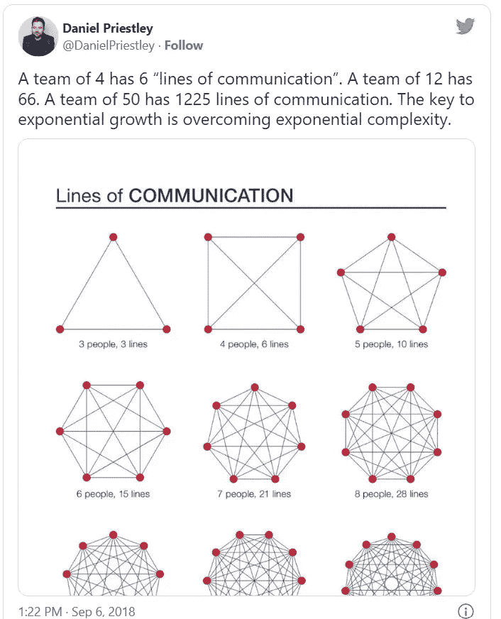

# 停止在工作中直接发信息。相反，创造开放和有效的沟通渠道

> 原文：<https://betterprogramming.pub/stop-direct-messaging-at-work-instead-create-open-and-effective-communication-streams-e55a7dbfb761>

## 保持最少的通信线路

照片由 [Pixabay](https://www.pexels.com/photo/close-up-photography-of-yellow-green-red-and-brown-plastic-cones-on-white-lined-surface-163064/) 拍摄

在过去的三年里，作为我当前团队中的一名开发人员，我注意到我已经成为团队中的问题、观察和帮助的关键人物。起初，我喜欢被称为知道答案的人，但我很快意识到我在重复自己，导致额外的上下文切换和时间消耗。

我意识到，通过与单个团队成员或产品经理讨论解决方案，我正在创造孤立的知识。我意识到，我需要将这些对话转移到更多的公共论坛上，以帮助建立一个联系更紧密、效率更高的工程团队。

私人信息阻碍了沟通在团队中的传播，减缓了知识的传递。如果团队成员不同步，那么一定会发生错位，这会导致错误、事故和停机。

这是一个很好的信息图，展示了恰当沟通的重要性。丹尼尔·普里斯特利向我们展示了直接沟通是如何导致不必要的复杂性的。当这些线中的任何一条断开时，上下文就丢失了。有些时候，直接信息是保密的，但需要理解的是，如果信息是相关的，甚至对其他成员是有用的，它应该被共享。当收到直接信息时，礼貌地要求将这些问题转到团队应该已经建立的指定渠道。

公开讨论将对话保留在搜索历史中，因为我们不会永远留在团队中。未来的开发人员将能够理解为什么要做某事，或者对某个错误或特性有更深入的了解。

一致的团队知识不是公开渠道沟通的唯一好处；它也允许工程师之间更多的合作。你询问的人可能没有最佳解决方案。我们都来自不同的背景，拥有不同的知识体系，可以借鉴他人的观点，甚至从他人的角度发展出一种解决方案。

有时我们想要一个快速的回答，或者担心问一个愚蠢的问题。我对此深感内疚，并提醒自己要遵循自己的原则。我以前没有意识到我的问题会对我的整个团队传播知识产生更大的影响。因为害怕问一个愚蠢的问题和承认不知道一些事情，在一个 100 人的松弛频道中抛出一个问题可能是令人生畏的，但只要我们事先勤奋地研究我们的问题，那么你的团队将很乐意提供帮助。

在《实用程序员》一书中，有一章是关于复制和应用 DRY(不要重复自己)原则的。这本书解释了 DRY 原则不仅仅是代码；是关于知识复制的。

> "也许最难检测和处理的重复类型发生在一个项目的不同开发人员之间."

上面的引文指的是作者所说的开发者之间的重复。当团队不沟通时，重复是不可避免的。这本书参考了美国政府对其计算机系统的审计，发现了 10，000 个程序，每个程序都使用自己的社会安全号码验证。这是沟通失败的一个很好的例子，知识没有在开发人员之间传递，不仅仅是在团队的基础上，而是在组织的层面上。同样的原则也适用于你的团队。

在我的公司工作几年后，我被提升为高级工程师。我可以把这部分归因于遵循开放的交流规则。这将提高利益相关方的可见性，有助于展示影响和价值。将对话转移到公共渠道有利于团队，并有助于推动您的职业发展，因为您被展示为一名合作者和领导者。

最后，对我来说，最重要的是可搜索性。我已经提到，当我们有问题时，我们应该尽职调查，以确保答案尚未被提及。假设团队有一个现代的消息传递系统(Slack，Teams，等等。)，我们应该能够通过搜索讨论来找到之前所提问题的答案。这将节省团队等待响应的时间，因此我们可以保持高效，并继续执行我们的任务。

所有这些原因就是为什么公开我们的私人信息如此重要。如果每个人都遵守这个规则，我们可以将那些指数级的交流减少到一个可管理的水平。即使我们去了更好的地方，知识也能传承下去。