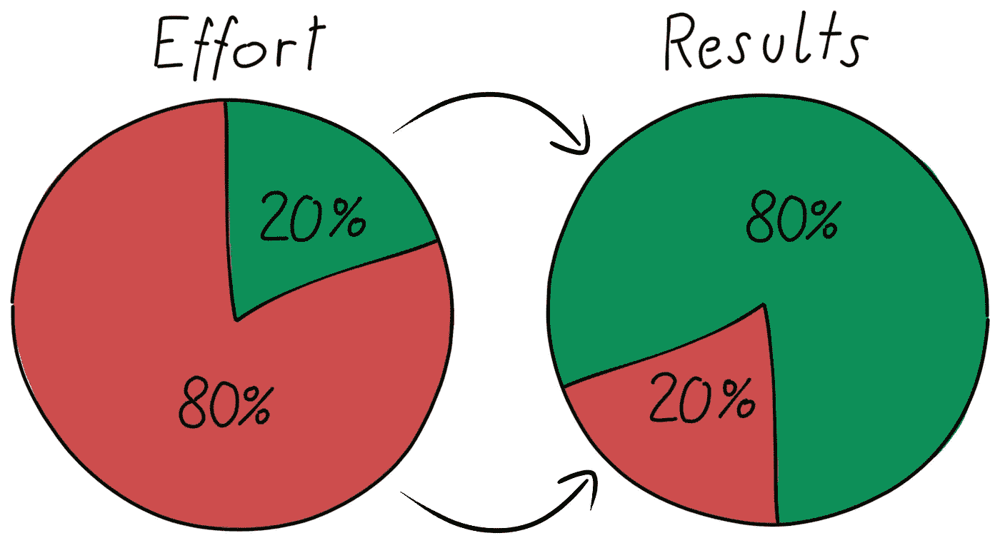

# 停止雇佣软件工程师

> 原文：<https://betterprogramming.pub/stop-hiring-software-engineers-8545520437ac>

## 考虑产品工程师


[拉拉·阿兹利](https://unsplash.com/@lazizli?utm_source=medium&utm_medium=referral)在 [Unsplash](https://unsplash.com?utm_source=medium&utm_medium=referral) 上的照片

好吧，我知道，这个标题听起来很大胆，但是这篇文章不是关于你的开发团队的外包或者增加顾问，一点也不是。

最近看了几篇关于“ **10x 开发者”、**的文章，看的都很有见地；无论如何，我读到的大部分都是从一个**工程** **观点**中获得的——他们经常谈论初级与高级、工具、删除代码、能力等等。所有的观点都是正确的，但是我想给出一个稍微不同的角度。

# 产品工程师

软件工程师有一个子集:这些是(软件)产品工程师，很可能是你真正应该寻找的人。

产品工程师(从现在开始的 PE)在面试过程中很容易被识别，我们将在后面讨论一些共同的特质。

作为软件工程师，我们很少在技术领域工作；我们大多在其他领域结束，改进技术以支持业务，其中我们可以提到金融科技，汽车，保险，航空航天，医疗，旅游，电子商务等。当一个软件工程师进入一个新的领域时，他会带来一个能力工具箱:编程语言、算法、框架、工具、模式等等。

最有可能的是在面试中，你评估某人是否精通使用 Scala，如果那是你公司的编程语言，或者他们是否知道 Kafka，Redis 和 Cassandra，如果你正在使用它们；事实证明，通常情况下，你最终会雇佣拥有技术团队所需技能的人。恭喜你，你很可能为你的团队雇佣了一个伟大的软件工程师，但是也许检查一下是否有 PE 特征是值得的。

那么什么是 PE 呢？这与职位高低无关，也与技术无关:这完全与产品开发和所有权有关。一个真正的 PE 明白他的主要精力必须放在产品改进上，所以会专注于试图理解动态、过程和核心概念的领域。

# 传递价值！

PE 痴迷于传递价值；他们拥有(或将获得)技术产品和相关流程的全部所有权。

PEs 不会真的关心从一种技术迁移到另一种技术，除非这背后有商业价值。

PE 不要在筒仓中思考，他们想要一个完整的图片来了解哪里需要改进。他们会去与公司的其他职能部门交谈:从营销到客户服务，以便收集完整的产品知识(是的，即使他们在 DDD 工作，环境也是有限的)。

PEs 将负责生产环境，表现得好像没有什么比这更重要:在发生事故时停止任何其他活动。

PEs 喜欢帕累托原则:



维尔弗雷多·帕累托:80%的工作是通过 20%的努力完成的

# 问很多问题

想象一下在 backlog 中有这样一个条目，标记为技术债务:

"通过索引 K 将函数 X 的执行时间减少三分之一"

这很重要吗？这是“真实”的技术债吗？任何工程师都很可能告诉你修复它很重要，因为作为工程师，我们痴迷于改进、重构等。

产品工程师很可能会试图理解它是否交付了价值
“时间的减少对任何利益相关者有积极的影响吗？”
“这会让我们客户的生活变得更好，减少他们的等待时间吗？”“这会显著降低平台成本吗？”

如果优化纯粹是技术性的，那么它是最低优先级

不要误解我的意思:PEs 非常关心代码的可维护性、设计原则和重构等概念——但是他们总是会平衡前面提到的“价值交付”的每一个改进。

“这种变化是促成因素吗？”
“如果我们转向这种模式，我们会更快地适应其他业务需求吗？”

# **我的 2 分钱:2 行代码**

我一直在几个行业工作，写了几千行代码，开发了几个我引以为豪的产品和功能，总之下面两行代码引起了最大的共鸣:

```
if (text.trim().length() <= 2) 
    text = ""
```

最初级的开发人员，甚至是第一次接触编程的学生，都能够编写这样的代码。一点上下文。

我在一家在线旅行社(OTA)工作，作为一个团队，我们负责航班的结账阶段。有一天，我组织了一次与客户服务团队的电话会议，试图了解他们的痛点，客户服务主管准备了一张幻灯片，列出了他们面临的所有问题:其中一个条目是“**手动预订**”。

作为一家 OTA，你的目标是，无论何时，只要顾客在买东西，向航空公司或任何其他第三方完成的过程不需要任何人工干预。无论如何，一些预订最终会进入手动模式(例如，没有空房，价格上涨，等等)。所以你需要一个操作员来处理这件事。**15%的人工预订**，被标记为“**特殊请求:来自最终客户的错误输入**”——在网页上，有一个文本框，标题为:

在此填写您对航班的任何特殊要求。

当您预订航班时，您可能会有一些特殊要求，如运输动物或贵重物品，因此您希望有人在购买机票前确认您可以这样做。
长话短说:一些用户被弄糊涂了，他们在文本框中写了“ *NO* ”或者他们添加了一个“或一系列空白。
将预订设置为手动模式的逻辑是:“如果文本框中有内容，则将其分配给操作员”。

会议结束后，我立即来到我的笔记本电脑前，添加了两行代码，引入了几个测试来验证，并发布到产品中。一个月后，我被邀请参加一次高管会议，会上我因高效解决了一个巨大的公司问题、节省了大量资金并提供了更好的客户体验而获奖。
是的，这 2 行代码执行了以下操作:

*   减少人工预订的数量
*   改善顾客体验，在结账完成后立即确认
*   降低人工处理时间导致的价格上涨或不可用的风险

# **不是我的问题，是别人的问题**

在会议结束前，我试图了解客户服务主管过去是否联系过任何人来解决此类问题，我对答案感到非常惊讶！”*这不是工程问题。这是一个用户体验问题，UX 团队应该解决这个*”，她回了一句，但当她试图联系 UX 团队时，他们正在重新设计整个收银台，因此当前的设计没有任何改进的空间。

一个公司问题已经存在了几个月，却没有人去解决。

这两行代码在网上保留了几个月，当新设计发布时，问题通过一个复选框得到了解决:

"*如果您对航班有任何特殊要求，请点击此处*"

单击复选框会使文本框出现。

# **范围和界限的区别**

前面提到的例子建立了区分范围和边界的空间。

问题的解决方案是否超出了纯工程的范围？是的，毫无疑问。

从公司的角度来看，正确的解决方案是否可以接受？
我个人不这么认为。再等几个月，让 UX 解决这个问题，从各方面来看都会花费很多，但对于工程来说，一个人花 30 分钟就能修好。一个人的界限远远大于他们所涉及的角色范围，不管他们是在软件开发、数据或测试，还是平台工程。这是一种思维模式，你总是专注于你的产品和你的客户，而不是技术和范围。这一概念适用于公司的每一个职能部门，而不仅仅是技术部门。

# **10x 工程师**

我在这个领域工作了 15 年，在几个行业中，我遇到了不到 30 个可以称之为产品工程师的人。

我遇到过令人惊叹的工程师，他们中的一些人在技术上令人惊叹，比任何 PE 都更有能力，但他们中没有人能像 PE 一样提供如此多的价值。

我觉得 PE 就是 10x 工程师。

# 我们真的应该停止雇佣软件工程师吗？

视情况而定:每件事都必须联系具体情况。

如果你的公司正在开发一个产品，你可能应该寻找 PE 特性，无论如何，许多开发人员选择这个职业是因为他们热爱技术，他们对其他领域并不真正感兴趣。他们希望建立管道、建立基础设施、实现自动化，并与尖端技术合作。

在许多现实中，这些软件工程师要么在平台领域工作，要么在“开发经验”领域工作，做纯粹的技术工作，试图改善开发人员的生活。

# 我们如何改变我们的面试过程

找 PE 很难，所以你不要缩小你的初始漏斗。

在我现在的雇主 iptiQ，我们改变了我们的面试流程，以便有最好的机会找到顶级玩家:

*   我们不要求任何具体的技术知识(没有 *Spring Boot* 、 *DynamoDB* 、 *Redis、*等，即使我们使用这个堆栈)
*   我们接受来自任何编程语言的开发人员，即使我们的代码库是用 *Kotlin* 编写的(我们做一个编码测试，要求这个人用他们最喜欢的编程语言来解决它)
*   我们评估一般解决问题的技能
*   我们寻找一个关心产品、在技术领域之外提问的人的特质

我们这样做是因为我们认为每个人都可以学习一门新的编程语言或框架，但很难教如何成为一名 PE。