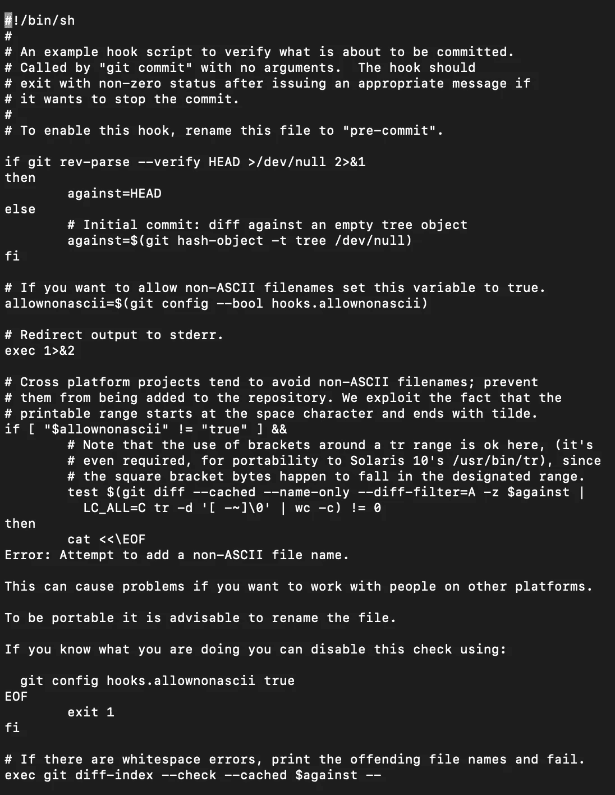

# 停止让垃圾代码进入你的仓库

> 原文：<https://betterprogramming.pub/stop-letting-crappy-code-into-your-repos-97cb69507e7b>

## 利用 git 挂钩和预提交来提高回购质量


照片由[西格蒙德](https://unsplash.com/@sigmund?utm_source=medium&utm_medium=referral)在 [Unsplash](https://unsplash.com?utm_source=medium&utm_medium=referral) 上拍摄

我在各种各样的公司中都见过这种情况。从财富 500 强到小型创业公司，每个人似乎都错过了确保你的代码库不会被糟糕和失败的提交所污染的第一步。这就是 git 提交钩子。

# 什么是 Git 挂钩？

Git 挂钩允许您在不同的 git 事件上触发定制代码。一个常见的用例是在允许提交通过之前运行 linter。您可以通过访问`.git/hooks/`查看回购中的一些挂钩示例，并查看所有以“”结尾的挂钩。样本”。

有两类挂钩。本地和服务器端。我们将只讨论本地的问题，因为我觉得这是最没有实现价值的地方。

下面我有一张`pre-commit.sample`的截图。如果你和我一样(不喜欢 shell 脚本),那么下面的代码看起来很吓人……所以我们不打算用它！



。git/hooks/预提交. sample

有三个原因我们不打算为我们的钩子使用内置的 shell 脚本。首先，它们不能被签入版本控制。有一个变通方法允许签入 git 挂钩，但是这涉及到修改你的全局`core.hooksPath`，这是不可持续的。大多数回购协议不会同意钩子应该在哪里，所以最好不要经常修改钩子的路径。

第二个原因是 shell 脚本不是大多数人想学的东西。你已经知道了足够多复杂的语言。Shell 脚本通常不是人们想学的东西。

最后，这是一个大问题。不能分享或分发挂钩。你真的需要把你的钩子从一个项目复制到另一个项目。这是大量的代码重复。这将使更新所有存储库的钩子成为一场噩梦。这就是预提交的用武之地。

# 预提交—可持续的解决方案

Pre-Commit 是一个允许我们使用和分发 git 钩子的库。虽然它是用 Python 编写的，但它能够调用任何可执行程序，这意味着你可以从一个地方配置所有的钩子。

使用预提交就像这样简单:

```
python -m pip install pre-commit
pre-commit install
```

然后你只需要在你的库的根目录下创建一个`.pre-commit-hooks.yaml`文件。这个钩子文件描述了预提交在哪里可以找到它需要运行的提交钩子。下面是这个样子的一个例子。

```
repos:
-   repo: https://github.com/pre-commit/pre-commit-hooks
    rev: v2.3.0
    hooks:
    -   id: check-yaml
    -   id: end-of-file-fixer
    -   id: trailing-whitespace-   repo: [https://github.com/Yelp/detect-secrets](https://github.com/Yelp/detect-secrets/)
    rev: v1.1.0
    hooks:
    -   id: detect-secrets
        args: ["scan"]- repo: [https://github.com/dtaivpp/commit-msg-regex-hook](https://github.com/dtaivpp/commit-msg-regex-hook)
  rev: v0.1.0
  hooks:
    - id: commit-msg-hook
      args: ["--pattern='[A-Z]{3,4}-[0-9]{3,6} \\| [\\w\\s]*'"
      stages: [commit-msg]
```

它是这样工作的:在第一次运行时，pre-commit 将钩子下载到它们自己的带有标记版本的虚拟环境中。然后，它将对已更改并正在签入的文件运行它们。如果您更新“rev”来升级版本，在下一次运行时，它将下载新版本来检查您的代码。

配置中的第一个 repo 将验证 YAML，以确保其格式正确。然后，它将修复文件的结尾，并删除任何不必要的尾随空白。这些只是代码清理步骤。

接下来，Yelp detect-secrets 将运行并检查以确保您没有将任何密钥或秘密签入到您的回购中。它熟悉许多不同的令牌类型，甚至可以通过查找高熵字符串来检测密码。在秘密被提交之前发现它们是非常重要的，因为一旦它们被提交，就很难清除你的 git 历史。

最后，`[commit-msg-regex-hook](https://github.com/dtaivpp/commit-msg-regex-hook)`将检查并验证我指定的提交消息是否与提供的正则表达式模式匹配。当我制作这个插件时，我对这一步感到特别自豪。

注意:为了能够运行这个，您需要运行`pre-commit install --hook-type commit-msg`。这个钩子是一个提交消息钩子，它被安装在一个不同于常规预提交钩子的钩子文件中。

# 预提交—高级用法

也可以添加任意数量的插件。如果它有一个可执行的预提交能够使用它。

## 林挺·胡克斯

预提交的一个常见用例是自动林挺您的文件。对于 python 来说，你可以使用下面的代码自动运行`pylint`,如果你的 linter 给你的代码打了 8 分，它会让你的提交失败。它将给出林挺的输出，并告诉您需要改进的地方以获得更高的分数。

```
-    repo: git://github.com/pycqa/pylint
     rev: pylint-2.6.0
     hooks:
     -   id: pylint
        args: ["--fail-under=8"]
```

## 类型检查/配置验证

如果你正在使用一些严重依赖配置文件的工具，比如 Kubernetes、CircleCI、Ansible 等。您可能经历过这样的挫折:签入代码却因为没有键入变量名或缩进被关闭而失败。

预提交在这里会有所帮助。这些工具中的许多都提供了检查这些文件类型的实用程序。例如，使用 CircleCI，您可以使用命令`circleci config validate`。这可以作为一个预提交钩子添加进来，这样在每次提交之前，你可以知道你的配置文件是有效的。下面是一个预提交钩子，可以帮助验证 CircleCI 文件。这个提交钩子归功于[狗头金属](https://github.com/KoBoldMetals/pre-commit-circleci)。

```
-   repo: http://github.com/KoBoldMetals/pre-commit-circleci
    rev: v0.0.4
    hooks:
    -   id: circleci-validate
```

至此，您已经准备好提升您的开发人员体验，您的公司将会感谢您，因为您的回购现在将具有更好的安全性、更少的失败提交，以及整体更高质量的代码。