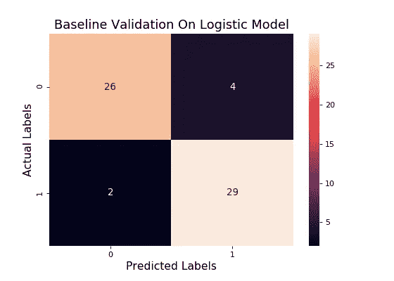
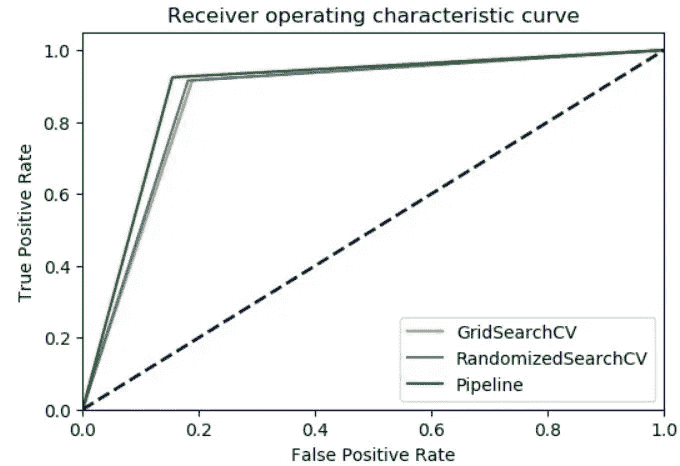

# 简化模型选择

> 原文：<https://betterprogramming.pub/streamlining-model-selection-de50c421d129>

## 针对分类问题的更简单的调整/模型选择过程

照片由[阿迪·戈尔茨坦](https://unsplash.com/@adigold1?utm_source=unsplash&utm_medium=referral&utm_content=creditCopyText)在 [Unsplash](https://unsplash.com/search/photos/dials?utm_source=unsplash&utm_medium=referral&utm_content=creditCopyText)

# 介绍

如果你做过任何数量的预测建模，那么你知道这个过程的很大一部分是计算出从看似无限的杠杆中选择哪一个来返回可能的最佳模型。有时，将数据放入一个基本的决策树或逻辑模型中并就此收工太容易了，而不是进行必要的(也就是乏味的)调整，以确保您的模型在预测能力方面至少有些用处。然而，你几乎永远也不会在现实世界中找到可以简单地投入分类算法并返回 95%准确率的数据。现实世界的数据要求我们做出明智的决策，并在构建可产生可操作结果的预测模型时密切关注。幸运的是，像 GridSearchCV、RandomizedSearchCV 和 Python 的 scikit-learn 库中的管道这样的工具使整个过程变得不那么乏味和繁琐。

# 第一步

当我遇到分类问题时，我的直觉通常会引导我创建一个基本的逻辑模型(我知道，对我来说这不是一个好主意)，作为我后来适合的模型的基线比较。在拟合训练数据和验证测试数据(使用 scikit-learn 的`train_test_split`函数)之后，我将查看我的预测的准确性和混淆矩阵，以可视化错误分类，因为可能有相当多的错误分类:

# GridSearchCV

接下来是 GridSearchCV。它之所以如此有用，是因为您可以指定某些超参数，它会自动拟合模型，从而获得最高的精度。超参数是一种告诉分类算法(如逻辑回归)如何改进自身并产生更好结果的度量。特别是对于逻辑回归，我们可以指定反正则化参数 C、正则化惩罚(L1 或 L2)以及用于计算分类的求解器。其他算法，如随机森林和支持向量机，有更复杂的超参数，可以在 scikit-learn 文档中找到。

GridSearchCV 函数将获取用户指定的超参数的字典，然后运行每个可能的组合，以便通过使用 k-fold 交叉验证来训练和测试数据，从而产生最佳模型。在下面的代码片段中，我将这个过程简化为函数`perform_gridsearch`。作为参考，您可以在函数底部的打印语句中看到适合模型的优化参数。

在这个过程的这一部分，您将开始注意到时间和质量之间的权衡。增加超参数和 k 倍的数量可以非常快速地增加运行时间，但最有可能产生更精确的模型。我还建议你要意识到由于过多的交叉验证而过度拟合你的模型的危险。下图展示了模型因过度训练而无法归纳其他数据时出现的训练和验证错误模式。

# 随机搜索

与 GridSearchCV 类似，RandomizedSearchCV 也通过超参数规范简化了模型选择/参数调整过程。然而，它不是列出每个超参数的显式值，而是从输入的范围/分布中取随机值(因此命名为 RandomizedSearchCV)。如果您没有任何特定的超参数值，这种方法可能比 GridSearchCV 函数更可取。下面的模块化函数与 GridSearchCV 对应的函数非常相似，但您可以看到，抵消套索和山脊惩罚的反向正则化参数 C 现在已定义在均匀分布上，以纳入随机选择方法:

根据我的经验，RandomizedSearchCV 和 GridSearchCV 在模型准确性上的差别并不大，但是如果您不明确知道您要测试什么，这可能会更容易。

# 流水线和预处理

这里有一个场景:假设我们使用了所有这些不同的模型选择/参数调整方法，我们仍然对我们的结果不满意(并且可能不确定我们是否使用了正确的算法)。我们如何知道接下来要测试什么模型和相应的参数？当你想测试一大堆不同的算法和超参数时，流水线是完美的。不是只传递一个分类算法和一组超参数，而是可以传递尽可能多的参数到管道中(只需记住时间-质量的权衡)，并获得给定输入的最佳可能模型。下面是管道函数的代码:

我向管道函数传递了一个 GridSearchCV，但是如果您愿意，也可以轻松地插入一个 RandomizedSearchCV。指定分类器和超参数的语法在流水线中与 GridSearchCV 稍有不同，但是它导致了一个更加简化的过程。我还要警告你，流水线操作可能比前面的任何方法都要花更长的时间，尤其是如果你包括随机森林，因为它们是计算密集型的(增加每个森林中的树的数量会使你的运行时间暴涨)。

管道非常有用的另一个原因是，除了选择模型之外，它还会为您预处理数据。正如您可以将多种类型的模型传递到管道中一样，您也可以通过预处理选项传递不同的特征选择方法(即 k-best 特征、主成分分析)。我不会过多地讨论它，但是特征选择可能与模型选择一样重要，尤其是当您的数据带有大量特征时。你可以在这里阅读更多关于特征选择方法[。模型/特征选择的双重打击就是为什么`Pipeline`函数如此有用，即使你首先知道你想使用哪种算法。](https://medium.com/@madelinemccombe/intro-to-feature-selection-methods-for-data-science-4cae2178a00a)

# 结论

事实上，Pipeline 确实给了我们明显更好的结果，即使数据集相对较小

一般来说，这些交叉验证/管道技术绝对是建模的必由之路。我保证他们会帮你节省很多时间和挫折。只是要警惕你一次交叉验证了多少，否则你可能会发现自己在电脑前坐了 30 分钟，而它却适合成千上万个模型。如果你喜欢这些内容，记得击碎拍手按钮并跟随😤。

# 关键词

逻辑回归——一种统计模型，其基本形式使用逻辑函数来模拟二元因变量

超参数—其值在学习过程开始前设置的参数

正则化-一种用于防止统计模型过度拟合的机器学习技术

预处理—数据预处理是一种数据挖掘技术，涉及将原始数据转换为可理解的格式

管道-用于帮助自动化机器学习工作流