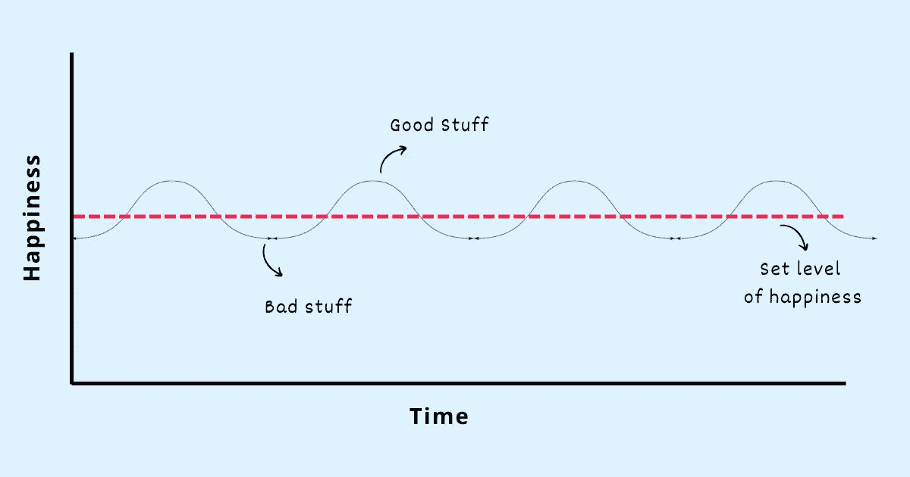

# 被困在快乐的跑步机上？以下是逃避它的方法

> 原文：<https://betterprogramming.pub/stuck-on-the-hedonic-treadmill-heres-how-to-escape-it-fa000bc3a812>

## "总是想要比我们拥有的更多，我们跑啊跑啊跑，就像轮子上的仓鼠一样."

鸣谢:作者

不断渴望改善我们自己和我们的生活状况，寻求更好的生活，或追求快乐，是人类不断繁荣的原因。但这也让我们踏上了快乐的跑步机，不断追逐下一个大目标。

我们设定[目标](https://www.techtello.com/goal-setting/)和期望——获得下一次升职，完成一项复杂的任务，或者完成一个真正的大项目。我们跑着去获得那些东西，经常在醒着的每一个小时工作，走极端去改善自己，一路上想象着当我们实现这个目标时会有多快乐。

但是一旦我们成功了或者到达了目的地，这种感觉不仅仅是兴奋，更多的是一种解脱——结束了导致这一刻的所有努力。快乐——如果它真的出现了——也只是短暂的，通常持续几个小时、几天，有时甚至一周。

在我们知道之前，我们又回到了追逐下一个大目标的跑步机上——一个更大的目标，一个更好的责任，或者任何能让我们更快乐的事情。我们再次跑步，我们为自己设定了一个新的目标，却以我们的基线——我们设定的幸福水平——结束。心理学家布里克曼和坎贝尔在 20 世纪 70 年代创造的术语“快乐跑步机”或“快乐适应”表明，不管生活中发生了什么，大多数人都会回到他们的基本幸福水平，无论是积极的还是消极的。

乔纳森·海特说这让我们停留在享乐的跑步机上:

> “在跑步机上，你可以随心所欲地提高速度，但你会停留在原地。在生活中，你可以想怎么努力就怎么努力，想积累多少财富、果树、小妾就积累多少，但你不能出人头地。
> 
> 因为你不能改变你的“自然和平常的平静状态”，你积累的财富只会提高你的期望，不会让你比以前过得更好。然而，我们没有意识到我们的努力是徒劳的，我们继续努力，同时做一些有助于我们在生活的游戏中获胜的事情。
> 
> 总是想要比我们拥有的更多，我们跑啊跑啊跑，就像轮子上的仓鼠。"

虽然我们都有一个设定点(出生时由基因编码),占我们幸福倾向的 50%,但仍有很多改进的余地。即使你是一个容易悲伤或抑郁的人，你也不是注定永远不会快乐。足足有 40%的幸福在你的控制之下，剩下的 10%是你无法控制的外部环境。

有了正确的策略，你可以逃离快乐的跑步机。

# 逃离快乐跑步机的 3 个策略

## 享受旅程，而不是目的地

想想跑马拉松的目标。到达终点线会带来一种强烈的解脱感，就好像一个重担从你的肩膀上卸下来了，但这种快乐感只是短暂的。将这种转瞬即逝的快乐与你每一步都感受到的喜悦相比较——每接近你的目标一步都会带来一种进步感，这种进步感通常更有回报和成就感。

当谈到目标追求时，我们都把目光放在最终结果上，而没有意识到过程比目的地更有价值。朝着我们的目标前进的每一小步，让我们更接近目标的每一小步，以及每一步都很重要。快乐是在进步中，而不是在得到我们想要的东西时。这种体验非常类似于乘坐过山车，刺激是在乘坐开始时产生的，而不是在刹车和到达终点时产生的。

然而，大多数人错过了沿途感受那些纯粹快乐时刻的机会，因为他们一直将快乐推迟到稍后阶段——等待到达终点线，而不是看着他们现在已经拥有的东西。

心理学家理查德·戴维森指出，当试图实现某个目标时，会产生两种积极的效果:

1.  目标达成前的积极情绪是当你朝着目标前进时所获得的愉快感觉。
2.  一旦你实现了你的目标，积极的情绪就会出现。

研究表明，前目标的实现更持久，而后目标的实现只是短暂的。

乔纳森·海特称之为进步原则:

> “快乐更多地来自朝着目标前进，而不是实现目标。成功的最后一刻通常不会比在长途跋涉结束时卸下沉重的背包更令人激动。如果你去远足只是为了感受那种快乐，那你就是个傻瓜。”

## 对你所做的表示感激，而不是你没有的

我们没有从小事中找到快乐——第一次学习如何做某事，在工作中得到表扬，或者[在你需要的时候得到帮助](https://www.techtello.com/how-to-ask-for-help/)——而是继续追逐下一件大事，假设那只是我们生活中缺少的让幸福误入歧途的东西。

我们没有把快乐释放出来，而是把它塞进一个盒子里，只在特定的场合才会拿出来:

*当我被提升时，我会很高兴。*

当我得到那个大机会时，我会很高兴。

当我有这么多钱的时候，我会很快乐。

延迟幸福会增加我们的痛苦。对我们所拥有的不感恩，对我们所没有的表达不满，让我们陷入了快乐的跑步机——我们不断渴望获得成就带来的快乐，但这种快乐不会持续很久，也没有我们想象的那么强烈。

不要说“当我…时我会很开心”，而是对自己说“我对…很开心”

从你的一天中抽出几分钟来表达对生活中小事的感激——初升的太阳、一杯热咖啡、一顿健康的饭菜、去跑步、与家人共度时光——可以改变你的视角——而不是从不断的不快乐中寻求一些东西到对你所拥有的感到满足。

当你寻找你感激的东西而不是你缺少的东西时，你是在一个富足的地方工作。匮乏心态——我没有足够的钱——让你心烦意乱，而富足心态——我有足够的钱——扩大了你获得幸福的能力。反思和欣赏生活中美好的事物会带来满足感和内心的平静，这是你整体幸福的两个重要因素。

> “在追求目标的过程中，要感激你已经拥有的一切。如果你不感激你已经拥有的，你怎么会觉得拥有更多会让你快乐呢？”——罗伊·T·贝内特

## 从为什么开始，而不是什么

大屠杀幸存者维克多·弗兰克尔写道，死亡集中营的幸存者不一定是最强壮的，但他们有明确的生活目标。正是他们的目标使他们忍受了最困难和可怕的条件。

> “生活不像弗洛伊德认为的那样主要是追求快乐，也不像阿尔弗雷德·阿德勒教导的那样主要是追求权力，而是追求意义。对任何人来说，最大的任务就是找到生活的意义。”维克多·弗兰克尔

当你开始做什么的时候，你会被追上，[追逐那些对你的生活没有任何意义的徒劳活动。你可能日以继夜地努力工作，但旅途并不能让你兴奋，到达目的地也不能带来任何快乐。然而，当你从“为什么”开始，当你知道你的目标，当其中包含意义时，即使是微小的成就也会成为快乐的巨大源泉。](https://www.techtello.com/are-you-keeping-busy-or-being-productive/)

从“为什么”开始，在知道什么适合你和让它成为你生活的一部分之间架起了一座桥梁。它为停顿、反思和做出有意识的选择开辟了必要的空间。根据你自己的价值观和对你来说什么是重要的来管理你的生活，使你能够有目的地生活，而不是简单地随波逐流。

为了澄清你的原因，这里有一些问题要问你自己:

*   为什么这对我很重要？
*   我为什么想要它？
*   完成这件事对我有什么帮助？
*   它如何与我的人生目标保持一致？
*   做这件事的成本是多少？
*   不做的代价是什么？

记住这一点:找到你所做的事情的意义，从为什么开始。快乐会随之而来。

# 摘要

1.  我们的默认设置让我们在生活中追求更大更好的东西，从进步的角度来看这很有用。当我们永不满足，继续追逐下一件大事时，问题就出现了。
2.  设定目标本身是有用的，但是如果你只关心最终目标而不享受过程呢？一旦达到目标，你可能会感到快乐，但那种快乐只是短暂的，稍纵即逝的。
3.  为了寻找快乐，从一个目标转移到另一个目标会让你踏上快乐的跑步机。
4.  快乐在进行中，没有到达最终的目的地。享受旅行可以帮助你逃离快乐的跑步机。
5.  与其对你没有的东西表达不满，不如对你生活中的小事心怀感激。从长远来看，它们会带来更多的满足感和幸福感。
6.  先说为什么。知道做某事的目的，并将其与你生活的意义和目的联系起来，这本身就是快乐的源泉。

在这里和[推特](https://twitter.com/techtello)上关注我，了解更多故事。

【https://www.techtello.com】这个故事最初发表于**。**