# 开始使用样式组件

> 原文：<https://betterprogramming.pub/styled-components-with-examples-quick-start-guide-90b398e54cad>

## 带示例的样式组件快速入门指南

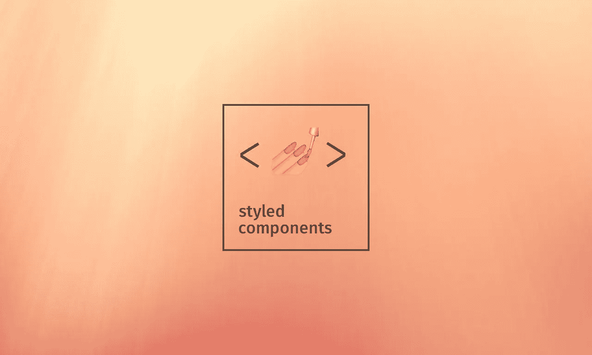

**Styled components** 是想知道如何增强 CSS 样式 React component 系统的结果:**自动关键 CSS，没有类名错误，更容易删除 CSS，简单的动态样式，无痛维护，自动供应商前缀。**

# 本文将涵盖哪些内容:

*   [先决条件](#faf2)；
*   [安装](#32fd)；
*   [基础知识](#b6d4)；
*   [自动修复器](#da07)；
*   [全局样式](#127f)；
*   [定制道具](#5f9b)；
*   [风格化系统](#5710)；
*   [主题](#4f7f)；

# 先决条件

在开始之前，我们将使用`**create-react-app**`命令创建一个 React Typescript 应用程序项目:

```
npx **create-react-app** react-styled-components-examples --template **typescript**
```

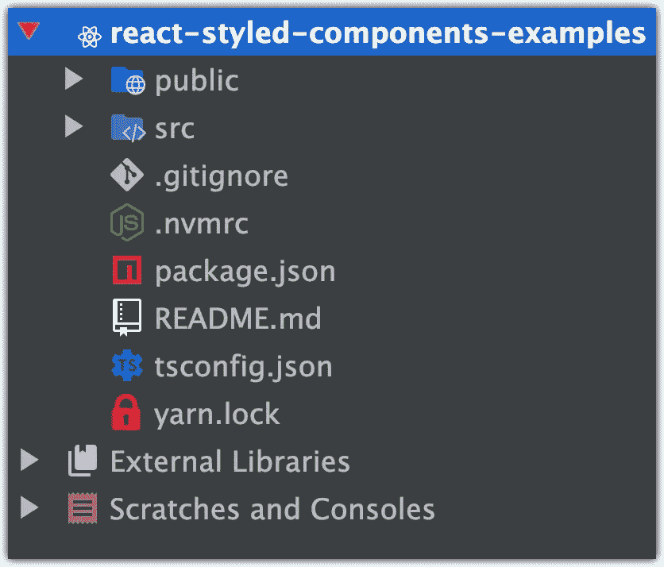

# [安装](https://styled-components.com/docs/basics#installation)

首先，我们需要添加带有类型包的 [**样式化组件**](https://styled-components.com/) :

```
yarn add **styled-components &&** yarn add **@types/styled-components** -D
```

⚠️ **注意**:如果可以的话，建议(但不是必须)也使用[样式组件巴别塔插件](https://github.com/styled-components/babel-plugin-styled-components)。它提供了许多好处，比如更易读的类名、服务器端呈现兼容性、更小的包等等。

下面是一个使用`**styled-components**`和`Next.js`的例子→你需要添加[**babel-plugin-styled-components**](https://www.npmjs.com/package/babel-plugin-styled-components)到你的开发依赖项中(*`***CREATE-REACT-APP***`不需要这个):*

```
*yarn add **babel-plugin-styled-components** -D*
```

*并添加/更新`.babelrc`文件:*

*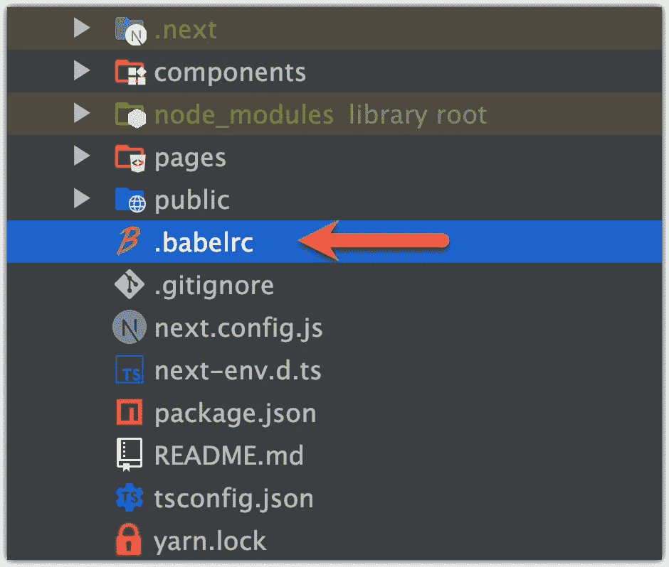*

# *[基础知识](https://styled-components.com/docs/basics)*

*`**styled-components**`利用带标签的模板文字来设计组件的样式。*

*它移除了组件和样式之间的映射。这意味着当您定义您的样式时，您实际上是在创建一个普通的 React 组件，它附加了您的样式。*

*让我们将 create-react-app 添加的 React 的默认 CSS 属性从`.css`文件迁移到`.tsx`文件:*

*之后，我们会得到完全相同的结果:*

*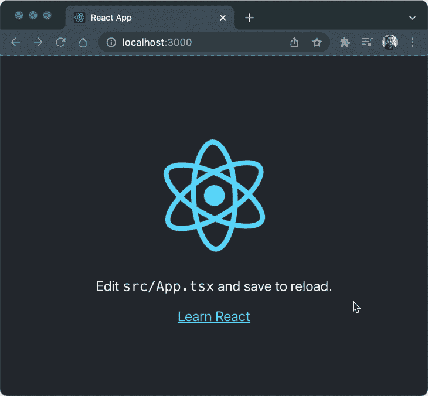*

*⚠️ **注**:我将把 [**留在下一个. js**](https://nextjs.org/) 示例中，并在我的 Github repo 中使用`**styled-components**`和`npx create-next-app@latest --typescript`命令创建:*

**

# *自动预混合器*

*CSS 规则自动以厂商为前缀，`**styled-components**`会为你处理好的！样式化组件使用头罩下的 [**stylis.js**](https://stylis.js.org/) 包作为 CSS 规则的前缀。关于 **stylis.js** 中支持的前缀的更多信息，请访问他们的[库](https://github.com/thysultan/stylis.js)。*

## *以前*

*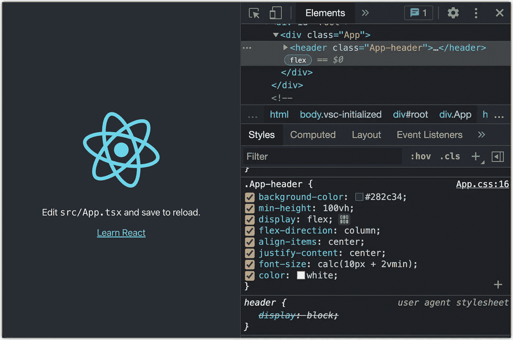*

## *在...之后*

**

*⚠️ **注** : `**styled-components**`为你的风格生成唯一的类名。你永远不必担心重复、重叠或拼写错误。*

**

*你可以在这里查看更多关于前缀的信息:*

*[](https://developer.mozilla.org/en-US/docs/Glossary/Vendor_Prefix) [## 供应商前缀- MDN Web 文档词汇表:Web 相关术语的定义| MDN

### 浏览器供应商有时会在实验性或非标准的 CSS 属性和 JavaScript APIs 中添加前缀，因此开发人员…

developer.mozilla.org](https://developer.mozilla.org/en-US/docs/Glossary/Vendor_Prefix) 

此外，您可以检查`**autoprefixer**`:

[](https://autoprefixer.github.io/) [## 在线自动修复 CSS

### Autoprefixer 是一个 PostCSS 插件，它解析你的 CSS 并添加厂商前缀，包括带有配置的注释…

autoprefixer.github.io](https://autoprefixer.github.io/) 

⚠️ **注**:那么，我们怎样才能得到一个 CSS 类的值呢？

假设我们想使用 [**CSS 元素+元素选择器**](https://www.w3schools.com/cssref/sel_element_pluss.asp) **:**

> 将样式应用于具有类的元素。“仅当元素具有类时”。a' **是紧跟在带有类的元素之后的**。“b”元素:

```
.**b** + .**a** {
  background-color: red;
}
```

普通 CSS 示例:

结果:

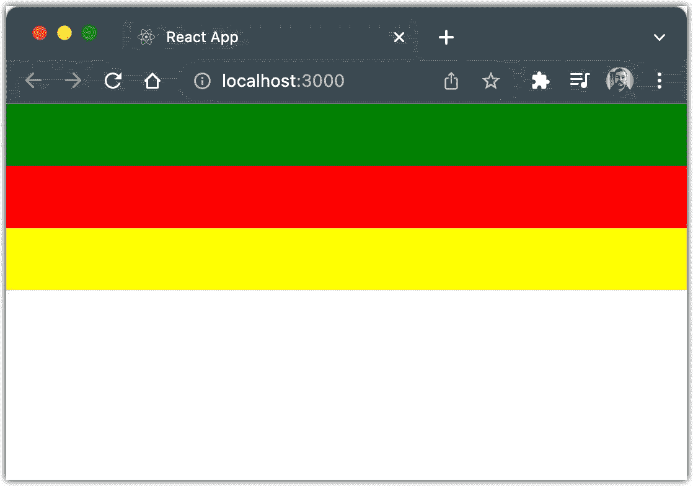

我们可以用这样的`**styled-components**`获得同样的结果:

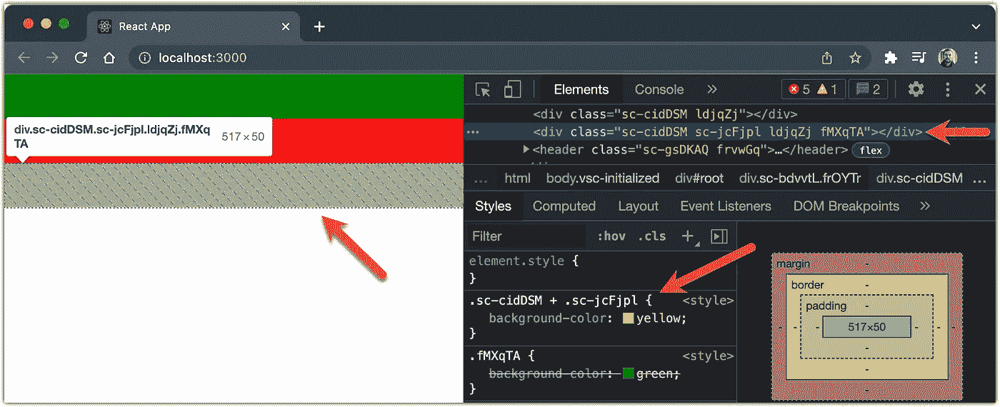

# 全局样式

要添加全局样式，您可以使用`**createGlobalStyle**`辅助函数→生成一个特殊的 **StyledComponent** 来处理全局样式。通常情况下，样式化组件的作用域自动限定在一个本地 CSS 类中，因此与其他组件隔离开来。在`**createGlobalStyle**`的情况下，这个限制被移除，可以应用 CSS 重置或基本样式表之类的东西。

我们将复制粘贴默认的 React 全局样式。

……到`**createGlobalStyle**` **:**

你可以看到，你可以把它“注入”到你的应用程序中，风格效果是一样的。

# 定制道具

样式组件允许您传递任何您喜欢的自定义属性，并按照您喜欢的方式管理这些属性:

console.log 的结果:

```
PROPS {
      **myCustomProp**: '50px',
      **theme**: {},children: {
        '$$typeof': Symbol(react.element),
        type: {
          '$$typeof': Symbol(react.forward_ref),
          render: [Function],
          // ...
        },
        key: null,
        ref: null,
        // ...
        _store: {}
      },
    }
```

让我们更新`**<Styled.Header/>**`组件的几个道具:

如你所见，我们正在使用 [**ccstype**](https://www.npmjs.com/package/csstype) npm 包，该包将用于类型并作为 CSS 助手，现在 IDE 将向你显示`align-item`的所有可用 CSS 值:

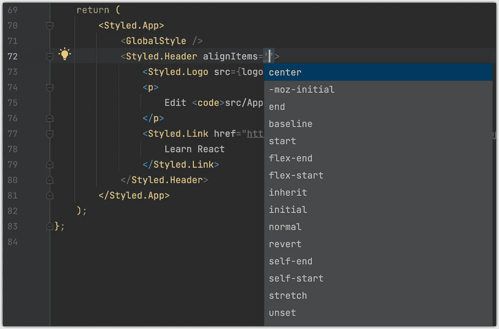

# 风格系统

如果我们想将所有布局和 flex CSS 属性添加到我们的样式化组件中，这样我们就可以编写类似于:

我们已经介绍了一种使用 [**csstype**](https://www.npmjs.com/package/csstype) 包的方法，但是这种方法有一个缺陷——我们需要手动添加 CSS 道具*。让我们使用[**styled-system**](https://www.npmjs.com/package/styled-system)NPM 库来检查一个更好的方法:*

*[](https://www.npmjs.com/package/styled-system) [## 风格系统

### 使用 React 构建设计系统的响应式、基于主题的风格道具。最新版本:5.1.5，最后发布时间:2…

www.npmjs.com](https://www.npmjs.com/package/styled-system) 

首先，将开发依赖项添加到项目中

```
yarn add styled-system -D
yarn add @types/styled-system -D
```

让我们看一个简单的例子:

所有通过的道具都将被应用，然后让我们看看 TS 将如何帮助我们:

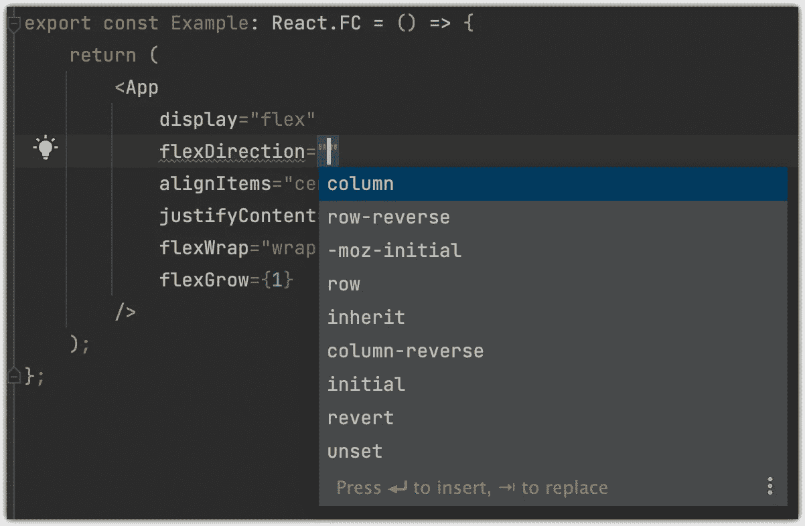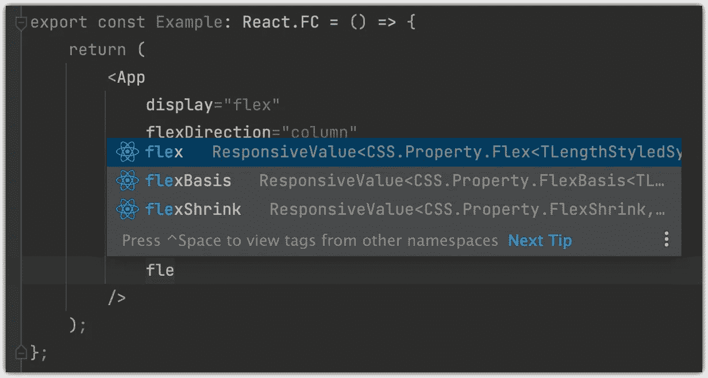

您可以通过此链接查看更多信息:

 [## 风格系统

### Styled System 是一个实用函数的集合，它将样式道具添加到 React 组件中，并允许您…

styled-system.com](https://styled-system.com/)* 

# *主题*

*通过导出一个`**<ThemeProvider>**`包装器组件，`**styled-components**`完全支持主题化。该组件通过上下文 API 向其下的所有 React 组件提供一个主题。在渲染树中，所有样式化的组件都可以访问所提供的主题，即使它们是多层的。*

*你可以通过任何你喜欢的主题道具。*

*简单的例子:*

*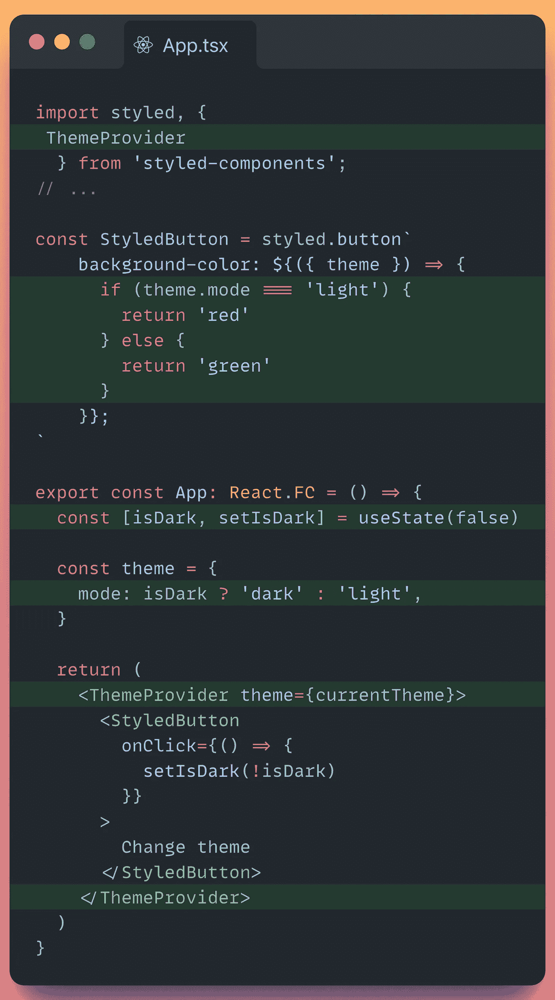*

*现在，让我们实现一个更有趣的主题示例:*

*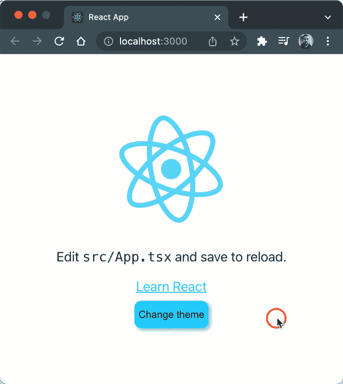*

*首先，我们将创建一个不同颜色的主题`.ts`文件:*

*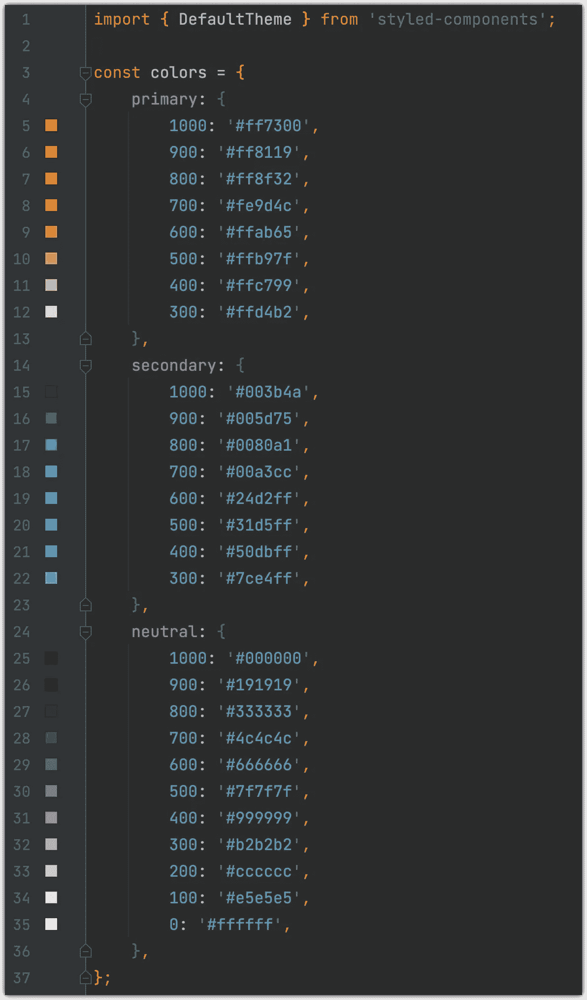*

*将主题导入`**App.tsx**`组件，并为主题变化添加简单状态:*

*和更新全局样式:*

*⚠️ **注意** : IDE 会抛出 TS 错误:*

```
*TS2339: Property 'mode' does not exist on type 'DefaultTheme'.*
```

*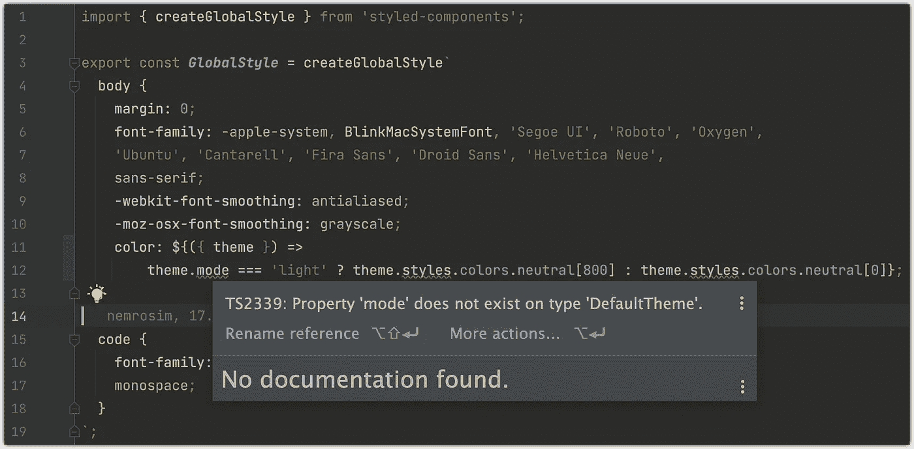*

*…因为`styled-components`的 **DefaultTheme** 类型就像`any` → IDE 对我们添加的道具一无所知。我们需要添加/更新全局默认主题类型:*

*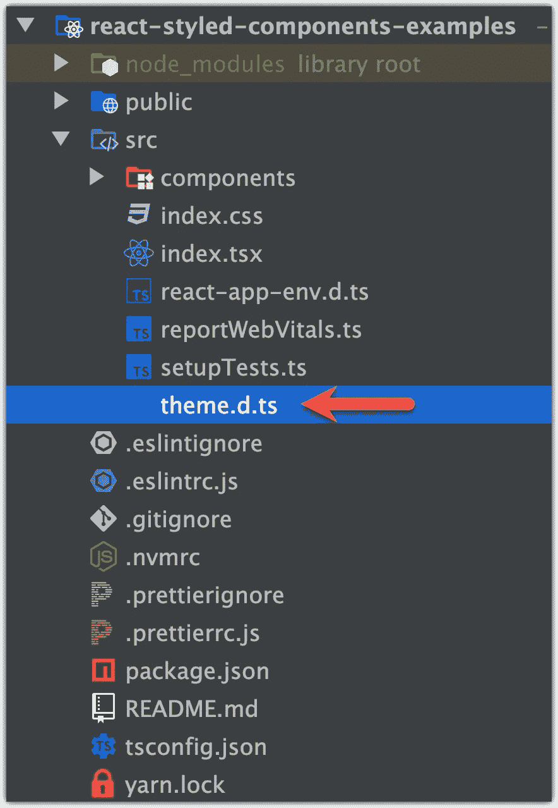*

*内容:*

*现在 TS 会开心的🎉：*

**

*Codesandbox:*

*Github 回购链接:*

*[](https://github.com/nemrosim/react-styled-components-examples) [## GitHub-nemrosim/react-style-components-示例

### 这个项目是用 Create React App 引导的。在项目目录中，您可以运行:在…中运行应用程序

github.com](https://github.com/nemrosim/react-styled-components-examples)**