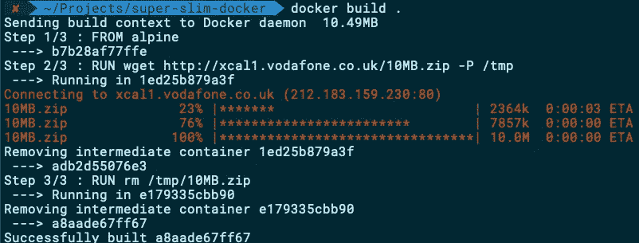
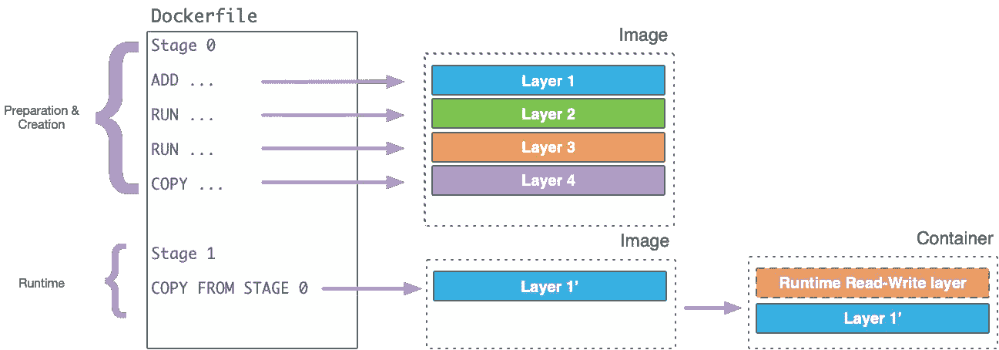

# 超薄码头集装箱

> 原文：<https://betterprogramming.pub/super-slim-docker-containers-fdaddc47e560>

## 缩小 Docker 图像尺寸的指南


由[威廉·沃比](https://unsplash.com/@wwarby?utm_source=medium&utm_medium=referral)在 [Unsplash](https://unsplash.com?utm_source=medium&utm_medium=referral) 拍摄的照片

你有没有想过为什么你的单应用 Docker 容器会增长到 400 MB？或者，为什么一个几十兆字节的应用程序二进制文件会产生一个几兆字节的 Docker 映像？

在本文中，我们将回顾导致容器变胖的一些主要因素，以及为您的项目提供超薄 Docker 容器的最佳实践和技巧。

# Docker 图像层

Docker 容器映像实质上是一些堆积的文件，稍后将被实例化为一个运行容器。Docker 利用了 Union 文件系统( [UnionFS](https://en.wikipedia.org/wiki/UnionFS) )设计，在这种设计中，文件按层分组。每一层可能包含一个或多个文件，并且每一层都位于前一层之上。它是所有层的所有内容的虚拟运行时合并，作为最终用户，我们体验到的是一个统一的文件系统:


UnionFS 的简化视图(图片由作者提供)

UnionFS 的底层实现呈现给我们的最终文件系统视图(Docker [通过可插拔的存储驱动程序支持相当多不同的文件系统](https://docs.docker.com/storage/storagedriver/select-storage-driver/))具有它所包含的所有层的总大小。当 Docker 为图像创建容器时，它以只读格式使用图像的所有层，并在它们之上添加一个薄的读写层。这个薄薄的读写层允许我们实际修改正在运行的 Docker 容器中的文件:


运行容器在图像的只读层上添加读写层。(图片由作者提供)

如果在上面的第 4 层删除一个文件会怎么样？尽管被删除的文件不再出现在观察到的文件系统中，但是它最初占用的大小仍然是容器的一部分，因为该文件包含在较低的只读层中。

从一个小的应用程序二进制文件开始，以一个胖容器映像结束，这相对容易。在接下来的部分，我们将探索不同的方法来保持我们的图像尽可能的小。

# 小心你的构建路径

我们构建 Docker 形象的最常见方式是什么？

```
docker build .
```

上面命令中的`.`告诉 Docker，我们将当前工作文件夹视为构建过程的根文件系统路径。

为了更好地理解发出上述命令时会发生什么，我们应该记住 Docker 构建是一个客户端-服务器进程。Docker CLI(客户端)使用底层 Docker 引擎(服务器)构建容器映像，我们从这里执行`docker build`命令。为了限制对客户机底层文件系统的访问，构建过程需要知道虚拟文件系统根是什么。正是在这个路径下，您的`Dockerifle`中的任何命令都试图找到可能在正在构建的映像中结束的文件资源。

让我们考虑一下我们通常放置`Dockerfile`的位置。在项目的根，也许？好了，将项目根中的一个`Dockerfile`与一个`docker build`组合起来，我们已经有效地添加了完整的项目文件夹作为构建的潜在文件资源。这可能会导致在构建上下文中不必要地添加多个 MB 和数千个文件。如果我们不小心在`Dockerfile`中定义了一个`ADD` / `COPY`命令，所有这些文件都可能成为最终图像的一部分。大多数情况下，这并不是我们所需要的，因为只有少数选定的项目工件应该包含在最终的容器图像中。

总是检查你提供了一个合适的到`docker build`的构建路径，并且你的`Dockerfile`没有添加不必要的文件到你的映像中。如果出于某种原因，您确实需要将项目的根定义为构建上下文，您可以通过`[.dockerignore](https://docs.docker.com/engine/reference/builder/#dockerignore-file)`有选择地包含/排除文件。

# 规格化你的图像层

如果您的底层存储驱动程序支持，一个映像最多可以有 127 层。如果确实需要的话，这个限制可以增加，但是这样就缩小了构建这个映像的选择范围(也就是说，您需要一个 Docker 引擎运行在一个经过类似修改的底层内核上)。

正如上面关于 Docker 图像层的部分中所讨论的，由于 UnionFS，无论什么文件资源进入一个层，即使您将该文件放在下一个层中，该文件资源也会保留在该层中。让我们用一个例子来看看`Dockerfile`:

```
FROM alpineRUN wget [http://xcal1.vodafone.co.uk/10MB.zip](http://xcal1.vodafone.co.uk/10MB.zip) -P /tmp
RUN rm /tmp/10MB.zip
```

构建上面的图像:



用浪费的空间构建一个样本图像(图片由作者提供)

并用[潜水](https://github.com/wagoodman/dive)检查:


图片只有 34%的效率(图片由作者提供)

34%的效率意味着我们的图像中浪费了大量的空间。这导致更长的图像获取时间、额外消耗的带宽和更慢的启动时间。

如何才能摆脱这种浪费的空间？

## 命令合并

你见过有一个非常长的`RUN`指令的`Dockerfile`，其中多个 shell 命令用`&&`聚合在一起吗？那就是命令合并。

通过合并命令，我们实际上从这个长命令的结果中创建了一个单独的层。由于不存在在另一层中添加文件并随后移除文件的中间层，因此最终层不会为此类幻影文件使用任何空间。让我们通过修改上面的`Dockerfile`来看看:

```
FROM alpineRUN wget [http://xcal1.vodafone.co.uk/10MB.zip](http://xcal1.vodafone.co.uk/10MB.zip) -P /tmp && rm /tmp/10MB.zip
```

现在我们有了一个优化的图像:


一个 100%优化的图像和命令合并(图片由作者提供)

当你完成建造你的`Dockerfile`后，检查它看看你是否能合并命令以减少可能的空间浪费。

## 挤压图像

命令合并的另一种方法是用 Docker 的`squash`命令构建你的映像，尤其是在使用别人的`Dockerfile`而你不想或不能修改的时候。

除非你是在一个非常老的 Docker 版本(<1.13), Docker allows us to squash all our layers into a single layer, effectively removing all ghost resources. We can still use the original, unchanged 【 with the many individual commands, but this time we execute the build passing the 【 option:

```
docker build --squash .
```

The resulting image is, again, 100% optimised:


A 100% optimised image with image squash (Image by the author)

An interesting point to notice here is that since our 【 created a layer to add a file and then created another layer to remove that file, 【 is clever enough to realise that no layers need to be created (we only have the 【 layer from the base image we’re using). Extra kudos to 【 then. However, take into account that squashing your layers may prevent you or the users of your image from taking advantage of previously cached layers.

Note: When working with a third-party 【 that you don’t want to change, a quick and easy way to minimise any possible wasted space is to build it with 【 . You may use a tool [潜水](https://github.com/wagoodman/dive)检查图像的最终效率。

# 删除缓存

通常，当我们封装一个应用程序时，我们需要通过使用一个包管理器，比如`apk`、`yum`或`apt`，在我们构建的映像上提供额外的工具、库或实用程序。

当我们安装软件包时，软件包管理器试图通过缓存以前获取的软件包来节省我们的时间和带宽。为了使我们得到的 Docker 图像尽可能小，我们不需要保存包管理器缓存。毕竟，如果我们的容器需要不同的映像，我们总是可以用更新的`Dockerfile`来重建映像。

要删除上面三个流行的包管理器的包管理器缓存，我们可以在聚合(即命令合并)命令的末尾添加以下命令，例如:

```
**APK:** *... &&* rm -rf /etc/apk/cache
**YUM:** *... &&* rm -rf /var/cache/yum
**APT:** *... &&* rm -rf /var/cache/apt
```

注意:在完成 Docker 映像之前，不要忘记删除构建过程中使用的所有缓存以及容器正常运行不需要的任何其他临时文件。

# 选择基础图像

每一个`Dockerfile`都以一个`FROM`指令开始。这是我们定义基础图像的地方，我们自己的图像将在此基础上创建。

如[文档](https://docs.docker.com/engine/reference/builder/#from)中所述:

> FROM 指令初始化新的构建阶段，并为后续指令设置基础映像。因此，有效的 Dockerfile 必须以 FROM 指令开头。该映像可以是任何有效的映像，从公共存储库中提取一个映像非常容易。”

显然，有大量不同的基础图片可供选择，每一个都有自己的优势和特点。当涉及到您自己的 Docker 映像的最终大小时，选择一个能够提供您的应用程序运行所需的足够工具和环境的映像是至关重要的。

正如您所料，不同的流行基础图像的大小差异很大:


受欢迎的 Docker 基本图片大小(图片由作者提供)

实际上，使用 [Ubuntu 19.10 基本映像](https://hub.docker.com/layers/ubuntu/library/ubuntu/19.10/images/sha256-bceb2fb47400491f75a9056a3d4e219cbe5f9512d4220ca43f3f5cb3d08e9d04)封装你的应用程序至少会增加 73 MB，而使用 [Alpine 3.10.3 基本映像](https://hub.docker.com/layers/alpine/library/alpine/3.10.3/images/sha256-77cbe97593c890eb1c4cadcbca37809ebff2b5f46a036666866c99f08a708967)的完全相同的应用程序只会额外增加 6 MB。由于 Docker 会缓存图像层，因此下载/带宽损失仅适用于第一次使用该图像启动容器时(或者简单地说，当提取图像时)。然而，增加的尺寸仍然存在。

在这一点上，你可能已经得出了以下(相当符合逻辑的)结论:“那么我将一直使用 Alpine！”。要是软件中的事情也这么清楚就好了。

你看，[Alpine Linux 背后的家伙们](https://gitlab.alpinelinux.org/groups/alpine/-/activity)还没有发现 Ubuntu 或 Debian 的家伙们仍在寻找的一种特殊的秘方。为了能够创建一个比 Debian 小一个数量级的 Docker 映像，他们必须决定在他们的 Alpine 映像中包含什么和不包含什么。在选择 Alpine 作为默认基础图像之前，您应该检查它是否提供了您需要的所有环境。此外，即使 Alpine 附带了一个包管理器，您可能会发现您在基于 Ubuntu 的开发环境中使用的特定包或包版本在 Alpine 中是不可用的。在为您的项目选择最合适的基础图像之前，您应该了解并测试这些权衡。

最后，如果你真的需要使用一个较胖的基础图像，你可以使用一个图像最小化工具，比如免费开源的 DockerSlim。

注意:为你自己的图像选择一个合适的基础图像是很重要的。评估您的选择，并选择一个图像，提供您需要的工具的大小，你可以负担得起。

# 不选择任何基础图像

如果您有一个应用程序可以在没有基础映像提供的任何附加环境下运行，那么您可以选择根本不使用基础映像。当然，既然`FROM`在一个`Dockerfile`中是强制的，那么你必须仍然拥有它并指向某个东西。在那种情况下你应该用什么？

[划痕](https://hub.docker.com/_/scratch)，即:

> 一个显式空图像，尤其是用于“从头开始”构建图像。这种映像在构建基本映像(如 debian 和 busybox)或超小型映像(只包含一个二进制文件和它需要的任何内容，如 hello-world)的环境中最有用。“从头开始”在 docker 文件中是不可行的，并且不会在您的映像中创建额外的层。”

注意:如果您的应用程序包含可以独立运行的自包含可执行文件，选择`scratch`基本映像可以让您尽可能地减少容器的占用空间。

# 多阶段构建

当 Docker 17.05 推出时，多阶段构建是关注的焦点。一个期待已久的特性，多阶段构建允许映像构建者留下定制的映像构建脚本，并将所有内容集成到众所周知的`Dockerfile`格式中。

在高级术语中，您可以将多阶段构建视为将多个`Dockerfiles`合并在一起，或者简单地将一个`Dockerfile`与多个`FROMs`合并在一起。

在多阶段构建之前，如果您想要构建项目的产品并使用`Dockerfile`将其分发到一个容器中，您可能必须遵循一个构建过程，最终得到如下所示的容器:


构建和分发您的应用程序，无需多阶段构建(图片由作者提供)

尽管上述过程在技术上没有任何问题，但最终的图像和最终的容器被构建/准备项目产品时创建的层所膨胀，而这些层对于项目的运行时环境是不必要的。

多阶段构建允许您将创建/准备阶段从运行时环境中分离出来:



多阶段构建，从运行时分离创建/准备(图片由作者提供)

您仍然可以使用一个`Dockerfile`来定义完整的构建工作流。但是，您可以将工件从一个阶段复制到另一个阶段，同时丢弃您不需要的层中的数据。

注意:多阶段构建允许您创建跨平台、可重复的构建，而无需使用特定于操作系统的自定义构建脚本。通过有选择地包含在构建的前几个阶段生成的人工制品，可以将图像的最终尺寸保持在最小。

# 结论

为容器创建 Docker 映像是现代软件工程师经常要处理的一个过程。有大量的在线资源和例子向你展示如何创建一个`Dockerfile`，然而，你应该留意你的最终图像的大小。

在这篇文章中，我们回顾了几种最小化 Docker 图像最终尺寸的方法和技巧。通过精心制作一个只包含必要人工制品的`Dockerfile`，选择一个合适的基础图像，并使用多阶段构建，Docker 图像的最终大小可以大大减小。