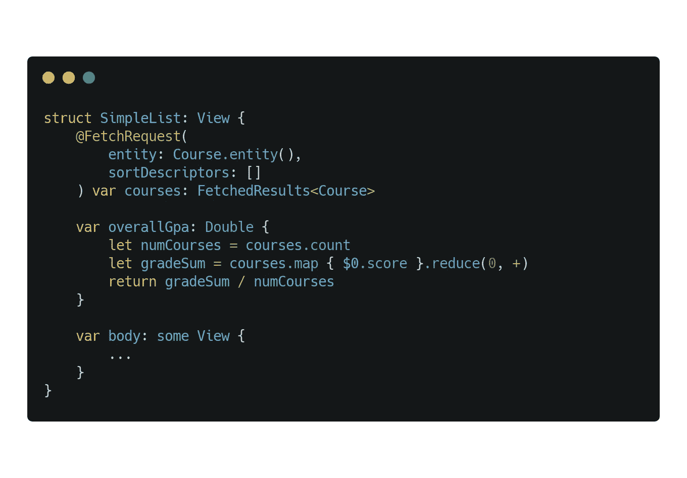
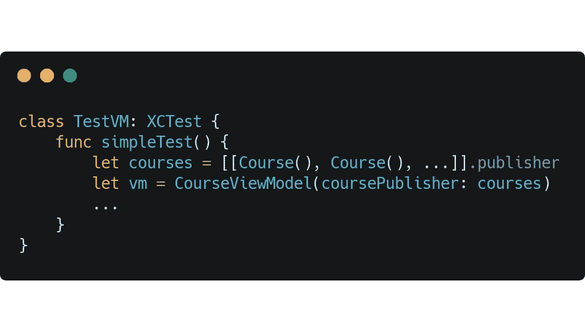
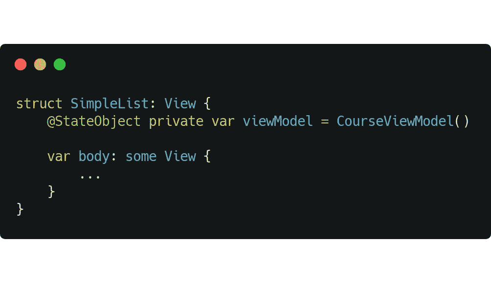

# SwiftUI 和核心数据:MVVM 之路

> 原文：<https://betterprogramming.pub/swiftui-and-coredata-the-mvvm-way-ab9847cbff0f>

## 在 SwiftUI 中处理核心数据实体的简洁直观的方式

[戏谑的抓拍](https://unsplash.com/@bantersnaps?utm_source=medium&utm_medium=referral)在 [Unsplash](https://unsplash.com/?utm_source=medium&utm_medium=referral) 上的照片。

当我第一次开始为一些小项目使用 SwiftUI 时，我立即欣赏到了它的易用性和表现力。然而，事情并非一帆风顺。

当我开始开发一些更大的应用程序时——尤其是需要核心数据的应用程序——我清楚地意识到，我必须给项目本身一个不同的结构。否则，我很快就会陷入一个非常严重的可维护性和测试问题。

# 坏的，简单的方法

通过阅读苹果的文档和许多其他关于堆栈溢出的答案，你会发现很多人将`FetchRequest`属性包装变量放在需要从核心数据模型获取一些数据的`View`结构中。

如果你刚刚开始，这可能很有诱惑力，但是当你稍微深入研究提取的实体所涉及的逻辑时，你将很快意识到不仅很难——如果不是不可能的话——测试那些函数/变量，而且你也不再遵循 MVVM 模式。在这一点上，`View`结构知道很多关于实体和你在它们内部定义的函数/属性的信息。让我给你看一个很容易在其他实体中复制的例子:

在这种情况下，我将获取存储在核心数据中的所有`Course`实体，并引入一些逻辑，我将在稍后的视图中展示这些逻辑。我们如何检验这个计算变量呢？您可以创建一个可以稍后测试的特殊函数，但这不是一个干净的方法。另外，您不希望在任何视图中出现数据逻辑。

# 干净的替代品

我倾向于每个`View`有一个单独的`ViewModel`,这样我可以单独测试每个组件，并在每个组件中使用我需要的东西，而不是让一个巨大的`ViewModel`在视图中传递。

使用 SwiftUI 2.0，您会发现初始项目将一个`managedObjectContext`作为一个`environmentObject`属性传递。我们不希望这样。每次在需要从数据库获取数据的每个`View`中获取上下文是不干净的，我也不希望我的视图知道这些。

我想到的是一种更 MVVM 的方式，让我们易于使用的出版商和订户参与进来。

基本上，您将创建一个 singleton 实例，该实例监视数据库中的一个实体(在本例中为`Course`实体),并将所有课程发送给订阅它的每个订户。这样，您可以轻松地实例化订阅存储发布者的多个`ViewModels`,并在更专用和可测试的空间中对这些实体操作一些逻辑。让我们来看一个`CourseStorage`的例子:

正如您在代码中看到的，我正在创建一个 singleton `ObservableObject`，它公开了一个课程发布者。当`managedObjectContext`实体改变时，它将发出一个新的值。您可能也注意到了，我将`PersistenceController`放在了类本身中。这样，我们就可以忘记将它传递给视图，就像我之前解释的那样。在这个类中，我还处理与核心数据操作相关的一切，比如保存、添加和删除存储中的实体。因此，我将数据库逻辑与应用程序的业务逻辑分开。

下面是一个例子，说明如何利用这些变化来构建`ViewModel`:

`ViewModel`现在封装了它应该处理的所有数据和逻辑。代码基本上是不言自明的:`CourseViewModel`订阅了`CourseStorage`发布者，并从它那里接收最新的课程值。

你可能想知道为什么我用一个`AnyPublisher`值初始化`ViewModel`。还记得测试优势吗？正是针对这种情况。如果我现在想测试`CourseViewModel`及其逻辑，我可以创建一个包含一系列课程的样本测试数组，将其作为数组发布者传递给`ViewModel`，并做出测试所需的所有断言。

# 决赛成绩

现在，我将向您展示经过这些更改后的`View`结构看起来是多么简单和整洁:

不再有`managedObjectContext`传来传去的观点。有逻辑分离。它符合 MVVM 标准，易于测试，并且干净。

# 结论

我不得不说我对结果相当满意。我的组件现在都是以这种方式构建的，我没有发现实现中的任何问题。这就是为什么我鼓励你尝试这样做，这样你就能以一种结构良好、可维护、更优雅的方式组织大项目(和小项目)。