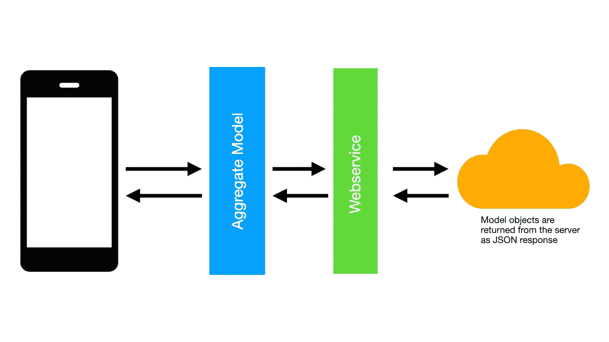
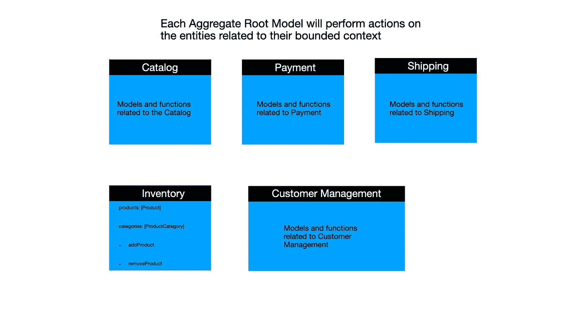

# SwiftUI 架构——MV 模式方法的完整指南

> 原文：<https://betterprogramming.pub/swiftui-architecture-a-complete-guide-to-mv-pattern-approach-5f411eaaaf9e>

## 不要对抗框架，试着拥抱它


[兰斯·安德森](https://unsplash.com/@lanceanderson?utm_source=unsplash&utm_medium=referral&utm_content=creditCopyText)在 [Unsplash](https://unsplash.com/s/photos/buildings?utm_source=unsplash&utm_medium=referral&utm_content=creditCopyText) 上拍照

> 更新 03/09/2023 —我发表了一篇全新的文章，标题为“[用 SwiftUI 构建大规模应用:模块化架构指南](https://medium.com/@azamsharp/building-large-scale-apps-with-swiftui-a-guide-to-modular-architecture-9c967be13001)”。
> 
> 2023 年 2 月 3 日更新—我最近发表了几篇关于 SwiftUI 架构的文章。这包括探索容器模式([https://azamsharp . com/2023/01/24/introduction-to-Container-Pattern . html](https://azamsharp.com/2023/01/24/introduction-to-container-pattern.html))，这是构建 ReactJS 应用程序和活动记录模式时的常用模式([https://azamsharp . com/2022/10/06/practical-mv-Pattern-crud . html](https://azamsharp.com/2022/10/06/practical-mv-pattern-crud.html))。
> 
> 对我个人来说，用 SwiftUI 构建*** *核心数据**** 应用程序时，活动记录模式感觉更自然。这主要是由于核心数据和传统 ORM 之间的相似性。我建议您尝试所有不同的架构模式，看看哪一种适合您的需求。对于客户机/服务器应用程序，我很喜欢使用本文中讨论的 MV 模式。

我听了西班牙国家安全局的马蒂亚斯·维拉维尔德和伦斯·布雷尔关于“在 SwiftUI 中重写 SoundCloud 的经验教训”的精彩演讲你可以在这里观看完整的演讲[。](https://vimeo.com/751534042/f1ae29434e)

这个演讲确实引起了我的共鸣，因为我在构建 SwiftUI 应用程序时也犯过类似的错误。我没有拥抱框架的简单，而是增加了不必要的复杂性来取悦设计模式之神。这包括为每个视图创建视图模型，忽略`@FetchRequest`和`@SectionFetchRequest`属性包装，将`@EnvironmentObject`传递给视图模型而不是直接在视图中访问它等等。

在朝着错误的方向行驶了将近两年之后，我决定猛踩刹车，思考我的决定。在这篇文章中，我将讨论我的应用程序所使用的 SwiftUI 架构。

> 这种架构没有正式的名称，但是在 iOS 社区中，它被称为 MV 模式。这种模式的灵感来自苹果的 WWDC 视频和示例应用程序。您可以在下面的参考资料部分找到示例应用程序的链接。

我们开始吧！

# 体系结构

我们的应用程序的架构将围绕几个不同的组件。这包括聚合模型、web 服务和服务器。聚合根模型的主要目的是为视图提供其他模型对象。

根据您的应用程序，您可能有`Order`、`Coffee`、`Category`等的模型对象。视图将与聚合根模型进行通信，以获取、保存和排序不同的模型。一个集合模型可以作为一个`@StateObject`使用，或者作为一个单体注入到`@EnvironmentObject`中，因此它可以在任何视图中被访问。由于这是一个客户端-服务器应用程序，一个聚合模型将调用 webservice，该 web service 将模型对象返回到视图。

对于小型应用程序，您只需要一个聚合模型。如下图所示:



对于较大的应用程序，您可以基于应用程序的[有界上下文](https://martinfowler.com/bliki/BoundedContext.html)引入几个聚合模型对象。这是一张图片:


> 您不需要每个视图都有一个聚合模型。聚合模型基于应用程序的有限上下文，而不是应用程序中的屏幕数量。

这种模式在苹果的 WWDC 视频[swift ui](https://developer.apple.com/videos/play/wwdc2020/10040/)中的数据要点中讨论过。

聚合根模型的主要目的是允许在特定的有界环境下访问实体/模型。有界上下文是由业务领域决定的。在下图中，您可以看到一个电子商务应用程序的不同聚合根模型。

每个聚合根模型将对与其有界上下文相关的实体执行动作。



每个聚合根模型将负责对它们上下文中的模型执行操作。`Inventory`模型将允许您访问产品和产品类别、添加新产品、删除产品、更新产品、搜索等。

> 聚合根模型还可以相互通信，以访问不在它们上下文中的实体。例如:一个`Shipping`根模型可以访问`Customer Management`根模型来找到关于特定客户的信息。

对于我们的小应用程序，我们将只使用单个聚合根模型，较大的应用程序可以有多个根模型。

# 实现聚合根模型

在苹果的文档中，他们为自己的型号使用了不同的名称。这包括`Model`、`FoodTruckModel`、`FrutaModel`等。我认为模型名称应该基于有界的上下文。对于一个电子商务应用，你的聚合根模型可能是`Catalog`、`Payment`、`Shipping`、`Inventory`等。每个集合模型将允许您访问由根控制的实体。

为了简单起见，我称我的模型为`Model`。基本实现如下所示:

> 聚合根模型可能看起来像视图模型，但它不是。根模型并不负责格式化要在屏幕上显示的数据。与视图模型不同，不需要为每个屏幕创建单独的根模型。对于较小的应用程序，您可以对整个应用程序使用单一模型。
> 
> 如果您的模型变得越来越大，那么考虑将其分离并在不同的聚合模型之间分配职责将是一个好主意。您可以根据应用程序域的有界上下文将一个根模型分解成更小的模型。
> 
> 你不能根据应用程序的屏幕数量来创建根模型。

你可以在这里阅读更多关于有界上下文[的内容。](https://martinfowler.com/bliki/BoundedContext.html)

> 如果您遵循 MVVM 模式，那么您将会得到几个视图模型，包括`OrderListViewModel`、`OrderViewModel`、`AddOrderViewModel`、`OrderDetailViewModel`等等。我们已经从图片中完全移除了视图模型，视图直接消费由根模型提供的模型。请记住 SwiftUI 中的`View is the View Model`。
> 
> 视图是视图模型并不意味着您应该开始将网络代码放到`View`中。如本文所示，创建一个单独的网络层是个好主意，这样相同的网络请求可以在其他视图中调用。

该模型的完整实现如下所示:

该模型调用`OrderService`获取所有订单，并执行与订单相关的不同操作，如插入、更新、排序和过滤等。

> 您可能想知道为什么视图不能直接调用`OrderService`并使用`@State`属性包装器在本地/私有状态下存储所有订单。你当然可以这样做，但是因为我们允许用户在单独的屏幕上编辑订单，然后在原始屏幕上刷新，所以让订单在全球可用更有意义。
> 
> 此外，如果您将数据存储在视图的本地状态中，并且其他视图需要相同的数据，那么您必须使用`@Binding`将状态传递给子视图。同样，这也没什么错，但是这会导致更多的工作，尤其是当您将一个状态传递到视图层次结构中太深的时候。

另一个原因是根模型可以提供排序和过滤功能，这在`OrderService`中并不合适。根模型还可以调用多个服务来聚合数据并将数据返回给视图，甚至为应用程序提供缓存支持(通过缓存层)。

接下来，我们来看看`OrderService`。

# 实现订单服务

`OrderService`的主要目的是从服务器获取数据，然后将其传递给聚合模型。`OrderService`的完整实现如下所示:

> 如果需要，您还可以创建一个通用的 webservice，它具有所有的基本操作，如`getAll`、`getById`、`delete`等。

接下来，让我们看看 SwiftUI 视图的实现。

# 实现视图

SwiftUI 视图不仅仅是视图，也是`view`模型。但这并不意味着您应该将网络代码放在视图中。

> 我说的联网代码是指`URLSession.shared.xxx`。虽然它可以工作，但是从其他视图中重用相同的网络调用会更加困难。这是我们创建`OrderService`的主要原因。在 React 应用中，开发人员通常使用 fetch 或 axios 等库直接从组件内部调用网络代码。这完全没问题，除非您需要在其他组件中进行同样的调用。

在我们的应用程序中，所有 SwiftUI 视图都需要访问根模型对象，这样它们才能持久化并获取订单。`@EnvironmentObject`非常适合这种情况。根模型对象作为根视图中的`@EnvironmentObject`注入。这显示在下面的实现中:

> 在上面的代码中，我注入了一个硬编码的基本 url。在您的应用程序中，url 可以基于环境(开发、测试、qa、生产)。这将允许您轻松切换测试环境。

`ContentView`的实现如下所示。`ContentView`负责向用户显示所有订单。

让我们来看看`AddNewCoffeeOrderView`。`AddNewCoffeeOrderView` 视图负责允许用户下一个全新的订单。同一视图也用于更新现有订单。

`AddNewCoffeeOrderView`还执行 UI 验证并向用户显示错误消息。它看起来是这样的:

如果您有一个大的表单要验证，那么您还可以引入一个视图模型，它将通过`TextFields`填充。视图模型还可以提供验证支持。一种可能的实现如下所示:

React 应用程序中使用了相同的验证技术。如果字段验证不成功，则设置一个标志，向用户显示错误消息。

> UI 验证不是业务逻辑。UI 验证只是检查用户是否输入了有效信息。将对有效数据执行业务规则(如果有)。假设你正在建立一个网站，用户可以输入他们的信用评分，并获得年利率(利率)。
> 
> UI 验证将检查信用评分`TextField`是否为空。它还将检查分数是否仅由特定范围内的数字组成。所有这些都将是 UI 验证。一旦用户成功提交信用评分，系统将运行业务规则来找出适合用户的 APR。

甚至 HTML 也提供了验证用户界面的属性。看看下面的代码:

```
<input type = 'text' required />
```

当提交表单时，上面的代码将验证输入字段(`TextBox`)。如果输入字段为空，则不会提交表单，用户会收到一条错误消息。这是 UI 验证的一个例子，而不是业务规则。

> 在大多数客户机/服务器应用程序中，业务规则存在于服务器上，而客户机只提供 UI。

使用`@EnvironmentObject`的好处之一是当顺序改变时，视图会自动重新评估。重新评估不同于重新渲染。重估意味着 SwiftUI 将查看 diff 树，然后决定哪些视图需要重新呈现。重估是一个非常快速的过程，因此尽管您的视图体可能会不断被解雇，但这并不意味着体中的所有视图都会被重新呈现。

看看下面的代码:

如果你输入`TextField`，那么你会注意到身体每次都被发射。主要原因是,`@State`变量名从`TextField`获得新值，这导致主体被重新评估。但这并不意味着身体内部的所有视图都被重新渲染。只有更改过的视图才会被重新渲染。

同样，当使用`@EnvironmentObject`时，几个视图可能会被重新评估，但只有那些需要重新渲染的视图会被再次渲染。如果你不想要重新渲染，你可以将你的`@EnvironmentObject`分割成多个对象。这在我的文章[使用多个环境对象](https://azamsharp.com/2022/07/01/slicing-environment-object.html)在 SwiftUI 中切片全局状态中有所展示。

# 测试

> 更新:2023 年 2 月 20 日:我最近发表了一些关于测试的文章。这包括【务实测试和避免常见陷阱】(https://azamsharp . com/2012/12/23/practical-unit-Testing . html)【测试关乎信心】(https://azamsharp . com/2023/02/15/Testing-is-About-Confidence . html)【测试视图模型不验证用户界面】(https://azamsharp . com/2023/02/16/Testing-View-models . html)。

测试是软件开发中非常重要的一部分。测试通常分为三个主要类别，称为测试金字塔。

-单元测试

-集成测试

- E2E 测试

根据应用程序的复杂程度，你可以在金字塔的不同部分投入时间。如果您的应用程序有许多领域规则，那么您应该针对聚合模型编写许多单元测试。如果你的应用程序与非托管依赖项集成，那么你将需要集成测试。最后，对您的应用程序来说，最好的测试是 E2E 测试。这些测试是在用户使用应用程序时进行的，是防止应用程序退化不可或缺的。

# 边注

> Kent Beck 说得好，“我是为有效的代码而不是为测试而获得报酬的，所以我的哲学是尽可能少地测试以达到给定的置信度。”

如今，我看到开发人员虔诚地测试他们的每一行代码，并以 100%的代码覆盖率为目标。开发人员拿工资是为了写特性/代码，而不是单元测试。但是我总是见证测试代码比代码库多三倍的项目。

测试无疑是重要的，但前提是你要编写有意义的测试。考虑这样一种情况，我们必须为下面的场景编写一个单元测试。

> 用户应该能够添加交易到他们现有的预算

如果这个操作是您的模型的一部分，那么您的测试应该创建一个用户，并在数据库中为该用户添加一个预算。之后，它应该向该预算添加一个新的事务，然后检查该事务是否添加成功。

不幸的是，大多数开发人员会忽略数据库部分，并针对模拟对象运行他们的测试。最终他们的测试会跑得很快，他们也很高兴看到测试通过，但是他们到底测试了什么？他们只是测试了他们的模拟对象是否如预期的那样工作。在这种情况下，一个真正的测试将触及数据库，并检查是否满足所有的规则。

> 对于上面的场景，我们正在考虑一个由核心数据或领域管理的设备数据库，比如 Sqlite。

我曾与拥有 2000 多项测试的公司合作过。但是如果你仔细观察，你会发现这些测试并没有测试任何与业务领域相关的东西。他们实际上是在测试编程语言。

这就是为什么测试应用程序的行为而不是实现很重要。在编写测试时，问问自己测试的是什么业务逻辑。如果你不能回答这个问题，停止写测试。

> 测试非常重要。这就是为什么我更优先考虑领域层单元测试和完整的系统端到端功能测试。功能系统测试将确保系统与应用程序的所有其他层一起工作。

# 结论

SwiftUI 已经内置了 MVVM。这意味着您的应用程序不需要额外的视图模型层。许多其他开发者也得出同样的结论，并使用 SwiftUI 提供的功能重写他们的应用。

SwiftUI 为其属性包装器添加了一些魔力，这使得一切变得简单，同时提高了性能。对于您的下一个应用程序，尝试创建没有视图模型的视图，并允许视图直接与模型对象对话。

与其和框架斗争，不如试着拥抱它。

# 源代码

你可以使用下面的链接下载源代码:【https://github.com/azamsharp/CoffeeAppMV 

# 资源

*   [SwiftUI 视图也是一个视图模型](https://azamsharp.com/2022/07/21/view-is-the-view-model.html)
*   [WWDC —通过 SwiftUI 的数据流](https://developer.apple.com/videos/play/wwdc2019/226/)
*   [在 SwiftUI 中重写 SoundCloud 的经验教训](https://vimeo.com/751534042/f1ae29434e)
*   [Fruta:用 SwiftUI 构建功能丰富的应用](https://developer.apple.com/documentation/swiftui/fruta_building_a_feature-rich_app_with_swiftui)
*   [快餐车:构建 SwiftUI 多平台应用](https://developer.apple.com/documentation/swiftui/food_truck_building_a_swiftui_multiplatform_app)
*   [模因创造者](https://developer.apple.com/tutorials/sample-apps/memecreator)

```
**Want to Connect?**If you are interested in learning more about the MV Pattern in iOS—or end-to-end testing—check out my brand-new course:[MV Design Pattern in iOS — Build SwiftUI Apps Apple’s Way](https://www.udemy.com/course/mv-design-pattern-in-ios-for-swiftui/?referralCode=4627986F77F533DEF0C7)
```