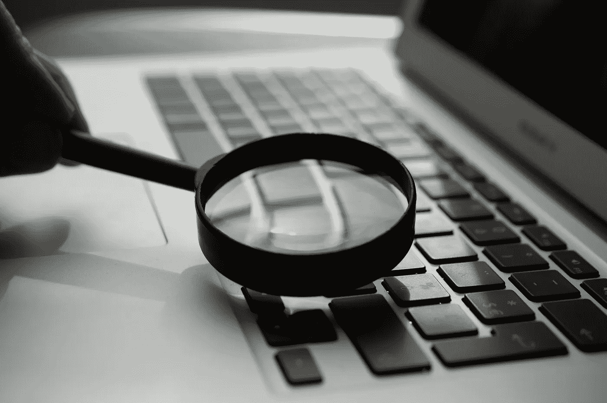
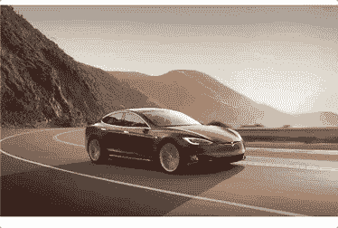

# SwiftUI:放大手势

> 原文：<https://betterprogramming.pub/swiftui-magnification-gesture-fa41b9bd404e>

## 放大 Swift 中的项目



照片由[法新社跟随](https://unsplash.com/@olloweb?utm_source=unsplash&utm_medium=referral&utm_content=creditCopyText)在 [Unsplash](https://unsplash.com/s/photos/magnifying-glass?utm_source=unsplash&utm_medium=referral&utm_content=creditCopyText) 拍摄

放大跟踪两个手指之间的距离，指示它们是否彼此靠近或远离。这将放大或缩小效果。

> *“识别放大动作并跟踪放大倍数的手势。”—苹果文档*

在本教程中，您将了解 SwiftUI 中的放大手势是什么以及如何使用它。

# 先决条件

按照本教程，你需要一些基本知识。

*   对 Swift 的基本熟悉。
*   至少 Xcode 11

# 放大手势

最流行的放大手势可以在照片中找到，您可以通过放大或缩小来放大照片。现在，你将尝试放大特斯拉图像。

您将需要一个`GestureState`来存储该值。

```
@GestureState var scale: CGFloat = 1.0
```

然后，您将需要创建一个图像，也将采取的规模值。每次放大时，该值将存储在标尺中并再次使用。

结果你会发现它放大了很多。我们几乎可以分辨出谁在特斯拉里。



# 从这里去哪里

如果你觉得你已经准备好接受更多的挑战，请随时查看我们创建的其他一些教程:

*   [拖动手势](https://medium.com/better-programming/swiftui-drag-gesture-2559cf255c5e)
*   [长按手势](https://medium.com/better-programming/swiftui-longpressgesture-63234cdc4eac)