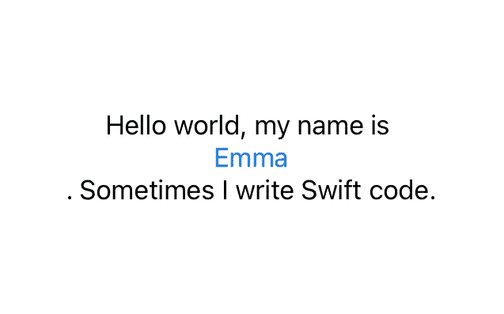

# 我的 SwiftUI 痛处:在文本中创建可点击的链接

> 原文：<https://betterprogramming.pub/swiftui-pain-links-in-text-b31319783c9e>

## 我的解决方案以及您如何做到这一点

从 WWDC 21 更新:你现在可以从一个新的 [AttributedString](https://developer.apple.com/documentation/foundation/attributedstring) 结构创建文本，这个结构在所有平台上都可用。看看郑关于如何使用它们的伟大文章。

图片来源:作者

所以你觉得 SwiftUI 很酷，你想在里面写你的新 app？你知道吗？SwiftUI *就是*酷。它可以做各种新奇的事情，这些事情在 UIKit 或 AppKit 中会很麻烦。这一切都很有趣和美好，直到你碰到到处都有的许多尖角中的一个。这是我最近遇到的一个尖锐的问题:

文本中的链接。你知道，就像我在上面的段落中无偿添加的那些。链接在网络和许多应用程序中无处不在。它们对我目前的项目来说无疑是至关重要的。假设你想在你的应用程序中添加一些文本，这些文本中有一些链接。你如何在 SwiftUI 中做到这一点？

好吧，幸运的是`[Text](https://developer.apple.com/documentation/swiftui/text)`和`[Link](https://developer.apple.com/documentation/swiftui/link)`存在——尽管`Link`是在 2020 年随着 iOS 14/mac OS 11 等推出的。，因此它可能不具备您所寻求的兼容性。无论如何，让我们取一些文本，并把它分解成这些观点。

很简单。让我们用`Text`和`Link`写一个`View`来显示这个文本。

酷，让我们看看怎么样。

尝试 1:不完全是我们想要的

不完全是我们想要的。我希望这段文字自然流畅，就像是一个文本块。让我们试试这个简单的东西，把它放在一个 HStack 中。

结果是:

尝试 2:这是不好的

糟透了。我的文本太宽，无法在 HStack 中的一行上布局，所以 SwiftUI 试图将空间垂直分成三部分，以适应我的文本。它实际上并不奏效。

艾玛，你说，“文本视图支持[使用](https://developer.apple.com/documentation/swiftui/text/+(_:_:)) `[+](https://developer.apple.com/documentation/swiftui/text/+(_:_:))` [将多个](https://developer.apple.com/documentation/swiftui/text/+(_:_:)) `[Text](https://developer.apple.com/documentation/swiftui/text/+(_:_:))` [视图串联在一起](https://developer.apple.com/documentation/swiftui/text/+(_:_:))！”确实如此——让我们试试看。

第三次尝试失败了

不幸的是，您不能使用`+`将一个`Link`视图连接到一个`Text`视图。但也许我们找到了些什么。`Link`，在我们使用它的方式中，真的只是一个奇特的`Text`视图，对吗？让我们试着将它转换成一个`Text`视图，并添加一个`onTapGesture`来自己打开 URL。

尝试 4:聪明受到惩罚

我们又一次受挫。`[onTapGesture](https://developer.apple.com/documentation/swiftui/text/ontapgesture(count:perform:))`只在`View`上定义，所以它输出`some View` 作为其返回类型，而不是`Text`。所以当`View`修改器被应用时，我们不能连接`Text`视图。

这些真的是我期望在 SwiftUI 中工作的解决方案，从这里开始，我真的相信所有合理的选项都用尽了。您可以尝试其他容器类型，比如网格或其他什么，但是它们都有一个基本的缺陷:它们不是为显示文本而设计的。

那我们现在怎么办？嗯，我想任何一个理智的人都会看着`[UITextView](https://developer.apple.com/documentation/uikit/uitextview)`或`[NSTextView](https://developer.apple.com/documentation/appkit/nstextview)`并想，“嘿，这些是针对这个问题的健壮的、经过测试的解决方案”，然后使用`ViewRepresentable`来进入 UIKit 和 AppKit。这是理智和理性的解决方法。我不是那样的人。

我想要一个纯粹的 SwiftUI 解决方案来解决这个问题，令人惊讶的是，确实有一个。但是你不会喜欢的。它很难看，容易出错，而且非常慢。每当我掉进未知的 SwiftUI 水域，这几乎就是我的经历。所以我们来看看。

我解决这个问题的第一步是分解一下内容。我希望每个`Text`视图只是一个单词，而不是包含句子或段落的长`Text`视图。这将使我们能够更好地控制一次放置多少文本。所以我创建了一个`View`来将`Text`分解成单个单词:

在`ContentText`中，一个给定的字符串被空格分割成单词(您可能想在这里使用空格分隔符，但是对于我的内容，空格也可以)。然后使用`ForEach`视图为每个单词生成一个文本视图。

重要的是，`ContentText`有一个 count 属性，允许其他`View`知道`ForEach`将输出多少个`Text`视图。这很重要，因为当将`View`修改器应用到`ForEach`时，会为`ForEach`中的每个`View`调用`View`修改器。那以后会很重要。

接下来，我希望这个解决方案相当通用，所以我定义了一个可以是`text`或`link`的`enum`，用适当的`View`作为关联数据。然后我从苹果的开发者网站上抓取了一些新的文本:

好了，现在我们可以开始展示我们的`Text`和`Link`视图了。我们需要一个可以计算自身高度的`View`，一个`GeometryReader`，和一个`ZStack`。

在`ContentView`的主体中，`ZStack`的高度(将包含我们所有的内容)被计算并输出到`VStack`，它将正确地将其框架设置为`ZStack`的高度。

由于`ContentView`可以布局任何文本，高度是可变的，所以我们需要计算它来保持我们的内容周围的东西正确布局。如果你想知道这个身高计算是如何工作的[，Swift 和 Majid 有一个很好的解释者](https://swiftwithmajid.com/2020/01/15/the-magic-of-view-preferences-in-swiftui/)。

现在我们需要在`ZStack`中实际布局视图。该代码如下所示:

哇哦。我们来分解一下。首先，我们将`zStackViews(_:)`方法调用添加到我们的`ZStack`并定义`zStackViews(_:)`。在`zStackViews`中，我们跟踪第 19 行的当前水平和垂直位置。然后，我们返回一个`ForEach`视图，其内容由`forEachView(_:)`函数生成。`forEachView`为单个`ContentText`或`Link`视图生成布局。

在这里，在`forEachView`中，我们决定需要我们渲染多少个`View`。

这就是`ContentText`上的`count`属性派上用场的地方。由于`ContentText`的`body`实际上是一个`ForEach`，我们需要为每个`ContentText`渲染多个视图——这是第 7 行。

链接只是一个视图，所以我们在第 10 行将`numberOfViewsInContent`设置为`1`。我们还从第 8 行和第 11 行的 `Content`中提取实际的`View`，并将当前渲染的`View`数量设置为`0`。

最后，`forEachView`用一些`[alignmentGuide](https://developer.apple.com/documentation/swiftui/view/alignmentguide(_:computevalue:)-330fz)`视图修饰符返回我们的`View`。对齐参考线用于`View`的堆栈系列中，以自定义对齐堆栈中的项目。这里我们使用了带有`topLeading` 对齐的`ZStack`,这样我们可以自由地手动调整顶部和前导对齐。

对齐导轨的`computeValue`功能是返回从顶部或前缘的偏移量。

在第 29 行，我们开始设置前导(水平)对齐。如果我们当前迭代的`View`适合当前行，第 43 行减少当前的`horizontal`偏移量。

如果`View`不适合当前行(意味着当前偏移+视图的宽度大于我们的`ZStack`的宽度，如第 32 行)，我们返回`0`作为我们的水平偏移(新行的开始)。将水平偏移设置为当前`View`的宽度，并将垂直偏移减少`View`的高度，如第 35-37 行所示。

这就是我们日常使用所需的全部失调调整。如果我们到达了最后一个`View` s，第 47 行的对齐参考线仅修改水平或垂直偏移。由于`View` s 可以多次绘制，我们需要清理偏移并准备下一次绘制。

为了将所有这些放在一起，下面是最终的代码:

如您所料，这个解决方案是纯 SwiftUI，支持动态类型。

是的，这个解决方案需要大量的黑客攻击，手动修改文本很容易出错。你在应用视图修改器到这个文本时也会有一些困难。有可能，但不是以通常的方式。

我可能会写另一篇包含视图修饰符的文章，但目前，这是我所知道的唯一将`Text`和`Link`组合成一个段落的方法。使用这种方法，你实际上可以添加任何你想要的`View`到段落中。我使用这种技术来包含图像、按钮和您可能想要包含在段落中的所有其他类型的文本。

再说一次，我真的认为 UIKit 或 AppKit 更适合任何遇到这个问题的项目，至少现在是这样。但是如果你像我一样过着那种快节奏的生活，给你！