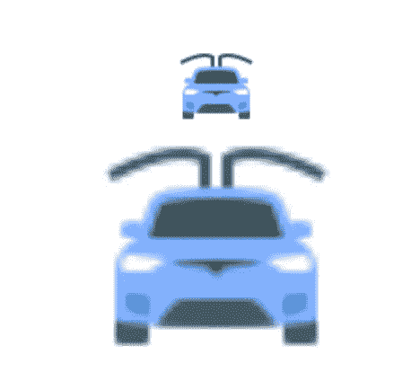

# SwiftUI:规模效应

> 原文：<https://betterprogramming.pub/swiftui-scale-effect-d4bbf987e11f>

## 捏合以放大或缩小内容


凯勒·米纳尔在 [Unsplash](https://unsplash.com/s/photos/mirror-image?utm_source=unsplash&utm_medium=referral&utm_content=creditCopyText) 上拍摄的照片

缩放效果用于放大或缩小内容。你会发现你可以利用规模效应做更多的事情，当我发现它能做什么时，你会和我一样惊讶。

> 相对于锚点，在水平和垂直方向上按给定量缩放此视图的渲染输出—苹果文档

在本教程中，您将了解 SwiftUI 中的缩放效果。您将了解到:

*   如何利用规模效应？

# 先决条件

要学习本教程，您需要了解以下方面的一些基本知识:

*   迅速发生的
*   至少 Xcode 11

# 放缩效应

您可以选择缩放文本或图像。在此示例中，您将使用以下代码缩放图像:

```
.scaleEffect(1.0)
```

第一幅图像是 1.0 的比例效果的示例，第二幅图像是 3.0 的比例效果的示例。



更进一步，您甚至可以使用 *x* 和 *y* 轴进行缩放。这样，你可以调整一侧或两侧。

在 *x* 和 *y* 上缩放:

```
.scaleEffect(x: 5.0, y: 3.0)
```


原始图片来自 mage [汽车和司机 2020 特斯拉 Model-S](https://www.caranddriver.com/tesla/model-s)

仅缩放 *y* :

```
.scaleEffect(x: 5.0, y: 0.8)
```


仅缩放 *x* :

```
.scaleEffect(x: 0.5, y: 3.0)
```


通过使用负数，您将能够垂直或水平翻转它。

这将水平翻转它:

```
.scaleEffect(x: -1, y: 1)
```


这将垂直翻转它:

```
.scaleEffect(x: 1, y: -1)
```


缩放通常发生在中心点，但是您可以使用锚点将其调整为发生在不同的点。

通过缩放效果并将其设置在右下角，图像应该出现在右下角。

```
.scaleEffect(0.4, anchor: .bottomTrailing)
```


# 从这里去哪里

如果你觉得你已经准备好接受更多的挑战，请随时查看我们创建的其他一些教程:

*   [SwiftUI:拖拽手势](https://medium.com/better-programming/swiftui-drag-gesture-2559cf255c5e)
*   [SwiftUI:“旋转效应”](https://medium.com/better-programming/swiftui-rotation-effect-8f1dc116f126)