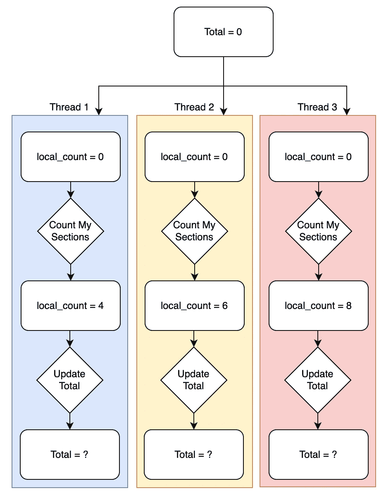

# 同步代码——释放加速器和并行程序的力量

> 原文：<https://betterprogramming.pub/synchronization-letting-accelerator-parallel-developers-run-free-809573b3b86a>

## 用于防止崩溃和错误的锁、信号量、临界区和其他同步结构


照片由[飞:D](https://unsplash.com/@flyd2069?utm_source=medium&utm_medium=referral) 在 [Unsplash](https://unsplash.com?utm_source=medium&utm_medium=referral)

在我的上一篇文章[加速器和并行编程简介](/an-accelerated-and-parallel-programming-introduction-2f91420fb4f0)中，我们讨论了并行编程的基础知识，包括一些简单的方法来获取一个程序并在多个 CPU 或一个加速器上运行它。当然，这篇文章只是触及了并行和加速编程挑战的表面。

一般来说，这些类型的编程使用异步执行模型，这意味着多个计算将同时在一个系统中发生。挑战在于确保这种执行是快速和正确的。

在这篇文章中，我将讨论如何使用同步来确保程序正确运行。

# 线

首先，稍微绕一下术语“线程”，主要是因为键入线程比键入程序的一部分更容易，它与程序的另一部分同时执行，并在一个硬件上反复执行。

在并行程序的上下文中，您编写的代码可能同时运行在多个处理器上。每段同时运行的代码都是一个线程。这听起来可能很复杂，但幸运的是，大多数编程范式允许我们专注于要并行化的内容以及我们希望如何并行化，而不必关注使用线程的具体细节。

# 同步

同步构造强制执行我们线程的顺序。当我们允许线程运行时，我们需要考虑各种事情来确保我们的程序按照我们期望的方式运行，包括:

1.  多个线程是否试图同时访问一个共享资源？
2.  多线程是否需要完成自己的工作后才能进入程序的下一部分？
3.  有没有一些问题会导致我们的程序挂起，以至于所有的线程都因为某种原因而互相等待？

## 为什么同步很重要？

想象一下，我们想做一些简单的事情，比如数体育场里的人数，我们有三个人在数。一个简单的算法是:

1.把体育场分成几部分

2.将每个部分分配给三个人中的一个

3.让每个人清点其指定区域的人数

4.将三个人中的每一个人的价值相加，得到整个体育场的总价值

这看起来很简单，但有一个问题:要对步骤 4 中的值求和，每个人都必须读取当前的总数，加上该值，然后将更新后的总数写在纸上，让其他人都可以看到。所以，实际上，要更新总数，实际上必须发生三个动作(读、加、写)。



图 1

根据图 1，这个问题的正确答案是 18。每个线程都有一个变量，`local_count`,这个变量只在那个线程中创建和使用，这意味着对段的计数独立于其他线程。然而，当线程去更新共享总值时，有一个潜在的问题。

让我们假设线程 1 和线程 2 同时尝试更新`Total`。有可能他们都读取了总数的值`0`，然后将他们的`local_count`加到总数上，这意味着他们认为`Total` 的更新值应该分别是 0+4=4 或 0+6=6。当他们去更新`Total`时，输出可能是 4 或 6。

无论哪种情况，两个线程更新总数后的结果实际上都应该是`10`。这是一场数据竞赛，也是为什么同步对正确性很重要。我们需要确保一次更新一个共享变量。下面是一个使用 OpenMP 的简单例子:

在这个例子中，有三个不同的 OpenMP 编译器指令在工作。

*   `*omp parallel sections*` —告诉编译器并行运行下面代码块中的每个部分(也称为线程中的每个部分)。sections pragma 还会等待，直到块中的每个单独部分都完成。
*   `*omp section*` —告诉编译器下面的代码块是可以在线程上运行的完整部分。
*   `*omp critical*` —告诉编译器只允许一个线程执行下面的代码块，这只是一行代码。

为了编译代码，我使用了支持 OpenMP 的[英特尔 oneAPI DPC++/C++编译器](https://www.intel.com/content/www/us/en/developer/tools/oneapi/dpc-compiler.html)，使用了以下命令:

```
> icx count_sections_omp.cpp -o serial.exe
> icx -fopenmp count_sections_omp.cpp -o parallel.exe
```

第一个命令在不启用 OpenMP 的情况下编译，而第二个命令告诉编译器使用 OpenMP 编译指令。在这种情况下，我的测试系统是我的 HP Envy 16 英寸笔记本电脑，采用英特尔酷睿 i7–12700h 处理器和 32GB 内存。运行两个可执行文件如下所示:

```
>serial.exe
Total=18
Elapsed time in milliseconds: 1570 ms
>parallel.exe
Total=18
Elapsed time in milliseconds: 520 ms
```

您可以看到并行代码和只在一个 CPU 上运行的代码在运行时的差异。

只是为了好玩，我从代码中删除了 omp 关键指令，并运行了几次。经过几次尝试，我得到了以下输出:

```
>parallel.exe
Total=14
Elapsed time in milliseconds: 520 ms
```

在这种情况下，您可以看到第一部分的值(值为 4)不知何故被遗漏了，因为每个线程没有以序列化的方式添加到总数中。

## 资源共享同步

有相当多的同步构造保护对资源的访问，我不能给出所有这些的代码示例。为了让您更深入地了解，我将列出几个例子以及它们的一般用途:

*   临界区—一次只允许一个线程运行受临界区保护的代码。
*   lock/mutex —通过要求每个线程在运行某些代码之前通过锁显式请求访问来保护代码段。这不同于临界区，因为存在多个线程可以同时访问共享资源的情况(例如，下面将讨论的读取器/写入器范例)。
*   信号量——给定一个预定义的数量`N`；这只允许`N`用户同时运行他们的代码。

请注意，如果同步使用不当，可能会导致不正确的结果以及线程无法取得进展或挂起的问题。

# 读者/作者范式

经常使用的并行编程范例之一是读取器/写入器。当有两种类型的用户访问内存中的一些共享值时，使用这种同步:

*   读者—需要知道共享的价值
*   writer —需要更新共享值

想想看，多个读者可以同时查看一个值，因为他们将总是看到与其余值相同的值。但是，当写入方需要更新该值时，它必须防止其他人读取或写入该值。这确保了程序中所有读者和作者的值是一致的。

为了更具体地说明这一点，让我们看一个 SYCL 中的例子，看看读取器/写入器的使用如何影响程序的行为和性能。

## 读者/作者 SYCL 示例

让我们看看 SYCL 如何使用读/写器同步来控制对数组的访问。

您可以看到读取和写入功能基本相同。需要了解的一些关键事项:

*   第 18 行— `Read()`创建一个`sycl::access::mode::read`访问器
*   第 34 行— `Write()`创建一个`sycl::access::mode::write`访问器
*   第 16 行和第 32 行—提交到所选计算设备的队列。这是异步的，所以代码会在任务完成之前返回
*   第 25 行和第 41 行—将一个任务放入要执行的队列中

此外，为了让测试更容易理解，我通过旋转`WORK_ITERS`变量将`doWork()`函数设置为在我的特定机器上运行大约一秒钟。如果你自己测试，你可能想调整一下，让测试更快或更慢。

现在我们已经有了核心读写函数，让我们看看读写访问模式如何影响程序:

对于这个程序，感兴趣的行是 25–41，每个循环迭代`NUM_ACCOUNTS (8)`次。考虑到读取器/写入器同步的工作方式，运行同步的时间应该是:

*   第 25–28 行:对我们的缓冲区执行八次读取(一秒钟，并行发生)
*   第 31–34 行:对我们的缓冲区执行八次写操作(八秒，按顺序运行)
*   第 37–40 行:对我们的缓冲区执行八次写操作(一秒钟，并行发生)

请注意，第 41 行导致程序在继续之前等待队列中的所有异步操作完成。

我再次使用[英特尔 DPC++编译器](https://www.intel.com/content/www/us/en/developer/tools/oneapi/dpc-compiler.html)编译并运行我的代码:

```
>icx -fsycl read_write_sycl.cpp
>read_write_sycl.exe
Running on device: 12th Gen Intel(R) Core(TM) i7-12700H
Pass
Elapsed time in milliseconds: 11105 ms
```

我们的运行时间接近我们预期的 10 秒。

## 读者/作者对关键部分

为了理解读取器/写入器的价值，想象一下，如果我们不使用读取器/写入器结构，而是使用一种锁定机制，其中读取和写入都被视为需要独占访问。

为了模拟这种情况，我更新了我的`Read()`中的第 18 行，如下所示以使用写锁(一次一个访问):

```
auto acc = buf.get_access<sycl::access::mode::read>(h);
auto acc = buf.get_access<sycl::access::mode::write>(h);
```

重新编译并运行我的代码，我得到以下输出:

```
>read_write_sycl.exe
Running on device: 12th Gen Intel(R) Core(TM) i7–12700H
Pass
Elapsed time in milliseconds: 24035 ms
```

将代码运行方式与读写器代码进行比较，细分如下:

*   第 25–28 行:对我们的缓冲区执行八次读取(八秒，按顺序运行)
*   第 31–34 行:对我们的缓冲区执行八次写操作(八秒，按顺序运行)
*   第 37–40 行:对我们的缓冲区执行八次写操作(八秒，按顺序运行)

这意味着读者/作者总是更好，但事实并非如此。读/写锁是一个更复杂的同步结构，运行时开销更大，所以在选择使用什么同步时要记住这一点。

如果你对 SYCL 以及它如何帮助你用同步结构保护数据感兴趣，你可以看看这个[SYCL 基础介绍视频](https://www.intel.com/content/www/us/en/events/on365/sycl-basics.html)。

# 结论

加速器和并行编程在正确使用时可以给我们更快的应用和程序。但是就像生活中的大多数事情一样，好处并不总是免费的。在这种情况下，当我们希望在更快、更多样化的计算硬件上运行我们的程序时，我们还必须学习和理解帮助我们面对加速器和并行计算带来的挑战的 API。

这篇文章只是触及了同步的表面和加速器编程的陷阱。下一次，我将讨论为什么在您进行性能编程时，对目标加速器架构有一个基本的了解会很重要。

```
**Want to Connect?**If you want to see what random tech news I’m reading, you can [follow me](https://twitter.com/tonymongkolsmai) on Twitter. Also, check out [Code Together](https://connectedsocialmedia.com/category/code-together/), an Intel podcast for developers that I host where we talk tech.
```