# Synthwave 场景——我最酷的 Three.js 项目

> 原文：<https://betterprogramming.pub/synthwave-scene-my-coolest-three-js-project-yet-6359c38dfd08>

## 我的代码的详细演练

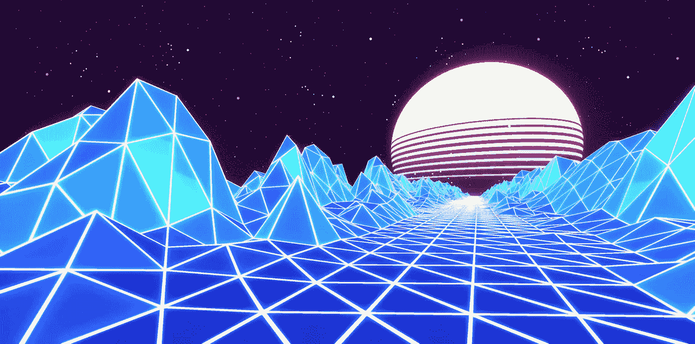

大约两年前，我完全迷上了 YouTube 上的 Retrowave/Synthwave 音乐。我真的很喜欢音乐和视觉的复古未来主义美学——一个向前移动的视角，展示了一个超级酷的永不结束的霓虹网格，夕阳就在地平线上。从那以后，我一直想用 Three.js 重新创建一个“Synthwave 场景”

我记得去年我第一次尝试，但我在某个时候卡住了，很快就感到沮丧，最后放弃了。老实说，重现场景不是一件简单的工作，对初学者来说更是如此。我为自己最终创造了一个像样的 Synthwave 场景感到非常自豪。现在，我将带你一步一步地完成创建相同场景的过程。

先说细分。

# 教程分解

1.  现场演示
2.  构建地形的方法
3.  项目的代码结构
4.  设置场景环境
5.  为地形⛰设置平面几何体
6.  在地形上创建亮/霓虹网格线
7.  创造一个没有尽头的地形的幻觉
8.  添加落日☀并制作动画
9.  添加 GUI 控件以在运行时调整参数
10.  用 Bloom 效果对场景进行后期处理，让它看起来更酷！

# 1.现场演示

像往常一样，先看看你要建立什么！这个演示是托管在我的代码沙盒帐户。在更大的窗口里看起来更好，不那么笨重。

很酷的场景吧？

如果你想看完整的代码，请查看 https://github.com/franky-adl/threejs-synthwave-scene 的。

# 2.构建地形的方法

这一节解释了如何处理在制作地形几何图形时遇到的问题，这真的有助于你理解我在幕后的思考过程。这会变得有点长，所以如果你想马上进入代码，跳到下一节。

制作 synthwave 场景要克服的第一个障碍是生成地形。我们将制作一个中间平坦的地形作为道路，两边崎岖不平的地形作为山脉。有不同的方法生成地形；有些在你脑海中看起来很容易，但当你尝试编码时却很难。为了更深入地了解地形问题，实际上有三个主要问题:

A.我们应该使用什么样的几何图形？
B .如何使地形中间平坦而两边凹凸不平？
C .如何制作地形动画来伪造一个无尽的道路效果？

让我们一个一个来。

## **A .我们应该使用什么样的几何图形？**

乍一看，你可能认为`PlaneGeometry`是显而易见的选择；是的，但也有一些曲折。有很重要的一点要记住:霓虹灯线必须匹配这个平面几何的线框；比方说，如果霓虹灯线不沿着你的`PlaneGeometry`网格中的对角线，你会看到相邻的三角形面的阴影在对角线上变化，但是如果没有一条线来切断阴影的变化，视觉效果会看起来很奇怪。因此，如果你使用香草`PlaneGeometry`作为地形的基础几何图形，你的霓虹线也需要追踪除垂直和水平网格线之外的所有对角线，缺点是使中央通道看起来不对称。

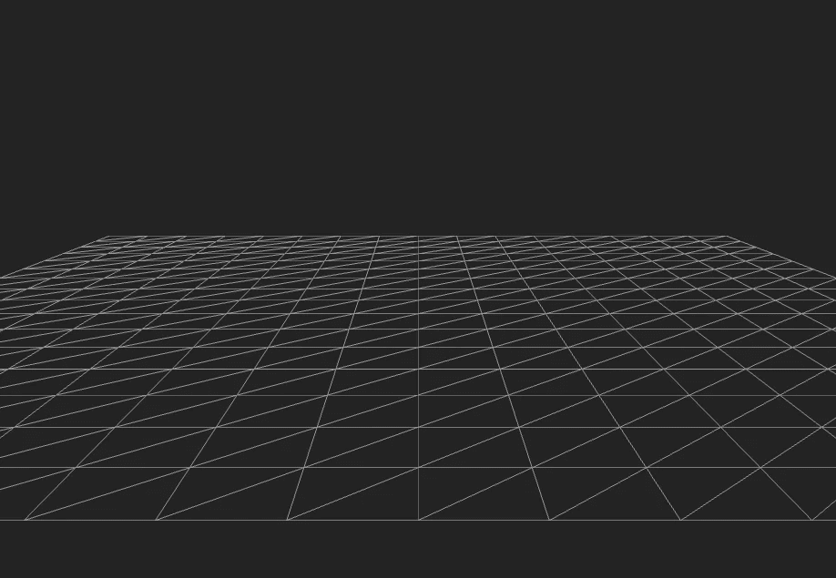

普通平面几何的线框

如果我们想避免对角线问题，有 3 个选择。

1.  将整个`PlaneGeometry`旋转 45 度！
2.  制作一个自定义的`BufferGeometry`，它是旋转方块的镶嵌。
3.  在 y 方向剪切`PlaneGeometry`，直到你有一个对称三角形的镶嵌！

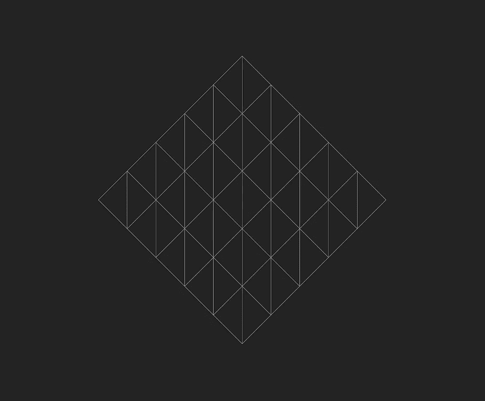

左:选项 1 将平面旋转 45 度，右:选项 2 进行自定义缓冲测量

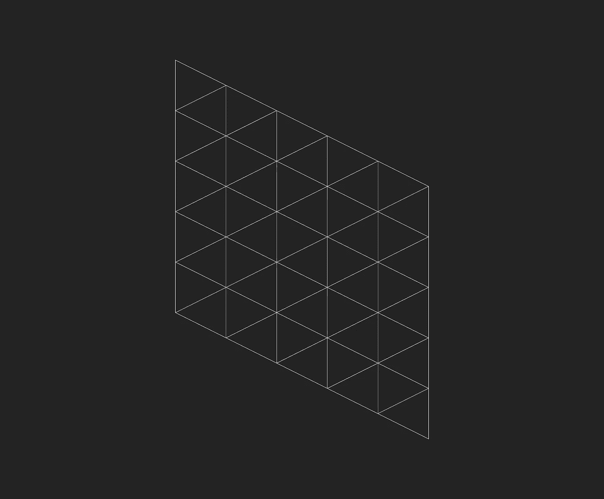

选项 3:使用`matrix.makeShear()`剪切平面，xy 设置为-0.5

你可能会说，嘿，有选项 4，这是简单地使用一个正方形网格！遗憾的是，这不是一个可行的选择，因为三角形最终是 Three.js 的基本构建块；据我所知，不可能用纯正方形来堆叠网格。

因此，让我们考虑 3 个选项。请记住，我们需要在地形中铺设一条很长的道路，因此我们可能需要复制和连接飞机，以便使它更长。

*   对于选项 1，从头到脚连接多个旋转的平面会产生一个明显的问题:它们之间会有很大的空白空间。将一个指向前方的菱形镶嵌成一条道路是非常痛苦和低效的。
*   对于选项 2，自定义几何图形看起来不错，但是开销太高；你将不得不自己计算和设置顶点的位置，并且精确地连接平面更加复杂。
*   对于选项 3，只需要 2-3 行代码就可以剪切它，直到三角形对对称。开销很小。虽然整个平面被对角拉伸，但仍然很容易将平面相乘并连接起来，如果我们正确设置相机和动画循环，观众不会注意到剪切。

选项 3 是赢家👑！

## **B .如何让地形中间平坦而两边凹凸不平？**

我们首先需要一张高度图。不管你是用手工还是用一些生成代码来做，都应该是黑白图像，白色代表最高，黑色代表最低。我在 Affinity Designer 中使用径向渐变和纹理笔刷生成了我的。显然，我们需要保持中央垂直矩形区域为黑色，以便将其作为道路铺设。

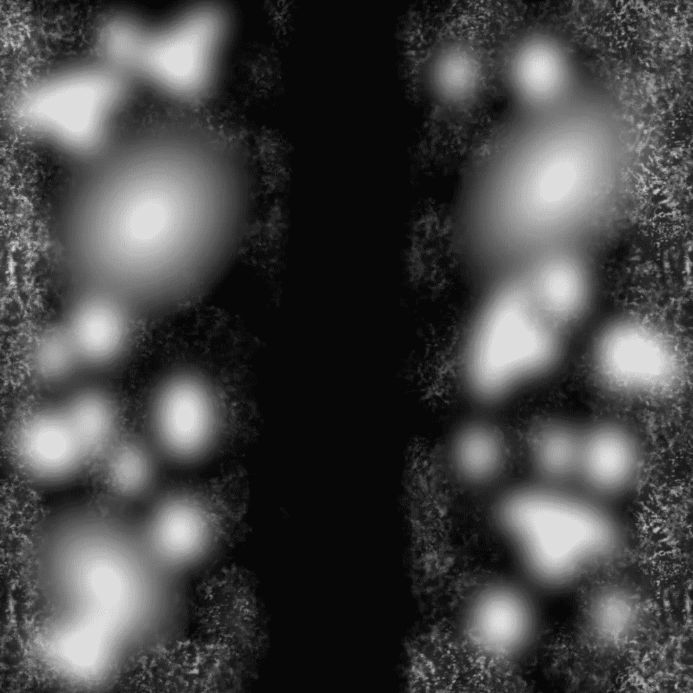

我在合成波场景中使用的高度图

下一个问题是用这个高度图中的高度数据来渲染我们的平面几何。我尝试的第一件事是使用`TextureLoader`加载高度图图像，然后将纹理分配给`MeshStandardMaterial`的`displacementMap`属性。但是这种方法不适用于以后创建的霓虹线(我将在霓虹线部分解释原因),因为`displacementMap`属性只在运行时更新`vertexShader`程序中的顶点位置，我们的主 js 程序中的平面几何对象的 positions 数组不受影响。

因此，我不得不手动从位移贴图中提取灰度值，缩放它，并将其值直接分配给我们的几何对象的每个顶点的 z 位置值。我发现我们甚至不需要手动计算法线，灯光只是以某种方式工作！

## 如何制作地形动画来模拟一个无尽的道路效果？

这个问题存在于很多需要某种无尽之路的游戏/动画中。我敢肯定，这是解决了很多次，反反复复。是的，这个问题本身很容易解决，但在我们的情况下，有一个额外的复杂性(将在下一段解释)。大局依旧；假设我们有多个平面实例连接在一起形成我们的道路，我们让它们像火车一样向相机加速，这样从相机的角度看，我们就像是在前进。一旦火车的车头在我们的相机后面，我们就把它的位置调回到火车的尾部，这就是如何让我们的路看起来没有尽头。

额外的问题是，我们如何确保平面实例在它们的连接处完美地结合在一起，没有间隙。想象一下，对所有平面实例使用相同的`heightmap`，高度图的顶行像素很可能与底行像素不匹配，自然，您会看到这样的间隙:

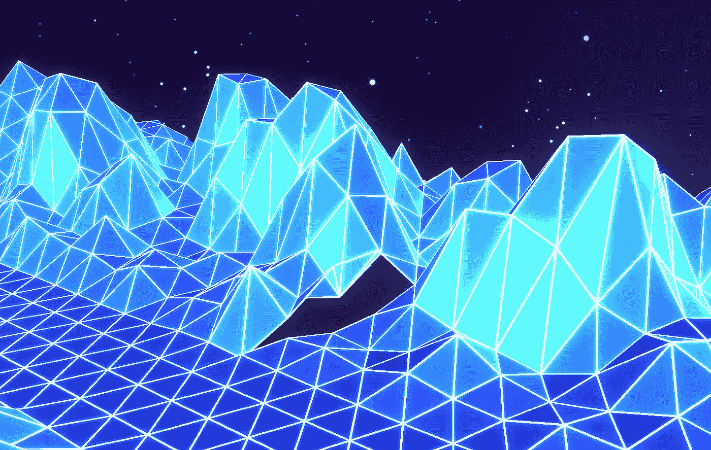

平面实例之间的间隙，如果它们没有完全从上到下缝合

解决方案其实很简单。您可以编辑您的高度图图像，复制顶行像素并将其粘贴在底行像素的顶部。那行得通。

但我更喜欢编程的方式，因为如果你想在高度图图像之间切换，程序会自动为你做完美的缝合，这样你就不必每次想尝试新的`heightmap`时都亲自做缝合工作。

# 3.项目的代码结构

我从我的自定义模板开始这个项目，在 https://github.com/franky-adl/threejs-starter-template 公开托管。编写本教程时，假设您使用此初学者模板开始项目。

当然，您可以使用任何您喜欢的样板文件或设置，然后您必须做一些小的代码翻译，使我的代码为您的设置工作。关于这个初学者模板如何工作的更多细节，你可以在这里阅读我以前的文章。

现在，让我简单介绍一下代码的结构。

项目文件层次结构:

```
.
├── src
│   └── assets
│       ├── heightmap.png
│       └── Starfield.png
│   ├── common-utils.js
│   ├── core-utils.js
│   ├── functions.js
│   ├── index.html
│   └── index.js
├── .gitignore
├── package-lock.json
└── package.json
```

我们所有的代码和图片基本上都在`src`文件夹里。在`package.json`中，我们只有 3 个依赖项:

*   `three@0.145.0`:three . js 库
*   `dat.gui@0.7.9`:GUI 控件库
*   `parcel@2.7.0`:捆扎机工具

在`src`中，将所有的纹理/图像保存在`assets`子文件夹下。

包含大部分场景构建代码的文件是`index.js`文件。

`core-utils.js`包含一些方便的方法，用于设置大多数 Three.js 项目中需要的公共对象(即相机、渲染器、合成器、窗口大小调整监听器、鼠标`onmove`监听器、动画循环)。

`common-utils.js`有一些更方便的方法，我自己发现这些方法在 Three.js 项目中很有用(例如，支持 async/await 的图像加载函数，十六进制到 rgb 的转换器等等)。

`functions.js`包含了在这个项目中使用的函数，这些函数有助于从主 js 文件中取出部分代码，使其可读性更好，体积更小。

`index.html`是 package bundler 的入口点，它有一个请求`index.js`文件的脚本标签。

# 4.设置场景环境

让我们假设我们使用我的`[threejs-starter-template](https://github.com/franky-adl/threejs-starter-template)`开始这个项目。运行以下命令将打开一个选项卡，显示一些灯箱后面的旋转圆环。

```
git clone https://github.com/franky-adl/threejs-starter-template
cd threejs-starter-template
npm i
npm run start
```

根据自己的喜好，在不同的地方重命名项目名称`threejs-starter-template`。场景中的物体只是为了演示，我们需要移除它们，这样我们就可以重新开始。

进行清理，并用以下代码替换`index.js`的内容:

```
// ThreeJS and Third-party deps
import * as THREE from "three"
import * as dat from 'dat.gui'
import Stats from "three/examples/jsm/libs/stats.module"
import { OrbitControls } from "three/examples/jsm/controls/OrbitControls"

// Core boilerplate code deps
import { createCamera, createComposer, createRenderer, runApp } from "./core-utils"

global.THREE = THREE

/**************************************************
 * 0\. Tweakable parameters for the scene
 *************************************************/
const params = {
  // general scene params
}

/**************************************************
 * 1\. Initialize core threejs components
 *************************************************/
// Create the scene
let scene = new THREE.Scene()

// Create the renderer via 'createRenderer',
// 1st param receives additional WebGLRenderer properties
// 2nd param receives a custom callback to further configure the renderer
let renderer = createRenderer({ antialias: true })

// Create the camera
// Pass in fov, near, far and camera position respectively
let camera = createCamera(45, 1, 1000, { x: 0, y: 5, z: -15 })

// The RenderPass is already created in 'createComposer'
let composer = createComposer(renderer, scene, camera, (comp) => {
})

/**************************************************
 * 2\. Build your scene in this threejs app
 * This app object needs to consist of at least the async initScene() function (it is async so the animate function can wait for initScene() to finish before being called)
 * initScene() is called after a basic threejs environment has been set up, you can add objects/lighting to you scene in initScene()
 * if your app needs to animate things(i.e. not static), include a updateScene(interval, elapsed) function in the app as well
 *************************************************/
let app = {
  async initScene() {
    // OrbitControls
    this.controls = new OrbitControls(camera, renderer.domElement)
    this.controls.enableDamping = true

    // GUI controls
    const gui = new dat.GUI()

    // Stats - show fps
    this.stats1 = new Stats()
    this.stats1.showPanel(0) // Panel 0 = fps
    this.stats1.domElement.style.cssText = "position:absolute;top:0px;left:0px;"
    // this.container is the parent DOM element of the threejs canvas element
    this.container.appendChild(this.stats1.domElement)
  },
  // @param {number} interval - time elapsed between 2 frames
  // @param {number} elapsed - total time elapsed since app start
  updateScene(interval, elapsed) {
    this.controls.update()
    this.stats1.update()
  }
}

/**************************************************
 * 3\. Run the app
 * 'runApp' will do most of the boilerplate setup code for you:
 * e.g. HTML container, window resize listener, mouse move/touch listener for shader uniforms, THREE.Clock() for animation
 * Executing this line puts everything together and runs the app
 * ps. if you don't use custom shaders, pass undefined to the 'uniforms'(2nd-last) param
 * ps. if you don't use post-processing, pass undefined to the 'composer'(last) param
 *************************************************/
runApp(app, scene, renderer, camera, true, undefined, composer)
```

然后，从资产文件夹中移除`checker_tile.png`。

现在运行`npm run start`应该会给你一个黑屏，在左上角只有 fps 计数器。从现在开始保存对文件的代码更改将触发 packet bundler 自动重新构建，并且您的 Three.js 浏览器选项卡将自动刷新。

```
% npm run start

> threejs-synthwave-scene@1.0.0 start
> parcel src/index.html --open

Server running at http://localhost:1234
✨ Built in 1.21s
```

让我们先放一张背景图片吧！

将 [my synthwave repo](https://github.com/franky-adl/threejs-synthwave-scene) 中的`Starfield.png`复制到 assets 文件夹中。

用以下内容创建一个新文件`functions.js`:

```
import { maintainBgAspect } from "./common-utils"

/**
 * @param {object} scene the Three.js scene object
 * @param {object} image the path to the background image
 * @returns a Promise that resolves after the texture is loaded as the scene's background
 */
export const loadSceneBackground = (scene, image) => {
  return new Promise((resolve, reject) => {
    var loader = new THREE.TextureLoader();
    loader.load(image, function (texture) {
      scene.background = texture
      // position scene background such that image aspect ratio is preserved
      maintainBgAspect(scene, texture.image.width, texture.image.height)
      // need to maintain background aspect ratio across window resizes
      window.addEventListener("resize", () => {
        maintainBgAspect(scene, texture.image.width, texture.image.height)
      })
      resolve()
    }, undefined, function (error) {
      console.log(error)
      reject(error)
    });
  })
}
```

我们用一个`Promise`包装`TextureLoader.load()`函数的回调，这样我们就可以在`async initScene()`函数中使用`loadSceneBackground`上的`await`表达式。

我们希望这个`Promise`只有在纹理被加载时才能被解析，这就是为什么我们在传递给`loader.load()`的`onLoad`回调中调用`resolve()`。这确保了我们的场景只有在背景完全加载后才被揭开。由于`core-utils.js`中的`runApp()`函数中的代码，该揭示机制起作用:

```
app.initScene().then(() => {
  const veil = document.getElementById("veil")
  veil.style.opacity = 0
  return true
})
```

后台加载函数就绪后，我们需要在主程序中执行它。

对`index.js`进行以下代码更改:

```
+ import { loadSceneBackground } from "./functions"
+ import Background from "./assets/Starfield.png"

...

let app = {
  async initScene() {
    // OrbitControls
    this.controls = new OrbitControls(camera, renderer.domElement)
    this.controls.enableDamping = true

+   // Environment
+   await loadSceneBackground(scene, Background)
```

现在我们有了繁星满天的夜空！很好很容易。

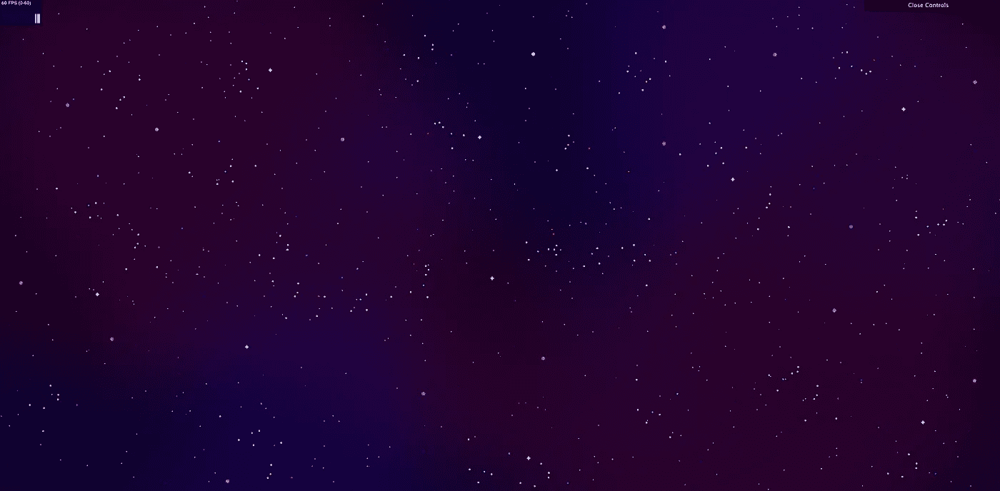

# 5.为地形⛰设置平面几何体

首先，将我的`synthwave`回购中的`heightmap.png`复制到 assets 文件夹中。

接下来，将下面的代码添加到`common-utils.js`中:

```
/**
 * This loadImage function returns a Promise that is resolved when the image finishes loading
 * if you use it with await, it returns the loaded image object
 * @param {string} path image file path
 * @returns a Promise that resolves with the value assigned as the loaded image
 */
export const loadImage = (path) => {
    return new Promise((resolve, reject) => {
        const img = new Image()
        img.crossOrigin = "Anonymous" // to avoid CORS if used with Canvas
        img.src = path
        img.onload = () => {
            resolve(img)
        }
        img.onerror = (e) => {
            reject(e)
        }
    })
}
```

我们将使用这个函数来同步加载我们的`heightmap`。

然后，将以下代码追加到`functions.js`中:

```
/**
 * original reference: https://gist.github.com/jawdatls/465d82f2158e1c4ce161
 * This function lets you get the greyscale color value from a specific point in an image
 * In this scenario, we pass in a displacement map as imageData,
 * and u/v values which gets translated to a certain point on the image
 * getting either one of r/g/b value as the displacement value is the same
 * since the image is supposed to be black and white
 * note that the direction of v axis in texture data is the inverse of the y axis in image data
 *
 * @param {object} imageData the color data of the displacement map image to be passed in
 * @param {number} u the x position [0,1] of the target pixel
 * @param {number} v the y position [0,1] of the target pixel
 * @param {number} cvWidth the width of the heightmap image in canvas
 * @param {number} cvHeight the height of the heightmap image in canvas
 * @returns {number} height value of the requested point within [0,5]
 */
export function getZFromImageDataPoint(imageData, u, v, cvWidth, cvHeight) {
  const mapWidth = cvWidth
  const mapHeight = cvHeight
  const displacementScale = 5
  var x = Math.round(u * (mapWidth - 1))
  var y = Math.round((1 - v) * (mapHeight - 1))
  var index = (y * imageData.width + x) * 4
  var red = imageData.data[index]
  return red / 255 * displacementScale
}
```

我们将使用该函数从`heightmap.png`中提取每个平面顶点对应像素的高度值。

该函数的`u`和`v`输入正好是平面顶点的 uv 值。该函数将 uv 坐标转换为图像坐标。

对于这一行代码`var index = (y * imageData.width + x) * 4`，`y`和`x`是图像数据中映射的行号和列号，乘以 4 是因为`imageData.data` 顺序存储所有像素的颜色值(即【r，g，b，a，r，g，b，a，…】)。

因此，产生的`index`是每个像素的第一个颜色通道，为红色。我们得到哪个颜色通道并不重要，因为高度图是黑白的。

最后，我们将该值放大 5 倍。因此，该函数的返回值在[0，5]的范围内。

让我们在`index.js`中进行以下代码更改:

```
+ import { loadImage } from "./common-utils"
- import { loadSceneBackground } from "./functions"
+ import { loadSceneBackground, getZFromImageDataPoint } from "./functions"
import Background from "./assets/Starfield.png"
+ import HeightMap from "./assets/heightmap.png"

global.THREE = THREE

/**************************************************
 * 0\. Tweakable parameters for the scene
 *************************************************/
const params = {
  // general scene params
+ dirLightColor1: 0x2dd7ff,
+ dirLightColor2: 0x2dd7ff,
+ // plane params
+ metalness: 0.2,
+ roughness: 0.7,
+ meshColor: 0xffffff,
+ meshEmissive: 0x000098,
}
+ const terrainWidth = 30
+ const terrainHeight = 30
+ const lightPos1 = {
+   x: 15,
+   y: 1,
+   z: 5
+ }
+ const lightIntensity1 = 0.85
+ const lightPos2 = {
+   x: -15,
+   y: 1,
+   z: 5
+ }
+ const lightIntensity2 = 0.85

...

- let camera = createCamera(45, 1, 1000, { x: 0, y: 5, z: -15 })
+ let camera = createCamera(70, 1, 120, { x: 0, y: 0, z: 2.4 })

...

let app = {
  async initScene() {
    // OrbitControls
    this.controls = new OrbitControls(camera, renderer.domElement)
    this.controls.enableDamping = true

    // Environment
    await loadSceneBackground(scene, Background)

+   // Lighting
+   this.dirLight1 = new THREE.DirectionalLight(params.dirLightColor1, lightIntensity1)
+   this.dirLight1.position.set(lightPos1.x, lightPos1.y, lightPos1.z)
+   scene.add(this.dirLight1)
+   this.dirLight2 = new THREE.DirectionalLight(params.dirLightColor2, lightIntensity2)
+   this.dirLight2.position.set(lightPos2.x, lightPos2.y, lightPos2.z)
+   scene.add(this.dirLight2)

+   // load heightmap to a new image first, then read its color data to set the heights of our plane vertices
+   // see: https://gist.github.com/jawdatls/465d82f2158e1c4ce161
+   let hm_image = await loadImage(HeightMap)
+   var canvas = document.createElement("canvas")
+   canvas.width = hm_image.width
+   canvas.height = hm_image.height
+   var context = canvas.getContext("2d")
+   context.drawImage(hm_image, 0, 0)
+   var hm_imageData = context.getImageData(0, 0, canvas.width, canvas.height)

+   // Create a PlaneGeom
+   let planeGeometry = new THREE.PlaneGeometry(terrainWidth, terrainHeight, terrainWidth, terrainHeight)
+   let geometryPositions = planeGeometry.getAttribute("position").array
+   let geometryUVs = planeGeometry.getAttribute("uv").array

+   // update each vertex position's z value according to the value we extracted from the heightmap image
+   for (let index = 0; index < geometryUVs.length / 2; index++) {
+     let vertexU = geometryUVs[index * 2]
+     let vertexV = geometryUVs[index * 2 + 1]
+     // Update the z positions according to height map
+     let terrainHeight = getZFromImageDataPoint(hm_imageData, vertexU, vertexV, canvas.width, canvas.height)
+     geometryPositions[index * 3 + 2] = terrainHeight
+   }
+   // skew the plane geometry
+   const shearMtx = new THREE.Matrix4()
+   shearMtx.makeShear(-0.5, 0, 0, 0, 0, 0)
+   planeGeometry.applyMatrix4(shearMtx)

+   // material for the plane geometry
+   let meshMaterial = new THREE.MeshStandardMaterial({
+     color: new THREE.Color(params.meshColor),
+     emissive: new THREE.Color(params.meshEmissive),
+     metalness: params.metalness,
+     roughness: params.roughness,
+     flatShading: true
+   })

+   // create plane mesh and add to scene
+   let mesh = new THREE.Mesh(planeGeometry, meshMaterial)
+   mesh.position.set(0, -1.5, 0)
+   mesh.rotation.x -= Math.PI / 2
+   scene.add(mesh)

    // GUI controls
    const gui = new dat.GUI()
```

这是怎么回事？首先，我们添加依赖关系和必要的变量，用于设置照明和平面几何体+材质。我们还更新了摄像机，以便更好地观察我们的场景；我喜欢使用更大的`fov`，这样场景看起来更宽。

然后在`initScene()`中，我们添加了两个`DirectionalLight`来照射左右两边的山体。如果没有光线，整个地形会有相同的颜色，没有明暗变化。

之后，我们创建一个`canvas`对象来存储加载的高度图图像，并通过`context.getImageData()`将图像数据保存到`hm_imageData`中。不要担心，这个画布没有添加到文档中，因此在屏幕上是不可见的。

然后我们创建一个具有相同宽度和高度(设置为 30)的正方形`planeGeometry`，为简单起见，宽度/高度段也具有相同的值。我们从普通的`PlaneGeometry`中提取出`BufferAttribute`中的`position`和`uv`数组以备后用。

然后我们遍历所有的顶点来设置每个顶点的高度值。我们使用`getZFromImageDataPoint()`来获得高度图上每个顶点对应的高度值。看看 for 循环，`geometryUVs.length / 2`表示顶点的总数，因为`BufferAttribute`数组在一个层中顺序存储值，而不是嵌套每个顶点的 x，y，z 或 u，v 值；见下图。

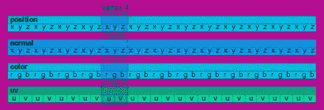

每个 BufferAttribute 的数组结构，图片来自[https://threejs.org/manual/#en/custom-buffergeometry](https://threejs.org/manual/#en/custom-buffergeometry)

这就是为什么在`geometryPositions[index * 3 + 2]`中，we 乘以 3 因为每个顶点有 3 个位置值 x，y，z，加 2 就是得到 z 值。

现在我们已经为每个顶点设置了正确的高度，我们仍然需要沿着 y 方向剪切平面。我没有真正深入到`makeShear`函数的源代码中，但是如果我没有弄错的话，用`0.5`剪切它应该是正确的幅度。

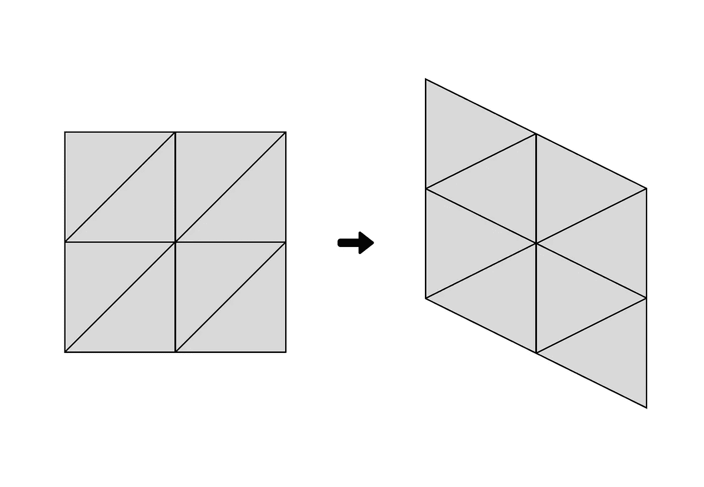

我们想沿着 y 轴剪切它，直到图案看起来像一对对称三角形的组合

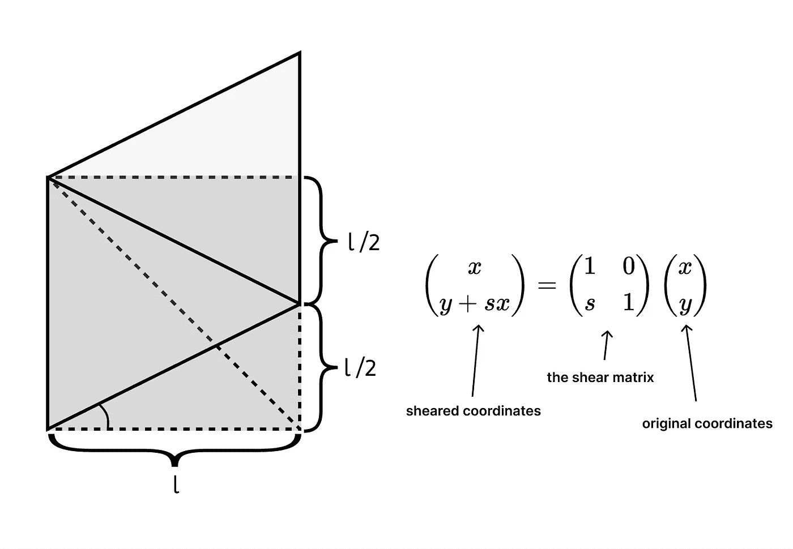

虚线表示普通平面几何形状的一个单元，实线表示剪切状态

我们创建的普通平面几何体由正方形组成，因为宽度和高度值与宽度和高度部分相同。我们想在 y 方向剪切它一半的正方形长度`l/2`。查看上面简化的 2d 剪切方程，如果我们将剪切因子`s`设置为 0.5，那么我们得到的坐标将是`(x, y + 0.5x)`。代入`x = l`，剪切的量就是`l/2`，这就是我们想要的量。

[这个视频](https://www.youtube.com/watch?v=cxbTV5Jjm6s)很好地解释了剪切概念。

对于平面材质，我们使用`MeshStandardMaterial`，因此我们可以使用`metalness`和`roughness`进行调整。打开`flatShading`很重要，因为视觉样式更适合低多边形的对象。

应用所有更改后，您的场景现在应该如下所示:

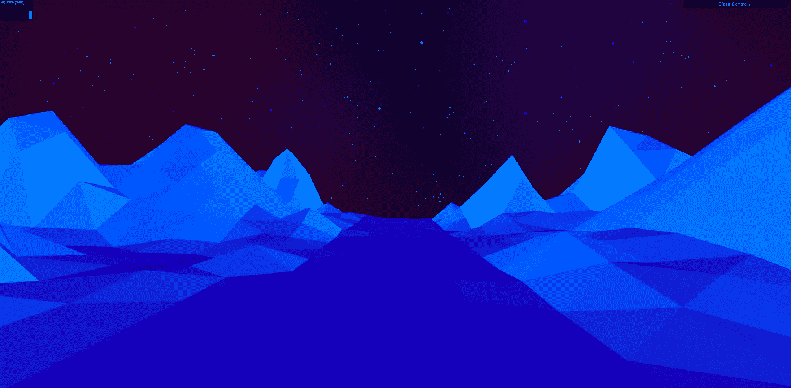

# 6.在地形上创建亮/霓虹网格线

最初，我尝试使用`WireframeGeometry`和`LineSegments`来创建网格线，但是有一个严重的限制。遗憾的是，使用的`LineBasicMaterial`被限制为`linewidth`总是为 1，而不管设置了什么值。

幸运的是，还有另一种方法来实现可配置粗细的线条。按照[这个例子](https://threejs.org/examples/?q=fat#webgl_lines_fat)演示的方法，我们能够控制线条的粗细。但是如果我们要实现这个方法，我们将需要注入了高度图数据的平面几何的顶点位置。

这就是为什么需要手动计算每个顶点的 z 值，而不是简单地将`heightmap`分配给材质的`displacementMap`属性(如第 2 节所述)。

在`index.js`中进行以下更改:

```
import Stats from "three/examples/jsm/libs/stats.module"
import { OrbitControls } from "three/examples/jsm/controls/OrbitControls"
+ import { LineGeometry } from "three/examples/jsm/lines/LineGeometry"
+ import { LineMaterial } from "three/examples/jsm/lines/LineMaterial"
+ import { Line2 } from "three/examples/jsm/lines/Line2"

...

const params = {
  // general scene params
  dirLightColor1: 0x2dd7ff,
  dirLightColor2: 0x2dd7ff,
  // plane params
  metalness: 0.2,
  roughness: 0.7,
  meshColor: 0xffffff,
  meshEmissive: 0x000098,
+ lineWidth: 0.04,
+ lineColor: 0xcee4ff,
}

...

- let renderer = createRenderer({ antialias: true }, (_renderer) => {
+ let renderer = createRenderer({ antialias: true, logarithmicDepthBuffer: true }, (_renderer) => {

...

let app = {
  async initScene() {
    ...

+   // the grid lines, reference: https://threejs.org/examples/?q=line#webgl_lines_fat
+   let lineGeometry = new LineGeometry()
+   let linePositions = []
+   // This is a specific way to map line points to cooresponding vertices of the planeGeometry
+   for (let row = 0; row < terrainHeight; row++) {
+     let isEvenRow = row % 2 == 0
+     for (let col = (isEvenRow ? 0 : (terrainWidth - 1)); isEvenRow ? (col < terrainWidth) : (col >= 0); isEvenRow ? col++ : col--) {
+       for (let point = (isEvenRow ? 0 : 3); isEvenRow ? (point < 4) : (point >= 0); isEvenRow ? point++ : point--) {
+         let mappedIndex
+         let rowOffset = row * (terrainWidth + 1)
+         if (point < 2) {
+           mappedIndex = rowOffset + col + point
+         } else {
+           mappedIndex = rowOffset + col + point + terrainWidth - 1
+         }

+         linePositions.push(geometryPositions[mappedIndex * 3])
+         linePositions.push(geometryPositions[mappedIndex * 3 + 1])
+         linePositions.push(geometryPositions[mappedIndex * 3 + 2])
+       }
+     }
+   }
+   lineGeometry.setPositions(linePositions)

+   // the material for the grid lines
+   let lineMaterial = new LineMaterial({
+     color: params.lineColor,
+     linewidth: params.lineWidth, // in world units with size attenuation, pixels otherwise
+     alphaToCoverage: false,
+     worldUnits: true // such that line width depends on world distance
+   })

    // create plane mesh and add to scene
    let mesh = new THREE.Mesh(planeGeometry, meshMaterial)
    mesh.position.set(0, -1.5, 0)
    mesh.rotation.x -= Math.PI / 2
    scene.add(mesh)

+   // create the lines mesh and add to scene
+   let line = new Line2(lineGeometry, lineMaterial)
+   line.computeLineDistances()
+   line.position.set(0, -1.5, 0)
+   line.rotation.x -= Math.PI / 2
+   scene.add(line)

    // GUI controls
    const gui = new dat.GUI()
```

注意，我们打开了渲染器的`logarithmicDepthBuffer`。此配置修复了网格线和平面几何体之间的 z 战斗问题。在[https://threejs.org/manual/#en/cameras](https://threejs.org/manual/#en/cameras)的下半部分阅读更多关于这个问题的内容。

另外，请注意，`LineGeometry`、`LineMaterial`和`Line2`类不是来自核心的 Three.js 库。它们是从`jsm`文件夹导入的。

`LineGeometry`的工作方式是它需要一个顶点位置的顺序数组，然后它会画一条线，以相同的顺序连接位置数组中指定的点。所以基本上只画了一条线，从头到尾。

三重嵌套的 for 循环代码块所做的是正确设置顶点的顺序数组。我用一个简单的例子来解释。

比方说如果我们根本不计算`linePositions`直接用平面几何的`geometryPositions`:

```
lineGeometry.setPositions(geometryPositions)
```

你看到的会是混乱的:

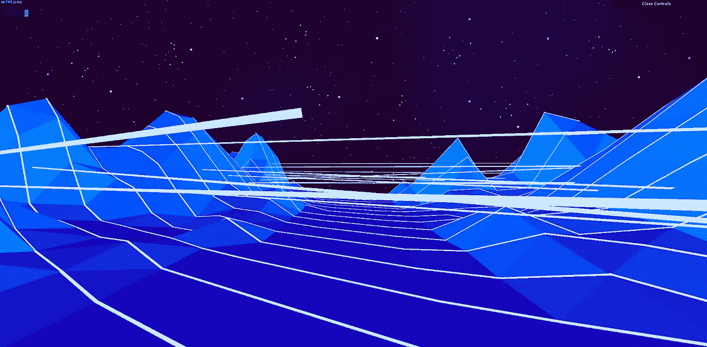

原因是顶点位置的默认顺序是从左到右逐行排列的。查看带有数字辅助对象的平面几何体，这些辅助对象标记了下面的每个顶点:

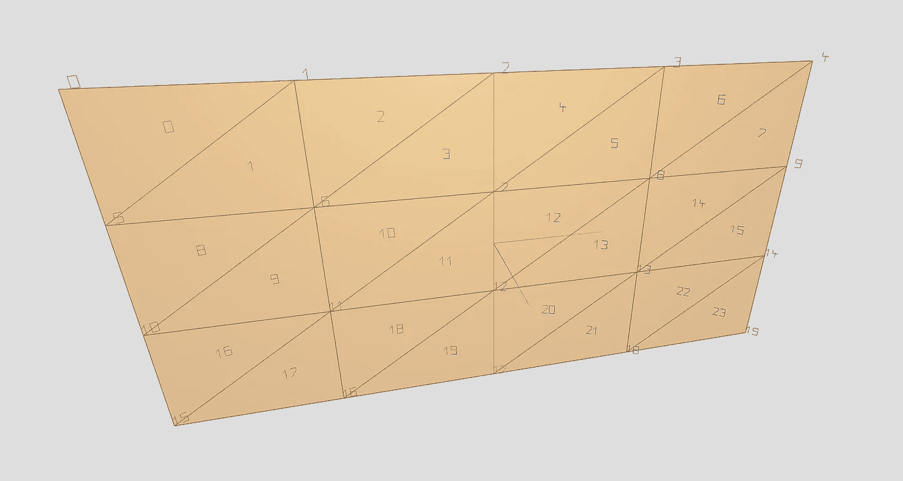

位于[https://hofk . de/main/discourse . three js/2022/three n/numberinghelperexamples . html](https://hofk.de/main/discourse.threejs/2022/THREEn/NumberingHelperExamples.html)的示例截图

因此，正在绘制的线只是遵循顶点顺序，结果是这样的(蓝线):

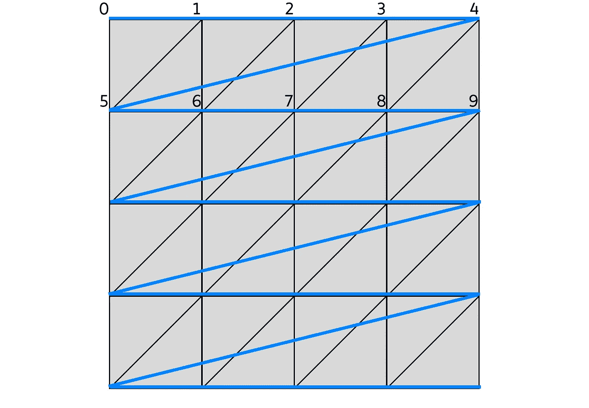

每一行都是从最右边到最左边，难怪我们会看到一片混乱

为了防止行从右边缘跳到左边缘，我们必须以特定的方式排列行的位置。

对于第一行，我们应该按照顶点顺序绘制直线:

v0 — v1 — v5 — v6，接着是 v1 — v2 — v6 — v7，依此类推。

然而，对于第二行，我们必须从右侧开始，而不是从左侧开始，因为否则，我们会遇到同样的问题，即直线从右边缘跳到左边缘。所以基本上，对于偶数行，我们必须按照奇数行的相反顺序排列顶点。

因此，对于第二行，我们应该遵循以下顶点顺序:

v14 — v13 — v9 — v8，接着是 v13 — v12 — v8 — v7，依此类推。

通过实施这种特殊的排序，我们可以在我们的地形上获得一个完美的线网格:

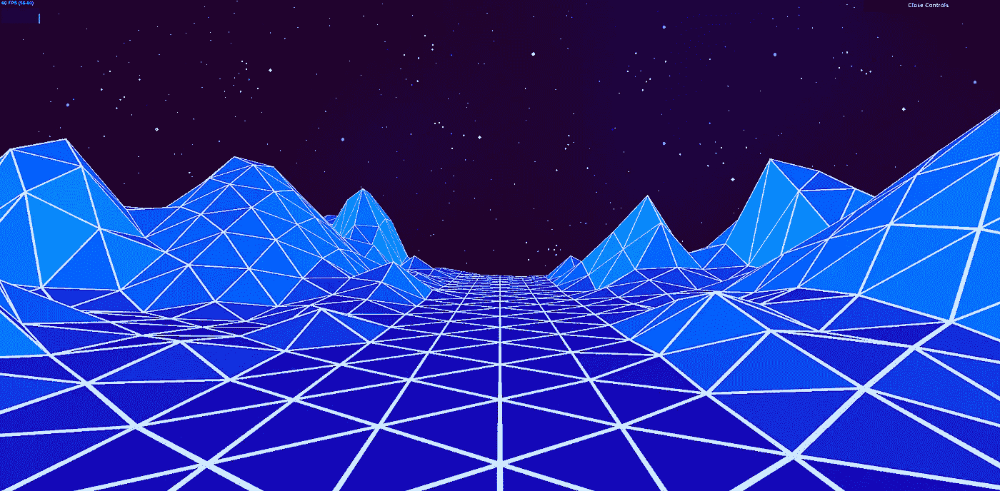

走近我们的最终产品！

# 7.创造一个没有尽头的地形的幻觉

这个项目令人兴奋的部分来了:伪造一个永无止境的地形！

如果您跳过了上面第 2 部分的解释，我将快速回顾一下这个概念:

1.  制作几组地形图
2.  像火车一样把他们连接起来
3.  让火车朝着摄像机移动
4.  弹出火车头部，如果它在摄像机后面，就把它放回尾部。
5.  瞧啊。这就是你如何伪造一个无尽的地形。

在我的开发过程中，我发现为所有连续的地形克隆只重复一个高度图在视觉上太重复了，所以我做了一个快速修复，使地形看起来不那么重复；通过水平翻转高度图来“创建”第二个高度图。也就是说，对于“奇数”地形使用高度图，而对于“偶数”地形反转高度图。

让我们在`index.js`中进行以下代码更改:

```
/**************************************************
 * 0\. Tweakable parameters for the scene
 *************************************************/
const params = {
  // general scene params
+ speed: 2.5,

...

const lightIntensity2 = 0.85
+ // need to be even number since the consecutive terrains are stitched in pairs
+ const numOfMeshSets = 6

...

let app = {
  async initScene() {
    ...
    scene.add(this.dirLight2)

+   // create sets of objects, for the capability to use different heightmaps for each set of plane and lines
+   let planeGeometries = []
+   let lineGeometries = []
+   let geometryPositionsArray = []

+   // we only loop twice here, although we load a single HeightMap, the trick is:
+   // first loop we load the HeightMap the normal way
+   // second loop we load the HeightMap data horizontally inversed
+   for (let i = 0; i < 2; i++) {
      // load heightmap to a new image first, then read its color data to set the heights of our plane vertices
      // see: https://gist.github.com/jawdatls/465d82f2158e1c4ce161
      let hm_image = await loadImage(HeightMap)
      var canvas = document.createElement("canvas")
      canvas.width = hm_image.width
      canvas.height = hm_image.height
      var context = canvas.getContext("2d")
      context.drawImage(hm_image, 0, 0)
      var hm_imageData = context.getImageData(0, 0, canvas.width, canvas.height)

      // Create a PlaneGeom
      let planeGeometry = new THREE.PlaneGeometry(terrainWidth, terrainHeight, terrainWidth, terrainHeight)
      let geometryPositions = planeGeometry.getAttribute("position").array
      let geometryUVs = planeGeometry.getAttribute("uv").array

      // update each vertex position's z value according to the value we extracted from the heightmap image
      for (let index = 0; index < geometryUVs.length / 2; index++) {
        let vertexU = geometryUVs[index * 2]
        let vertexV = geometryUVs[index * 2 + 1]
-       // Update the z positions according to height map,
-       let terrainHeight = getZFromImageDataPoint(hm_imageData, vertexU, vertexV, canvas.width, canvas.height)
+       // Update the z positions according to height map, inverse heightmap horizontally for the second loop
+       let terrainHeight = getZFromImageDataPoint(hm_imageData, (i == 0 ? vertexU : 1 - vertexU), vertexV, canvas.width, canvas.height)
        geometryPositions[index * 3 + 2] = terrainHeight
      }
      // skew the plane geometry
      const shearMtx = new THREE.Matrix4()
      shearMtx.makeShear(-0.5, 0, 0, 0, 0, 0)
      planeGeometry.applyMatrix4(shearMtx)

+     planeGeometries.push(planeGeometry)
+     geometryPositionsArray.push(geometryPositions)
+   }

+   // zip up the gaps between the 1st and 2nd plane geometries
+   for (let index = 0; index <= terrainWidth; index++) {
+     let bottomOffset = (terrainWidth + 1) * terrainHeight
+     // 2nd geom's bottom row height should be synced with 1st geom's top
+     geometryPositionsArray[1][(bottomOffset + index) * 3 + 2] = geometryPositionsArray[0][index * 3 + 2]
+     // 1st geom's bottom row height should be synced with 2nd geom's top
+     geometryPositionsArray[0][(bottomOffset + index) * 3 + 2] = geometryPositionsArray[1][index * 3 + 2]
+   }

    // material for the plane geometry
    let meshMaterial = new THREE.MeshStandardMaterial({
      color: new THREE.Color(params.meshColor),
      emissive: new THREE.Color(params.meshEmissive),
      metalness: params.metalness,
      roughness: params.roughness,
      flatShading: true
    })

    // the grid lines, reference: https://threejs.org/examples/?q=line#webgl_lines_fat
+   for (let i = 0; i < 2; i++) {
      let lineGeometry = new LineGeometry()
      let linePositions = []
      // This is a specific way to map line points to corresponding vertices of the planeGeometry
      for (let row = 0; row < terrainHeight; row++) {
        let isEvenRow = row % 2 == 0
        for (let col = (isEvenRow ? 0 : (terrainWidth - 1)); isEvenRow ? (col < terrainWidth) : (col >= 0); isEvenRow ? col++ : col--) {
          for (let point = (isEvenRow ? 0 : 3); isEvenRow ? (point < 4) : (point >= 0); isEvenRow ? point++ : point--) {
            let mappedIndex
            let rowOffset = row * (terrainWidth + 1)
            if (point < 2) {
              mappedIndex = rowOffset + col + point
            } else {
              mappedIndex = rowOffset + col + point + terrainWidth - 1
            }

-           linePositions.push(geometryPositions[mappedIndex * 3])
-           linePositions.push(geometryPositions[mappedIndex * 3 + 1])
-           linePositions.push(geometryPositions[mappedIndex * 3 + 2])
+           linePositions.push(geometryPositionsArray[i][mappedIndex * 3])
+           linePositions.push(geometryPositionsArray[i][mappedIndex * 3 + 1])
+           linePositions.push(geometryPositionsArray[i][mappedIndex * 3 + 2])
          }
        }
      }
      lineGeometry.setPositions(linePositions)

+     lineGeometries.push(lineGeometry)
+   }

-   // create plane mesh and add to scene
-   let mesh = new THREE.Mesh(planeGeometry, meshMaterial)
-   mesh.position.set(0, -1.5, 0)
-   mesh.rotation.x -= Math.PI / 2
-   scene.add(mesh)
-   // create the lines mesh and add to scene
-   let line = new Line2(lineGeometry, lineMaterial)
-   line.computeLineDistances()
-   line.position.set(0, -1.5, 0)
-   line.rotation.x -= Math.PI / 2
-   scene.add(line)

+   this.meshGroup = []
+   this.lineGroup = []
+   // create multiple sets of plane and line meshes determined by numOfMeshSets
+   for (let i = 0; i < numOfMeshSets; i++) {
+     // create the meshes
+     let mesh = new THREE.Mesh(planeGeometries[i % 2], meshMaterial)
+     let line = new Line2(lineGeometries[i % 2], lineMaterial)
+     line.computeLineDistances()
+     // set the correct pos and rot for both the terrain and its wireframe
+     mesh.position.set(0, -1.5, -terrainHeight * i)
+     mesh.rotation.x -= Math.PI / 2
+     line.position.set(0, -1.5, -terrainHeight * i)
+     line.rotation.x -= Math.PI / 2
+     // add the meshes to the scene
+     scene.add(mesh)
+     scene.add(line)
+     this.meshGroup.push(mesh)
+     this.lineGroup.push(line)
+   }

...

  // @param {number} interval - time elapsed between 2 frames
  // @param {number} elapsed - total time elapsed since app start
  updateScene(interval, elapsed) {
    this.controls.update()
    this.stats1.update()

+   for (let i = 0; i < numOfMeshSets; i++) {
+     this.meshGroup[i].position.z += interval * params.speed
+     this.lineGroup[i].position.z += interval * params.speed
+     if (this.meshGroup[i].position.z >= terrainHeight) {
+       this.meshGroup[i].position.z -= numOfMeshSets * terrainHeight
+       this.lineGroup[i].position.z -= numOfMeshSets * terrainHeight
+     }
+   }
  }
```

我们定义了一个新的`speed`参数来控制地形移动的速度。我们还定义了一个新的`numOfMeshSets`变量来控制我们想要创建多少地形副本。

现在，我们定义变量`planeGeometries`、`lineGeometries`和`geometryPositionsArray`来存储两组几何图形，每组都是由于使用的`heightmaps`不同而产生的。

然后，我们将平面和线几何设置代码包装在一个 2 圈的 for 循环中。在平面几何设置的第二个循环中，我们将`1 — vertexU`传递给`u`参数来实现水平反转高度图的效果。

在`runApp()`中设置的动画循环每一帧都会调用`updateScene()`功能。这里添加的代码是无休止地激活地形的东西。相机设置也是一个因素。由于其`far`值设置为 120，而“地形列车”的可见长度约为 150 至 180，我们将永远不会看到弹出的地形抖动被添加回列车尾部。

变化之后，你会看到地形不断向你移动。

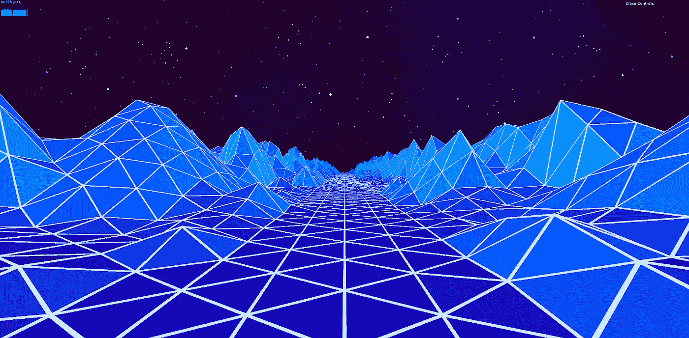

在永无止境的地形中前进的错觉

# 8.添加落日☀并制作动画

这也是一个有趣的部分，但涉及到这个项目中最复杂的数学。我花了一些时间来找出正确的公式来制作太阳上这些条纹的动画。我使用自定义着色器，以动画太阳的颜色。如果你不熟悉这个主题，请阅读关于[https://thebookofshaders.com/](https://thebookofshaders.com/)的着色器。

将以下代码附加到`functions.js`:

```
// vertexShader for the Sun
export function vertexShader() {
  return `
      varying vec2 vUv;
      varying vec3 vPos;
      void main() {
        vUv = uv;
        vPos = position;
        gl_Position = projectionMatrix * modelViewMatrix * vec4(position, 1.0); 
      }
  `
}

// fragmentShader for the Sun
export function fragmentShader() {
  return `
      #ifdef GL_ES
      precision mediump float;
      #endif
      #define PI 3.14159265359
      #define TWO_PI 6.28318530718

      uniform vec2 u_resolution;
      uniform vec2 u_mouse;
      uniform float u_time;
      uniform vec3 color_main;
      uniform vec3 color_accent;
      varying vec2 vUv;
      varying vec3 vPos;
      void main() {
        vec2 st = gl_FragCoord.xy/u_resolution.xy;
        float x = vPos.y;
        float osc = ceil(sin((3\. - (x - u_time) / 1.5) * 5.) / 2\. + 0.4 - floor((3\. - x / 1.5) * 5\. / TWO_PI) / 10.);
        vec3 color = mix(color_accent, color_main, smoothstep(0.2, 1., vUv.y));
        gl_FragColor = vec4(color, osc);
      }
  `
}
```

我很乐意花更多的时间来解释`fragmentShader`中的代码，但是我担心这篇文章会变得太长。

接下来，对`index.js`进行如下更改:

```
- import { createCamera, createComposer, createRenderer, runApp } from "./core-utils"
+ import { createCamera, createComposer, createRenderer, runApp, getDefaultUniforms } from "./core-utils"

- import { loadImage} from "./common-utils"
- import { loadSceneBackground, getZFromImageDataPoint } from "./functions"
+ import { loadImage, hexToRgb } from "./common-utils"
+ import { loadSceneBackground, getZFromImageDataPoint, vertexShader, fragmentShader } from "./functions"

...

/**************************************************
 * 0\. Tweakable parameters for the scene
 *************************************************/
const params = {
  // general scene params
  ...
+ // sun params
+ topColor: 0xffab00,
+ bottomColor: 0xff51c8
}
...
const lightIntensity2 = 0.85
// need to be even number since the consecutive terrains are stitched in pairs
const numOfMeshSets = 6
+ const sunPos = {
+   x: 0,
+   y: 16,
+   z: -100
+ }
+ const uniforms = {
+   ...getDefaultUniforms(),
+   color_main: { // sun's top color
+     value: hexToRgb("#ffab00", true)
+   },
+   color_accent: { // sun's bottom color
+     value: hexToRgb("#ff51c8", true)
+   }
+ }

...

let app = {
  async initScene() {
    ...

+   // the sun
+   const sunGeom = new THREE.SphereGeometry(30, 64, 64)
+   const sunMat = new THREE.ShaderMaterial({
+     uniforms: uniforms,
+     vertexShader: vertexShader(),
+     fragmentShader: fragmentShader(),
+     transparent: true
+   })
+   let sun = new THREE.Mesh(sunGeom, sunMat)
+   sun.position.set(sunPos.x, sunPos.y, sunPos.z)
+   scene.add(sun)

    // GUI controls
    const gui = new dat.GUI()
```

`uniforms`变量包含要传递给着色器程序的参数。`fragmentShader()`中的动画代码也利用了`getDefaultUniforms.`定义的`u_time``u_time`由`runApp`中的动画循环更新。对于任何动画代码来说，时间都是必不可少的元素。

应用代码更改会给你一个动画太阳:


# 9.添加 GUI 控件以在运行时调整参数

GUI 控件有助于开发人员在运行时快速测试各种参数值。通常，GUI 控件是在开发的早期阶段添加的，但是为了本文的流程，我宁愿先解释所有重要的代码。

在`index.js`中进行以下更改:

```
 async initScene() {
    ...

    // GUI
    const gui = new dat.GUI()

+   gui.add(guiOptions, "speed", 1, 10, 0.5).name('Plane speed')
+   gui.addColor(guiOptions, 'dirLightColor1').name('Dir light 1').onChange((val) => {
+     this.dirLight1.color.set(val)
+   })
+   gui.addColor(guiOptions, 'dirLightColor2').name('Dir light 2').onChange((val) => {
+     this.dirLight2.color.set(val)
+   })

+   let planeFolder = gui.addFolder(`Plane`)
+   planeFolder.add(guiOptions, "metalness", 0, 1, 0.05).onChange((val) => {
+     meshMaterial.metalness = val
+   })
+   planeFolder.add(guiOptions, "roughness", 0, 1, 0.05).onChange((val) => {
+     meshMaterial.roughness = val
+   })
+   planeFolder.addColor(guiOptions, 'meshColor').name('color').onChange((val) => {
+     meshMaterial.color.set(val)
+   })
+   planeFolder.addColor(guiOptions, 'meshEmissive').name('emissive').onChange((val) => {
+     meshMaterial.emissive.set(val)
+   })
+   planeFolder.addColor(guiOptions, 'lineColor').name('line color').onChange((val) => {
+     lineMaterial.color.set(val)
+   })
+   planeFolder.add(guiOptions, "lineWidth", 0, 0.1, 0.01).name('line width').onChange((val) => {
+     lineMaterial.linewidth = val
+   })

+   let sunFolder = gui.addFolder(`Sun`)
+   sunFolder.addColor(guiOptions, 'topColor').name('top color').onChange((val) => {
+     let clr = new THREE.Color(val)
+     uniforms.color_main.value = hexToRgb(clr.getHexString(), true)
+   })
+   sunFolder.addColor(guiOptions, 'bottomColor').name('bottom color').onChange((val) => {
+     let clr = new THREE.Color(val)
+     uniforms.color_accent.value = hexToRgb(clr.getHexString(), true)
+   })

    // Stats - show fps
    this.stats1 = new Stats()
    this.stats1.showPanel(0) // Panel 0 = fps
    this.stats1.domElement.style.cssText = "position:absolute;top:0px;left:0px;"
    this.container.appendChild(this.stats1.domElement)
  },
```

现在你可以任意调整参数和颜色了！


# 10.用布鲁姆效果✨✨对场景进行后期处理，让它看起来更酷！

下面是本文的最后一部分。我们将添加 Bloom 效果来照亮场景！这最后的润色对于让场景看起来很酷和散发出一种合成波的氛围是很重要的！

对`index.js`进行以下更改:

```
+ import { UnrealBloomPass } from "three/examples/jsm/postprocessing/UnrealBloomPass"

...

const params = {
  // general scene params
  speed: 2.5,
  dirLightColor1: 0x2dd7ff,
  dirLightColor2: 0x2dd7ff,
+ // bloom params
+ bloomStrength: 0.5,
+ bloomRadius: 0.2,
+ bloomThreshold: 0.5,
  // plane params
  metalness: 0.2,
  ...
}

...

// The RenderPass is already created in 'createComposer'
+ // Post-processing with Bloom effect
+ let bloomPass = new UnrealBloomPass(
+   new THREE.Vector2(window.innerWidth, window.innerHeight),
+   params.bloomStrength,
+   params.bloomRadius,
+   params.bloomThreshold
+ );
let composer = createComposer(renderer, scene, camera, (comp) => {
+   comp.addPass(bloomPass)
})

...

let app = {
  async initScene() {
  ...

    // GUI controls
    const gui = new dat.GUI()

+   let bloomFolder = gui.addFolder(`Bloom`)
+   bloomFolder.add(params, "bloomStrength", 0, 3, 0.05).onChange((val) => {
+     bloomPass.strength = Number(val)
+   })
+   bloomFolder.add(params, "bloomRadius", 0, 1, 0.05).onChange((val) => {
+     bloomPass.radius = Number(val)
+   })
+   bloomFolder.add(params, "bloomThreshold", 0, 1, 0.05).onChange((val) => {
+     bloomPass.threshold = Number(val)
+   })
```

这需要一些实验来获得适合场景的高光参数。随着这最后的润色到位，整个场景现在照亮了✨:

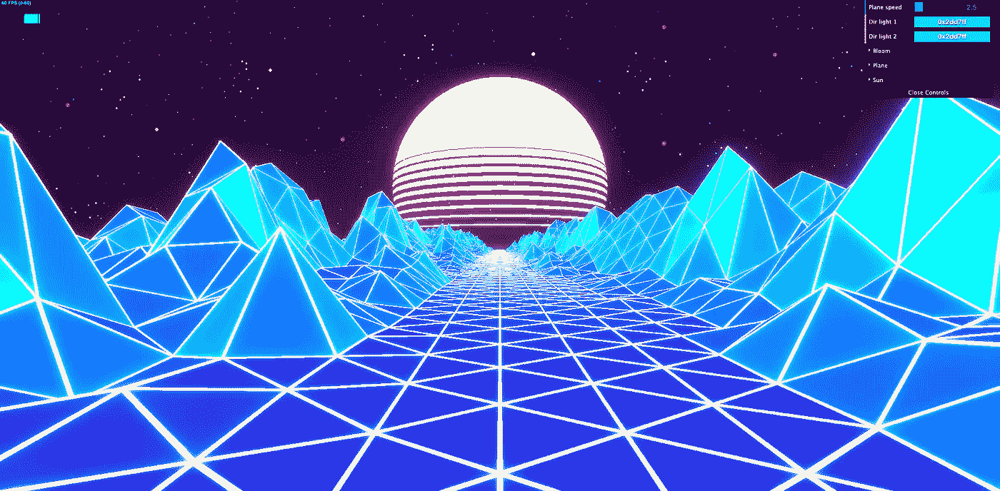

一旦你开花了，就再也不会回来了。

这就是了。您已经完成了教程！

说实话，在动笔之前，我已经搭建了一个我认为足够好的版本。然而，当我开始写这篇文章时，我发现它并不好！

我正在使用一个复杂的自定义`BufferGeometry`构建地形几何图形。视觉效果和性能比我现在得到的结果更差。感谢阅读。