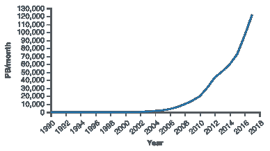
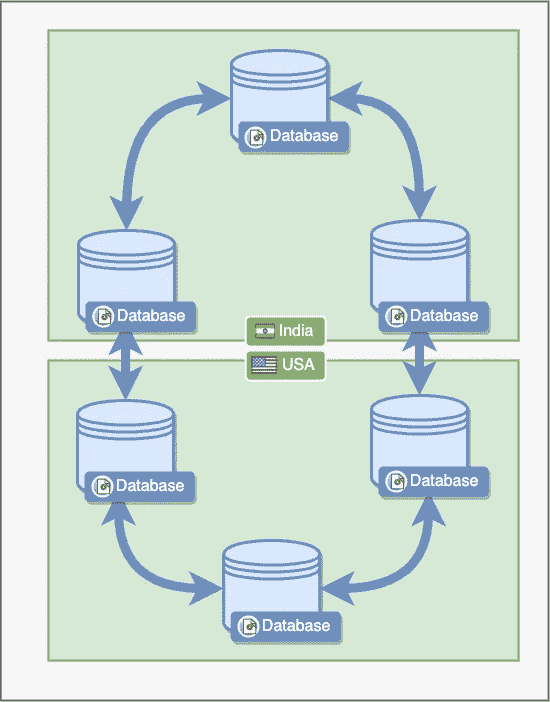
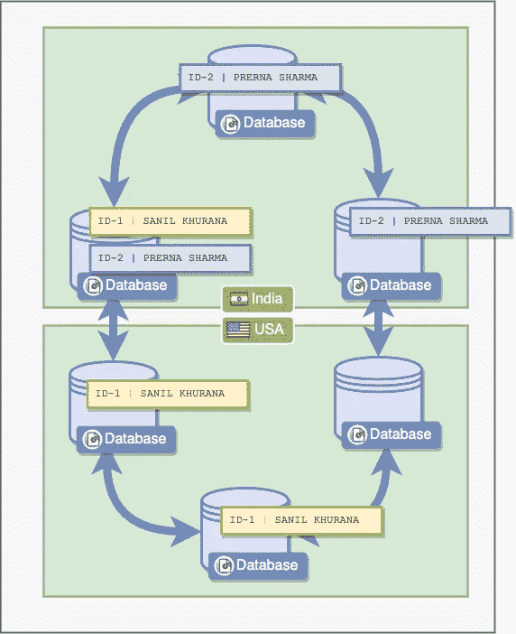
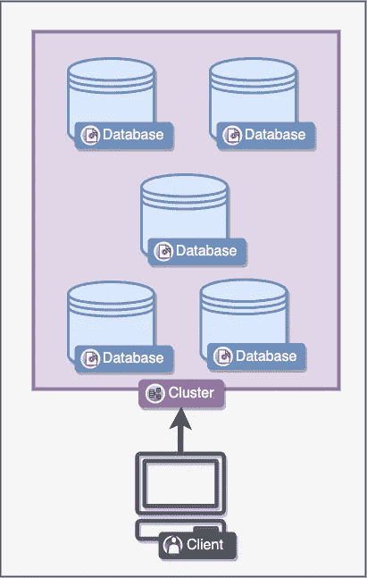
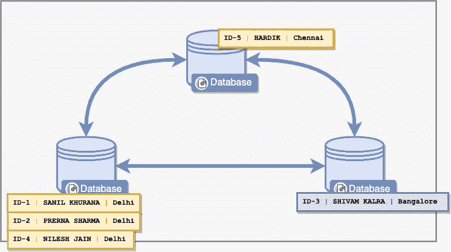
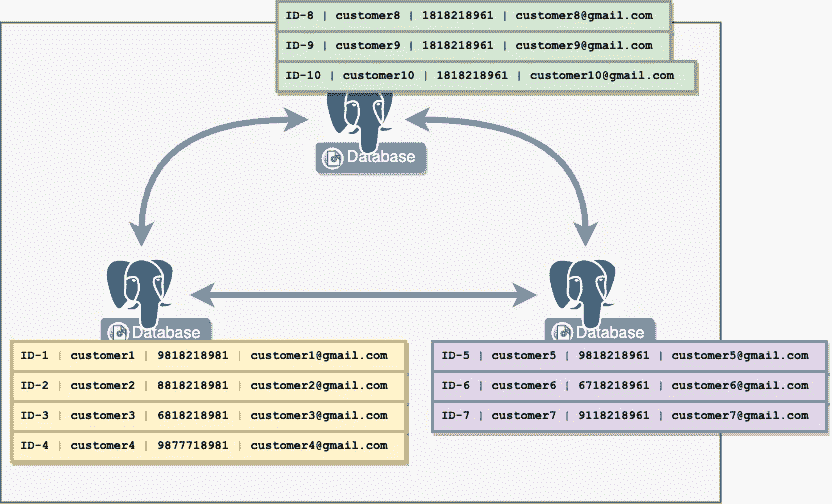
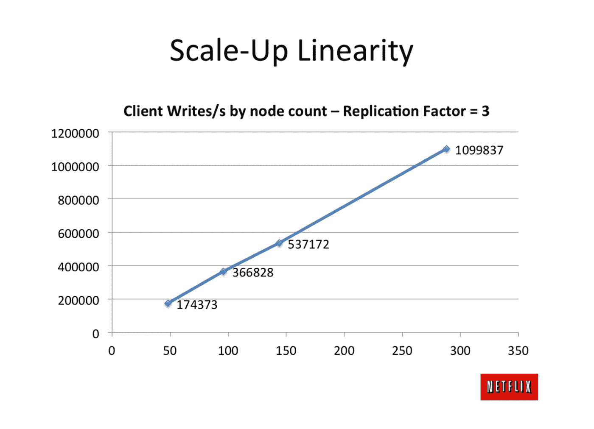
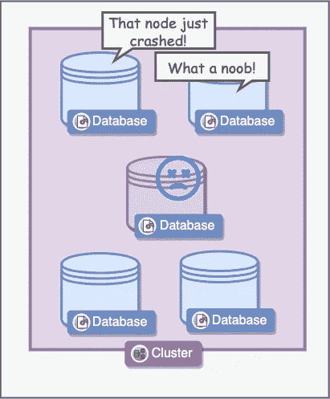

# 系统设计概念:发电机，改变世界的 16 张纸

> 原文：<https://betterprogramming.pub/system-design-concepts-dynamo-16-sheets-of-paper-that-changed-the-world-fd2cba6585e3>

## 了解如何在系统设计中使用 Dynamo 系列、AWS DynamoDB、Cassandra 和 SimpleDB


# 开始前快速介绍

早在 2004 年，Amazon 就在运行一个大型分布式 Oracle 数据库集群。想象一下，许多服务器运行着大量庞大的闭源专有软件，却没有真正关注规模和可用性。他们正在以现有的规模挑战商业数据库的极限。

重要的是要明白这是一个不同的时代。分布式系统并不常见，关系数据库是唯一的主要 OLTP 数据库，最重要的是，没有足够的人或数据在线。



疯狂的看到互联网在短短的一二十年里爆发式的增长！

在这一点上，亚马逊的服务当时正处于推动传统 SQL 数据库规模边界的风口浪尖，他们决定需要一个长期可持续的解决方案来继续以他们正在增长的速度增长。

关系数据库是复杂的系统。它们在可以运行的查询类型方面为您提供了很大的灵活性，为您提供了强大的 ACID 遵从性，在表之间建立关系，以及连接表的能力。这些功能不是免费的，而且是有代价的。成本通常是有限的可扩展性、可用性和较低的性能。

正如亚马逊首席技术官沃纳·威格尔在这里解释的那样，他们估计 70%的操作只基于主键，另外 20%没有使用任何类型的连接。因此，他们使用关系数据库，但他们意识到他们并不真正需要关系数据库提供的大部分优势。此外，他们在横向扩展数据库时面临困难。

因此，他们内部建立了一个名为“发电机”的内部数据库，并对其进行了几年的测试。2007 年，他们公开发布了白皮书“Dynamo: Amazon 的高可用性键值存储”，以帮助其他在关系数据库中面临类似可伸缩性问题的人。

这篇论文很受欢迎，并成为 NoSQL 数据库背后的驱动力，它现在是任何大型技术组织的技术堆栈的重要部分。正如沃纳·威格尔所描述的，“迪纳摩的论文很受欢迎，并成为创建分布式数据库技术类别的催化剂，这种技术现在通常被称为‘NoSQL’"

Dynamo 能够处理大规模数据，单个表每秒能够处理数千万个请求。2017 年，最初的 Dynamo 每秒钟能够处理 1290 万次请求。我确信，更加强大的现代 DynamoDB 可能会将极限推得更远。

Dynamo 最终启发了当今许多最流行的数据库，如 AWS 的 SimpleDB 和 DynamoDB，以及 Cassandra。这些数据库中的大多数，像 Cassandra 和 DynamoDB，最终都与 Dynamo paper 非常相似，并且通常具有相同的优点和缺点。理解 Dynamo 白皮书也有助于您更好地理解 Dynamo 系列数据库。

在通读成功、性能和几乎童话般的故事时，我想知道为什么其他数据库仍在使用？亚马逊的工程师们最终用这些性能、规模和可用性的巨大收益换来了什么？无限规模实际成本是多少？而且负担得起吗？

# 搭建舞台

## 快速概述系统 Dynamo 描述

Dynamo 描述了一个由多个节点组成的分布式数据库系统。


这些数据库可以在彼此完全隔离的情况下运行，并且实际上在物理上位于世界的不同地方。



它描述了该系统将是一个无主系统。这意味着所有节点都是同构的，并且行为相同。

所有数据都将分布在这些相同的节点上，然后在它们之间进行复制。例如，如果我必须存储两行数据，比如说雇员数据，dynamo 会在内部存储如下:



请注意，数据甚至可以在不同的大陆上复制！

为了确保性能，群集通常不会等待所有节点实际写入数据。例如，要写一个 ID 为 3 的新雇员，Dynamo 可能会等待单个节点实际确认写操作，而其他节点甚至还没有完成向磁盘写入数据，Dynamo 可能会向用户返回一个响应，告诉用户写操作已经完成。


这意味着您的整个数据库集群可能处于不一致的状态，其中一些节点可能存储某些行，而其他节点可能不存储。例如，在上面的图表中，两个节点没有写完新行，而其中一个写完了。这意味着在某种意义上，节点在该行是否存在的问题上意见不一致。别担心，这很正常。

最终，所有节点都将完成新行的写入，集群将处于一致状态。这是一个最终一致的数据模型，因为整个集群最终会达到一致性。

在我继续之前，重要的是要注意到这个新实体——集群的存在。在我职业生涯的早期，我曾在一台服务器上运行一个 Postgres 数据库，所以当我开始接触分布式数据系统的概念时，我很难理解集群的概念。

为了更好地理解这一点，不要把节点看作是您必须管理的单个节点。想象一个全新的实体，集群。这个集群由运行在服务器上的这些更小更简单的数据库进程组成。


事实上，集群管理这些节点，维护它们的健康和通信，在需要时启动更多节点，在不需要时关闭节点。

有点像分行经理:


节点本身也知道集群，并且它们是集群的一部分。这些节点可以相互通信，并讨论与集群相关的信息。

作为客户端，您会经常与集群进行交互，并且经常关心整个集群表现出来的特征，而不是单个节点。例如，群集可能处于不一致的状态，因为一些节点会存储更新的数据，而一些节点可能不会。



# 发电机纸是如何改变世界的

亚马逊首席技术官沃纳·威格尔说，

> "*迪纳摩的论文很受欢迎，并成为创建分布式数据库技术类别的催化剂，这种技术现在通常被称为“NoSQL”。"*"

Dynamo 启发了许多其他 NoSQL 数据库，并为大规模高度可用的分布式数据存储创建了一个框架。它被引用了 2000 多次，并影响了分布式数据存储在各种数据库中的工作方式。

简而言之，简单的关系数据库根本无法支持现代应用程序的写入能力。大多数大型科技公司，如网飞、苹果、Discord、AirBnB 等，都使用 Dynamo 系列数据库(DynamoDB、Cassandra 等)。).

“改变世界”可能有些言过其实，但迪纳摩白皮书绝对是最有影响力的白皮书之一，并影响了许多现有的大型科技公司。

# 关键要点和权衡

## 键值存储

Dynamo 提供了一个键值数据存储，这意味着不支持表或关系等。

您只能存储键及其相应的值。您使用的键将是您的分区键，Dynamo 将使用这个键来确定将数据放在哪个分区中。或者，从另一个角度来看，分区键决定了数据将去往哪个节点。

分区键必须是唯一的，并且为了确保在节点之间平均分布，它应该能够有一大组大致平均分布的值。

例如，假设我必须存储这些数据:

```
| ID         | Name                  | Location
---------------------------------------------------------
| 1          | Sanil Khurana         | Delhi
| 2          | Prerna Sharma         | Delhi
| 3          | Shivam Kalra          | Bangalore
| 4          | Nilesh Jain           | Delhi
| 5          | Hardik                | Chennai
```

如果我选择`Location`作为分区键，这将意味着我的集群中的每个节点将负责存储与某一组位置相关的数据。



在上面的例子中，您可以看到每个节点都被分配存储一个位置。

这已经说明问题了。根据人口和您的组织可能瞄准的位置，一些位置肯定会比其他位置更受欢迎。例如，你的平台在德里比在钦奈用得更多。这会导致数据在节点间的不平衡分布。因为所有节点都是同构的，所以您正在浪费没有存储大量数据的节点的资源。

然而，基于 ID 存储数据可能会好得多。您的应用程序逻辑可以为每个数据项分配一个增量 ID 或随机 ID，您可以根据该 ID 对数据进行分区。

尽管这种数据模型相当简单，但是 Dynamo 系列数据库已经发展到支持更复杂的数据模型。DynamoDB 和 Cassandra 确实支持表，但是没有分区键是不可能进行查询的。

它们还支持基本级别的排序、限制返回的结果等。简而言之，Dynamo 论文的迭代能够支持更丰富的模型，尽管它缺乏关系数据库通常具有的特性。

选择分区键还有其他细微差别。Dynamo 系列数据库支持较弱的 ACID 模型，在这种模型中，可以实现一些基本的隔离、事务或一致性级别。当您正在交互的行在同一个分区上时，这通常是可能的。

所以 TL；DR，Dynamo 的数据模型非常简单，很少花里胡哨。DynamoDB 和 Cassandra 支持更丰富的数据模型，但仍然没有任何关系、关联、灵活的查询等。

选择分区键是决定数据模型的一个非常重要的部分，需要比关系数据库更多的考虑。

## 不太灵活的查询模型

Dynamo 公开了一个更简单、限制更多的查询模型。

它只公开了两个函数，`get(partition key)`和`put(partition key, object)`。这意味着不支持数据排序、限制返回的行数等。通常在关系数据库中可以找到。

然而，正如我之前解释的，Cassandra 和 DynamoDB 提供了一个更加丰富的模型，能够过滤数据(类似于 SQL 中的`WHERE`)、排序数据、限制行数等。它们仍然有局限性，主要是因为数据必须存储在不同的节点上。

您通常会受到分区键的限制，如果您还没有意识到这一点的话，这一点非常重要。

## 分布的

迪纳摩作为一个分布式系统工作。在单节点系统中运行它毫无意义。如果您运行的是 Dynamo，那么您运行的可能是数十个甚至数百个节点，因为这是 Dynamo 的优势所在。

## 缺乏酸支持

> “亚马逊的经验表明，提供 ACID 保证的数据存储往往可用性很差。这一点已经得到了业界和学术界的广泛认可[5]。Dynamo 的目标是一致性较弱的应用程序(ACID 中的“C ”),如果这能带来高可用性的话。Dynamo 不提供任何隔离保证，只允许单键更新。

正如这篇论文所言，迪纳摩不支持酸性。它并不支持更高的一致性，而是提出了一个以可用性而不是一致性为目标的 AP 系统。

这是有道理的。对于许多应用程序来说，严格的一致性可能很重要。这意味着集群中的节点应该始终对数据的当前状态保持一致。例如，如果您正在处理与支付相关的数据，保持严格的一致性可能很重要。想象一下，如果集群中的节点对您账户中的金额意见不一。一些节点将允许借记交易，而一些节点可能拒绝它。

然而，严格的一致性是有代价的。成本通常是可用性、性能和耐用性。

对于大多数应用程序，如果您的数据存储处于不一致的状态，这并不重要。例如，如果一些节点认为某条推文有 2000 个赞，而一些节点认为它有 2001 个赞，那就没那么重要了。有的用户可能看到 2000，有的可能看到 2001，但几乎不影响用户体验。迪纳摩就是为这些应用而打造的。一致性并不重要，可用性和性能才是最重要的。

另一方面，Dynamo 确实为您提供了具有可调一致性的选项。简单地说，你可以定义你想要的一致性水平。这有更多的细微差别，但是有严格的一致性是可能的，尽管以可用性为代价。这个概念需要更多的深度，所以为了节省时间，我现在跳过它。然而，如果你想让我写更多关于这方面的东西，请在评论中告诉我！

## 线性可扩展的写入性能

当您水平扩展关系数据库时，您不能获得系统中所有节点的全部能力。这是因为在水平扩展的集群中运行的关系数据库，尤其是当每个节点只存储关系的一部分，而不是整个关系时，会不断地为了最简单的查询而相互通信。

例如，假设您有一个简单的 customer 表，分布在 Postgres 的三个节点上，因此每个节点都存储整个表的一些行。由于您要为每一行存储电子邮件地址和电话号码，所以您还需要确保它们在整个表中是唯一的(同样，它跨越多个节点)。



如果您必须写一个新客户，您首先必须决定在哪个节点上写它，然后检查具有相同电话号码或电子邮件地址的客户是否不存在于任何其他节点上，然后再写它。

在执行所有这些操作时，您还需要确保其他节点上没有写入新的客户，因为可能会同时写入两个具有相同电子邮件或电话的客户，从而打破了唯一约束。现在想象一下，如果这些节点在物理上也相距很远。

即使在这样一个简单的场景中，关系数据库中的分片会有多复杂也是显而易见的。以及添加更多节点将如何增加每个现有节点的工作，因为现在它需要与另一个节点连接、交谈和八卦。

迪纳摩背后的原因很简单。单个节点无法承受所需的读写次数。解决这个问题的唯一方法是拥有一个水平扩展的多节点系统。Dynamo 旨在提供一个可以轻松处理数百、数千甚至更多节点的系统。这样做是因为它可以线性扩展写入性能。

所以目标应该是，添加一个节点不会增加其他节点的工作。每个节点只传递所需的信息，Dynamo 不承诺验证或唯一约束或其他会增加系统中节点负担的功能。

网飞进行了大量测试，以了解 Cassandra(属于 Dynamo 数据库家族)在增加节点数量时的性能。这张图完美地概括了线性标度。



来自网飞的这篇令人惊叹的博文，这篇博文深入探讨了这一点——https://Netflix tech blog . com/benchmark-Cassandra-scalability-on-AWS-over-a-million-writes-per-second-39 f 45 f 066 c 9 e

您可以看到添加更多节点并不会降低其他节点的性能。

# 在哪里使用 Dynamo 系列数据库？

我认为沃纳·威格尔总结得很好:

> “我们的目标是构建一个具有无限可扩展性、一致的性能和高可用性的数据库，以支持我们快速增长的业务需求。”—沃纳·威格尔

迪纳摩和迪纳摩系列数据库提出了一个想法，以存储绝对巨大的难以想象的数据量与一致的性能保证。它承诺高可用性、低延迟和可线性扩展的写入性能。

但是它牺牲了数据模型和查询能力的灵活性，并且缺少 ACID 支持。它还是一个分布式系统，作为单节点系统运行是没有用的。

我最近写了一篇关于卡珊德拉[的深度文章，我在整篇文章中做了一个同样适用于迪纳摩的类比。](https://medium.com/geekculture/system-design-solutions-when-to-use-cassandra-and-when-not-to-496ba51ef07a)

把迪纳摩想象成兰博基尼 Huracan，把传统的关系数据库想象成劳斯莱斯幻影。幻影会给你更多的豪华，在这种情况下，豪华的灵活性，你的查询，和酸属性，但当你想地板气，你想绝对原始的性能，一个兰博基尼 Huracan 将击败幻影手下来。

所以，TLDR；当您希望在分布式环境中获得大规模和高可用性以及一致的性能时，请使用 Dynamo。

# 有趣的语录

## 始终可写的数据存储

> Dynamo 主要面向需要“始终可写”数据存储的应用程序，在这种存储中，不会因为失败或并发写入而拒绝更新。这是许多亚马逊应用程序的关键要求。”

有趣的是，上面的段落在论文中是如何措辞的。它强调了 Dynamo 是如何为编写而构建的，并始终确保更新或失败永远不会被拒绝。

始终可写的数据存储这一理念贯穿整篇论文，也是该系统的主要目标之一。

## 强调不断的失败和如何处理它

> “处理由数百万个组件组成的基础架构中的故障是我们的标准操作模式；在任何给定时间，总会有少量但数量可观的服务器和网络组件出现故障。因此，亚马逊的软件系统需要在不影响可用性或性能的情况下，将故障处理视为正常情况。”

我真的很喜欢上面的引用，这是论文导言的一部分，它真的设定了迪纳摩的期望。能够每天处理失败是迪纳摩工作要求的一部分。

它还强调了 Dynamo 的重点是可用性和性能。

## 闲话

迪纳摩是以分布式方式工作的。在任何时候，系统中都应该有多个节点存储数据。这些数据通常被复制到多个节点。这些节点需要了解彼此、彼此的健康状况以及整个系统。有许多有趣的问题，如负载平衡、作业调度、请求路由、副本同步、处理故障、并发性等。这需要节点之间的持续通信。

节点使用基于八卦的协议相互通信。这是一种点对点的通信方式，实际上被数据库系统大量使用。我之前在这里谈论 Redis [和在我之前的帖子中谈论 Cassandra 时谈到了这一点。](https://medium.com/@sanilkhurana7/list/redis-88a4c95150fa)[关于八卦交流的维基百科页面](https://en.wikipedia.org/wiki/Gossip_protocol)也是一本有趣的读物。

简而言之，把节点想象成普通的高中生，讨论我们的一个节点令人尴尬的中断。



## 版本控制和冲突解决

> " Dynamo 不提供任何隔离保证，只允许单键更新."

这很有趣，因为在分布式系统中没有隔离保证，您的数据存储可能有单个数据项的多个版本。

事实上，对于 Dynamo 论文描述的数据库系统来说，这是正确的。Dynamo 没有像传统的关系数据库系统那样依靠保证隔离，而是拥抱多版本的可能性。

这是因为更新需要异步传播系统。这种传播可能需要一点时间。在此期间，数据存储将存储同一数据项的多个版本。Dynamo 使用向量时钟的概念来确定版本，并试图解决版本冲突，但它并不总能解决这些冲突。如果不能，它会返回多个版本给用户，并让用户决定哪个版本是正确的。

这篇论文谈了很多关于版本控制的内容，这是一篇非常吸引人的文章，讲述了他们是如何做出这些决定的，以及是什么因素促成了这些决定。

> 重要的是要理解，某些故障模式可能会导致系统具有相同数据的不止两个而是多个版本。存在网络分区和节点故障时的更新可能会导致对象具有不同的版本子历史，系统将需要在将来对其进行协调。
> 
> 这要求我们设计的应用程序明确承认同一数据可能有多个版本(为了不丢失任何更新)。

上面的段落特别强调了这些多个版本是以“从不错过更新”的承诺为代价的这又与 Dynamo 承诺的始终可写的数据存储有关。

这篇文章的另一个摘录谈到了版本控制和决定谁应该解决冲突、数据存储还是应用程序背后的决策过程。迪纳摩不仅仅是懒惰，它不想做冲突解决，但迪纳摩背后的工程师认为让应用程序做冲突解决可能更好

> 下一个设计选择是由谁来执行冲突解决的过程。这可以由数据存储或应用程序来完成。如果冲突解决是由数据存储完成的，那么它的选择是相当有限的。在这种情况下，数据存储只能使用简单的策略，如“最后写入者获胜”[22]，来解决更新冲突。另一方面，由于应用程序知道数据模式，它可以决定最适合其客户体验的冲突解决方法。

在阅读这一部分时，我直觉地想到为什么不采用“最后写入成功”的方法来确定所有数据项的当前状态，这篇文章提供了一个很好的例子来说明这种解决方案何时不起作用。

> 例如，维护客户购物车的应用程序可以选择“合并”冲突的版本，并返回一个统一的购物车。

## 有趣的是，高可用性缺乏耐用性

通常，数据库被迫在可用性和一致性之间做出选择。这是数据库做出的最大选择之一，并极大地影响了它们的用例。

本文对此进行了深入的讨论，因为 Dynamo 试图带来的一个重大变化就是在不需要一致性的时候，为了可用性和性能而放弃一致性。

人们会认为可用性和耐用性是相辅相成的，正如这篇论文所指出的，

> 传统观点认为，耐用性和可用性是相辅相成的。然而，这在这里不一定是真的

它进一步谈到了在迪纳摩的例子中，情况正好相反。由于并非所有节点都会确认写入，因此数据项可能只写入到少数节点，甚至可能是一个节点。

这意味着有一小段时间数据没有被复制和持久地存储在多个位置。这可能会影响耐用性，因为单个节点很少会因硬件故障而丢失数据。

> 当写请求被成功返回到客户端时，即使它仅在少量节点上被持久化，这也引入了持久性的漏洞窗口。

这篇论文没有太多关于持久性的内容，阅读他们如何将数据同步到操作系统会很有趣，它是类似于关系数据库的每个事务的强制同步，还是在今天的 NoSQL 数据库中有时会看到的更定期的同步。此外，找不到任何与预写日志或类似内容相关的东西，因此很难评估单个节点的持久性。

# 结论和资源

我觉得这份白皮书非常有趣，它以一种普通软件工程师也能理解的方式编写。我真的推荐阅读全文，它比我所能涵盖的要详细得多。如果你感兴趣，这里有链接。

我真的推荐沃纳·威格尔在迪纳摩[十年后写的文章。](https://www.allthingsdistributed.com/2017/10/a-decade-of-dynamo.html)

AWS 关于 DynamoDB 的数据建模的两部分系列也非常有趣，尽管它更侧重于 DynamoDB 而不是 Dynamo。它真正展示了数据查询和数据模型与关系模型的完全不同。[如果你感兴趣，这里有链接。](https://www.youtube.com/watch?v=fiP2e-g-r4g&t=948s)

如果你喜欢这篇文章，请在评论中告诉我你是否使用过 Cassandra 或 DynamoDB，以及你的使用体验如何。

另外，如果你喜欢这篇文章，你可能也会喜欢我最近写的关于 Cassandra 的文章。

