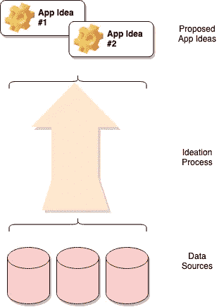
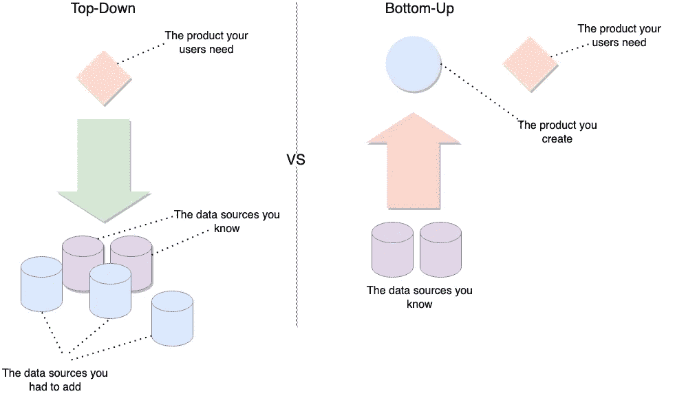

# 系统设计 101:你的数据第一的方法是错误的，下面是如何解决它

> 原文：<https://betterprogramming.pub/systems-design-101-your-data-first-approach-is-wrong-and-heres-how-to-fix-it-a82b8078d0a3>

## 不要再考虑使用什么技术，开始先倾听你的用户需要什么

由 [Unsplash](https://unsplash.com/) 上的 [Kumpan Electric](https://unsplash.com/@kumpan_electric) 拍摄的照片

说到软件设计，有一个非常简单的问题我喜欢问，但不是每个人都考虑:你从哪里开始？

这个问题对设计的其余部分至关重要，但是很多人倾向于在提问之前就回答这个问题。然而，我认为有两种可能的答案:

*   自下而上的设计:或者换句话说，你从数据开始，观察它，并基于你所拥有的，决定你能用它构建什么。
*   自上而下的设计:或者也称为倾听用户，然后找出他们想要什么。根据他们给你的信息，你决定你要做什么和你需要的数据。

就我个人而言，由于这篇文章的标题已经泄露了，我倾向于第二种选择。如果你继续阅读，你会发现为什么。

# 设计系统时，你需要避免偏见

当你为别人设计系统时尤其如此，但即使你是自己的客户，这句话也是成立的。

偏见往往是我们生活中固有的，我们往往有自己的偏好和过去的经历，迫使我们产生偏见。作为一名软件架构师，你必须在工作中牢记这一点。

这就是为什么我想先集中讨论这个话题。作为技术人员，我们倾向于用数据来思考，因为毕竟数据不会说谎。它展示了我们项目的真实范围，但前提是我们不看其他地方。

如果我们有一个单独的数据库，其中包含存储用户、书籍和订单的表，那么我们对这个数据集就没什么可做的了，不是吗？等等，先别回答这个问题。

这就是你正在做的:

你从底层开始，你在构思过程中使用的数据会给你一系列的应用想法。有了这些信息，你就可以去找你的客户，或者展示它们，或者重申它们，直到有一个准备好了。通过只查看现有的数据，您有效地限制了自己，从而扼杀了其他应用程序的任何潜在想法。

相反，如果您在开始时让您的最终用户在这个问题上有发言权，然后在此基础上决定使用哪些数据集，您最终会得到以下结果:

看那个！你开始与你的潜在用户对话，而不是从你的数据开始。你问他们想要实现什么，然后深入到数据源。您决定需要一些额外的(可能是外部的)数据源来完成所有潜在的应用程序，而不是只选择通常的数据源。

我并不是说想出额外的数据源，或者甚至访问和使用外部数据源都是一项简单的任务。一点都不简单。然而，事实上，你没有根据这些知识来限制自己，这使得你能够想出新的和潜在的更好的应用想法。所需的额外努力很可能是值得的。

# 知道目的地比知道你从哪里开始要有用得多

这听起来有点拗口，但其背后的基本思想是，你最好了解你的设计要去哪里，并确切知道你的用户需要什么，而不是完全控制你来自哪里，比如你的数据源。

当设计一个系统时，你总会有未知，这没什么。其实不仅没问题还在意料之中。你会有未知，你会对它们做出假设。这是因为你还没有开发你的系统，你停留在一个更高的抽象层次，正因为如此，你不能确定每一个小细节。

考虑以下场景:

自上而下的方法从倾听你的用户(或客户，或利益相关者，或任何你想称呼他们的方式)开始，到数据结束。通过这个过程，您增加了交付您最初开始创建的产品的机会。

当然，这里的未知数变成了数据来源，因为你没有太注意那些细节。这反过来又意味着不得不使用你原本没有考虑到的信息。

另一方面，使用自底向上的方法，您的数据不会有任何问题，因为您已经烂熟于心。您的关注点在那里，而不是在您的用户身上，正因为如此，您可能最终交付了一个可能类似于最初请求的产品，但并不完全是它。

这绝对是一种更安全的方法，可以确保您的开发以某种方式完成。但结果并不总是最好的。

就我个人而言，我认为有了适量的常识，再加上一点经验的支持，你就可以从顶层开始创造伟大的产品。你也能够对你的数据做出安全的假设。

# 自顶向下与敏捷方法非常兼容

作为结束语，我想介绍一下用户第一的方法与敏捷方法的兼容性。

这些天我们可能不会都在使用敏捷，但是我们肯定会走向一个更加“敏捷”的行业。如果有足够的时间，你将会在一个敏捷的框架内工作。它可能会也可能不会和已经存在的完全一样，但是你可以肯定你将会拥抱变化，因为这是关于它的主要咒语之一。

拥抱变化意味着拥抱不确定性。这意味着接受假设，并一直接受它们，直到它们实现的时候。听起来很熟悉？应该的！

敏捷的生命周期允许你获取你所知道的，使用它，并迭代它以快速进化。您使用短暂的时间窗口作为迭代来实现您的愿景并测试它。如果行得通，你就前进，如果行不通，你就调整并继续前进。这最后一部分是至关重要的，因为“调整并保持前进”这一步意味着你的目标可能会根据你所学到的东西而改变。

记住这一点，自上而下的方法，或者说用户第一的生命周期，将使你能够从用户需求的正确想法开始。技术部分会随着时间的推移而改变和发展。为他人提供产品意味着你真的将他们的需求置于一切之上。我个人认为这是一个好的产品设计规则。

一种更注重技术的方法，比如自下而上的方法，可能最终会改变目标。或者，正如我们之前所说的，基于你的技术选择的限制，它会改变实际交付的产品。框架本身会让你迭代你想要构建的东西，但是问题不会是“我们如何构建这个部分？”相反，它可能被框定为“我们真的可以用我们的数据构建这个特性吗？”如果焦点在正确的一面，你可能会刮错东西，比如功能而不是实际的技术。

所以不要忘记:在开始之前，您需要考虑您的方法如何适合您的开发方法，以及该选择可能如何影响您的最终交付。

就我个人而言，我认为技术是产品设计的牺牲品。作为开发人员，我们往往有自己的偏好，比如最喜欢的数据库或最喜欢的编程语言。但是，作为一名软件设计师或数据平台、视频游戏或网站的架构师，你需要把用户放在第一位，考虑他们的需求，而不是你的偏好。

记住:技术是一种工具，而不是最终产品。所以，远离你自己的偏好，试着为这项工作选择合适的工具。

如果你不喜欢你选择的工具，但它能完成工作，那么你做得对。

如果你敲得够用力，你总是可以用锤子钉你的螺丝。但是，最终结果可能不会像使用螺丝刀时那么干净。