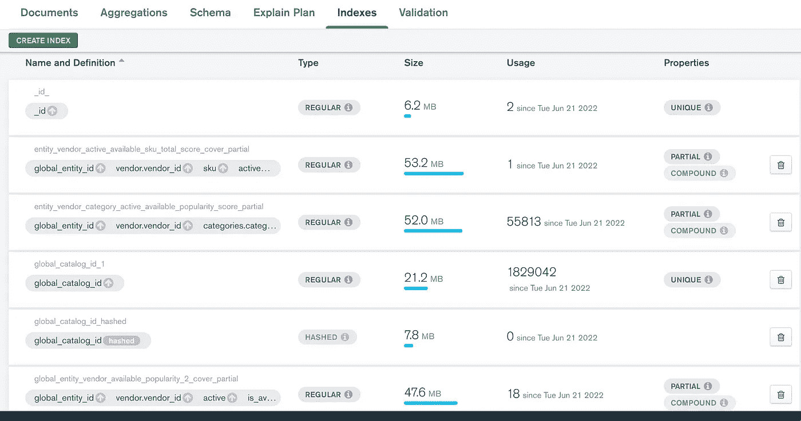
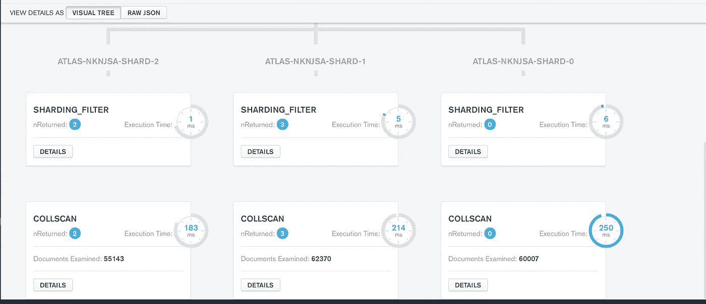
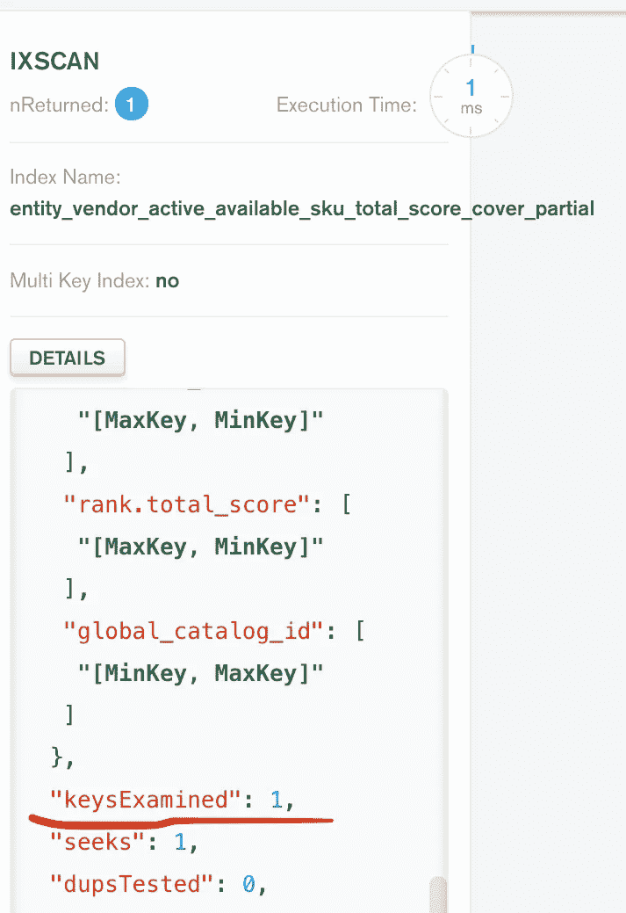

# 解决数据库资源利用问题

> 原文：<https://betterprogramming.pub/tackling-database-resource-utilisation-developer-guide-71a20bb99c8e>

## 开发者指南


[活动发起人](https://unsplash.com/@campaign_creators?utm_source=medium&utm_medium=referral)在 [Unsplash](https://unsplash.com?utm_source=medium&utm_medium=referral) 上的照片

数据库资源利用经常被忽视。

在早期项目阶段，当既没有负载也没有大量数据时，过度优化一切是没有意义的。主要重点是构建启动应用程序的功能。

当实时流量进来时，一些性能下降开始出现。通常，会有一些额外的索引发生，但在这个阶段，添加额外的硬件比试图“计算字节”和花费大量时间测量、调试和修复性能瓶颈更容易。

软件工程是一个在正确的时间点找到正确的平衡点的无止境的旅程。记住这句名言:

> "过早优化是万恶之源."—唐纳德·克努特

对于编写代码/设计系统来说总是如此，对于数据库使用调优来说也是如此。好的工程总是考虑 RoI(投资回报)，在你的公司成为“大技术”(200 多名工程师)之前，通常更有意义的是投入时间和精力来构建产品功能和活动，从而带来更多的客户、收入、流量等。

当公司有大量云预算时，你也不会做数据库优化。因为总有可能扩大硬件规模，并找到一种高效快速的方法来解决问题。在某些情况下，它更有意义。(还是那句话，工程时间是最宝贵的资源，不是吗？)

# 但是如果我们可以升级硬件，为什么要写这篇文章呢？

在某种程度上，扩展硬件不再可行。数据量和负载显著增长。现有的硬件扩展不再有益。它要么成本太高，要么没有带来任何好处，例如，一些未经优化的查询或数据库模式缺陷可能会耗尽 96 个 vcpu，这是 Google Cloud SQL 上的最大值。历史知道这样的案例。

往前一点——当处理数据库资源利用时，查询优化是其中的一部分。主要部分，但通常，如果您有一个大型分布式应用程序，您不能只优化您的查询。有些地方可能应该重新访问，有些部分应该重写和移动，甚至 DB 引擎本身也可以更改。

本文的目的不是提供一个跨多个数据库的深入性能课程(这可能需要一篇以上的文章)，而是提供一个在各种数据库系统中发生的常见事情以及如何减轻常见问题的高层次概述。
我们开始吧。

# 写密集型系统还是读密集型系统？

纵观系统设计文章和软件工程经验，您可能会遇到类似“写密集型”或“读密集型”的概念这是什么意思？嗯，很简单:

> 写入密集型—系统主要处理写入
> 
> 读取密集型—系统主要处理读取

许多方面可以代表一个写密集型系统，例如，物联网遥测数据摄取系统。当每秒处理数百万次写入时(在大型系统上)，数据读取很少发生。它可以是预聚合数据(控制面板)或滑动时间窗口内的实时分析(监控)。这些任务都不会导致繁重的读取工作负载，尤其是与写入数量相比。

对于一个阅读密集型系统，想象一个新闻网站。每天数百万的访问量，数十万的顾客，数百万的人阅读 QPS。然而，编辑/更新很少发生(新闻网站上的内容每天被编辑多少次？大概几十次)。

当写入和读取或多或少相等，并在系统上产生相同量的负载时，就会出现写入/读取密集型系统。最复杂的场景包括许多权衡，围绕着[上限定理](https://en.wikipedia.org/wiki/CAP_theorem)跳舞，并与商业利益相关者保持一致。

虽然这个概念非常简单，基于通用逻辑并基于业务目的预测使用模式，但令人惊讶的是，定义这一关键特征的步骤经常被跳过。

因为了解我们的系统是重读还是重写会直接影响到我们设计中最重要的部分之一——数据库选择。

# 选择数据库

如果你有可预测的行为，你可以选择一个专门的数据库来满足你的需求，这会给你一个更好的负载/价格比。

在上面的例子中，一个新闻网站可以使用类似 elasticsearch 的东西。它有许多有用的特性，比如良好的读取/聚合和索引覆盖。此外，它通常是全文搜索的首选解决方案。但是任何东西都是有代价的，elasticsearch 也不例外。快速读取性能和可扩展性是以缓慢的接收速度为代价的。

对于写密集型工作负载和偶尔的查询，没有什么比 Cassandra 或 Clickhouse 这样的基于列的数据库表现得更好了(实际上，有比这两个更好的，但这两个可能是最受欢迎的)。

但是在大多数情况下，您可能会遇到混合的写/读工作负载，并且需要以某种方式平衡它们。因此，选择通用数据库或 SQL 或 noSQL 数据库，如 PostgreSQL 或 Mongodb。

在本文中，出于解释的目的，我们将使用 [Mongodb Atlas](https://www.mongodb.com/atlas/database) 监控指标。每个流行的数据库都可以找到类似的工具(开源的和付费的)。

# 从测量开始

> 如果你不知道你要去哪里，任何一条路都会带你去那里。—刘易斯·卡罗尔

没有可量化的目标是很难实现的。“我们需要系统快速运转。”这是一个模糊的目标，每个人对“快”实际上是什么都有自己的感觉。

对于一些系统来说，95%的 HTTP 请求在一秒钟内得到处理是可以的；对其他人来说，一毫秒已经太多了。首先，我们需要用可以衡量的数字来定义“快”对我们意味着什么。

> “(只有)可衡量的东西才能得到管理。”—彼得·德鲁克

这里要提一件重要的事情；最初的“零假设”不是永远的。做 95 百分位 100 毫秒，立志做 50 毫秒。这是一个活生生的不断变化的东西。重温目标并上下移动它们并没有什么不好意思的。唯一重要的是业务需求。如果 100ms 和 50ms 的业务还可以，这在硬件方面会多花 4 倍的成本，没有必要把系统挤到 50ms。

# 资源使用的三大支柱

CPU、内存和磁盘利用率(以及网络)。

从广义上来说，数据库是一个“应用程序”，所以可以像我们理解我们的应用程序一样来理解这个高层次。我们的应用程序也使用 CPU、内存，偶尔还会使用磁盘。为了正确地调优数据库，我们需要理解那里发生了什么，至少在高层次上。那么，这三大支柱的资源使用是如何分配的呢？让我们看看。

## 中央处理器

每个操作都要用到 CPU。通常，这是数据库监控的主要指标，也是最具描述性的指标。在每个数据库中，都会执行计算工作。无论是执行索引扫描、从磁盘读取数据，还是在磁盘上写入数据。然而，它的使用在很大程度上依赖于另外两个支柱，优化内存和磁盘的使用会显著影响 CPU 的使用。下面，我们将解释为什么我们应该在链的最后解决 CPU 的使用。


*Atlas monitoring dashboard 中我们的 CPU 使用情况的可读细分。注意 IOWAIT(CPU 空闲不做任何事情并且不能用于其他任务的时间)*

## 记忆

像 CPU 一样，内存几乎被用于所有事情。同样，当我们执行操作时，我们为我们的数据库对象分配一些空间，并且为数据库中非常重要的部分——磁盘读取缓存**。**为什么缓存如此重要？

> 数据库拥有的内存越多，访问磁盘的频率就越低。

## 磁盘

当我们谈论磁盘利用率和磁盘性能时，从缓存中读取尤其重要。在本文中，我们不会触及磁性硬盘、自管理固态硬盘或 NVMe 固态硬盘等特殊情况。可以就这个话题写一整篇新文章。不同的数据库和不同的硬件有大量不同的细节。为了简化，我们将采用最常见的设置:一些云提供商、AWS、GCP、Azure 等上的常见 SSD。

# 解决记忆问题，第 1 部分

如前所述，几乎每个操作都要用到内存，通常，解决内存问题最简单的方法是添加更多的内存。但是让我们退后一步，想想当我们内存不足时会发生什么。

当我们部署应用程序时，我们可以通过 Kubernetes limits、Linux cgroups、ulimit 等来限制应用程序的内存使用。，如果内存不足，我们可以重新启动它们。这不理想，但我们通常能负担得起。

注意:如果您正在为医疗、飞机或太空任务开发关键任务软件，请关闭这篇文章，忘记这里写的内容。


*良好的内存使用度量；我们还有很多可用内存*

然而，数据库操作需求应该提供更高级别的稳定性，当它们耗尽内存时，数据库仍然必须运行。我们不希望我们的数据在许多应用程序中被破坏，是吗？

为了解决这个问题，操作系统可以通过内存交换的形式来帮助我们。这里有一个关于内存交换如何工作的非常简单的解释:它是磁盘上的一个专用位置，我们在那里保存“虚拟内存”——从应用程序/数据库的角度来看，这是相同的内存，但它不是从 RAM 读取数据，而是从磁盘读取数据。从磁盘读取比从 RAM 读取要慢得多，这导致了磁盘读取操作、更长的执行时间、更长的线程(IOWAIT)等待时间，并因此增加了 CPU 使用率。


即使固态硬盘非常慢，最大延迟也可达 21 毫秒

> 作为第一步，建议首先观察交换指标和交换发生情况，如果需要的话添加内存


*交换指标的一个好迹象是根本没有交换*

# 解决磁盘问题，第 1 部分

如果与磁盘容量无关(这通常很容易解决)。通常，磁盘的真正问题是吞吐量。

部署到云中时，总会有一个每秒输入/输出操作(IOPS)的限制。每当数据库执行磁盘读取或写入时，都会使用 IOPS 容量。如果我们离开 IOPS，运营将会受到限制。这将导致线程等待时间。因此，看起来好像 CPU 过载了，但它只是空闲，等待磁盘操作完成。因此这些资源不能用于执行其他任务(扫描索引等)。).


监视 IOPS。看起来我们系统中的写操作比读操作多两倍

对付里德·IOPS 相当简单。通常，添加更多内存会有所帮助。即使我们没有发生交换，随着内存的增加，我们也将缓存更多的数据—因此，磁盘访问减少了。万岁！

由于写乘法，写 IOPS 稍微复杂一些。每次我们向数据库写入内容时，都会有许多事情发生。DB 必须写入日志(如果启用)，将数据插入特定的磁盘区域，并更新数据涉及的所有索引。我们对最后一部分最感兴趣。

减少写 IOPS 最简单的方法是减少索引数量。

这个想法很简单；写 1 倍比写 10 倍容易。这样做将减少写 IOPS、减少磁盘访问频率、iowait，从而减少 CPU 的使用。

此外，当我们部署到云时，IOPS 限制可以简单地增加。这是一个很好的第一反应方式；总成本不会受到太大影响。

当我们确定没有耗尽内存并且磁盘 IOPS 不是问题时，让我们开始应用程序代码。

# 解决记忆问题，第二部分

好吧，增加内存是有帮助的，但是如果增加资源或内存不是一个选项呢？例如，我们必须升级到另一层，这一层的成本要高出一倍，而且拥有我们不需要的更强大的 CPU。

我们再想想内存是用来干什么的。最明显也是最关键的是加载索引以实现快速访问。同样，从 RAM 中读取通常比从磁盘中读取要快，所以数据库首先将索引加载到内存中，在内存中可以快速访问索引。


缓存读取 MB/秒

这些结构(B 树——不要和二叉树混淆！)会有一些大小。以 MongoDB 和 Postgres 为例，有很多——[LSM](https://en.wikipedia.org/wiki/Log-structured_merge-tree)、[哈希表](https://hakibenita.com/postgresql-hash-index)等。在大型集合/表的情况下，索引大小可以增长到集合大小。它们中的几个会比集合中的全部数据占用更多的磁盘空间/内存。

因此，作为第一步，注意你索引的内容！避免对不需要的字段使用通配符索引和过度索引！

大多数数据库都会附带一套工具，允许您观察索引大小和利用率。删除不需要的索引；减少所需索引的大小。很简单，不是吗？



来自“mongodb Compass”工具的索引和索引使用统计。每个数据库系统都有这样的工具。

一种更高级的技术(如果您的应用程序逻辑允许的话)是使用部分索引。假设您的数据删除方法是软删除，它用`deleted: true`字段标记记录。该字段在每个查询中使用，以确保删除的数据不会到达任何查询它的对象。

因此，一个合乎逻辑的问题出现了:我们还需要索引这些文档中的字段吗？我们没有，所以可以创造局部表达。新旧指数的大小比例可能会有所不同，但这取决于商业模式。在我们的例子中，我们可以将索引大小减少 3-5 倍(从 6GB 减少到 1.2GB)。

> 减少索引大小意味着更少的内存占用，从而允许其他操作、更多的缓存、更少的磁盘访问，从而减少 CPU 的使用

# 最后一个阶段:处理 CPU——查询优化

正如我们已经发现的，CPU 无处不在。它受几乎所有事物的影响。但是，在跳到查询优化**、**之前，这实际上是我们在谈论优化 DB 时想到的第一件事，我们需要确保我们没有副作用。这样做将确保测量的结果清晰，不受磁盘 IOPS 或缺少执行操作的内存的影响。

优化查询是一个非常广泛的话题，因数据库而异。所以，这又需要一篇大文章。在这里，我们将简要描述常见的概念。

那么，我们如何衡量这一点呢？每个数据库都有各种工具/内置的分析器。对于 MongoDB，跟踪的最佳指标是扫描的键/文档与返回的文档的比率。

## 全表/集合扫描

在没有索引的情况下查询数据将导致完全收集扫描，这意味着对于每 100，000 条记录，我们将在检索其中的 10 条后得到 10，000/1 的比率。这是一个很大的数字，最好记住这是磁盘读取操作、内存加载操作和迭代本身。您可以将此视为一个大的“for 循环”，它应该首先读取磁盘，然后遍历每条记录。因此，请确保您的应用程序不会执行无索引查询。这对 CPU 来说是一个很大的负担。



完全收集扫描显示了在没有索引的情况下检查了多少文档

我们已经知道，数据库中最流行的记录索引结构是一个 [B 树](https://en.wikipedia.org/wiki/B-tree)。在 B 树上的查找是 O(logN)操作，这意味着对于平衡 B 树上的十亿条记录，大约只有 30 跳。这使得索引非常高效——随着数据集的增加，所执行的查找数量略有增加。我们的 CPU 感觉轻松了，我们可以在索引集上每秒执行更多的查询。



有了索引，查询速度提高了 200 倍

## 复合索引和复杂查询

然而，和其他事情一样，它并不像看起来那么简单，尤其是对于复杂的查询和复合索引(跨越多个字段的索引)。您可能会遇到使用 index 的查询，但是性能仍然很差，扫描的 keys-documents/returned objects 仍然很高。这看起来很复杂，但如果我们仔细想想，一切都有它的道理。举个例子，

> 如果我们查询一个存在于索引中的字段和一个不存在于索引中的字段，我们只能缩小整个集合/表扫描的范围

假设我们有一个包含一百万(或更多)记录的`persons`集合，我们想过滤掉所有名字为`Walther`年龄为`30`的人。

```
db.persons.createIndex({firstName: 1})
db.persons.find({firstName: 'Walther', age: 30})
```

姓名有索引，年龄没有。DB 端会怎么样？DB 将使用 B 树中的数据将我们的数据集缩减为带有`firstName`“Walther”的记录，然后对这个数据子集执行扫描。同样，低效的 O(N)操作、较差的扫描/返回比率、增加的 CPU 使用率。

使用复合 B 树索引时要记住的另一件事是索引键的顺序很重要。

发生这种情况是因为树分裂将由第一个键完成，然后是第二个键，然后是第三个键。B-tree 的内部结构比这稍微复杂一点，但是我们不要碰它，除非我们想创建我们自己的 DB。这对我们意味着什么？该代码可以帮助:

```
db.persons.createIndex({firstName: 1, age: 1})
db.persons.find({age: 30})
```

*先按名称再按年龄的复合索引和仅按年龄的查询将导致低效的索引扫描，如果 DB query planner 认为这样会更快，甚至会导致完全扫描。但是，如果这将是一个完整的扫描，为什么要去索引呢？*

同样，大的扫描/返回比率，低性能，高 CPU 使用率。

如果我们跳过查询中的一些字段，也会产生同样的效果。假设我们已经索引了`lastName`字段，然后添加了`age`字段。如果只按`firstName`和`lastName`查询会怎么样？

```
db.persons.createIndex({firstName: 1, age: 1, lastName: 1})
db.persons.find({firstName: 'Walther', lastName: "White")
```

与前面的例子非常相似，唯一的例外是 DB 将只使用部分索引(例如，`firstName`)。之后，它将对遗骸进行全面扫描，因为自然秩序被打破了。另一方面，MongoDB 可以使用`index-prefix`，它是原来大复合索引的子集。

因此，如果我们只通过`firstName` 和`age`查询我们的`persons`集合，它将完美地使用索引和一对一的扫描返回比率。这将导致低 CPU 使用率和高性能。这是一场胜利。关于指数如何工作的详细信息在 M [ongodb 大学性能课程](https://university.mongodb.com/courses/M201/about)中有详细解释。如果想做深潜，强烈推荐。

## 关于内存排序的说明

即使是最优化的查询，排序阶段也会有问题。为什么会这样？同样，即使我们使用 index 获取数据，如果我们的 B 树不知道请求的顺序，它也不会返回按照我们需要的方式排序的结果。我们还是指令数据库做一些排序，那么数据库会做什么呢？就像我们在应用程序中一样。使用快速排序/合并排序算法返回用户结果。

而且，根据从 B 树返回的子集，即使我们指定了查询限制和查询条件，也可以对几千条记录进行数据库端排序。想象一下在我们的应用程序中这样做的内存/CPU 占用。数据库也不例外。


具有高关键字/返回比率和内存排序的查询

如何处理内存排序？

> 确保我们的复合 B 树索引包含需要排序的字段，并且它们位于由 Equality[(Equality-Sort-Range rule)](https://www.mongodb.com/docs/manual/tutorial/equality-sort-range-rule/#:~:text=An%20index%20that%20references%20multiple,keys%20correspond%20to%20document%20fields.)查询的字段之后。当然，查询不会跳过字段(排序也是其中的一部分)。

```
db.persons.createIndex({firstName: 1, lastName: 1, age: 1})
db.persons.find({firstName: 'Walther', lastName: "White"}).sort({age: 1})
```

因此，完美的索引匹配==执行的操作更少==减少的 CPU /内存使用。巨大的胜利。

## 高级-超快仅索引查询

我们做了所有我们需要的索引:扫描的键比率是 1，或者接近 1，我们没有内存排序，CPU 使用率还可以，内存在限制范围内，但是性能仍然不能让我们满意。

我们想一想，我们的数据库从索引中获取一些数据后会发生什么？
完全正确—它将读取磁盘以获取数据(如果数据不在缓存中)。同样，我们已经知道磁盘读取会对资源利用和块 CPU (IOWAIT)造成严重影响。我们能以某种方式避开它们吗？

如果我们的查询只需要来自我们的`persons`集合的`firstName`和`age`，我们可以指示数据库只获取这些字段。这就是奇迹发生的地方，因为我们已经在索引中有了它们。Db query planner 足够聪明，能够理解这一点，因此它将直接从索引中获取数据，完全省略读取磁盘/缓存阶段。

```
db.persons.createIndex({firstName: 1, lastName: 1, age: 1})
db.persons.find({firstName: 'Walther', lastName: "White"}, {firstName: 1, age: 1, _id: false}).sort({age: 1}) // set projection to firstName only
```

这是从数据库中检索数据的最有效的方法，因为它完全在内存中，可以极大地提升性能，显著减少 CPU/磁盘的使用。


覆盖查询(Postgres 术语中的“仅索引扫描”)。请注意，检查了 0 个文档—完全在内存中执行，无需接触磁盘。6 毫秒的执行时间，因为在我们的系统中仍然需要执行分片合并，通常这些查询是 1 毫秒或更少

# 包扎

不同的数据库有很多不同的细节。其中一些完全在内存中(例如，`memcache`，`redis`)，所以磁盘利用率不是问题。一些数据库经过高度优化，可以在普通硬件(`clickhouse`)上使用，因此即使是磁盘也比其他数据库带来更少的问题。其中一些内存效率更高，一些更低，但解决资源利用的主要方法保持不变:

*   数据库执行工作
*   工作消耗资源。
*   了解数据库如何工作以及资源如何分配是减少资源使用以节省资金、减少碳足迹并提高整体性能和工程满意度的第一步

# 何去何从——要问的问题和要采取的步骤

1.  您的系统是读写密集型的吗？您是否有适合工作负载的数据库？
2.  重新审视您的监控解决方案。问自己一个问题——你对正在发生的事情有详细的监控吗？
3.  检查指标。您是否耗尽了 IOPS、内存或 CPU？你们有交换吗？
4.  重新访问索引并清理那些不用的索引。在可行的情况下使用部分索引。什么是索引大小？它们的使用频率如何？
5.  再次访问复合索引，根据访问模式检查键的顺序是否正确。扫描的索引键/文档比率是多少？你有内存排序吗？
6.  剖析慢速查询，并通过适当的索引覆盖热点。
7.  深入了解—报名参加涵盖您的数据库系统的性能课程。您可以在那里了解更多关于不同工具/方法的信息。

就是这样。黑客快乐！