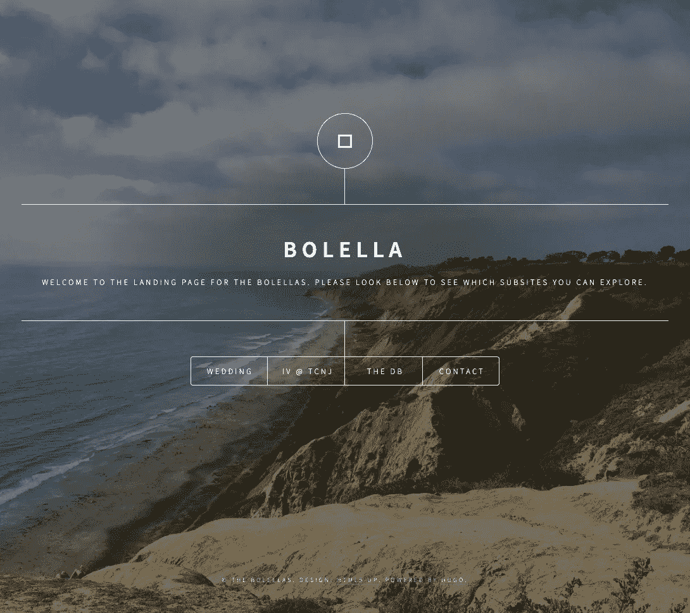
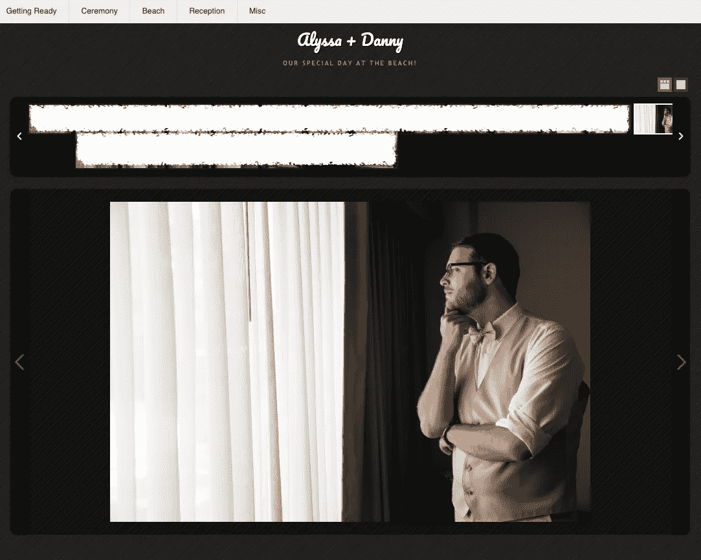

# 利用 Firebase 的免费托管我的个人网站

> 原文：<https://betterprogramming.pub/taking-advantage-of-firebases-free-hosting-for-my-personal-site-36f1b81bc8a1>

## 阻止我钱包里的钱流出

我从大学开始就拥有 Bolella.com，我想:“我最好在别人得到它之前抓住它！”(你知道，因为我的姓的域名实际上是谷歌的同义词)。

当时，我还通过同一个供应商支付了托管服务的费用，因为，嗯，那是你当时做的事情。当时它看起来并不多，对我来说，用它来尝试不同的事情就足够了(比如托管音乐、文件、项目、特殊活动网站等)。

但是 10 年后，托管一个我这些天难得更新一次的网站需要很多钱。

看看这些年来我累计支付了多少钱，仅仅为了让互联网的一小部分(我愿意认为是我的)存活下去而支付是不值得的。

所以，那就是我考虑免费替代品的时候，在经过一些研究后，我决定用 [Firebase 托管](https://firebase.google.com/docs/hosting)。

# 为什么是 Firebase

有几个原因。首先，我意识到这是个人的，是我已经有了使用 Firebase 的其他服务的经验，所以我有一个帐户(也是免费的)并且知道我的基本方法。

第二，是免费的*。“哇，那个星号在那里干什么？”你在问。

是因为它免费提供 1GB 的存储空间和高达 10GB/月的流量。这可能看起来不是很多存储，但它是可行的。请记住，我所建议的是利用一个小型/个人网站的免费层托管计划。

考虑到我们的目标是免费的，就必须有所取舍。我将给出一个例子，说明我是如何用一个创造性的小黑客工作来绕过这些限制的，以至于我几乎没有接近极限。

免费层在他们自己的子域(web.app 或 firebaseapp.com)下也有一个基本域名，或者你可以链接到自己的自定义域(单独出售)。

最后，在同一个项目中有所有其他可用的 Firebase 服务，所以如果你想扩展你的站点的功能，很多服务已经在那里了。

# 我如何使用它

是这样的。要设置一个项目和 Firebase CLI，我建议您参考官方的[入门](https://firebase.google.com/docs/hosting/quickstart)页面。我可以在这里这样做，但我基本上是复制粘贴，这是一个太简单的过程重写。

此外，我不会进入实际创建一个网站的细节，但我会进入我所使用的。

这是我从旧网站上转移过来的两个页面:

*   指向我的其他页面的登录页面
*   婚礼相册

注意:在我的网站的登陆页面上，你会看到一个链接，指向我以前的一些博客。具有讽刺意味的是，它们是免费托管的(Google Sites 和 GitHub page)，所以我只需要引用它们。

然而，我没有把它们作为我的主要主机，因为它们确实有自己的局限性。

# Hugo 登录页面

我的网站的登录页面。照片拍摄于加利福尼亚州托里派恩斯。

所以，在我浏览了[入门](http://plagiarizing)页面后，我想把我的网站从我的旧主机上拿下来，并把它移到新项目中。

第一部分是登录页面。我用 [Hugo](https://gohugo.io/) 创建了它，这是一个用于创建静态网站的相当简单的网站框架，也是他们[主题画廊](https://themes.gohugo.io/)的免费主题之一。

因为我已经按照步骤让我的自定义域指向新的 Firebase 项目，所以我实际上不需要重新构建我的登录页面。

我只是将它复制粘贴到我的项目的公共文件夹中，然后进行部署。就这样了！我的登陆页面是实时的！

# 使用 Google Drive 的婚礼相册

我和妻子结婚后，我们想要一个简单的空间让家人看到我们的照片。我们确实“私下”在脸书上发布了它们，但并不是每个人都有账户。

所以，我用 JavaScript 驱动的图库创建了一个简单的网站。最初，我以原始尺寸上传了每张照片以及它们的缩略图(顺便说一下，这是我用 Mac Automator 脚本创建的)。

缩略图是这样的，你可以滚动浏览图片，并实际加载网站，原件，因为有成员想要打印。

在说“我愿意”之前，我在想如何避开那些该死的托管费

这将是 Firebase 的一个问题，因为我只有 1GB 的空闲空间，即使我把它放在自己的独立项目中。

这个解决方案实际上非常好。你看，当你有结婚照的时候，你会把它们备份到多张 DVD，闪存盘，硬盘，电脑，当然，还有云端。

就我而言，我把它们存储在了谷歌硬盘上。不知何故，我的所有图像仍在空闲的驱动器层中，所以我是清白的。

我对 Drive 的了解是，在改变你的共享权限后，你可以直接链接到每一张单独的图片*和*该图片的缩略图！

这立即改变了游戏规则。因此，我编辑了所有的网址(包括原始大小和缩略图),并编辑了我的图库来引用这些链接。

到了部署的时候，我复制粘贴了没有照片的婚礼网站。这大大减少了我的网站的大小，使之在免费层的限制之内。

另外，这给了我硬盘上的照片一个新的用途。我还将我的项目设置为链接到“wedding”子域，由于我的自定义域已经在我的登录页面项目中注册，所以设置起来更加容易。

一旦我点击了 deploy，这个网站就开始运行了。

# 这对你意味着什么

我意识到这是几个非常特殊的用例，你可能不会涉及或关心(你甚至可能会评判我的 web 开发技能，这不是我的强项)。

但我要说的不是我自己的目的。相反，它是关于 Firebase 主机如何足够灵活地满足各种需求，甚至在免费层。

注意，在这两个用例中，唯一特定于 Firebase 的步骤是创建项目、链接我的域、注意自由层的限制，然后点击 deploy。维护只需要重复最后两个步骤。

说到局限性，如果你愿意为它制定一个计划，它们是可行的。

在实现方面，我能够用相同的步骤部署静态页面的不同实现。但是，就内容而言，我认为使用 Drive 是相当巧妙的。

参考云账户可能会有所帮助，但也可以考虑其他场所，如托管、链接和/或嵌入来自 [Imgur](https://imgur.com/) 或[异常艺术](https://www.deviantart.com/)的图像、 [Soundcloud](https://soundcloud.com/) 上的音乐、 [Dropbox](https://www.dropbox.com) 上的文件，以及目前可以存储内容的其他地方。

简而言之，拥有一个个人网站已经变成了关注我的创作、我的需求和我想要分享的东西。

这是我想让 T9 关注和关心的，而不是我花了多少钱买任何东西，或者不得不决定放弃我自己名下的一小块互联网房地产，一个非常受欢迎的定制域名。

如果你正在寻找一个个人主页，一个作品集，一个活动网站，一个组合，或者其他什么，Firebase 是一个很好的免费途径。