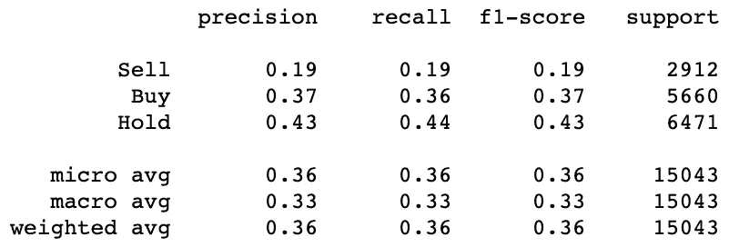
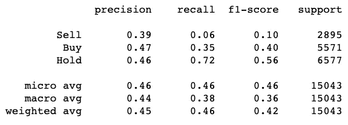
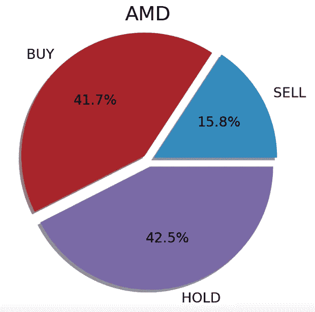

# 我建立了一个机器学习模型，像沃伦·巴菲特一样交易股票(第二部分)

> 原文：<https://betterprogramming.pub/teaching-a-machine-to-trade-stocks-like-warren-buffett-part-ii-5d06427b13f7>

## 使用机器学习来分析股票的基本面


*照片由* [*斯蒂芬道森*](https://unsplash.com/@srd844?utm_source=medium&utm_medium=referral) *上* [*下*](https://unsplash.com?utm_source=medium&utm_medium=referral)

*编者按:本文仅用于信息和教育目的，不包含财务建议。*

*点击下面的第一部分:*

[](https://medium.com/swlh/teaching-a-machine-to-trade-stocks-like-warren-buffett-part-i-445849b208c6) [## 我建立了一个机器学习模型，像沃伦·巴菲特一样交易股票(第一部分)

medium.com](https://medium.com/swlh/teaching-a-machine-to-trade-stocks-like-warren-buffett-part-i-445849b208c6) 

在前一部分，我们设定了我们的目标:创建一个机器学习分类模型，通过分析季度报告数据来利用对股票的基本面分析，从而确定一只股票当时是否值得投资。为了做到这一点，必要的信息经历了一个数据工程过程，包括数据收集、清理、格式化、可视化和特征选择。整个过程为下一个激动人心的阶段准备了数据:数据建模！

机器学习建模涉及接受数据来训练模型，以便基于该数据进行预测。然而，这些模型不能只接受我们给它的任何数据——它必须符合特定的标准。这个标准是在我们决定要解决什么样的问题时主观设定的。每个问题都需要他们自己的一组独特的数据，而且大多数时候这些数据必须经过整个数据工程过程。

# 我们的数据

由于我们明确检查了季度报告，我们决定通过观察股票相对于之前 QR 的 QR 表现来评估股票的投资价值，并将其存储为百分比变化。通过观察下一个 QR 的`Price high`和`Price low`来确定`Buy`、`Hold`、`Sell`的类别标签，以及它们是否增加或减少了显著的量。

我们拥有的两组数据:`percentage change values`和`class labels`，将分别构成 X 和 Y 值。百分比变化值(X 值)被称为`independent variable`。分类标签(Y 值)被称为`dependent variable`。这些变量将被缩放，以提高我们的模型的性能。然后，缩放后的数据将被分成训练集和测试集，以评估我们的模型。一旦数据准备就绪，我们将能够最终使模型符合我们的数据，然后进行一些预测/分类！

在最后一部分中，我们创建了两个不同的数据集，每个数据集的前十个特征集略有不同(相关特征与树分类器的特征重要性)。这使我们有机会根据提供给模型的数据来比较和对比模型性能。一个数据集实际上可能比另一个数据集表现得好得多。这听起来像是额外的工作，但是实际上，我们只需要改变加载到模型中的数据，只需要修改一行代码。

# 机器学习分类器

为了找到性能最佳的机器学习分类模型，我们将通过多个模型运行我们的数据。每种模式都有自己的优缺点。为了确保我们对数据使用最佳模型，我们必须尝试每个分类器。不要担心，一旦我们为一个模型编写了代码，我们就可以为每个新模型复制相同的代码，只需做几个一两行的修改。

我们将使用的分类模型:

*   [AdaBoost](https://scikit-learn.org/stable/modules/generated/sklearn.ensemble.AdaBoostClassifier.html)
*   [决策树](https://scikit-learn.org/stable/modules/generated/sklearn.tree.DecisionTreeClassifier.html)
*   [假人](https://scikit-learn.org/stable/modules/generated/sklearn.dummy.DummyClassifier.html)(基线模型)
*   [梯度提升](https://scikit-learn.org/stable/modules/generated/sklearn.ensemble.GradientBoostingClassifier.html)
*   [K 个最近邻居](https://scikit-learn.org/stable/modules/generated/sklearn.neighbors.KNeighborsClassifier.html) (KNN)
*   [逻辑回归](https://scikit-learn.org/stable/modules/generated/sklearn.linear_model.LogisticRegression.html)
*   [朴素贝叶斯](https://scikit-learn.org/stable/modules/generated/sklearn.naive_bayes.GaussianNB.html#sklearn.naive_bayes.GaussianNB)
*   [随机森林](https://scikit-learn.org/stable/modules/generated/sklearn.ensemble.RandomForestClassifier.html)
*   [支持向量机](https://scikit-learn.org/stable/modules/generated/sklearn.svm.SVC.html) (SVM)
*   [极限梯度提升](https://xgboost.readthedocs.io/en/latest/get_started.html) (XGBoost)

那可是好多款啊！它们中的每一个都将被训练并适合我们的数据集，以便确定最佳执行模型。

## 虚拟分类器

为了衡量每个模型的性能，需要将它们与基线模型进行比较。这就是我们的虚拟分类器的用武之地。伪分类器的功能类似于随机猜测每个 QR 的类别标签。它通常基于概率——类别标签将根据其样本大小来确定。

使用虚拟分类器作为我们的基线模型，为每个模型设定了性能标准。为了被认为是可行的模型，每个模型必须能够胜过虚拟分类器。如果他们不能超越基线模型，那么这个模型并不比随机猜测更好。

# 编码分类模型

既然我们已经准备好了数据并建立了我们将要使用的模型，我们就可以编写我们的第一个分类器了。这将是我们的基线模型(虚拟分类器)，以便设置要击败的标准。

## **导入库并加载数据**

在这里，我们加载 Python 库，我们需要开发一个虚拟分类模型。这些库的大部分对于其余的模型都是一样的——只是替换了`DummyClassifier`导入行。在导入数据时，我们可以选择想要的数据集。如果我们希望比较两个不同数据集的模型性能，这将是很重要的。

## **缩放和训练、测试、拆分数据**

我们在这里缩放数据，以提高我们大多数模型的整体性能。要使用的缩放方法由您决定。每个定标器都有自己的优势([点击这里查看每个定标器的对比](https://scikit-learn.org/stable/auto_examples/preprocessing/plot_all_scaling.html))。

然后，这些数据被分成 X 和 Y 变量的训练集和测试集，我们需要用它们来拟合和评估我们的模型。

## 创建虚拟分类器

我们通过实例化分类器来创建虚拟分类器，然后使其适合我们的训练集。然后，我们使用测试集来制作预测标签，以便与实际标签进行比较。最后，我们打印出一份分类报告，其中包含我们需要的评估指标:



我们的虚拟分类器的分类报告功能的评估指标

# 评估指标

由于我们正在处理一个不平衡的数据集，我们不能依赖准确性作为模型的评估指标。这就是为什么它没有被包括在分类报告中。准确性可能是一个重要的衡量标准，但由于我们问题的性质和等级的不平衡，它将被忽略，以利于*精度*和*召回*。[点击此处了解更多信息](https://developers.google.com/machine-learning/crash-course/classification/precision-and-recall)。

## 精确度>召回

为什么我们选择精确而不是召回？Precision 处理*误报的数量。*当涉及到投资决策时，我们不希望分类器将一个`Sell`错误地归类为一个`Buy`。在我们保守的投资策略上，我们宁愿错过投资的机会(`Recall`)，也不愿投资错股票(`Precision`)。显然，两者之间有一个平衡，这就是`F1-Score`发挥作用的地方。然而，每个分类模型的总体判断将基于*相对于基线模型增加其* `Precision` *得分*。

# 混淆矩阵

将我们的模型的结果可视化可能更好。对于每个分类器，我们将可视化它们的混淆矩阵，以获得更好的可解释性。混淆矩阵将向我们显示被错误分类的 QRs 的数量。

运行该遗嘱会给我们带来:


我们的虚拟分类器的混淆矩阵

随着混淆矩阵的可视化，基线模型的创建和评估，我们已经正式完成了我们的第一个分类模型！

# 构建更多分类模型

构建更多的模型似乎是一项艰巨的任务，但是不要担心——正如我们之前所说的，要创建更多的模型，我们真正要做的就是复制基线模型的代码，然后修改几行代码。下面是一个模型的代码(类似于基线模型):

构建模型的全部代码(以及评估指标和混淆矩阵)

正如我们所看到的，构建每个模型只需要修改两三行代码，这都要归功于 Scikit Learn 的兼容库。

我们需要修改的两三行代码是:

*   `with open(“top10_df.pkl”, “rb”) as fp:` —仅在测试不同特征的其他数据集时修改。
*   `from sklearn.ensemble import AdaBoostClassifier` —将这些导入更改为适当的库及其各自的分类器。
*   `clf = AdaBoostClassifier()` —将此变量更改为适当的分类器。

其他一切都应该保持不变，运行起来应该没有问题。(*查看本文末尾的 Github，了解各型号的概述*)。

# 网格搜索—参数调整

当谈到使模型适应数据集时，我们可以让模型保持原样，或者我们可以通过使用`Grid Search`来增强它们的性能。通过使用这种方法，我们将能够使每个分类模型的参数适当地适应我们的数据集。

在迄今为止我们开发分类模型必须做的所有事情中，网格搜索是最耗时的。不是因为我们要写的代码量(不多)，而是因为每个参数组合的迭代次数。有些模型比其他模型需要更长的时间进行网格搜索，但整个过程仍然需要相当长的时间，因为我们将对我们拥有的每个模型进行网格搜索。

每个模型的网格搜索代码本质上是相同的，我们只需要修改几行代码。

为每个分类模型运行网格搜索的代码

正如你所看到的，没有太多的代码需要编写，事实上这里有些代码我们以前使用过(分类报告和混淆矩阵)。

需要改变的是:

*   `params`变量，这将是一个字典，字典的键对应于各自的分类器的参数，字典的值是我们想要在每次迭代中尝试的不同值。
*   `clf`早在最初改变变量以适应每个新分类器之前就应该被改变。

## GridSearchCV 的参数

关于`GridSearchCV`自身的参数，需要根据我们的个人需求进行设置。正如我们所见，上面已经处理了`clf`和`params`。但是对于其他参数:

*   `return_train_score`被设置为`True`，以便观察随后评估的结果。
*   `verbose`被设置为`5`,这样我们就可以看到每次迭代的进度和它们的分数。
*   `scoring`被设置为`‘f1_macro’`，因为我们在确定最佳参数时会优先考虑 F1 分数。

## F1 分数宏观平均值

`F1 Score`优先于`Precision`的原因仅仅是因为分类的数量。当`Precision`被优先考虑时，`Precision`分数可能显著增加，但是被分类为某些类别的 QRs 的数量大大减少。在我们的例子中，分类器很少会对`Buy`或`Sell`进行分类，但是会对`Hold`类进行分类。这是因为`Hold`类是多数类。我们不希望我们的分类器很少告诉我们什么时候投资，我们希望至少有相当数量的机会落在`Recall`分之下。

为了在`Precision`和`Recall`之间取得平衡，我们将优先考虑`F1 Score`。我们选择`Macro Average`而不是`Micro Average`的原因是因为宏忽略了阶级的不平衡。`Hold`类是占主导地位的类，当涉及到投资活动时，它几乎不告诉我们任何东西——我们更想知道一只股票是`Buy`还是`Sell`。总的来说，使用`F1 Score Macro Average`将允许`GridSearchCV`在我们的首选条件下找到最佳参数。

# 运行和评估每个分类模型

既然我们已经有了数据、分类器代码、评估报告和网格搜索代码，我们可以将它们应用到每个分类模型中。这可能需要一段时间，但我们最终会知道哪个分类器在对股票进行分类时表现最好。也可以选择使用`Sklearn’s Pipeline`库来简化流程，但是我们应该仔细检查每个模型，真正理解每个步骤。(查看最后的 Github，看看我们是如何运行每个模型的)。

## 保存分类模型

一旦我们决定了哪个模型最适合我们的数据，我们就可以用正确调整的参数保存拟合的模型。看看下面的代码，看看如何保存一个模型(只有两行代码):

```
# Importing the library
from joblib import dump# Saving the classification model as a file named 'xgboost.joblib'
dump(clf, “xgboost.joblib”)
```

这段代码将导出我们的模型，以便在其他文件中使用。

## 表现最好的型号

在我们的例子中，性能最好的模型来自 XGBoost 分类器，它使用了树分类数据集的前 10 个重要特征。该分类器的分类报告如下所示:



XGBoost 的分类报告

正如我们在这里看到的，与基准模型相比，XGBoost 模型的*购买*类增加了 10%,而*销售*类增加了 20%。这是对基线模型的重大改进。数字不接近 100 的原因是我们问题的性质。在许多方面，我们试图预测未来。如果我们的分类器能够以 47%的准确率(或精确得分)确定一只股票是否值得投资，那么我们应该认为这是一个重大成就！

# **分类新数据**

假设我们想使用我们的分类器对一个新的 QR 进行预测。我们如何做到这一点？最好的选择是找到最新的 QR 值和之前的 QR 值，然后观察它们之间的百分比变化，以便它们与我们自己的数据集中的格式相匹配。

新的数据可以从许多报告 QRs 的网站上获得。我们既可以从网上搜集这些值，也可以手动输入。Stockpup.com 可能也有最新的 QRs，对于这个项目，我们将使用该网站的最新值。在前面的部分中，我们从每只股票中删除了最新的 QRs，因为没有未来价格的高低用于我们的类别标签。所以这些 QRs 仍然是未标记的，但现在我们可能能够使用分类器的预测来标记它们。

> **注意**:Stockpup.com 不再活跃。请参阅上一篇文章，了解在哪里检索这个分类器的基本数据。

准备我们的数据和模型

我们使用的数据同样来自 Stockpup.com，但现在我们特别寻找最新的 QRs 波群。理想情况下，我们将通过网络抓取或手动输入从其他网络来源收集最新的 QR。这是因为 stockpup.com 并不总是有最新的 QR 可用。

## 我们最新 QR 和可视化的助手功能

当处理新数据时，为了与我们的分类器合作，我们必须对其进行缩放，因为这是我们最初训练分类器的方式。必须对数据进行格式化，以包括相对于其余数据的百分比变化、正确的要素列和比例值。一旦我们有了所有这些，我们就可以对最新的 QR 进行分类。

## 对最新 QR 进行分类

对于本例，我们将使用 AMD 的最新 QR:

运行这段代码还将创建一个包含预测概率的饼图



AMD 的预测概率

根据我们的分类器，AMD 有 42.5%的机会成为`Hold`。最主要的概率将决定分类器如何确定股票的名称。

# 结论

根据季度报告决定股票价值并不是一项新的成就。对于大多数基本面分析师来说，我们使用的策略可能被认为过于简单或过时。但是对于学习机器学习分类的目的来说，这已经足够了。我们可能会添加更多的功能来改进模型，或者根据新的策略改变现有的功能。

还有一些技术可以简化这个过程，比如创建一个`Pipeline`。或者我们甚至可以用神经网络进行实验，看看它们是否能比我们目前的模型表现得更好。

这些选项将在以后的另一篇文章中讨论。所以请留意更多！

同时，我们希望你学到了更多关于机器学习模型的创建和评估的知识。请随意修改代码，尝试自己的策略。有许多实现的可能性，我们现在有机器学习来帮助我们回测我们能想到的任何策略！

> [在这里注册一个中级会员，可以无限制地访问和支持像我这样的内容！在你的支持下，我赚了一小部分会费。谢谢！](https://marco-santos.medium.com/membership)

## 资源:

[](https://github.com/marcosan93/Stock-Performance-Predictor-2.0) [## Marcos an 93/股票表现预测工具-2.0

github.com](https://github.com/marcosan93/Stock-Performance-Predictor-2.0) [](https://medium.com/swlh/teaching-a-machine-to-trade-stocks-like-warren-buffett-part-i-445849b208c6) [## 我建立了一个机器学习模型，像沃伦·巴菲特一样交易股票(第一部分)

### 利用机器学习进行股票基本面分析

medium.com](https://medium.com/swlh/teaching-a-machine-to-trade-stocks-like-warren-buffett-part-i-445849b208c6)