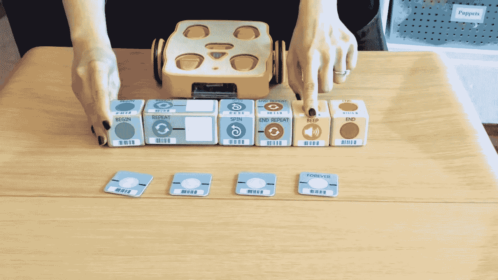
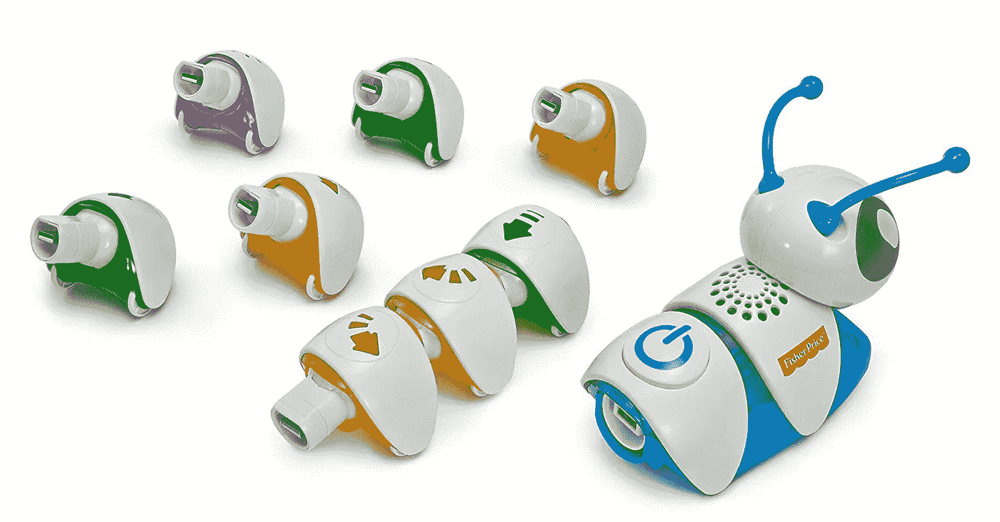
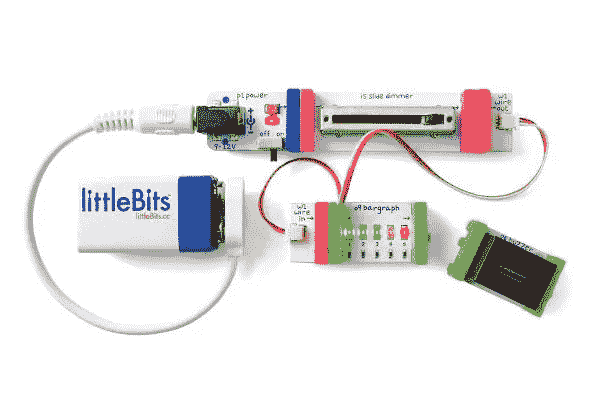
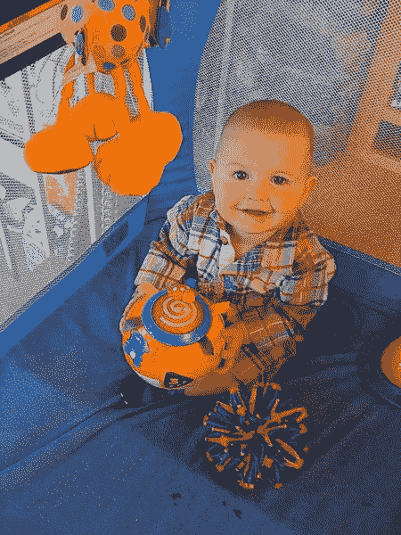
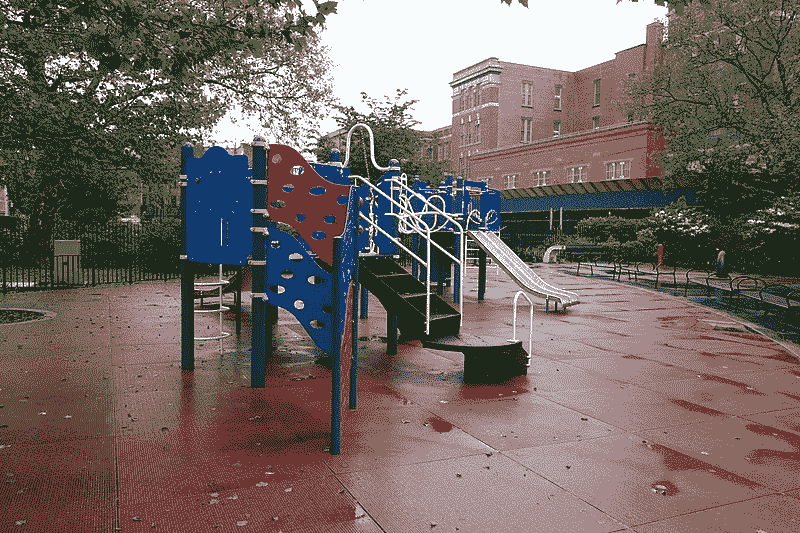
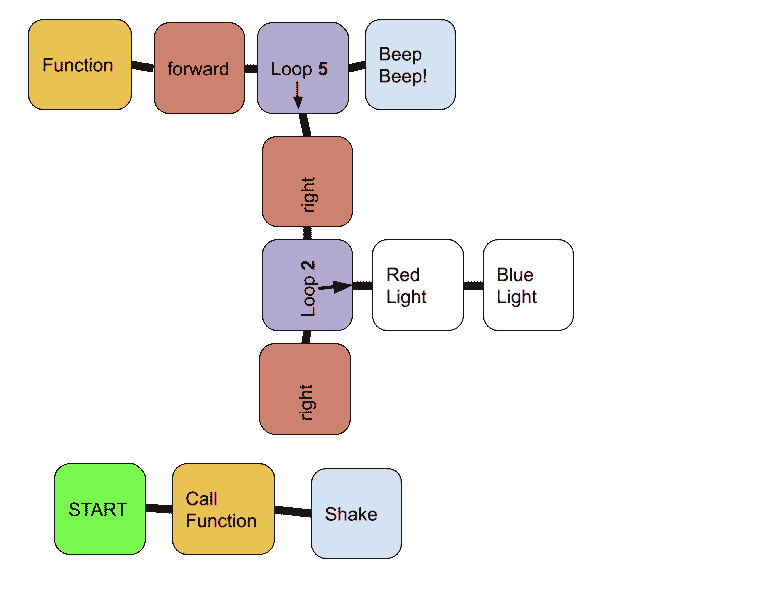

# 教孩子编程

> 原文：<https://betterprogramming.pub/teaching-kids-programming-fdeaf1745980>

## 来自行业内部的批评、想法和漫谈


照片由[像素](https://www.pexels.com/)上的 [Pixabay](https://www.pexels.com/@pixabay) 拍摄

如今，似乎有很多中上阶层的专业人士想教他们的孩子编程。无论哪里有中上层阶级的专业人士想要教他们的孩子一些东西，那些拥有优秀产品的教育专家一定会紧随其后。

这里不缺少书籍、玩具、研究论文、方法论、流行语和高价小工具，致力于将 2 到 12 岁的孩子培养成未来高薪的程序员！

如果您的孩子对机器人感兴趣，您可以获得 Kibo:



来源: [KIBO](https://kinderlabrobotics.com/getting-started/)

您的孩子将积木排成一行，扫描每块积木上的条形码，机器人按照扫描的指令按顺序操作。

没错，起价仅为 200 美元，这款聪明的产品利用了您孩子对机器人和编程的热爱，为他们将来从事零售业做准备！

说真的，我已经向数百名儿童和家长展示了这个玩具——这就像是在用一排不耐烦的顾客和一台喜怒无常的扫描仪结账。

类似地，还有费雪-普莱斯的思考和学习代码支柱(50 美元):



来源:[儿童玩具新闻](https://www.kidstoysnews.com/fisher-price-think-learn-code-pillar/fisher-price-think-learn-code-a-pillar6/)

专为 2 岁的孩子设计，您的孩子将有几个小时的乐趣捣碎电源按钮和扔在房间里的片段！它巧妙地引入了编程，诱使父母(在花了 50 美元买这个东西的胁迫下)以预期的方式玩玩具，同时疯狂地向他们哭喊着想要回该死的毛毛虫的蹒跚学步的孩子解释编程和机器人技术。

老实说，我觉得我和毛毛虫在一起比和蹒跚学步的孩子在一起更开心。

如果这两个都不太对，那么有几十个玩具介绍了每一个专业程序员和机器人专家日常使用的四种主要技能:

*   向前
*   左边的
*   对吧
*   旋转

如果你的孩子仍然不感兴趣，并不是所有的希望都破灭了。还可以教他们电气工程！给他们买小比特(100 美元以上……非常高):



来源:[小比特](https://littlebits.com/)

每个人都知道电路从一端的电池开始，以直线从电池延伸出去！

在运行非 LittleBits 电气工程演示(真实故事)时，我亲身体验了 LittleBits 的教学功能:

**我:**“所以，在这个活动中，我们要把电池连接到 LED 上来点亮它。”
**孩子的母亲:**“哦，他很擅长这个。我们家里有很多小玩具，他一直都在玩！”
**子:****抓起电池和 LED，一下子把所有的线都拔掉** **灯:****保持关闭** **电路:****短路** **我:**“好，酷。”

如果你仍然不相信，这里有一个鼓舞人心的 TEDx 演讲，关于通过创造性表达来教年轻程序员(以及她也卖的 200 美元的玩具机器人):

这个视频提出了一个很好的观点，当谈到教孩子编程时，我们应该想到“操场”而不是“游戏围栏”儿童无法在游戏围栏中学习——适合年龄的人工环境，由安全工程师设计，周围有围栏，活动有限。



照片由[德鲁·祖克曼](https://www.flickr.com/photos/44578715@N05/5122876891)在 [Flickr](https://www.flickr.com/) 上拍摄

他们在操场上学习得最好——适合年龄的人工环境，由安全工程师设计，周围有围栏，活动有限。



照片由[维基媒体](https://commons.wikimedia.org/wiki/File:Winthrop_Playground_td_(2019-05-12)_021.jpg)上的 [Tdorante10](https://commons.wikimedia.org/wiki/File:Winthrop_Playground_td_(2019-05-12)_021.jpg) 拍摄

好吧，说出心里话很有趣，但希望你已经意识到我有点爱开玩笑。计算机科学和编程教育是我非常关心的一个话题，它确实值得一次真诚的讨论。所以，下面实聊。

# 下面是真实的对话，我在其中提到了(大多数)Snark

在某些情况下，我没有给这些玩具足够的信任。其中许多确实引入了函数和条件逻辑等概念。然而，正如任何一个和 7 岁孩子争论过的人都知道的，这些概念是通过说话和与世界互动而习得的。

如果天气好，我们将去公园。

```
if weather == 'nice':
    goToPark()
```

"呆在你的房间里，直到我叫你出来。"

```
while !toldToComeOut:
    stayInRoom()comeOut()
```

***注:*** *中的“！”第一行中的表示“不是”，或相反的值。比如，“虽然没有人告诉你出来……”程序员称这个操作符为“砰”，而不是“感叹号”所以，你可能会把这段代码大声读出来，就像“Bang told to come”，说起来更有趣。*

"你想看什么书，我们都可以看，但之后你必须睡觉。"

```
readBook(bookIWant)
sleep()
```

这些是我们每天都在使用的概念，它们对于孩子们以具体的方式理解是至关重要的。这可以通过与你的孩子交谈，解释计划，分解事情，鼓励他们使用逻辑推理，建设性地质疑他们的思维过程来实现。

不是给他们买 50 美元的毛毛虫。

但有人可能会说，即使孩子理解了这些概念，编程中仍然涉及很多东西——语法、计算机、打字…

我认为这些玩具并没有真正教会我们这些。事实上，他们经常特意去*而不是*教授这些概念，这很好。我曾经教过 12 岁的孩子 Scratch(一种入门的拖放式编程语言),他们和我一样很快就理解了简化的语法。最难的部分就是让这些该死的积木按照你想要的方式排列起来！

当我第一次开始编程的时候(13 岁——相对来说，在那之前我几乎不用电脑)，我从来没有想过，“这个‘如果’*语句是什么意思？”我只是看到了它，它是有意义的，我把它输入到我的 TI-BASIC 界面中，因为我想生成一些非常非常好的质数。*

*虽然编程语法是一件必须学习的事情，但它并不是区分非程序员和程序员的*和*的东西。这是路上的一个小点。一些容易理解的东西——比如马克·吐温在《哈克贝利·费恩历险记》中使用的南方方言如果你已经知道如何阅读，这可能需要一点时间来适应，但这也是有意义的。*

*因此，儿童作为与世界互动的人类，已经有了相当好的逻辑、秩序和结构感。如果没有，不要担心，他们会捡起来(但很可能不是通过编程)。*

*“编程语法”，如果学过的话，也不是非常有用。不要误解我——明亮的颜色、形状和积木对孩子来说很棒！爱死了。但是如果他们继续编程，这些知识将完全不可转移。*

*那么，为什么玩具以它们的形式存在呢？以下是一些悲观和阴谋论的可能性:*

*   *设计者迎合了那些不太了解计算机科学或编程的父母和教育工作者，并坚持“编程是一个食谱/一套指令”的比喻。*
*   *他们把玩具作为一种方式，让孩子们在以后的生活中不害怕编程，而不是“教”他们任何东西。类似于那些让你“习惯烹饪”而不是“教你烹饪”的幼儿厨房玩具*
*   *成年人自己害怕编程并将这种恐惧投射到孩子身上。*

*但是拆东西很容易。如果我如此憎恨现存的一切，还有什么选择？*

*明确一点:我并不讨厌*一切*。例如，我喜欢 LittleBits(即使它有时会让孩子们对电的工作原理感到困惑)。但我确实认为编程教育者有必要深呼吸，退一步。然后我们应该看看我们到底在教什么，为什么要教。我们应该考虑，在整个世界的可能性中，什么是最好的教学。*

*因为如果我看到另一个“不是另一个机器人玩具，但它会左，右，左，右，这是一个机器人玩具，”我会把我的头发扯下来。*

# *需要考虑的几个概念*

*当面对一个明亮、闪亮的新白板时，很容易想把整个知识世界一次塞进他们的脑袋里。但这让孩子们很困惑。*

*因此，怀着巨大的悲痛，我将整个编程世界缩小到三个主题。我认为关注这些话题可以极大地改善当前的编程教育。*

*对此，我使用了三个标准:*

*   ***重要的**:如果你继续编程，你将不得不在某个时候学习它。*
*   ***基础**:他们深刻洞察了编程“到底是什么”它们可以应用于任何编程情况，并且将允许孩子在他们的一生中使用这些信息，不管技术如何变化。*
*   *简单:它们不需要高深的术语或理论就能理解，而且可以教授给各种年龄和技能水平的人。*

*我将经常使用，作为一个例子，我们如何将这些编程概念应用到一个“机器人玩具”这并不意味着我认为我们应该坚持让每个编程玩具都成为机器人的趋势(见上面的 rants)。我在这里只是用“机器人”作为一个方便的比较工具，来比较当前存在的和可能存在的。*

## ***状态与价值:编程的基础理论***

*所有已经编写的和将要编写的程序都可以归结为两件事:状态和价值。*

*你可以把“状态”想象成一个机器人的位置和方向。机器人目前的状态是什么？它在地板上的一个特定位置，面向左边。下一步，我们可能会改变它的状态——向前移动一米并向右转，这样它就处于不同的位置和方向。*

*大多数编程玩具只是通过一系列线性步骤来修改事物的状态。机器人从一个状态移动到下一个状态，在地板上穿行。*

*“值”是传入程序的变量或数据。这些值可能会影响程序的状态。一些编程玩具确实使用值。这是你可以用 Kibo 做的事情:*

```
*while noWallInFrontOfRobot:
    moveForward()

turnRight()*
```

*在这种情况下，使用的值是机器人前面是否有墙。机器人将向前移动，直到出现一堵墙。在这一点上，程序将从“快乐地前进”状态进入“因为有一堵墙，所以转得更好！”状态。*

*该值会改变状态。*

*但是这里有一个概念，绝大多数这些教育玩具都忽略了:程序可以改变价值观。*

*在理想的世界里，机器人可以推倒墙，甚至对墙正在推倒它这一事实做出反应。机器人可以根据墙壁当前的颜色(可能来自机器人之前的油漆工作)将墙壁漆成不同的颜色。*

*值改变状态，状态改变值，它们在一个复杂的相互作用中一起工作，形成了所有可以编写的程序。*这个*是编程的基本概念。*

*虽然大多数这些玩具处理的是“状态变化”，但大多数专业程序员实际处理的是“值变化”行业中甚至有巨大的推动力来尽可能远离“状态变化”(尽管在需要时仍然使用它们)，并通过始终保持相同的状态，但修改或转换值来完成任务。*

*机器人不是在房间里走来走去，而是房间来到机器人面前，机器人在房间经过时对每个点应用一些值变换。*

*值得称赞的是，LittleBits 是这一概念的一个极端例子。电流从一端馈入，价值只能从一个街区转换到下一个街区。后续块接收先前块的变换值。*

*所以很明显，我们不认为“价值改变”是一个超出儿童想象力的概念——我们只是没有在“编程”的背景下提出它*

*入门编程玩具应该引入状态变化和值变化，作为平滑交互的概念，相互影响。*

## ***编程结构***

*看一个孩子玩乐高玩具。他们是否以一种模式将它们线性堆叠:红色、黄色、蓝色、红色、黄色、蓝色、红色、黄色、蓝色…*

*这可能在几分钟内很有趣，但如果这是孩子唯一做过的事情，我会开始担心他们。更常见的是，他们会建造房屋、汽车或人。他们把车开进房子里，他们在院子里放了一棵树。*

*也许孩子意识到他们想要几棵乐高树，所以他们指导另一个孩子开始按照一定的规格制作树(对每棵树重复使用相同的步骤)，以便美化乐高资产。*

*专业程序员也是这么做的。他们不做线性的代码集，但是他们按照“块”来工作和思考。他们创造结构、物体和变形金刚。对象可以有属性和值，做有用的事情。他们四处移动它们，改变它们在网和树上的互动方式——不仅仅是线。他们要求团队中的另一名程序员为他们开发一个小的辅助功能，然后当队友完成时，他们将该功能集成到自己的代码中。*

*事实上，在专业编程中，不鼓励独自工作，只把程序写成一组线性步骤。我既接受过指令，也接受过指令，比如:“哇，这真恶心。把它拆开，把它拆开，你在做同样的事情好几次——把它变成自己的块…别人已经写好了，就用他们的吧…”*

*当教育工具确实有函数的概念时(例如，Scratch)，它们通常被作为一种高级技术教授给最大和最复杂的代码。这传达了一个信息，代码主要是“线性的”，但是好吧，如果你真的，真的需要它，这里有一个奇怪的“函数”的东西。*

*这是一个思维实验。如果我们不得不*从“函数”的概念开始*，然后*再*教授“代码行”的概念，其中每一行代码都必须在某种函数中(毕竟，函数是最重要的部分)。那么编程是如何教授的呢？*

*说真的，想象一下你和一个八岁的孩子说话，把编程呈现为“一系列函数”而不是一系列行。课程计划和解释会有什么变化？入门练习是什么？你会改变教育工具本身中函数的使用或表示方式(函数的语法)吗？*

*现在，我并不支持这种方法作为教授编程的***方式。想的话从台词开始！但我认为偶尔进入这种心态很重要。它更接近编程的本质，如何使用它，以及为什么它如此强大。毕竟，在幕后，每一行划痕都有自己的功能。Scratch 中的函数是多个函数的函数(这些函数反过来调用其他函数——它是所有函数的函数！)****

****但是函数永远不应该作为过于复杂的代码的奇怪副产品来教授。功能小且不复杂。它们可以只有几行，甚至只有一行！****

```
****function turnRight():
    right(90)function rightForward():
    turnRight()
    forward()****
```

****另一个鼓励更多编程思维的简单方法是将机器人本身带入代码中。而不是一个存在于真空中的函数，没有对任何事物的明确依附，就像这样:****

```
****forward****
```

****尽量把发生的事情说清楚:****

```
****purpleRobot.forward****
```

****这可以让你坚持最基本的，但也可以让孩子想做更有趣的事情时有扩展的可能性:****

```
****function slowToStop(robot):
    robot.speed = 10
    loop 5 times:
        robot.forward
        robot.speed = robot.speed - 2slowToStop(purpleRobot)****
```

****仅仅一个简单的概念上的改变——“由/在*事物*上明确执行的功能”而不是“存在于神秘真空中的功能”——打开了大量不同的选项。****

*   ****孩子能制造第二个机器人，并在同一个程序中移动两个机器人吗？****
*   ****机器人可以用代码相互交流或影响吗？****
*   ****一个机器人可以是具有特殊功能和能力的快速机器人，而另一个是不做太多事情的慢速机器人吗？****
*   ****如果我这样做，会发生什么:****

```
****purpleRobot.forward = slowToStop****
```

*   ****对于大一点的孩子:“前进”(一个函数)和“速度”(一个值)有什么区别？****

****但是大多数编程玩具采取了完全相反的方法——代码是线性的，它只能单向扩展。所有命令都存在于真空中，只是“知道”它们应该作用于什么(或者它们只能被输入/读取到单个物理对象)。值总是硬编码传递给每个函数的东西，步骤不受前面步骤的影响。****

****这并不是说我们让事情变得更“复杂”****

****复杂的是这些玩具跳过的所有圈，以确保它们的小指令块*总是*堆叠成一条直线。“这是表示循环结束的块…哦，你也忘了‘结束程序’块。”大声哭出来，如果没有更多的程序，为什么我需要一个块来说呢？****

********

****如何更好地将程序的“结构”可视化，而不是直接看到它？****

****复杂的是阅读和记忆这些没完没了的“程序”呕吐物中发生的事情，这些呕吐物没有有用的结构来帮助你导航或找到你的方向。****

****复杂的是反复写同样的指令和数字。****

****复杂的是，无法根据命令的编写方式来判断命令应该做什么或它在做什么。****

****结构美观、简单，是编程的基本要素。他们让事情变得简单，而不是复杂！****

## ******编程前教计算机科学******

****当我还是一个小书呆子的时候，我在课间休息时志愿去小学图书馆借书。我最喜欢的部分是重新装裱《国家地理》——这是一个华丽的收藏，横跨两个六英尺的书架，每个书脊上都有日期。****

****它们必须按时间顺序放在书架上，所以我会有一小摞未分类的杂志，这些杂志必须插入一大堆已分类的书架上。****

****我花了很多时间坐在这些书架前的地板上，把金色的期刊一个接一个地放好。这给了我很多时间去思考如何最有效地完成任务——甚至思考如何最低效地完成它！****

*   ****天真的方法是:从“待搁置”的书架中挑选一本杂志，放在正确的位置。****
*   ****或者，我可以先把“待搁置”的书架分类，记住杂志的日期放在书架的最上面，同时从左到右扫描较大的书架，边走边插入。****
*   ****如果有很多杂志需要搁置，只按年份松散地排序，然后插入，而按月份排序，一次一年，是不是更好？****

****许多顾客还自己动手重新摆放他们自己的国家地理杂志，这使得这个大书架处于无序状态。如何最好地解决这个问题？最好是先重做再修改，还是先修改再重做？如果书架只是稍微有点乱，我可以通过在这里和那里做一些改变来解决它。或者，我可以完全删除无序堆栈，回到“从无序堆栈插入”的技术。****

****但是如果货架非常无序呢？****

****“非常无序”的情况也适用于我那堆“待搁置”的国家地理杂志。尤其是当堆栈变大时，使用正确的排序方法变得非常重要。我很快意识到有很多*方法可以对一个非常无序的堆栈进行排序！*****

****尽管当时我从未听说过计算机科学，更不用说“排序算法”，但即使在孩提时代，在完全没有计算机的情况下，思考和重新发现其中一些原理也是很容易的。****

****当你在字典中查找一些东西，计划一条旅行路线去做一个差事列表，根据将要过期的东西做晚餐，或者组织一个基本上任何东西的集合时，你都在使用计算机科学的原理。这些都是程序员花大量时间深入思考的问题。****

****当然，这些与“物理计算机科学”的接触越来越少了。你上一次在物理纸上使用插值搜索(程序员可能会这么说)来翻阅字典查找单词是什么时候？卡片目录、电话簿、CD 收藏、百科全书——这些都被计算机存储和算法所取代。****

****我三年级的时候(**摇手杖** )我们学过卡片目录。在计算机科学中，卡片目录是“二级索引”的一个例子显然，对于八岁的孩子来说，在 90 年代使用这个主题并不太难，但是现在的孩子应该如何学习二级索引呢？****

****像数据是如何组织的，它是如何移动的，它是如何被发现的，什么是“容易”做的，什么是“难”做的，这些概念都是编程的基础。它们的重要性不亚于“语法”对于阅读的重要性，或者“数字代表数量”对于算术的重要性。****

****我并不是说八岁的孩子应该学习如何计算堆的大 O 时间(老实说，我几乎不记得什么是堆，我很好)。但是“排序”和“寻找”作为一般问题的概念是无价的，这些问题有更有效和更低效的解决方案。****

****不幸的是，很少有编程玩具或儿童教育活动提出这样的话题。像这样的话题是一个巨大而丰富的探索领域。以下是一些想法的例子:****

*   ****通过不可靠的连接传输数据。想想老式的对讲机或信件，在那里邮件可能会丢失。你想给朋友发一条信息，但是信息的一部分可能会丢失或失真。你如何检查你的朋友是否收到了这条消息，或者你是否需要重新发送这条消息？****
*   ****使用儿童友好版本的正则表达式，可能使用块和颜色，从更大的集合中提取模式。这对成年人来说可能也很有趣和有用:“机器人如何自动收集电话号码/电子邮件地址？”有没有不能用这种方式匹配的模式类型？****
*   ****在大量数据中找到你要找的东西。如果数据按照你正在搜索的属性排序会有帮助吗？你是用什么方法在排序数据中找到的？如果它根本没有排序，或者没有按照你要搜索的内容排序，那该怎么办？你能添加其他信息(一个索引)来帮助你搜索吗？****
*   ****使用树型结构查找数据(见鬼，如果你真的还喜欢机器人，如果你想的话，添加一个只能左右移动的机器人！).你能做不同种类的树吗？树和网格有什么区别？****
*   ****整理数据。对 5 件事，10 件事，1000 件事排序最快的方法是什么？整理 200 个东西的时间是整理 100 个东西的两倍吗？不管怎样，我们如何衡量一个种类的“速度”呢？****
*   ****你能压缩多少信息？使用颜色、块大小和/或其他“信息”替换字母或单词，看看你能把信息写得多短。你的算法会随着消息改变吗？接收器如何知道使用哪种算法对其进行解码？****
*   ****布尔逻辑。LittleBits 将其作为一个(非常昂贵的)附加包，但我花了不少时间幻想便宜、颜色鲜艳的双重尺寸的 snap together 块，只做布尔逻辑。小孩子可以咀嚼它们，观看漂亮的灯光，小孩子可以弄清楚为什么一个积木会这样工作，大一点的孩子可以制作计算器！****
*   ****存储数据以便快速检索。孩子们把卡片放在桌子上，每张卡片都包含一些信息(“信息”可以是形状、数字和颜色)。给出查询，比如“所有包含红色方块的卡片。”目标是能够在格子中以最少的移动次数捡起所有匹配的卡片，移动规则类似于计算机内存中数据的读取和访问。不同的查询类型如何影响桌子上卡片的最佳排列？****

****在计算机科学中有大量鼓舞人心的、有趣的、非常简单的想法。正是这些想法启发了我写的第一个程序——而不是相反。****

# ****我需要什么****

****虽然这些年来我教过很多儿童、成人和介于两者之间的人，但我最好被描述为一个教育外行。****

****我写过教育书籍，开过研讨会，教过课，设计过课，还作为一名教育工作者在几个组织做过志愿者。我的第一份工作是在当地的一所社区大学，在活动中心担任数学和科学(以及其他任何他们需要的)的导师。但是我接受的正规培训是工程方面的，不是教育方面的。****

****然而，工程和教育有一些共同点。想法是好的，但它们需要可论证的结果来支持。我有很多想法，但没有专业的教育者来帮助设计和审核活动，也没有孩子来做实验。****

****如果你是一名儿童或青少年教育工作者，特别是在计算机科学方面，我很想听听你的想法。你认为这些想法值得尝试吗？在计算机科学教育中，你还希望看到其他的事情吗？您愿意在自己的组织或教室中实施这些方法吗？****

****我也在波士顿地区寻找新的志愿者工作机会(这是我的简历)。).我确实有一份全职工作(朝九晚五)，但除此之外，我的时间表是完全开放的。我特别感兴趣的是和那些在数学或科学上有困难的孩子一起工作，或者那些可能无法接触到这些概念的孩子。我知道这是一个很难接触到的群体，但是一个女孩可以有梦想，对吗？****