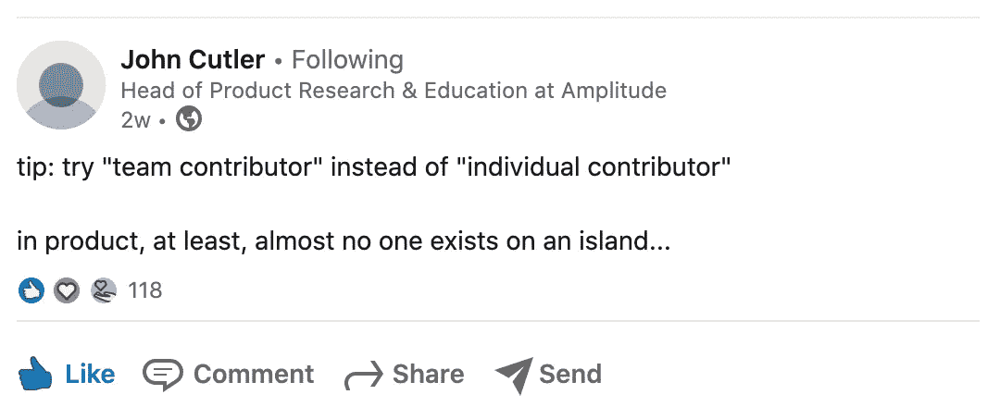

# 团队贡献者——因为团队中没有“我”

> 原文：<https://betterprogramming.pub/team-contributors-because-theres-no-i-in-team-31afd0a6ec81>

## 对于团队成员来说，团队贡献者比个人贡献者更好

兰迪·法特在 [Unsplash](https://unsplash.com?utm_source=medium&utm_medium=referral) 上的照片。

我没有提出这个概念，但我认为这是看待事物的正确方式，值得详细阐述一下。

我可以通过 LinkedIn 将其归因于约翰·卡特勒:

[约翰·卡特勒](https://twitter.com/johncutlefish)——团队贡献者——LinkedIn

# 个人贡献者

*个人贡献者*是一个术语，广泛用于指组织中不在管理轨道上*而*的成员。因此，在他们的职业生涯中，他们将有更多的时间专注于他们的职业，专注于他们工作的任何领域。我想到的是设计、工程和产品人员，但这个定义真的很宽泛。在整篇文章中，我将把工程学作为一个参考点，因为这是我理解最多的。

个人贡献者是一件了不起的事情。这表明，人们已经接受了这种类型的人确实很有价值，他们也应该有一条通往组织领导职位的现实之路。太棒了。

这个术语并不坏，只是可以改进。通过强调个人，这个术语根据他们*不*做什么而不是他们*做什么*来区分这些贡献者！*团队贡献者*对此给出了更积极的解释，因为它告诉每个人他们在做什么，而不是将他们定义为不是经理。

实际上，所有的高级技术顾问都有不同程度的“管理”责任，但这是努力实现某些目标的结果，而不是他们的主要职能。确切地考虑这应该是什么样子是一个有趣的练习，但是我们现在不会进行这个练习。

# 组

技术*集成电路*团队工作。在我的职业生涯中，我一直是团队中的一员，以某种形式朝着某些目标努力。到目前为止大约有九个团队，因为这就是它的工作方式。

我担心个人贡献者的绰号可能会给人一种印象，即流浪的工程师在组织内部游荡，做他们想做的事情。或者他们每天都在不同的项目上工作，这取决于哪个经理设法让他们停下来。我肯定你们中的一些人会有这样的经历，但这显然不是一件好事。

有咨询、个人项目、零工经济、对开源的贡献，以及其他你不属于核心团队的内部项目，但是 99%的付费工程工作完全是基于团队的。也应该如此！

越来越明显的是，可持续的成功来自于相对较小的、面向产品的、长寿的、跨职能的团队，这些团队具有清晰的关注领域、责任范围和创建、操作和迭代的沟通渠道。

我还觉得，IC 这个术语可能会加深 IT 是一个封闭学科的刻板印象，而事实上它是一个高度协作的学科。成功的软件产品需要不同类型的人和不同的技能。有这么多不同的利益相关者和利益，你需要平衡和考虑。在每一个层面，都有建立共识和妥协，这都是通过内部/内部沟通和协作技术来驱动的。

你需要弄清楚做什么，怎么做，什么时候做，并协调所有相关人员。把复杂的事情分解开来，这样就可以对它们进行加工，并精确地组合在一起，以达到预期的结果。是的，有些时候你需要深思熟虑和最少的干扰，但是很多工作真的是*人们工作*。

团队合作是技术人员职业发展的一部分。一个*高级工程师*的关键标志之一是帮助其他*高级工程师*的能力。当然，技术技能和领域知识是一个主要的组成部分，但指导和帮助人们也是如此。如果你通读员工和首席工程师的日常文章，你会发现他们无一例外地将团队合作作为一个主题:

 [## 一个高级软件工程师实际做什么

### 我接触过的几乎每家软件公司都有技术和管理两个方向，这意味着…

medium.com](https://medium.com/box-tech-blog/what-a-senior-staff-software-engineer-actually-does-f3fc140d5f33)  [## GitLab 的职员级别是什么意思？

### 从多方面了解 GitLab 的员工级工程。这篇博文未经 GitLab 后端工程师筛选…

about.gitlab.com](https://about.gitlab.com/blog/2020/02/18/staff-level-engineering-at-gitlab/) 

事实上——至少在一个组织内部——如果一个人(不管他们有多伟大)独自在一件事情上工作太长时间，这是一种反模式。人的依赖性总是一种风险，所以确保你的团队理解你在做什么，并定期在你的团队内部和更广泛地向其他利益相关者展示和分享知识是非常重要的。

# 结论

我已经解释了为什么我认为团队贡献者是一个更好的术语，因为它强调和传达了什么，而不是什么。但我也认为它看起来和听起来都更好。个体是一个音节字母比高的较长单词。团队贡献者/TC 比个人贡献者/IC 感觉更好、更快。这可能只是个人口味，但我不认为是无足轻重的事情。一个单词或术语的发音(可能)是它被采用的一个非常重要的因素。

当对话中出现机会时，我打算使用 TC 术语，并鼓励其他人也这样做。希望这能有助于推动该行业的方言朝着更好的方向发展。