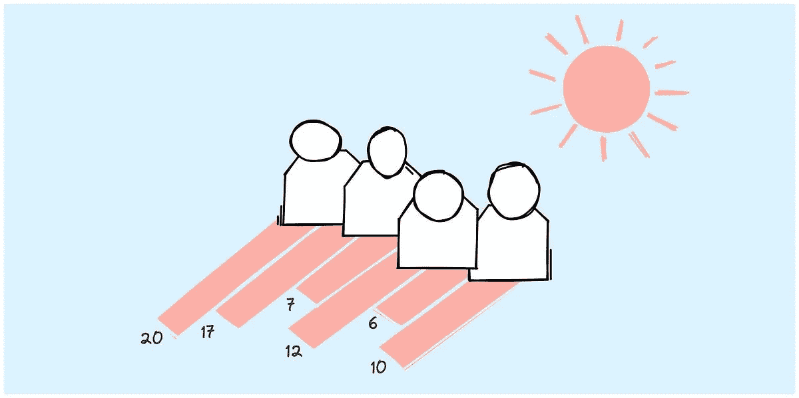

# 团队的度量:以人为中心的方法

> 原文：<https://betterprogramming.pub/teams-metrics-human-centric-approach-d0c0900a1320>

## 采取以人为中心的方法来评估您团队的指标，并确定如何使用它们来推动增长

作者图片

上周，我重读了约翰·卡特勒(John Cutler)的优秀文章[“什么是虚荣心指标，如何停止使用它们](https://amplitude.com/blog/vanity-metrics)”，他在文章中反思了产品虚荣心指标，以及如何用更好的 KPI 取代它们。看完之后，不禁想到了最近盛开的工程措施。

> “虚荣指标是让我们感觉良好的指标，但不会帮助我们做更好的工作或做出更好的决定。没有人能免于使用虚荣指标！关键是确保你提供了背景，陈述了你所使用的指标的意图，并阐明了该指标将推动的行动和决策。—约翰·卡特勒，什么是虚荣心指标，如何停止使用它们

如今，使用 KPI 建立团队仪表板非常简单。有很多直观的工具和解决方案来收集和处理你的团队的信号(即 [DX](https://getdx.com/) 、[雅典人](https://athenian.com/)、 [Waydev](https://waydev.co/) )。因此，工程度量标准越来越受欢迎，更多的团队和领导者参与到讨论中。人们开始争论 DORA metrics[是有用还是无用，以及产出或结果是否是衡量你的团队的最佳方式。](https://github.com/GoogleCloudPlatform/fourkeys/blob/main/METRICS.md)

我很高兴听到我们行业中的摩擦，以及它如何迫使我们的行业进行衡量并继续改进。但是，我觉得有些人忽略了一个根本点。你的团队的度量标准不应该被视为目标；相反，它们应该被视为有助于发现问题的健康措施。

# 人的系统，而不是机器

几乎所有的工程领导者都来自工程背景，他们在那里建立和维护机器系统(即服务器、模块、功能)。这些系统在性能、稳定性、安全性和许多其他指标方面不断得到测量和验证。这是一个成功的系统，允许团队在降低运营成本的同时提高客户满意度。

假设客户开始抱怨你的产品性能。您决定改进它们，为了实现这一点，您设置了所有页面加载在 300 毫秒内执行的要求。一旦您发现哪些查询有问题，您就可以开始找出它们为什么有问题。有一个解决办法，这只是一个时间问题。

如果我们的仪表板看起来像我们车上的一样优雅，那就太理想了。你可以很容易地检查你的油位，如果油位低了，就重新加满。如果油箱加满了，然后变空了，问题背后有一个合理的解释，我们可以诊断和解决。

事情是这样的...人类不是你可以调试的处理单元。我们不是纯粹的输入输出机器，充满了副作用。这就是为什么我们能够做出美丽和意想不到的事情，也是不可能的原因。因此，我们如何推理，更重要的是，我们如何行动必须是不同的。

最终，工程度量不能告诉你的团队全貌。它们只是提供了正在发生的事情的一瞥。好消息是它们仍然非常有用。通过变得更加“数据知情”而不是“数据驱动”，你可以用它们来创建实验和定义假设。关注行为而不是肤浅的数字。

# 激励塑造行为

经理们通常会根据指标值来设定目标，例如，“在第四季度，我们的目标是将交付周期缩短 30%。”别误会，背后的推理很扎实。一个更小的从想法到生产的循环将使团队学习得更快。然而，你相信缩短 30%的交付时间会带来更多的学习吗？你只是试图设定一个代理指标，因为没有可行的方法来衡量你的学习率。

达到四个小时的交付周期意味着你已经达到了四个小时的交付周期。如果团队以此为动力，你可能会达到这个目标，但可能是通过做与学习无关的事情。虽然团队可能进展得更快，但他们可能不会回头学习。

> "当一个度量成为目标时，它就不再是一个好的度量."—古德哈特定律

想象一下，我们希望我们的城市更加安全，所以我们为警察局的案件结案率设定了一个目标。这可能会导致相反的结果。该部门可能会专注于容易解决的案件，避免会对我们的社区产生重大影响的棘手案件。

交付周期是一种可以用来评估团队健康状况的方法。为您的团队建立模式，并开始跟踪异常情况。交付周期从 4 小时增加到 30 小时了吗？调查，写下你的假设，建立假设。然后用定性研究来验证它们，并不断衡量你的改变的影响。

# 承认你的数据是不完整的

尽管 GitHub、Linear 或吉拉可以提供相当多的关于你的团队的信息，但是这些指标只是实际发生的事情的影子。大数法则可以帮助大型团队(100 个或更多工程师)，但也更容易受到部门和团队之间不一致的影响。接受这一事实将有助于你确保充分利用你的工具和分析的潜力。

测量系统应该允许你减少搜索参数，把注意力集中在更小的界面上。健康指标可以指示您应该从哪里开始寻找，并帮助您验证决策的效果。

# 但是精英表演队到达 XYZ

真实但缺乏上下文。逻辑表明 A B 并不意味着 B A。换句话说，许多优秀的团队确实共享相似的度量和模式，但这并不意味着如果您的团队达到这些结果，就会使他们变得优秀。

即使一篇文章建议展示一个每周合并 10 个 pr 的团队是新的规则，在设定新的标准之前花一点时间。研究这种差异的来龙去脉，以及为什么你的团队会以不同的方式做事。结果可能是，一周有十个 PRs 伴随着一个薄弱的代码审查过程和大量的后续工作。你愿意做这个权衡吗？

不要关注度量标准，而是通过与成员和利益相关者(产品、设计和客户)交谈来确定团队的优势和劣势。通过好奇和灵感发展理论。在测试任何系统是否适合你的具体环境之前，不要采用它。

# 摘要

数据的可用性给了我们管理者很多新的机会。如果我们知道如何避免依赖定性数据的欲望，并混合一些定性方法，我们可以为我们的团队带来令人印象深刻的增长。确保你不要在假设和假说上吝啬。适当地研究和实验。

*推荐后续阅读:*

*   [你是数据驱动型、数据知情型还是数据启发型的？](https://amplitude.com/blog/data-driven-data-informed-data-inspired)
*   [什么是虚荣心指标，如何停止使用它们](https://amplitude.com/blog/vanity-metrics)
*   [第八集:《大经理在看》](https://www.guildmasterconsulting.com/post/episode-8-big-manager-is-watching)

*最初发布于*[*https://www . eng stuff . dev*](https://www.engstuff.dev/p/teams-metrics-human-centric-approach)