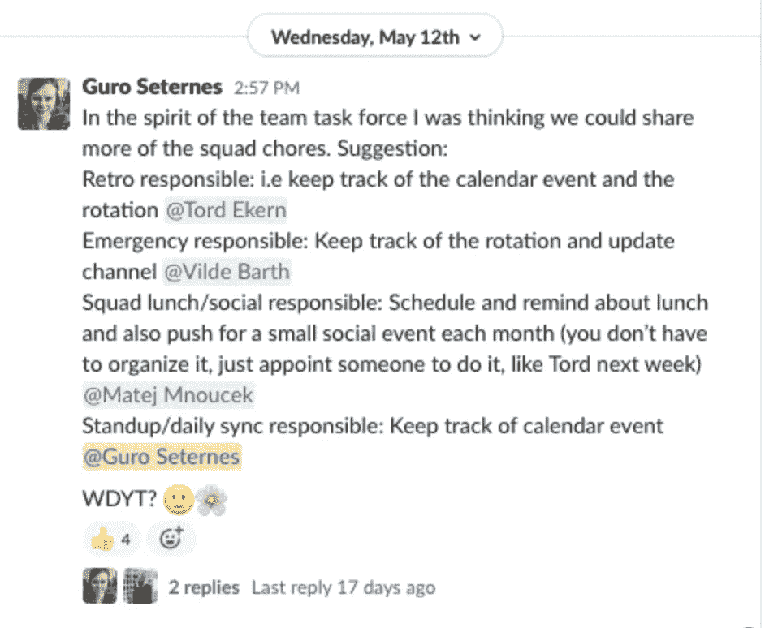

# 技术女，你去哪了？

> 原文：<https://betterprogramming.pub/tech-women-where-did-you-go-5d5c662fb47d>

## 我对女性为何离开科技行业的思考

作者图片

根据埃森哲的一项研究，在美国开始科技职业生涯的女性中，有一半在 35 岁时离职。我相信挪威也有类似的趋势。

例如，在我在 Spacemaker 担任数据科学家的三年时间里，我们在技术岗位上聘用了 12 名女性，要么是数据工程师，要么是数据科学家，要么是软件工程师。现在只有我们四个人继续专注于技术。其他人已经转移到 Spacemaker 或其他公司的产品管理、客户关系、业务、人员管理或其他非技术领域的角色或职位。相比之下，我的男同事中只有 13%做出了同样的转变。

这让我想知道，是否许多女性找到了更适合她们个人的道路，或者是否有组织结构和行为模式在推动这一趋势。

在与从事科技工作的女性交谈后，我认为有三个障碍导致女性无意中脱离了以科技为导向的职业道路:

*   女性的优势，比如软技能，在技术岗位上没有得到足够的重视。
*   女性花更多时间在办公室家务上。
*   女人隐藏在谦逊的背后，会变得过于自我批评。

每一个障碍都可以从两个方向接近。一方面是来自周围环境的影响，这意味着同事和任何性别的经理的潜在偏见，影响一个人在工作场所的日常选择。另一方面，女性自身需要更加关注她们的工作时间是如何度过的，以及她们如何运用自己的技能。因此，克服这些障碍成为了公司和个人的共同责任，这也是我在这篇文章中想要关注的。

# 女性的优势在技术岗位上没有得到足够的重视

"伟大的协调者，伟大的研讨会主持人，伟大的领导讨论，伟大的倾听者，伟大的见人."这些是对女性员工的常见赞美，它们源自许多女性拥有的品质，通常被称为*软技能*。软技能没有明确的定义，但通常是情感或社会业务优势。[研究](https://www.kornferry.com/about-us/press/new-research-shows-women-are-better-at-using-soft-skills-crucial-for-effective-leadership)显示，女性在 12 项情感和社交能力中的 11 项上胜过男性。

因此，女性经常被公司招聘从事非技术性工作，包括准备客户会议、协调跨团队功能、进行入职演示以及与有困难的人交谈等任务。虽然这些都是有意义的任务，但它们会占用技术型工作的时间。

拥有有价值的软技能并不意味着你不是一个有才华的工程师，也不意味着你喜欢这项工作胜过技术工作。但是如果你一直被提供这些任务，并且不断被问到，“你确定你不想成为项目领导吗？”很难保持对科技职业道路的关注。技术工作，尤其是帮助你开发的具有挑战性的部分，需要深刻的理解，因此需要大量的时间投入。我的一个朋友是一个由 30 名开发人员组成的部门中唯一的女性数据工程师，她说她不得不反复说，“不，谢谢，我想专注于数据湖，这是我喜欢做的事情。”经常不得不拒绝请求会对你的自信产生负面影响。除了让你担心你不是一个团队成员，它还让你怀疑你的经理是否认为你更适合这些角色。

作者图片

通过将具有这些所谓女性特质的人从技术部门撤出，公司错过了许多机会。例如，设想 Spacemaker 将推出一项架构变革；如果有人既了解变革的技术含义，又知道如何协调工作，这不是很好吗？还有，谁不欣赏一个精心策划的工作坊，主持人深刻理解主题，并能积极参与？软技能不仅是技术部门以外的优势，也是内部的优势，尤其是与深厚的专业知识相结合。

因此，我鼓励拥有这些优势的女性有意识地接受让你远离科技的新角色。同事和经理们在从技术部门吸取这种能力之前应该三思。

# 办公室家务阻碍职业发展

办公室家务的例子可以是写会议笔记、安排会议、为团队组织社交活动。尽管它们很重要并且提供了大量的价值，但是这些任务是乏味且耗时的。不幸的是，女性比男性更能感受到志愿服务的压力。由[哈佛商业评论](https://hbr.org/2018/07/why-women-volunteer-for-tasks-that-dont-lead-to-promotions)进行的一项研究显示,“男性在 51%的情况下会接受请求；女性，76%的时候。”更不幸的是，该研究还发现，无论性别如何，女性被要求执行此类任务的可能性要高 44%。

一个常见的误解是，一个人喜欢安排社交聚会或做笔记。有时我会听到“但是我记笔记很糟糕”或者“我记笔记时很难跟上讨论。”你猜怎么着？其他人都有同感。人们为即将离职的同事组织一次告别午餐，因为让离职的人得到赏识很重要，而不是因为组织者喜欢去杂货店或浏览收据。

《纽约时报》的一篇文章将办公室家务称为无收益的工作和“非正当任务”这意味着，这不仅会打击你的积极性，还会拖慢你的职业生涯。你可以积极参与讨论，而不是因为写会议笔记而分心。你可以编写代码，而不是和一家餐馆来回邮寄来组织一次活动。

这可能会成为一个恶性循环，你自愿参加一项任务，并因此获得很多荣誉，然后开始说服自己这就是你必须要做的。

不用说，平均分配这一工作量是很重要的。要做到这一点，团队应该坐下来，就他们的工作达成一致，并公平地分配。女性应该坚持自己的立场，顶住压力去做志愿者。当谈到社交活动时，让女性发起有趣的团队聚会或为夏季聚会或会议提出惊人的想法，对一个组织来说真的很有价值。那些不属于这些创造性主动者的人:主动提出创作涂鸦，订披萨，或者挂上装饰品。

# 隐藏在谦逊的背后

我很少看到女性假装她们了解一个软件库，或者独自承担一项她们没有信心的任务。相反，他们承认自己缺乏技能，并寻求帮助。因此，他们可能无法让人感觉到自己的存在，而且在同事看来，他们可能显得较弱或技能较低，导致被排除在技术讨论之外，甚至错过晋升机会。

当谈到这些倾向时，一些女权主义文学说“像个男人一样，假装自己能挺过去。”我不同意。

我们应该接受这种谦逊。坦诚面对自己不知道的事情，寻求指导，向队友寻求帮助，这些都是强项。举个例子，在评价实习生的时候，我发现好奇而谦逊的实习生比那些不问任何问题，想靠自己搞清楚一切来打动我的人表现好很多。我们的产品、领域和技术是复杂的，因此不寻求指导将不可避免地导致错位或走进死胡同。卑微的人表现出自己的弱点。这创造了一种工作环境，在这种环境中，同事们可以畅所欲言，分享他们的“愚蠢”想法，并承认他们的错误。由此产生的心理安全空间促进了更好的讨论，带来了更好的结果。

然而，谦虚可能会走得太远，变成有害的自我批评:

“很抱歉问这个问题，我可能误解了一切，我不太了解堆栈，但我不确定该数据库是做什么的？”

这个短语听起来熟悉吗？为什么女人要为自己开脱？当你不明白某件事的时候问一个问题应该被鼓掌！然而，我认识的许多女性脑海中有一个声音告诉她们，她们没有掌握技术，或者她们不适合技术岗位或任务。

这种声音会阻碍你表达自己的观点和积极参与讨论。当我在我们的技术领导小组得到一个职位时，我觉得自己很像失败者，所以我自愿承担每一项管理任务。这对我来说是一个极好的学习机会，我应该洗耳恭听，而不是做笔记。为了找出这种隐藏行为是否更普遍，我实际上搜索了我们的技术松弛频道。在 2000 个岗位中，我只找到了两个来自女性的技术岗位。其他来自女性的帖子是——惊讶吧，惊讶吧——行政类的，比如“请每个人都填一下这张表格”或者“我们的客户关系团队需要支持。”

自我批评对任何人都没有好处。你得到这份工作是因为你有资格做它；这不是偶然的。在某种程度上，每个人都是每项技术的初学者。花时间担心没有掌握一项技能，不如花时间使用或学习这项技能。当申请一个角色或职责时，你应该对你的能力保持透明，但是让别人来决定你是否合格。

# 结论

我相信，当我们申请这些职位时，我们申请是因为我们想发展、学习，并为我们在技术领域的指定角色做出贡献。当我们得到这份工作时，是基于我们的能力、技能和资历。没有人被录用，因为他们擅长 Outlook 日程安排助理。

调整自己的职业道路，发现自己更喜欢技术性不那么强的角色，并没有错。我并不是说让女性继续在科技行业工作本身就是一个目标。我担心的只是来自我们自己和我们周围的偏见会让我们做出我们不想做的选择。

我提到的三个障碍经常会相互叠加，产生更大的影响。如上所述，在我缺乏自信的情况下，我经常选择非技术性的任务。日复一日，这些看起来像是小的选择，但累积起来，它们可以把握你的职业道路。

所以我给女性的建议是:意识到你一周要做什么工作；这几周成为你的事业。骄傲地穿上你的谦逊，但把自我批评留在门口。