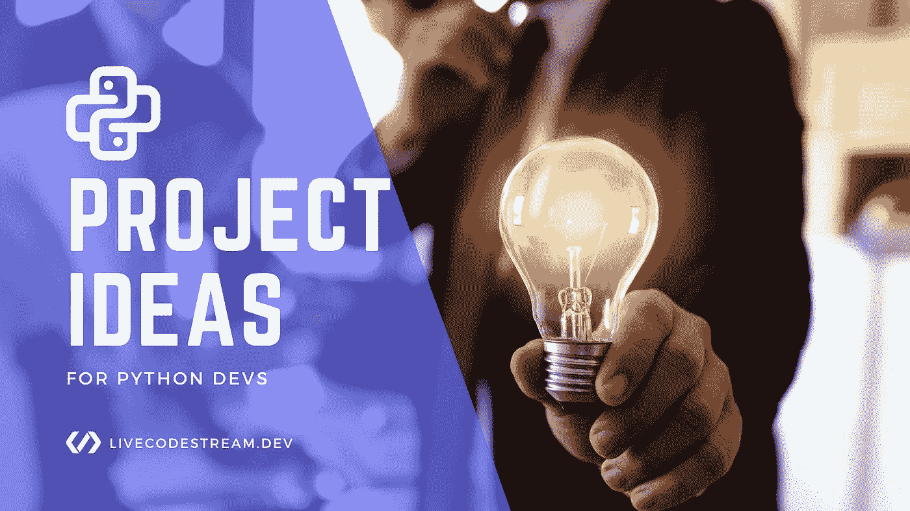
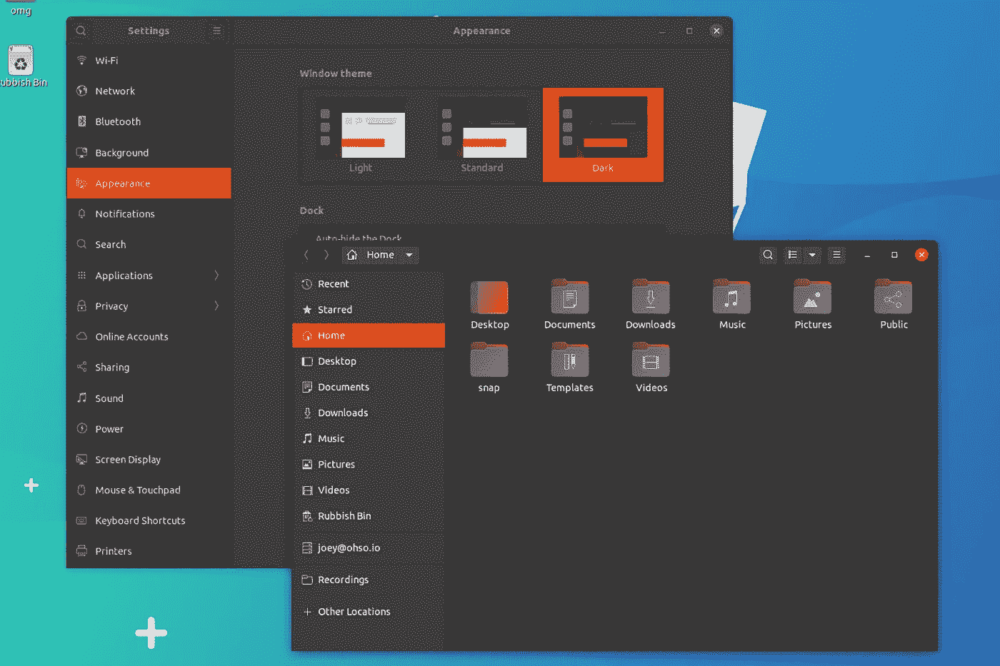

# 2022 年十大疯狂酷 Python 项目创意

> 原文：<https://betterprogramming.pub/ten-crazy-cool-python-project-ideas-for-2022-6fc7a0aaabfa>

## PYTHON 乐趣

## 挑战您的 Python 技能的疯狂项目想法。构建和共享

作者图片

您知道 Python 被认为是一种全能的编程语言吗？

是的，[虽然它不是每个项目的最佳选择](https://livecodestream.dev/post/what-is-python-best-for/)。

您可以使用它来创建桌面应用程序、游戏、移动应用程序、网站和 API。它在数据科学、机器学习和人工智能领域非常受欢迎。

因此，您可以使用 Python 构建各种各样的项目。

我第一次写这个指南是在两年前。从那以后，我从事了许多新的工作，学到了很多东西，并在[媒体](https://bajcmartinez.medium.com/)、[推特](https://twitter.com/bajcmartinez)和评论区与读者进行了令人难以置信的对话，所以是时候对它进行修改了，并分享几个你应该构建来学习和享受大量乐趣的 Python 项目！

> **注意**:如果这将是你的第一个 Python 项目，我可能不会推荐这些项目。首先从基础开始，一旦你确定了这些，回到这个列表来做一些有趣的 python 项目。

让我们一个一个来看看。

# 交易机器人

照片由 [Nick Chong](https://unsplash.com/@nick604?utm_source=medium&utm_medium=referral) 在 [Unsplash](https://unsplash.com?utm_source=medium&utm_medium=referral) 上拍摄

经济形势相当困难。股票市场和加密技术正处于艰难时期，但很多人都在赚钱。

虽然我不建议你把一生的积蓄押在一个交易机器人上，除非你真的知道你在做什么，但这是一个有趣的项目，可以建立、学习并从中获得乐趣。

我有我的[比特币价格预测器](https://livecodestream.dev/post/predicting-the-price-of-bitcoin-intro-to-lstm/)。它可能不是最准确的，但当我建造它时，我学到了很多关于机器学习和 ML 算法的知识。

有许多方法可以预测股票或密码的价格，我不想把你限制在我使用的方法上。尝试多种事情，玩输入，尝试，尝试，边做边学。

如果不能访问好的数据，您将无法进行这个 python 项目，因此这里有一些值得一提的检索数据的选项:

*   雅虎！财务—获取股票数据
*   [Alpha Vantage —财务数据实时 API](https://github.com/RomelTorres/alpha_vantage)
*   [Coinmarketcap API](https://coinmarketcap.com/api/)

这里有一些额外的资源可以帮助你更好地理解交易:

*   [新手交易策略](https://www.investopedia.com/articles/trading/06/daytradingretail.asp)
*   [只有通过这 5 步测试，才能进行交易](https://www.investopedia.com/articles/active-trading/090415/only-take-trade-if-it-passes-5step-test.asp)

也可以借鉴这个叫做 [freqtrade](https://github.com/freqtrade/freqtrade) 的开源交易机器人。这是一个令人兴奋的 Python 项目，实现了多种机器学习模型，尽管它是一个非常高级的项目。

# AI 体育博彩软件

[Chino Rocha](https://unsplash.com/@chinorocha?utm_source=medium&utm_medium=referral) 在 [Unsplash](https://unsplash.com?utm_source=medium&utm_medium=referral) 上拍摄的照片

类似于交易机器人，这里的想法是预测事件的结果。但是即使这个 Python 项目有一些相似之处，你在这个项目上工作的方式可能会非常不同，因为潜在的问题是。

交易机器人处理时间序列数据，而像这样的博彩软件可以从过去学习，但数据不一定像股票或密码那样与时间相关。

我自己用网球比赛建立了这个项目。网球是理想的，因为它比足球等其他运动更容易合作，球员的组成可以在一支球队中产生很大的影响。

对于网球，你会比较不同的比赛变量，比如球员、球场类型、场地，甚至锦标赛，或者比赛地点，谁知道呢。

然后，你将结合所有相关的属性，建立一个机器学习模型，试图预测结果，或者至少谁会是这场比赛的赢家。

有一个很棒的网站，你可以下载过去的数据来为不同的运动训练你的模型，如[网球](https://datahub.io/sports-data/atp-world-tour-tennis-data)或[足球](https://datahub.io/collections/football)，但那个网站有更多的选择，所以选择你的运动，下载数据，并开始预测比赛。

# 数据刮刀

约书亚·索蒂诺在 [Unsplash](https://unsplash.com?utm_source=medium&utm_medium=referral) 上拍摄的照片

构建一个应用程序，它获取一个 URL，[将你需要的数据](https://livecodestream.dev/post/how-to-turn-the-web-into-data-with-python-and-scrapy/)提取成一种更机器友好的格式，比如 JSON 或 CSV。

这是一个很棒的应用程序，你可以使用你的人工智能体育博彩软件来监控人工智能的进展，并计算你的累计收入。

但是它可以用在更多的地方。例如，我运行一个自动化的程序脚本软件来扫描我的博客，寻找断开的链接、丢失的图像和其他质量检查，以确保我的帖子保持干净。

这个项目的复杂性很大程度上取决于您的需求，但是对于初学者来说，这通常是一个很好的 Python 项目想法。

如果你想了解更多关于网络抓取的知识，可以看看我的关于用 scrapy 将网页转化为数据的[指南。](https://livecodestream.dev/post/how-to-turn-the-web-into-data-with-python-and-scrapy/)

# 一款笔记终端 App

由[大卫·特拉维斯](https://unsplash.com/@dtravisphd?utm_source=medium&utm_medium=referral)在 [Unsplash](https://unsplash.com?utm_source=medium&utm_medium=referral) 上拍摄的照片

听起来不太性感，但是听我说完。最近，我读了蒂亚戈·福特的《打造第二个大脑》一书，这本书的一个基本理念是捕捉与你产生共鸣的东西。它可以是一项任务，一个想法，一条来自网络的信息，一个音频剪辑，你能想到的。

我使用各种系统来存储这些信息，比如 Todoist、Evernote、email 等等。

当我在电脑上工作时，一个想法或任务出现在我的脑海中，我不得不打开相关的软件并在那里写下一个笔记，这是非常适得其反的。

因为我创造了这个工具，我可以简单地走到我的终端，用一个命令把我的想法发送到这些系统中的任何一个。

为了构建命令行应用程序，我使用的是 [Typer](https://typer.tiangolo.com/) ，这是 Sebastián Ramírez 的一个框架，他是 [FastAPI](https://github.com/tiangolo/fastapi) 的创建者。

至于集成，尽管这些服务中的大部分都提供了 API，但我想要更简单的东西来集成，如果我切换其中的任何一个，这将更容易维护和修复。

我注意到的是，它们都允许你从电子邮件中获取数据，你可以向它们提供的特定地址发送电子邮件，电子邮件就会被导入到该工具中。

这不是最优雅的解决方案，但却是我选择的方案。

我按照这个指南在[使用带 SMTP 的 Python 发送电子邮件](https://mailtrap.io/blog/python-send-email/)来实现我的解决方案。这个指南非常完整，提供了几个发送电子邮件的选项。

无论你为你的终端应用构建什么，都可以改变你的工作效率。

# 自动将文件从一个文件夹移动到另一个文件夹

作者图片

这是一个非常简单的项目，但如果您处理许多文件并希望将它们组织起来，它会很有帮助。

这个想法是用一个文件夹来存储所有文件，然后让 Python 脚本根据某些条件将文件移动到不同的文件夹中。

例如，假设您有一个包含照片的文件夹，并希望将所有风景照片移到一个文件夹中，将所有肖像照片移到另一个文件夹中。

或者，您可能有一堆文本文件，您想将所有包含单词“python”的文件移到一个文件夹中，而将所有其他文件移到另一个文件夹中。

这个项目将教你如何在 Python 中处理文件和文件夹，这将是对你工具箱的一个很好的补充。

还是那句话，我有一个类似的 app 来整理我的记账。每个月，我都要做一件单调乏味的事情，那就是把我所有收到和发出的发票以及银行、PayPal 和 Stripe 的报告发送给我的会计。

我需要下载所有东西，这已经够痛苦的了，但除此之外，我还需要将它们分类到他们使用的特定文件夹结构中，正确命名文件，并将它们移动到我在本地映射的云文件夹中。

这个简单的 Python 项目监视我的下载文件夹，使用正则表达式匹配一些文件，并将它们移动到正确的文件夹中，这样我就不必这么做了。

# 为进入你家的人建立问候服务

作者图片

这是一个我还没有做的，但是当我有时间的时候我一定会做的。这个想法很简单:你需要在你的房子或花园的某个地方安装一个摄像机，以及一个 Python 程序来监控和搜索人脸。

一旦识别出一张脸，它就会查看是否与数据库中的任何人相匹配，如果匹配，它就会播放一条消息，类似于“欢迎回家{人名}”

这肯定会吓坏一些人。

这是一个更高级的项目。识别照片中的人脸可能更简单，但确定那个人是谁属于完全不同的层次。

久而久之，这个项目甚至可以变成一个产品。这种技术有很多可能性。

# 建立一个缩略图生成器网站

可以用网站生成的示例图像

博客、新闻杂志和其他人不得不经常考虑他们文章和帖子的缩略图。

这是一个很大的问题，很多都是基于文章的标题或其他元数据自动生成的。

我曾经使用过这种方法，但是我使用的脚本有它的局限性，所以我放弃了它。我有办法把它变成终极工具。

你可以使用像 [Pillow 这样的工具来创建、添加图层和文本到图片](https://livecodestream.dev/post/image-processing-with-python-and-pillow/)，这很棒，但是你可以做得更多。

想象一下，你的软件接受用户输入，使用人工智能为缩略图生成背景，使用类似 [DALL-E](https://openai.com/dall-e-2/) 的东西，然后在顶部添加一些透明的框和文本。

现在，您将为遵循相同模式的每篇博客文章创建独特的艺术质量的缩略图。

这是完全可行的。你只需要访问 DALL-E，它也有可能转化为一个产品。不过，你必须让它非常好，使用起来友好，并且可定制。

# 在分散式应用程序的基础上创建一个 API

照片由 [Unsplash](https://unsplash.com?utm_source=medium&utm_medium=referral) 上的 [Shubham Dhage](https://unsplash.com/@theshubhamdhage?utm_source=medium&utm_medium=referral) 拍摄

您可以使用智能合约构建自己的分散式应用程序，或者使用现有的 web3 应用程序，并围绕这些合约创建 API 包装器。

这将使其他开发人员，或者您自己，能够使用 web2 知识轻松构建 web3 应用程序。

这样的 API 提出了你必须解决的多重挑战，你将会学到很多关于 web3 的知识。

一个更具体的例子，也是我个人从事的工作，是创建一个链外投票系统，由 crypto 支持，使用签名来保证投票和与链的批量交易，以保存结果及其审计。

# 儿童故事发生器

本·怀特在 [Unsplash](https://unsplash.com?utm_source=medium&utm_medium=referral) 上的照片

这是一个更私人的话题，因为我喜欢给我的孩子讲故事，逗他们笑。但是我对好故事的了解有点有限，所以我找了些书来读。有时候，我自己看书，给他们讲故事，尤其是当我们准备睡觉的时候。

我想到了为孩子们创造一个故事发生器的主意。你可以选择不同的设置，比如“公主”、“龙”和“森林”，然后它会用这些元素生成一个小故事。

如果能有不同的设置，比如故事长度、角色数量、结局类型等等，那就太好了。

这个项目将需要先进的人工智能，但在 [gpt-3](https://openai.com/api/) 或类似库的帮助下，许多复杂性都降低了。

你必须找到一种方法来微调引擎，以产生相关的故事，也许你可以添加自己的过滤器，以确保只有 PG 级内容进入故事。

这肯定会变成一种产品，人们可以将自己的故事制作成电子书或印刷书籍的形式购买。

另外，想象一下当你的孩子和他们认识的人成为故事中的主角时，他们的表情。

# 人工智能驱动的国际象棋游戏

兰迪·法特在 [Unsplash](https://unsplash.com?utm_source=medium&utm_medium=referral) 上的照片

国际象棋游戏是一个非常棒的项目。它有一些概念，如棋盘、具有特定移动模式的游戏棋子，以及许多关于游戏的规则，所有这些都将考验你的算法知识。

最重要的是，如果你想建立一个学习下棋的人工智能，你将面临难以置信的复杂性——从如何有效地序列化棋盘的状态，决定使用什么算法来训练你的网络，生成有效的移动，以及建立一个可以击败玩家的游戏策略。

谷歌和其他大玩家一直主导着这一领域，他们的项目包括 [AlphaGo 大师](https://en.wikipedia.org/wiki/Master_%28software%29)、 [AlphaGo Zero](https://en.wikipedia.org/wiki/AlphaGo_Zero) 和 [AlphaZero](https://en.wikipedia.org/wiki/AlphaZero) ，这些项目比任何职业人类棋手都更擅长围棋(游戏)。

这很难做到，但也许你可以从一个能打败像我这样的玩家的低级人工智能开始。

大约四年前，我[建立了这个项目](https://github.com/bajcmartinez/kickass-chess)。它并没有那么好，但是你可以看看源代码，也许你可以找到灵感让它变得更好。

如果你做得更好，请让我知道。我想用我的棋艺来测试一下。

# 摘要

给你。十个 Python 项目想法，你可以用来提高你的 Python 编码技能，并学习一些其他领域的知识，比如国际象棋、生产力、体育等等。

你有其他想法吗？请在下面的评论中分享它们。如果你用这些想法做了什么，我很乐意听听。

编码快乐！