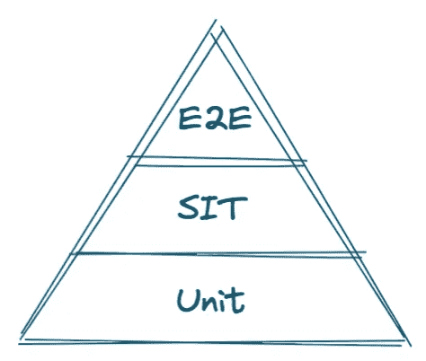

# 在无服务器项目中测试

> 原文：<https://betterprogramming.pub/testing-in-serverless-projects-4972ff8c1fa0>

## 测试有助于让我们对自己的编码充满信心，但它们也会让我们慢下来。我们如何在足够频繁地运行它们以捕捉问题，但又不妨碍进展之间取得适当的平衡？

由 [Unsplash](https://unsplash.com/@theshubhamdhage?utm_source=unsplash&utm_medium=referral&utm_content=creditCopyText) 上的 [Shubham Dhage](https://unsplash.com/@theshubhamdhage?utm_source=unsplash&utm_medium=referral&utm_content=creditCopyText) 拍摄的照片

即使相对简单的无服务器应用程序也可能很复杂。伴随着复杂性而来的是系统不能按预期运行的风险。针对这种风险，我们有两种武器:

*   测试——在发布软件之前，尽可能多地捕捉问题
*   *可观察性——确保发布时*(没有软件是完美无缺的！)以便我们能够尽快发现和诊断问题**

*这两种范式都是关于*学习*。特别是了解系统*如何运行*。*

*可观察性是迷人的，也是至关重要的，但是对我来说，这里的重点是测试。测试是在发布系统*之前获得系统*可信度*的一种手段。**

**

*作者照片*

# *快速获得信心*

*每当我们构建软件时，我们需要决定如何确保软件按预期工作。这意味着编写模拟真实场景的测试，然后在交付生命周期的正确时刻运行这些测试，以便它们捕捉问题。*

*那么测试到底是什么让我们相信我们的发布会进展顺利呢？*

*   *很多测试？*
*   *大量的代码覆盖率？*
*   *测试系统各部分之间的交互？*

*也许吧。这些都是良好测试的潜在指标，但是它们是有代价的:时间。它们以两种方式耗费时间:*

*   *执行时间:测试需要时间来运行，根据测试的类型，它们可能需要*长的*时间来运行*
*   *维护时间:有很多很多的测试意味着有很多很多的测试需要维护*

## **那又怎么样*如果需要时间的话？*

*问题是，如果测试运行时间太长，那么将会发生以下两种情况之一:您将经常跳过这些测试，或者，您将不能像您应该的那样频繁地发布，因为您正在等待您的测试完成运行。*

*如果你不做测试，那做测试还有什么意义呢？如果你不跳过测试，那么你就会浪费时间等待测试结束，这样你的交付就会变慢。*

*这一点之所以对**如此重要**是因为糟糕/缓慢的测试直接影响了 [DORA 指标](https://www.devops-research.com/quickcheck.html)的**所有 4 个**。DORA 指标如此重要的原因是 DevOps 成熟度[与业务成功](https://www.devops-research.com/research.html)直接相关。换句话说，如果你是一个优秀的开发者，那么你就有更大的机会成为一个成功的公司。*

*以下是四个 DORA 指标:*

*   ***交付时间**:从第一次提交到在生产中部署的时间— *长时间运行的测试可以增加这个指标**
*   ***部署频率**:部署到生产环境的频率— *长时间运行的测试会抑制经常部署的能力，并可能导致更大的批量和更低的部署频率**
*   ***恢复时间**:从问题第一次出现开始，恢复服务需要多长时间— *测试运行的时间越长，从*修复确定*到*修复部署的时间就越长*
*   ***变更失败率**:部署到生产环境中导致引入影响服务的问题的百分比是多少— *测试没有验证正确的行为(或者没有运行！)将导致更多问题进入生产阶段**

*测试是商业成功不可或缺的一部分，这让我想到了这篇文章的关键点:*

> *有价值的测试是在*深思熟虑的、有用的测试场景*和*快速执行*之间的一种平衡，以实现每个版本的短周期时间和高置信度。*

*这是一种平衡。平衡点取决于几个因素:*

*   *我们对失败能容忍到什么程度？*
*   *我们需要多快对变化做出反应？*

## *我们对失败能容忍到什么程度？*

*像“[智能高速公路](https://www.bbc.co.uk/news/business-59134013)”这样的系统根本不能容忍故障，它可能导致人们受到严重伤害。由于任何潜在问题的巨大*影响*，在发布变更之前花更多时间确保系统正常工作是有意义的。*

*然而，许多系统在失败时影响要小得多——因此在发布前花费大量时间测试它们是一种不太有价值的时间使用。*

## *我们需要多快对变化做出反应？*

*在某些情况下，系统可能长时间保持相当静态。在这些情况下，更改需要很长时间是可以接受的，因此测试可能需要更长时间。*

*然而，在竞争激烈的市场中，能否快速适应不断变化的环境可能是成败的关键。在这些情况下，与用户遇到问题的负面影响相比，公司在测试上花费太多时间的风险可能更大。*

# *了解平衡*

*无论“正确的平衡”对你来说是什么，重要的是要了解测试什么，什么时候测试，以及测试的详细程度。让我们从定义一些测试阶段开始:*

*   *单元测试*
*   *系统集成测试*(包括合同测试)**
*   *端到端测试*

*在我看来，这些是测试的基本类型和阶段(我故意忽略了非功能性需求测试，例如性能测试，因为这些对所有用例来说不太通用)。*

*当你顺着列表往下看时，会发生以下事情:*

*   ***测试越来越需要更长的时间来编写和维护**，例如，一个单元测试可能会非常简短和简单，只测试一个特定的东西，而一个 E2E 测试将会很长，很复杂，并且可能验证很多东西*
*   ***测试越来越需要更长的时间来执行**，例如，E2E 测试比单元测试需要更长的时间来运行*
*   *测试的价值增加了(因为它们更接近于反映真实的用户场景)，尽管我们在编写单元测试时可能会很小心，但是它们根本不会像真实用户那样使用代码。一个测试越“现实”和“像用户”，它就越有价值*
*   ***测试越来越依赖于能够运行的环境条件**，例如在单元测试中，第三方和外部服务会被模仿，而在 E2E 测试中，你不会被模仿，因此需要环境处于良好的工作状态*

**

*简而言之，在开发生命周期中，你测试的越早，运行测试*和*修复它发现的任何问题的成本就越低。*然而，*测试越不可能真实模拟用户对系统的体验。*

# *测试和无服务器架构*

*那么，这对于我的无服务器项目意味着什么呢？无服务器的一个主要好处是你可以保持每个组件的简单。每个 [FaaS](https://en.wikipedia.org/wiki/Function_as_a_service) 功能应该有一个单一的责任和单一的副作用。因此它的代码也应该简单。这对测试很重要。*

## *FaaS 函数的单元测试*

*在绝大多数情况下，FaaS 函数的流程如下所示:*

*   ***输入**:接收有效载荷(事件，API 请求)*
*   *验证有效负载(它的结构是否正确，是否符合某些业务规则)*
*   *做一些商业逻辑*
*   ***副作用**:执行副作用(在数据库中存储一些东西，发出一个事件，返回一个响应，等等)*

*因为 FaaS 函数非常简单，我总是推荐执行简单的[黑盒测试](https://en.wikipedia.org/wiki/Black-box_testing)。不要为函数中的每个方法编写单元测试，这只会导致脆弱的测试，每次代码更改都会失败。我们不想那样。*

*通过编写单元测试，用已知的输入(有效载荷)提供一个 FaaS 函数，并期望一个已知的输出(副作用)，用很少的测试，也许 8 个或 10 个，就可以达到很高的覆盖率(大约 100%)，这取决于验证场景的数量。*

*这种方法的关键是没有太大的回旋余地。你不能增加测试的次数，除非你多次测试一个东西(不要那样做！).但是，你不能减少测试的数量而不导致覆盖率的缺乏。它使得围绕单元测试的决策变得容易:*

*   *测试达到项目的覆盖目标了吗？*
*   *是的。我们完了。*
*   *否。添加缺失的黑盒测试场景。*

**在这个阶段，你正在测试*商业逻辑。*

## *系统集成测试*

*既然已经测试了 FaaS 函数代码，我们需要验证我们的部署。有工具可以在本地执行这种类型的测试，但是，我建议总是在有效的部署中执行系统集成测试。*

*如果您使用基础设施作为代码和 CI/CD 管道来确保您的部署完全自动化，那么部署后的 SIT 测试应该足够容易。一旦部署完成，我们需要确保它按预期工作。*

*那么我们在测试什么呢？好吧，让我们从我们没有测试的开始。我们不是在测试业务逻辑。单元测试已经覆盖了我们的业务逻辑，所以部署后重新测试是不必要的重复。相反，我们应该重点检查部署环境，即“结缔组织”。*

*   *权限:我们需要的云服务能被调用吗*
*   *路由:事件/请求最终会到达预期的目的地吗*

*这里的重点应该放在尽可能少的场景上，这些场景涵盖了项目使用的所有资源。*

*举个例子，一个 API 端点触发了一个函数，这个函数反过来将一条消息写入一个队列。*

**

*单元测试已经测试了函数的内部位，所以我们不在这里测试它们。这意味着只需要**一个** SIT 场景。*

*同样，黑盒测试是这里的必经之路。调用 API 端点然后检查消息队列的简单测试就足够了。甚至不要检查消息的内容(业务逻辑包含在单元测试中)。*

*确保 SIT 场景尽可能隔离。优秀测试的一个普遍真理是，当一个测试场景失败时，它隐含地指出了系统的哪个部分出了问题。*

## *端到端测试(E2E)*

*一旦所有这些测试都在理论上运行，我们就应该对系统的工作有信心了！问题是，尽管单元测试和 SIT 的结合为系统提供了很好的覆盖率，但是这些测试中没有一个作为用户。*

*端到端测试应该模拟用户如何与系统交互。要做到这一点，每个 E2E 场景可能会跨越几个垂直切片。这使得 E2E 测试很昂贵，它们需要很长的时间来运行，并且有时可能是不可靠的。*

*这是选择天平时需要关注的主要方面…*

# *找到平衡*

*我相信你一定听说过[测试金字塔](https://martinfowler.com/articles/practical-test-pyramid.html)。本质上，它是我前面提到的测试类型的图形表示。它表示金字塔中的类型，以反映早期测试应该是最多的，而后期测试应该较少:*

**

*使用上面描述的方法，编写的单元和 SIT 场景的数量被很好地规定了。有一个逻辑上的最大测试数量来实现覆盖，没有重复。*

*因此，减少测试的数量就是决定我应该*不应该*测试系统的哪些部分。换句话说“我不在乎这个业务逻辑行不行”或者“我不在乎我能不能调用这个 API 端点”。有时这是可以的，尤其是在概念验证或一个小爱好项目中。但事实上，对于大多数系统来说，没有太多的选择。我需要自信，我所有的商业逻辑都在起作用，我所有的“结缔组织”都在起作用。*

## *要拉的杠杆*

*当设计你的测试方法时，最大的操作空间是在端到端测试中。为了在 E2E 实现最大的覆盖率，测试通常需要大量的场景，大量的场景。不仅仅是几十个，而是可能有几百或几千个。*

*想想看，第一个场景可能涵盖了相当多的系统，也许第二个也是如此。但是当你到达第 1000 种情况时，你将进入系统的一个非常特殊的角落。当增加更多的 E2E 情景时，回报会递减。*

**

*记住你写的更多的 E2E 场景:*

*   *写它们花费的时间越长*
*   *维护它们需要的时间就越多*
*   *测试运行的时间越长*
*   *缺陷导致多次测试失败的可能性越大(使得调查更加困难)*

*所有这些因素都会对您的 DORA 指标产生重大影响。所以这里要做的决定是:*

> *我需要*足够** 确信我的系统正在工作的最少端到端场景数是多少。*

**足够的信心意味着我知道主要的用户旅程正在运行，并且我有足够的可观察性来迅速知道生产中是否出现了任何问题。*

# *不规则六边形测试*

*因此，当我们构建无服务器系统时，我们的测试方法可以保持相当简单。*

*   *采用黑盒测试方法进行单元测试和 SIT*
*   *(通常)目标是单元测试中大约 100%的代码覆盖率*
*   *(通常)目标是 SIT 中约 100%覆盖结缔组织*
*   *(很少)目标是在 E2E 实现 100%的代码覆盖率*

*调整端到端测试的数量，以匹配您的风险状况。换句话说，如果你非常厌恶风险，那么就有大量的 E2E 场景，而不是测试金字塔，你有一个“不规则的六边形测试”！*

**

# *包扎*

*在单元测试中追求 100%的覆盖率可能会引起争议。但是让我解释一下我的理由。我更喜欢以高覆盖率为目标，然后在覆盖率报告中明确而故意地省略某些文件或代码块。这比降低整个项目的全球覆盖水平更明智。*

*此外，在一些项目中，达到大约 100%的覆盖率会导致非常长时间的运行测试。我不想打断你，但是那样的话，你的项目可能太大了。维持项目所需的认知能力可能太高了。使用[领域驱动设计](https://martinfowler.com/bliki/DomainDrivenDesign.html#:~:text=Domain%2DDriven%20Design%20is%20an,through%20a%20catalog%20of%20patterns.)分割项目。*

*测试愉快。*