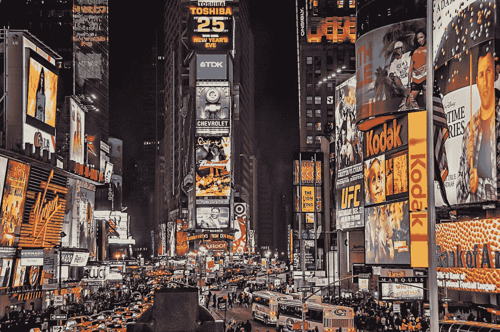

# 软件设计的 10 条戒律

> 原文：<https://betterprogramming.pub/the-10-commandments-of-software-design-lessons-i-learned-from-marty-sklar-89fc43a85de>

## 我从马蒂·斯克拉那里学到的教训

由[像素](https://www.pexels.com/photo/animation-cartoon-cartoon-character-disney-42415/)上的[摄影记者](https://www.pexels.com/@skitterphoto)拍摄的照片

# 马蒂打电话来，要求改变！

作为一个主题公园的爱好者，我的成长方式和你想象的差不多。我坐在妈妈的洗衣篮里下楼梯，在底部摔倒时，差点打破了我的鼻子。我和我的兄弟们在我们的后院玩主题公园，给我们讲了一个广为流传的故事，描述了用晾衣绳和衣架制作滑索的过程，我最小的弟弟被卡在中间，痛苦地掉进了玫瑰花丛中。我希望从巴黎迪斯尼乐园乘长途汽车回家的一天能快点结束，这样我就能回到我的 Acorn 电脑前，在那里我会花几个小时制作一本小册子，里面有我旅途中最喜欢的景点。因此，当我有机会在已故迪士尼传奇人物、华特迪士尼幻想工程公司(Walt Disney Imagineering)前副主席马蒂·斯克拉尔(Marty Sklar)的演讲中提问时，我感到极度紧张是完全合理的。

2016 年秋天，我和妻子一起参观了 EPCOT 的艺术节，听说 Marty 正在介绍他已故的朋友兼想象工程师 Herb Ryman 的作品。看到马蒂展示赫伯·莱曼和玛丽·布莱尔创作的各种作品，听到他讲述迪斯尼公园的历史，我感到非常激动。当问答环节开始时，我又一次陷入了紧张和渴望与一个我从小就崇拜的男人交流的战斗中。我想问一个聪明的问题，也许是他以前从未听说过的问题，但我无法抑制自己的欲望，想问他一个在许多想象工程演示中都会被问到的古老问题:我*如何成为一名想象工程师？马蒂给出了合理的建议。永远不要停止学习，尽可能地合作，如果你没有失败，你就没有尝试任何新的东西。*

马蒂指给我看他的新书*《一个小小的火花:米奇的十诫和幻想工程之路*。在书中，他分享了为迪士尼乐园和度假区每年欢迎的 5800 万游客提供良好游客体验的十大要务。虽然他的例子具体涉及主题娱乐，但这些原则超越了商业世界，可以以无数种方式应用于高级产品。在接下来的文章中，我的目标是为我的软件工程领域翻译 Marty 所说的“Mickey 的十诫”,这样我们就可以为我们的用户提供更有创造性、更容易理解和更轻松的体验。

# 1.了解你的用户

让我们从一些简单的问题开始。

*   你的目标用户是谁？
*   他们面临什么问题？
*   为什么他们需要你的解决方案来解决他们的问题？

虽然这些问题是一个很好的开始，但要了解谁是你的目标用户*真正的*，还有很多事情要做。这些最初的问题将让您了解您是否满足了设计中的要求，但这也是他们所能做到的。

现在我们来看看一些更高级的问题。

*   是什么激励或抑制了你的用户？
*   他们的痛点是什么？
*   他们对自己的工作感到沮丧吗？
*   他们喜欢自己的职业吗？

这些问题深入到用户的内心深处。他们会帮助你理解他们的行为。他们将揭示你为完美用户创造的外表下隐藏着什么，并揭示你的真实用户是如何与你的软件交互的。

如果你的用户在与你的软件交互时需要做出一个冲动的决定，你的软件会推动他们前进，还是会拖他们后腿？你的用户希望你的软件阻止他们吗？在下结论之前，他们需要更多的时间来思考吗？

问这些问题的目的是引出其他可能没有考虑到的问题——所有这些都是为了帮助清楚地定义和了解你的用户。

# 2.穿上用户的鞋子

让我们想象一下。您的用户在一家刚刚购买了您的软件的公司工作。工作场所有传言说你的软件比其他人的*更好。他们到达工作站时，已经做好准备，当他们启动您的应用程序时，所有的问题都会神奇地消失。然后嘣。他们无法登录。你的用户界面不直观。该应用程序运行缓慢且错误百出。你可能已经永远失去他们了。*

普林斯顿大学心理学家珍妮·威利斯和亚历山大·托多洛夫的一系列实验显示，人们只需十分之一秒就能形成第一印象。你的软件只有一次机会，伙计，你搞砸了！

穿上你的用户的鞋子是非常重要的。观察他们在使用你的软件时的感受。了解他们的痛点。了解他们的工作流程。不，实际上是进去拜访他们，了解他们的工作流程。Job 跟踪他们。了解他们日常任务和奋斗的来龙去脉。只有这样，你才能开始解决他们的问题。让你的软件成为你的用户真正想要反复交互的工具。

如果你是一名软件工程师经理，我真诚地请求你为你的各级直接下属组织一些团队出游，去拜访你的客户。当您的团队成员开始提出更具创造性的问题解决方案，并增加您提供的产品和服务的总体所有权时，理解和观察您的用户如何与您的工程师正在构建的软件交互的价值将会显现出来。

# 3.组织人员和想法的流动

在我离开英国移民美国前不久，我在一家销售咨询公司工作，并与苹果公司签约，在一家全国连锁电器商店销售他们最近推出的 iMac 型号。我们的卖点之一，尽管有点半开玩笑，是“用 Windows 完成一项任务需要五次点击，但用 Apple OS X 完成同样的任务只需要一次点击，”尽管我确实认为 Windows 自那时以来已经走过了漫长的道路，但不可否认的是，在可用性方面，苹果曾有一段时间将它们远远甩在身后。

优秀的软件应该有一个逻辑和顺序，让你的用户付出时间和努力后得到回报。

主题公园设计领域工作流程组织的一个很好的例子来自迪士尼幻想工程师约翰·亨奇在 1978 年接受《新西部》杂志的采访。约翰解释说:“当我们来到公园中的一个点，我们知道这是一个决策点，我们会给出两个选择。我们尽量不给他们七个或八个，这样他们必须以定性的方式决定哪一个是最好的。你只要给他们两个……我们打开这些东西，让他们变得正常。”

你的软件应该允许你的用户轻松地浏览他们的工作流程。它必须清晰、轻松、易学。这应该很容易，他们可以教他们的孩子如何使用它。

# 4.创建一个 Wienie(视觉磁铁)

在投身软件工程师职业之前，我做过很多工作。其中一份工作是在迪士尼魔术号上为迪士尼游轮公司做跟单员。

我记得有一天晚上，在一位同事的帮助下设计了一个商品展示。展示就放在我们商店的入口，目的是吸引我们的客人进来。完成后，我们都退后一步，审视我们的工作。我的同事问我对它的看法。我回答说，“它需要一个 wienie。”我的同事困惑地看着我。我想起了华特·迪士尼曾经说过的一句话，他想创造一个 wienie，一个吸引游客进入迪斯尼公园的视觉磁铁。想想华特·迪士尼世界的灰姑娘城堡，它吸引游客沿着美国大街来到魔法王国公园的中心。吸引世界各地游客注意力的埃菲尔铁塔。自由女神像是各国移民的自由灯塔。我们的最终成为了一个美丽的纪念剪贴簿，专属于迪士尼游轮公司，客人们可以带回家，在未来的岁月里记住他们的旅行。

照片由 [iWonder Vision](https://www.pexels.com/@wondererphotograph) 在[像素](https://www.pexels.com/photo/eiffel-tower-photography-2563984/)上拍摄

起初，将这一点转化到软件设计和工程领域有些复杂。记住，不是所有的软件工程师都处理技术栈的视觉方面。不要描绘视觉磁铁，让我们想想特征。你的软件需要有一个或多个独特的功能来吸引用户购买，并在未来几年内享受你的产品。他们一定会向他们的熟人大肆宣扬这件事。他们一定被它吸引住了。你必须给他们一些东西来记住你的品牌。

为你的用户做网飞为视频租赁消费者做的事情。像脸书为 MySpace 会员做的那样。你不一定要成为第一个，但你一定要有最好的功能。

# 5.用视觉素养交流

现在具体说说前端设计。

直接。一致。可识别。容易接近。这些就是我所说的用户界面的四大支柱。

直接点。永远不要让你的用户进入你的软件中的一个视图，不知道他们是如何进入那个页面的，他们必须点击哪个标签才能返回，或者他们应该点击哪个按钮来提交一些数据。未能突出显示当前选项卡，或未能提供正确的颜色阴影，是一个常见的错误。通过提供参考点，允许用户在界面中轻松导航。给他们视觉上的帮助和可预测性。

保持一致。有些软件自然很难学会使用，但是您不必因为视图之间或者甚至产品之间的不一致而增加学习曲线。确保用户界面中的所有元素看起来和行为都一样。这将有助于不断地打消用户的疑虑，创造一种控制感、熟悉感和可靠性。如果你的用户界面是一致的，它也将是直观的。

被认出来。确保你的软件上有你的商标。让你的用户放心，他们互动的仍然是你的产品。例如，如果你要把他们从你的产品转移到第三方付费服务，确保他们知道你把他们送到了那里。在第三方登录页面上设置一些品牌。确保无论你的用户在哪里与你的软件交互，你都和他们在一起。

最重要的是，要平易近人。不是所有的用户都有相同的能力。他们可能视力低下或失明。他们可能有认知障碍。他们可能有听力障碍。他们可能有学习障碍。您的用户可能有运动障碍，无法使用鼠标或键盘。一个好的用户界面对你的所有用户都是可访问的。

# 6.避免过载——制造刺激

让我们想象另一个辅助工作流的示例应用程序。您与一家公司签约，该公司需要一种方法让他们的远程员工团队处理共享文档。每个团队成员都需要能够实时阅读、编辑和评论文档。你离开，带着一个基于浏览器的文本编辑器回来。用户开始采用它，“乐趣”开始了。

一个用户打开应用程序，坐在那里等待 2-3 分钟，所有令人印象深刻但完全不必要的功能都会加载。当他们最终能够查看他们团队的共享文档时，包含许多功能按钮的工具栏覆盖了大部分用户界面。你的用户发现他们可以改变文本颜色，改变文本大小，颠倒文本，这完全分散了他们对真正重要的东西的注意力:共享内容。他们可以嵌入图像和 YouTube 视频，这是他们永远不会需要的另一个功能。您包含了一个自动缩进每段首行的特性，并且没有禁用选项。你甚至想到在某些单词或短语上加上自作聪明的标签，他们可以点击这些标签，再等 2-3 分钟，搜索引擎就会加载信息，让你的应用程序暂时无法使用。再有一个障碍，他们就完了。

文本上的高亮显示表明他们的同事已经开始发表评论。他们点击一条评论来查看它，你的应用程序开始加载页面上的每一条评论，让他们等待你的应用程序可用。他们最终被激怒了，并下载文档进行本地编辑。最后，他们意识到他们本可以通过电子邮件发送文件，甚至召开会议亲自审阅。

仅仅因为你可以把某个特性打包到你的软件中，并不意味着你应该这样做。是的，拥有很酷的特性是个好主意，但是如果它们侵蚀了你的用户体验，阻塞了用户界面，或者分散了他们的工作流程，那么它们就不值得让你的应用程序变得混乱。

# 7.一次讲一个故事

有时，我会遇到在索引页面上贴满大量信息的 web 应用程序。你很容易犯这样的错误:向你的用户抛出信息，并向他们展示你是一个怎样的公司，以及你所获得的认可。许多设计师认为这会吸引他们的用户，但实际上却把他们推开了。事实是，大多数人不喜欢同时面对大量信息。

让你的应用程序过载其他资源的链接也是一个错误。一个或两个链接是可以的，但是当用户不得不打开一个又一个链接来寻找他们想要的信息时，当他们真正应该专注于一个工作流程时，就会产生多种思路。

同样的，如果你正在设计一个辅助工作流的应用程序，确保你的用户的下一步的方向是清晰和合理的。当他们的工作流程完成时，确保你的用户知道。我们都遇到过点击了“提交”却没有任何反应的在线表单。更糟糕的是，它可能只是将您重定向到主页，引入一个新的工作流，而没有确认前一个工作流已经结束。当然，我们的数据被发送到后端的服务器，但我们不知道，因为前端没有确认消息。

这只是一场糟糕的演出。

# 8.避免矛盾，保持认同

我相信我们都曾有过这样的经历:浏览一个网站，被铺天盖地的广告淹没。我偶尔会遇到这种情况，以至于我甚至无法阅读我正在寻找的内容。

没有什么比用矛盾的垃圾邮件破坏你的软件的身份更糟糕的了。

何塞·佛朗西斯科·费尔南德斯·萨乌拉在 T2 的照片。

甚至不一定是广告。想象一下，浏览你的应用程序，你的用户界面的不同元素有完全不同的颜色对比，都是为了吸引用户的注意力。这相当于穿过一个购物中心，所有不同的商店都在为你的生意大喊大叫。

用户界面的任何元素或方面都不应该比它的邻居更大声。他们应该和谐地说话，并引导你的用户沿着他们的方式前进。

# 9.每一盎司的治疗，提供一吨的治疗

让我们面对现实吧，有些软件就是无聊透顶。庞大、笨重的传统系统让我们的用户不停地处理日常任务。它能完成任务。如果没坏，就别修。

这些应用程序的真正问题是你的用户无法从使用你的软件中获得乐趣。他们不太可能跑到他们领域的其他熟人那里去告诉他们你的产品。他们使用它们是因为要么他们的公司告诉他们这样做，要么这是唯一可以完成工作的方法。这意味着一旦一个更便宜或更受用户驱动的产品出现，他们就会把你的软件扔进垃圾堆。

一个更干净、更明亮、更现代的用户界面可以改变他们的看法。让他们的经历丰富多彩，吸引所有的感官。

有些工作很平凡。有些工作流程很难学习和掌握。但是对于你的用户的每一盎司的挣扎，给他们提供一吨的奖励。用更快的 API 调用取悦他们。用直观的功能打动他们。他们最终会对你的产品赞不绝口，并会寻找任何机会选择你而不是其他人。

# 10.保持下去(保持下去)！

最后一点几乎不用说。差不多了。

你必须继续改进你的软件。仅仅因为你在五年前，或者一年前，甚至上个月有了一个最佳实践，并不意味着它应该一直保持最佳实践。

正如鲍勃·迪伦曾经说过的，“因为时代在变”。"

花时间评估你的产品。根据用户反馈做出改变。看看新的部署方法。考虑新的监控方式。牵着你的软件的手，继续浇灌它，让它随着你的行业一起成长。

让一个小组负责清理软件应该是你组织中的标准做法。他们唯一的责任应该是清除代码库中的错误，实现现有应用程序的新功能，并改善用户体验。

底线是:当事情不工作时，你作为用户的体验会受到负面影响。糟糕的软件性能是糟糕的表现，在任何组织中都是不可接受的。

# 结束想法和对你的挑战

如果你从这篇文章中学到了什么，我希望那是你*欠*给你的用户最好的体验。不管他们是你社交媒体平台的非付费会员，还是使用你企业软件的大公司，还是维护基础设施的系统工程师。

最终，他们仍然是*你的*用户。好好照顾他们。

再次想到我对主题娱乐的热情，我想起了华特·迪士尼的一句话。他说:“我们不断前进——打开新的大门，做新的事情——因为我们很好奇。好奇心不断引领我们走上新的道路。”

无论你在提高软件可用性的道路上处于什么位置，最重要的是*你*继续前进。在不断变化的行业中停滞不前不是一个选择。

如果你喜欢上面列出的策略，我有一个挑战给你。实现其中的一个，让今天成为你承诺给用户最好体验的第一个。

最后一点，我喜欢结识新朋友，所以请随时在 LinkedIn 上与我联系！