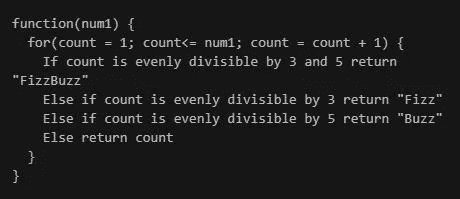

# 让我成为更好的程序员的 3 个认识

> 原文：<https://betterprogramming.pub/the-3-realizations-that-made-me-a-better-programmer-af7d1bcab4d3>

## 这不是一夜之间发生的


eberhard grossgasteiger 在 [Unsplash](https://unsplash.com/s/photos/light-bulb?utm_source=unsplash&utm_medium=referral&utm_content=creditCopyText) 上拍摄的照片

当我还是个孩子的时候，在我知道编程到底是什么之前，我就对编程产生了兴趣。我小时候学过 HTML，建过最老套的 90 年代网站。我十几岁的时候学过 SQL，那时我在 IT 行业做过暑期工。在大学和研究生院待了太多次之后，在 T21 工作了几年之后，我去了一个编码训练营，学习了一些 JavaScript 和 Ruby。

我花了几个月的时间将我所学到的东西概念化。我花了一年多的时间才能够独立制作东西。

一路上，我有了一些有益的认识。

# 1.编程实际上并不是告诉计算机做 X

当我开始学习时，这是一个相当大的误解。在我看来，我只需要写一个命令，比如`do X`，一切都会迎刃而解。

当然，我们不是这么做的。

相反，我需要:

*   做`X`到`Y`
*   从`Y`处获得`X`
*   从`Y`中获取`X`，放入`Z`
*   在`Y`中创建`X`
*   在`Y`中创建`X`，并使其完成`Z`

…等等。

直到开始用代码解决实际问题，我才意识到这一点。

**例子:**我从 BigQuery 拉一堆数据，连接到 Data Studio。我用这些数据做了一个很好的条形图。现在，我需要对 X 轴上的参数进行自定义排序，这些参数与 BigQuery 中的维度相关联。我可以通过点击一个按钮进行升序或降序排序，但这不适合我的用例。我需要通过编码来摆脱这一切。

在我脑子里，我在想:`sort order on x axis: A, D, E, B, C, F`。

然后我对自己说…这还不够。这些 X 轴值代表什么，它们来自哪里？假设他们来自`table001`上的`location`维度。

我想到了这样的东西:

```
SELECT *,

CASE
  WHEN location = 'A' then 1
  WHEN location = 'D' then 2
  WHEN location = 'E' then 3
  WHEN location = 'B' then 4
  WHEN location = 'C' then 5
  WHEN location = 'F' then 6
 ELSE 0 
END as SortOrder

FROM
 `table001`
```

现在我可以按我定义的 SortOrder 排序，而不是按升序或降序。

除了最初的`CASE`和`END`，这段 SQL 正是我的大脑所想象的那样。但是事情并不像`sort it like this: ADEBCF`那么简单。像这样排序*什么*？哪个维度？哪张桌子？

我的第一个 JavaScript 项目帮助我实现了类似的想法。我从神奇宝贝 API 中提取神奇宝贝的数据。太好了——我拿到统计数据了。现在怎么办？除了控制台，他们不会出现在任何地方。很明显。因为我没有把它们放在我认为应该放的地方。我只编程了我想编程的一半。

这听起来像是常识，但只有当你确切了解你想要完成的目标时，这才是常识。当你是编程新手时，可能需要一段时间对你试图解决的问题有一个概念性的理解。

# 2.我们编写代码来解决问题

当然，当你在做一个指令性的教程时，这很难学。你没有解决真正的问题。你正在遵循一套指令，如果正确遵循，就会产生一定的结果。故意的。

一个非开发人员可以遵循一个写得很好的教程，开发一个简单的应用程序，但是如果你正在解决一个还没有解决的问题，就没有任何指导可以遵循了。

你可能在做一些有趣的事情。希望你会*制造出*需要解决的问题。但是如果你只是在做指导性的教程，你不确定如何将这些练习应用到实际问题中，你需要一段时间来成长。

你学到的技能应该是可以移植的。如果你不能将你正在练习的技能应用到不同的场景中，那么做教程就没有意义。

出于这个原因，上面所有的例子都应该包含单词*，因为*。

*   做`X`到`Y`是因为…
*   从`Y`得到`X`是因为…
*   从`Y`中获取`X`，并放入`Z`中，因为…
*   在`Y`中创建`X`，因为…
*   在`Y`中创建`X`，并使其完成`Z`，因为…

假设你学习做一个待办事项 app。我做过一次。我学到了什么？我学会了如何制作待办事项 app。我没有学会如何使用相同的概念来制作功能相似的应用程序。

# 3.伪代码有助于算法思考

我曾经花了很多时间在试错模式上。如果某个东西不工作，我就尝试了很多不同的方法，直到(a)它最终工作了，或者(b)它不工作了，并且我以堆栈溢出结束。

我一直认为这是因为我对自己使用的语言缺乏理解。回想起来，其实是算法思维的问题。我想从`Y`中获取`X`，并将其放入`Z`。我写了代码，不知从哪里得到了`Z`，并试图将它放入`X`。

我意识到伪代码是启动算法思维过程的一个很好的方式。 [Brayden Copley](https://medium.com/u/59e49ffc5c4a?source=post_page-----af7d1bcab4d3--------------------------------) 用[他的 FizzBuzz 解决方案](https://medium.com/coding-in-simple-english/pseudo-coding-101-b623d6b8820)提供了一个坚实的伪代码例子。



我第一次尝试 FizzBuzz 时，我坐在那里思考 Ruby 的语法，甚至没有考虑如何对我最终编写的语句进行排序。我在谷歌上搜索了“如何用 Ruby 编写条件语句”和“Ruby divisible by”之类的东西，但我关注的是不重要的部分。真正重要的是如何以一种实际可行的方式从 A 点到达 B 点。

FizzBuzz 很简单。很多现实世界的问题都不是。

伪代码是思考复杂问题的好方法，不用担心你使用的语言。

我最初无法用算法思考的问题很容易被克服。我不再关注下一步该学哪种语言，而是开始关注如何想办法解决问题。

## 我开始学习 JavaScript 和 Ruby 已经一年了。

现在，我是一名技术作家。我读代码的次数比写代码的次数多。当我写的时候，它通常是一个特定目的的小片段。我不常像开发投资组合时那样构建完整的应用程序。

但是现在，我用代码解决问题。我清楚地知道我写的每一行代码想要完成什么。当我陷入某个问题时，我会对它进行伪代码处理，直到我找到一个有意义的解决方案。

我每天都在继续学习。虽然我将大部分精力集中在技术写作上，但我相信这些认识将帮助我成长为一名开发人员。